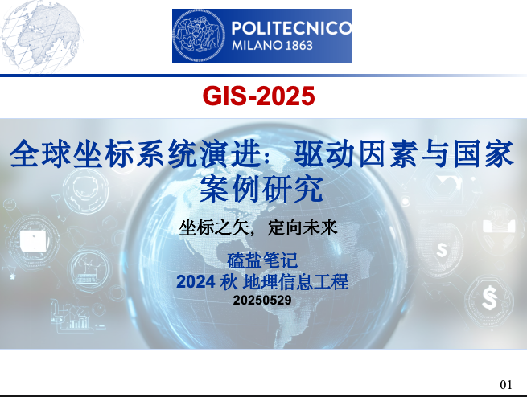
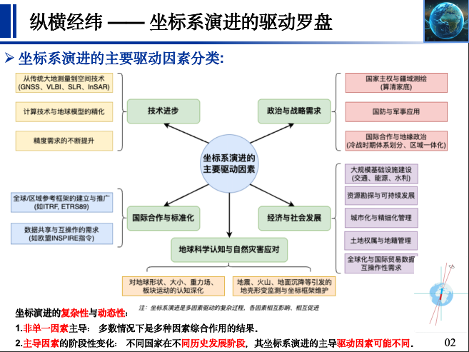
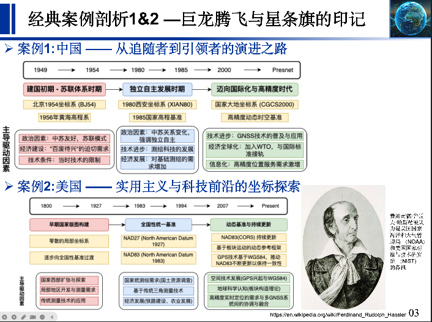
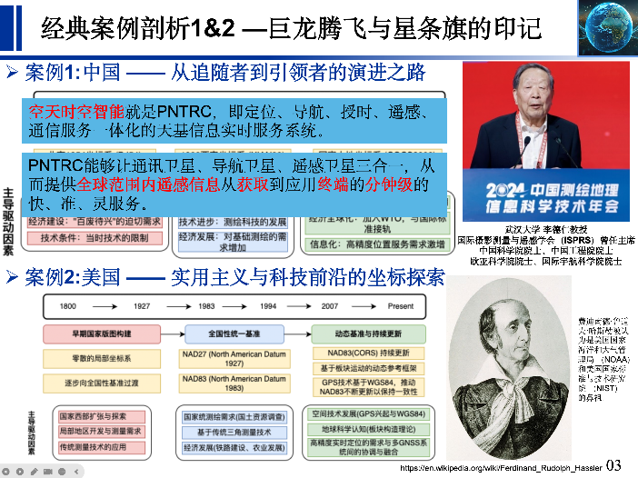
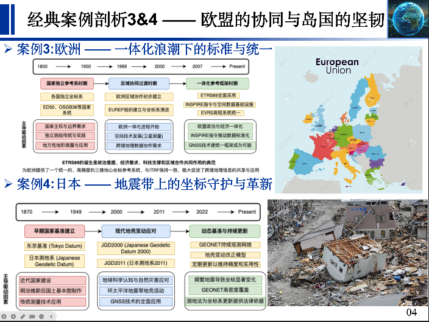
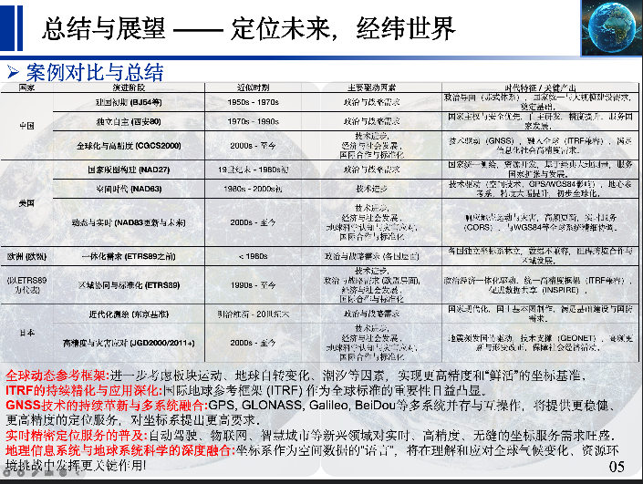

**全球坐标系统演进：驱动因素与国家案例研究**
**(Global Coordinate System Evolution: Driving Forces and National Case Studies)**

---

**第一页：引言 —— 坐标之矢，定向未来 (Introduction: The Arrow of Coordinates, Directing the Future)**

*   **核心内容：**
    1.  **什么是坐标系？为什么重要？** (What are coordinate systems? Why are they important?)
        *   简述坐标系在地理信息系统（GIS）、测绘、导航、资源管理、灾害监测等领域的基石作用。
        *   （配图：抽象的地球网格、GIS应用场景示意图，如城市规划、环境监测等）
    2.  **PPT主题与目标：** (Theme and Objectives of this PPT)
        *   探索全球不同国家和地区坐标系统演进的历程。
        *   分析驱动坐标系演进的深层、多维度因素。
        *   揭示坐标系选择与变革的复杂性与时代特征。
    3.  **本PPT结构概览：** (Brief overview of the PPT structure)
        *   驱动因素分类 -> 案例分析 -> 总结与展望。

---

**第二页：纵横经纬 —— 坐标系演进的驱动罗盘 (Weaving the Web: The Driving Compass of Coordinate System Evolution)**

*   **核心内容：**
    1.  **坐标系演进的主要驱动因素分类：** (Classification of Major Driving Forces)
        *   **技术进步 (Technological Advancement):**
            *   从传统大地测量（三角、导线）到空间技术（GNSS、VLBI、SLR、InSAR）。
            *   计算技术与地球模型的精化。
            *   精度需求的不断提升。
        *   **政治与战略需求 (Political and Strategic Needs):**
            *   国家主权与疆域测绘（"算清家底"）。
            *   国防与军事应用。
            *   国际合作与地缘政治（如冷战时期的体系划分、区域一体化）。
        *   **经济与社会发展 (Economic and Social Development):**
            *   大规模基础设施建设（交通、能源、水利）。
            *   资源勘探与可持续发展。
            *   城市化与精细化管理。
            *   土地权属与地籍管理。
            *   全球化与国际贸易对数据互操作性的要求。
        *   **地球科学认知与自然灾害应对 (Geoscientific Understanding and Natural Hazard Response):**
            *   对地球形状、大小、重力场、板块运动的认知深化。
            *   地震、火山、地面沉降等引发的地壳形变监测与坐标框架维护。
        *   **国际合作与标准化 (International Cooperation and Standardization):**
            *   全球/区域参考框架的建立与推广（如ITRF, ETRS89）。
            *   数据共享与互操作的需求（如欧盟INSPIRE指令）。
        *   （配图：用一个中心为"坐标系演进"的辐射状框架图或流程图，清晰展示上述五大类驱动因素及其子项）
    2.  **演进的复杂性与动态性：** (Complexity and Dynamism of Evolution)
        *   **非单一因素主导：** 多数情况下是多种因素综合作用的结果。
        *   **主导因素的阶段性变化：** 不同国家在不同历史发展阶段，其坐标系演进的主导驱动因素可能不同。
        *   （配图：一个示意图，例如几条不同颜色的曲线代表不同驱动因素的强度，它们在时间轴上相互交织、起伏，共同影响坐标系的"轨迹"）

---

**第三页：案例剖析（一）—— 巨龙腾飞与星条旗的印记 (Case Studies Part 1: The Soaring Dragon and The Star-Spangled Banner's Mark)**

*   **案例一：中国 —— 从追随到引领的坐标之路 (China: A Journey from Following to Leading in Coordinate Systems)**
    *   **演进历程 (Evolution Timeline):**
        *   **建国初期 - 苏联体系时期 (Early PRC - Soviet System Era):** 如北京1954坐标系 (BJ54)、1956年黄海高程系。
            *   **主导驱动：** 政治因素（中苏友好，学习苏联经验），国家大规模经济建设的迫切需求（"百废待兴"）。
            *   **辅助因素：** 当时技术条件的限制。
        *   **独立自主发展时期 (Independent Development Era):** 1980西安坐标系 (XAS80)、1985国家高程基准。
            *   **主导驱动：** 政治因素（中苏关系变化，强调独立自主），国家测绘科技的进步，对更高精度的追求。
            *   **辅助因素：** 经济发展对基础测绘的需求增加。
        *   **迈向国际化与高精度时代 (Towards Internationalization and High Precision):** 2000国家大地坐标系 (CGCS2000)。
            *   **主导驱动：** 技术进步（GNSS技术的普及与应用），经济全球化（加入WTO，与国际标准接轨的需求），社会信息化发展（高精度位置服务需求激增）。
            *   **辅助因素：** 地球科学研究的深入。
    *   **驱动因素的交织性体现：** 中国坐标系的每一次重要变革，都是政治导向、技术能力和经济社会发展需求相互作用、共同推动的结果。
    *   （配图：中国坐标系演进的时间轴信息图，标注关键节点和主要驱动因素；可加入当时的代表性地图或测量设备图片）

*   **案例二：美国 —— 实用主义与科技前沿的坐标探索 (United States: Pragmatism and Technological Frontiers in Coordinate Exploration)**
    *   **演进历程 (Evolution Timeline):**
        *   **早期国家版图构建 (Early Nation Building):** 零散的局部坐标系，逐步向全国性基准过渡。
        *   **NAD27 (North American Datum of 1927):**
            *   **主导驱动：** 国家统一测绘的需求（国土资源调查、西部开发），基于传统三角测量技术。
            *   **辅助因素：** 经济发展（铁路建设、农业发展）。
        *   **NAD83 (North American Datum of 1983):**
            *   **主导驱动：** 技术进步（空间大地测量技术如VLBI、SLR、Doppler，GPS的兴起），对更高精度的追求，与全球参考框架的初步连接。
            *   **辅助因素：** 科学研究（地球形状和大小的更精确测定）。
        *   **动态基准与持续更新 (Dynamic Datum and Continuous Updates):** 如NAD83各期更新（CORS），以及未来向基于板块运动的动态参考框架的演进趋势。
            *   **主导驱动：** 地球科学认知（板块构造理论，地壳形变监测），自然灾害（地震、火山等对坐标框架的影响），高精度实时定位的需求。
            *   **辅助因素：** GNSS技术的持续发展和广泛应用。
    *   **驱动因素的交织性体现：** 美国坐标系的演进清晰地反映了技术进步的引领作用，同时也服务于国家发展战略和对地球动态变化的科学响应。
    *   （配图：美国NAD27到NAD83的演进示意图，可展示参考椭球的变化；CORS网络分布图或板块运动示意图）

---

**第四页：案例剖析（二）—— 欧盟的协同与岛国的坚韧 (Case Studies Part 2: European Synergy and an Island Nation's Resilience)**

*   **案例三：欧洲（欧盟） —— 一体化浪潮下的标准统一 (Europe (EU): Standardization under the Wave of Integration - ETRS89)**
    *   **背景：** 历史上欧洲各国拥有众多独立的、不兼容的国家坐标系，阻碍了跨境数据整合与应用。
    *   **演进与驱动 (Evolution and Drivers for ETRS89 - European Terrestrial Reference System 1989):**
        *   **主导驱动：** 政治与经济一体化（欧盟的建立与发展，单一市场的需求），国际合作与标准化（EUREF组织的推动，INSPIRE指令要求地理空间数据在统一基准下共享）。
        *   **辅助因素：** 技术进步（GNSS技术使得建立高精度、统一的欧洲参考框架成为可能），科学研究的需求。
    *   **ETRS89的意义与推广：** 为欧洲提供了一个统一的、高精度的三维地心坐标参考系统，与ITRF保持一致，极大促进了跨境地理信息的共享与应用。EVRS (European Vertical Reference System) 亦为高程系统统一做出了贡献。
    *   **驱动因素的交织性体现：** ETRS89的诞生是政治意愿、经济需求、科技支撑和区域合作共同作用的典范。
    *   （配图：欧洲各国传统坐标系"马赛克"拼图的示意图，逐渐统一到ETRS89的示意图；EUREF或INSPIRE的Logo）

*   **案例四：日本 —— 地震带上的坐标守护与革新 (Japan: Coordinate Maintenance and Innovation on the Seismic Belt)**
    *   **演进历程 (Evolution Timeline):**
        *   **早期：** 东京基准 (Tokyo Datum - 日本測地系)。
            *   **主导驱动：** 近代国家建设（明治维新后国土基本图的制作），基于传统测量技术。
        *   **现代地壳变动应对：** JGD2000 (Japanese Geodetic Datum 2000) -> JGD2011 (日本測地系2011) 及其后续更新。
            *   **主导驱动：** 地球科学认知与自然灾害应对（日本位于环太平洋地震带，地壳活动频繁，导致坐标发生显著变化，必须定期更新以维持精度和实用性）。
            *   **辅助因素：** 技术进步（GNSS技术的全面应用，GEONET（GPS连续观测网）的建立与高密度覆盖），高精度定位服务的需求。
    *   **独特之处：**
        *   **"动态"基准的实践：** 虽然名义上是静态坐标系，但通过频繁的元期更新和地壳变动改正模型，实质上在应对地球的动态变化。
        *   **法律与制度保障：** 测地法的修订为坐标系的更新提供了法律依据。
    *   **驱动因素的交织性体现：** 日本的坐标系演进深刻烙印着其独特的自然地理环境特征，技术进步为其应对挑战提供了有力工具，国家需求是根本动力。
    *   （配图：日本列岛地震带分布图，GEONET站点分布图，地壳变动导致矢量位移的示意图）

---

**第五页：总结与展望 —— 定位未来，经纬世界 (Conclusion and Outlook: Positioning the Future, Mapping the World)**

*   **核心内容：**
    1.  **总结 (Conclusion):**
        *   **驱动因素的普适性与特殊性：** 技术进步、政治需求、经济发展、科学认知和国际合作是推动坐标系演进的普遍因素，但各国国情、发展阶段和面临的特定挑战（如日本的地震）使得其演进路径和主导因素组合呈现特殊性。
        *   **复杂交织的多重驱动：** 再次强调坐标系的演进是多因素综合作用的复杂过程，而非单一线性的技术迭代。
        *   **从国家本位到区域/全球一体化：** 坐标系的演进趋势也反映了从各自为政到寻求区域乃至全球统一参考框架的努力。
        *   （配图/表：可以设计一个对比表格，简要列出四个案例国家在不同演进阶段的主要驱动因素，进行横向对比）
    2.  **展望 (Outlook):**
        *   **全球动态参考框架 (Global Dynamic Reference Frames):** 进一步考虑板块运动、地球自转变化、潮汐等因素，实现更高精度和"鲜活"的坐标基准。
        *   **ITRF的持续精化与应用深化：** 国际地球参考框架 (ITRF) 作为全球标准的重要性日益凸显。
        *   **GNSS技术的持续革新与多系统融合：** GPS, GLONASS, Galileo, BeiDou等多系统并存与互操作，将提供更稳健、更高精度的定位服务，对坐标系提出更高要求。
        *   **实时精密定位服务的普及：** 自动驾驶、物联网、智慧城市等新兴领域对实时、高精度、无缝的坐标服务需求旺盛。
        *   **地理信息系统与地球系统科学的深度融合：** 坐标系作为空间数据的"语言"，将在理解和应对全球气候变化、资源环境挑战中发挥更关键作用。
        *   （配图：未来感科技图，如动态地球模型、全球卫星网络、智慧城市中无处不在的定位应用等）
    3.  **开放性思考/提问 (Optional: Open thought / Question for discussion):**
        *   例如：面对日益复杂的地球系统和人类活动，未来的坐标系还需要解决哪些核心挑战？

您说得对！确实，一连串的●在视觉上可能不够清晰，尤其是在快速浏览的PPT中。使用不同符号来代表不同的驱动力强度，无疑会更直观、更易于区分。

我们来重新设计一下符号系统，目标是**一眼就能看出主导与辅助的区别**。

**新的符号系统方案：**

*   **主导驱动力 (Dominant Driver):** 突出、醒目，可以考虑实心、较大的符号。
    *   **★** (实心五角星) - 普遍认知中代表"星级"、"最重要"。
    *   **❖** (实心菱形) - 比较独特且有强调感。
    *   **▲** (实心向上三角) - 暗示"引领"、"主要"。
*   **重要驱动力 (Significant Driver):** 仍然重要，但级别次于主导。
    *   **☆** (空心五角星) - 与主导的实心星形成对比。
    *   **◇** (空心菱形) - 与主导的实心菱形形成对比。
    *   **△** (空心向上三角) - 与主导的实心三角形成对比。
*   **次要/辅助驱动力 (Secondary/Auxiliary Driver):**
    *   **●** (实心小圆点) - 简单明了，表示存在影响。
    *   **+** (加号) - 表示"附加的"、"辅助的"。
*   **潜在/背景因素 (Potential/Background Factor):**
    *   **○** (空心小圆点) - 比实心圆点更弱化。
    *   **~** (波浪号) - 表示"相关的"、"潜在的"。

**我个人比较推荐使用星号组合或三角组合，因为它们在视觉上有清晰的层级感。我们以星号组合为例，重新构建表格：**

---

**全球坐标系演进驱动因素对比表 (四大案例国家) - 新符号版**

**图例说明 (Legend):**
*   **驱动力强度 (Driver Strength):**
    *   **★**  主导驱动力 (Dominant)
    *   **☆**  重要驱动力 (Significant)
    *   **●**  次要/辅助驱动力 (Secondary/Auxiliary)
    *   **○**  潜在/背景因素 (Potential/Background)
*   **驱动因素缩写 (Driver Abbreviations):**
    *   **TA:** 技术进步 (Technological Advancement)
    *   **PS:** 政治与战略需求 (Political & Strategic Needs)
    *   **ES:** 经济与社会发展 (Economic & Social Development)
    *   **GS/NH:** 地球科学认知与自然灾害应对 (Geoscientific Understanding & Natural Hazard Response)
    *   **IS:** 国际合作与标准化 (International Cooperation & Standardization)

| 国家 (Country)   | 演进阶段 (Evolution Stage)                                   | 近似时期 (Approx. Era) | **TA**  | **PS**           | **ES**  | **GS/NH** | **IS** | 时代特征 / 关键产出 (Era Characteristics / Key Outcome)      |
| ---------------- | ------------------------------------------------------------ | ---------------------- | ------- | ---------------- | ------- | --------- | ------ | ------------------------------------------------------------ |
| **中国 (China)** | **建国初期 (BJ54等)**   Early PRC (e.g., Beijing 1954)    | 1950s - 1970s          | ●       | **★**            | ☆       | ○         | ●      | 政治导向（苏式体系），国家统一与大规模建设需求，奠定基础。   |
|                  | **独立自主 (西安80)**   Independent Dev. (Xian 1980)      | 1970s - 1990s          | ☆       | **★**            | ☆       | ○         | ○      | 国家主权与安全优先，自主研发，精度提升，服务国家发展。       |
|                  | **全球化与高精度 (CGCS2000)**   Globalization & High Precision (CGCS2000) | 2000s -至今            | **★**   | ☆                | **★**   | ●         | **★**  | 技术驱动（GNSS），融入全球（ITRF兼容），满足信息化社会高精度需求。 |
| **美国 (USA)**   | **国家版图构建 (NAD27)**   Nation Building (NAD27)        | 19世纪末 - 1980s初     | ●       | **★**            | ☆       | ○         | ○      | 国家统一测绘，资源开发，基于经典大地测量，服务国家扩张与发展。 |
|                  | **空间时代 (NAD83)**   Space Age (NAD83)                  | 1980s - 2000s初        | **★**   | ☆                | ☆       | ●         | ☆      | 技术驱动（空间技术、GPS/WGS84影响），地心参考系，精度大幅提升，初步全球化。 |
|                  | **动态与实时 (NAD83更新与未来)**   Dynamic & Real-time (NAD83 Updates & Future) | 2000s -至今            | **★**   | ●                | **★**   | **★**     | **★**  | 响应地壳运动与灾害，高频更新，实时服务（CORS），与WGS84等全球系统精细协调。 |
| **欧洲 (EU)**    | **一体化需求 (ETRS89之前)**   Pre-Integration (Before ETRS89) | < 1980s                | ●(各国) | ☆(各国)          | ●(各国) | ○         | ○      | 各国独立坐标系林立，数据不兼容，阻碍跨境合作与区域发展。     |
| (以ETRS89为代表) | **区域协同与标准化 (ETRS89)**   Regional Synergy & Standardization (ETRS89) | 1990s -至今            | **★**   | **★** (欧盟层面) | **★**   | ●         | **★**  | 政治经济一体化驱动，统一高精度框架（ITRF兼容），促进数据共享（INSPIRE）。 |
| **日本 (Japan)** | **近代化测绘 (东京基准)**   Modern Mapping (Tokyo Datum)  | 明治维新 - 20世纪末    | ●       | **★**            | ☆       | ●         | ○      | 国家现代化，国土基本图制作，满足基础建设与国防需求。         |
|                  | **高精度与灾害应对 (JGD2000/2011+)**   High Precision & Hazard Response (JGD2000/2011+) | 2000s -至今            | **★**   | ☆                | **★**   | **★**     | **★**  | 地震频发国情驱动，技术支撑（GEONET），高频更新与形变改正，保障社会经济活动。 |

