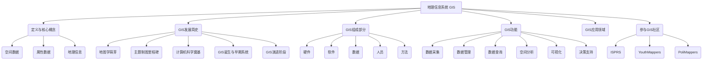

# 地理信息系统 (GIS) 学习笔记与知识框架
## —— 意大利米兰理工大学 (Politecnico di Milano) 2024-2025学年课程

---

## 第一部分：GIS 核心理论与方法

### 第一章：地理信息系统概论与课程总览

#### 1.1 课程介绍

本课程旨在系统介绍地理信息系统（GIS）的基本理论、核心技术、主流软件操作及前沿应用。通过理论学习、实践操作和项目实战相结合的方式，培养学生在地理空间数据获取、处理、分析、可视化及应用开发方面的综合能力。

##### 1.1.1 课程目标与学习成果 (Aims and Learning Outcomes)

**课程核心目标：**

*   **知识层面：**
    *   理解地理信息系统（GIS）的基本概念、组成部分、功能及其在不同领域的应用。
    *   掌握地理空间数据的基本特征、数据模型（矢量与栅格）、数据结构及常用格式。
    *   熟悉地球表面定位原理、坐标参考系统（CRS）、地图投影理论及其转换方法。
    *   了解空间数据探索性分析 (ESDA) 和场数据分析的基本方法，如空间自相关、趋势面分析等。
    *   初步掌握地理空间人工智能 (GeoAI) 的基本概念、主流模型 (特别是Transformer) 及其在地球观测 (EO) 中的应用。
    *   了解数字孪生地球 (DTE)、元宇宙 (Metaverse) 等前沿概念及其与GIS的关联。
    *   认识公民科学 (Citizen Science) 和志愿地理信息 (VGI) 的理念、方法及其在GIS数据贡献中的作用。
    *   熟悉地理空间Web服务 (OGC标准) 的基本原理和应用。
*   **技能层面：**
    *   熟练操作主流桌面GIS软件 (QGIS, ArcGIS Pro) 进行数据管理、可视化、空间分析和地图制图。
    *   掌握基本的WebGIS开发技能，包括使用GeoServer发布地理空间服务，利用PostGIS进行空间数据库管理，以及使用OpenLayers等前端库构建简单的WebGIS应用。
    *   能够独立完成一个小型GIS应用项目，从数据获取、处理、分析到成果可视化与展示。
    *   培养解决实际地理空间问题的能力和创新思维。

**学习成果 (Learning Outcomes)：**

学生在完成本课程后，将能够：

*   **设计与开发GIS系统：** 考虑到不同组件，能够设计并初步开发一个地理信息系统。
*   **空间数据探索与制图：** 使用GIS软件探索地理空间数据，并创建相应的主题地图。
*   **高级GIS功能管理空间数据：** 运用GIS的高级功能管理和分析地理空间数据。
*   **设计与开发WebGIS：** 初步具备设计和开发WebGIS应用以展示工作成果的能力。
*   **项目需求分析与建模：** 针对具体的项目案例，能够详细描述需求，并进行问题建模。
*   **复杂问题解决：** 面对相对复杂的问题，能够分析和理解目标、假设和需求，定义数据和架构，并部分或全部开发GIS解决方案。
*   **学术与成果表达：**
    *   撰写项目规格说明文档。
    *   清晰地展示工作成果。
    *   通过WebGIS发布研究结果。
*   **GIS领域实践项目开发：** 培养在GIS领域开发实际项目的能力。

##### 1.1.2 课程内容构成：理论、实践与实验 (Theory – Practice - Lab)

课程由三个主要部分组成，旨在平衡理论学习与实践操作：

*   **理论 (Theory)：** 共计 60 学时（预计学生课后平均投入 95 学时）。
    *   涵盖GIS的基本概念、数据模型、空间分析原理、地图投影、地理空间Web、地理空间AI等核心理论知识。
*   **实践 (Practice)：** 共计 30 学时（预计学生课后平均投入 40 学时）。
    *   主要进行桌面GIS软件 (QGIS, ArcGIS Pro) 和 WebGIS 相关技术 (GeoServer, PostGIS, OpenLayers) 的操作练习和案例分析。
*   **实验 (Lab)：** 共计 10 学时（预计学生课后平均投入 15 学时）。
    *   学生将分组完成一个综合性的GIS项目，主题为“空气污染时空分析与可视化”。项目要求学生利用课程所学知识和技术，从数据获取、处理、分析到最终成果的WebGIS展示。

##### 1.1.3 评估方式与权重 (Evaluation: Lecture, Practice, Laboratory)

课程的最终评估由三部分组成，各自占有不同权重：

*   **理论部分 (Lecture)：** 满分 30/30，占总成绩权重的 **1/2**。
    *   评估方式：口头考试，内容涵盖课程讲授的理论知识。
*   **实践部分 (Practice)：** 满分 30/30，占总成绩权重的 **1/3**。
    *   评估方式：上机考试，内容涵盖实践课程中涉及的软件操作和技术应用。
*   **实验部分 (Laboratory Project)：** 满分 30/30，占总成绩权重的 **1/6**。
    *   评估方式：基于小组完成的实验项目进行评估，包括项目成果的质量、完整性、创新性以及团队成员的个人贡献和口头答辩表现。
    *   实验项目要求学生以小组形式（约3人）在助教指导下完成。

**最终考试 (Exam)：** 综合口头考试，内容包括课程理论与实践部分，以及实验项目的展示与答辩。

**考试日期 (Exam Dates - 初步，待确认):**
*   2024年6月10日 10:00 - 18:00
*   2024年7月15日 10:00 - 18:00
*   2024年9月9日 10:00 - 18:00

##### 1.1.4 课程时间表与教室安排 (Schedule)

*   **周二 (Tuesday):** 9:15 - 12:15，教室 7.0.1
*   **周三 (Wednesday):** 11:15 - 13:15，教室 21.S.2
*   **周四 (Thursday):** 14:15 - 17:15，教室 B.5.3

*(具体课程内容安排请参考WeBeep平台，并及时注册。)*

##### 1.1.5 教师与助教团队介绍 (Tutors)

*   **主讲教授 (Lecturer):**
    *   **Prof. Maria Antonia Brovelli**
        *   邮箱: `maria.brovelli@polimi.it`
        *   个人主页/研究室: `https://www.gisgeolab.polimi.it/`
        *   LinkedIn: `https://www.linkedin.com/in/maria-antonia-brovelli-750544/`
        *   科学兴趣：GIS、地理空间服务、数字孪生地球 (主要关注自由开源GIS)、地理数据库/地理大数据/地球观测、地理空间人工智能 (GeoAI)、用户生成数据 (公民科学)。
        *   工作组与委员会参与：OSGEO, ISPRS TC IV, UN GGIM Academic Network, Copernicus Academy。
*   **桌面GIS实践助教 (Desktop GIS Practice Tutor):**
    *   **Dr. Alberto Vavassori**
        *   邮箱: `alberto.vavassori@polimi.it`
        *   WebEx会议室: `https://politecnicomilano.webex.com/meet/alberto.vavassori`
*   **WebGIS实践助教 (Web GIS Practice Tutor):**
    *   **Eng. Juan Pablo Duque Ordonez**
        *   邮箱: `juanpablo.duque@polimi.it`
        *   WebEx会议室: `https://politecnicomilano.webex.com/meet/juanpablo.duque`
*   **实验项目负责人 (Lab Responsible):**
    *   **Dr. Vasil Yordanov**
        *   邮箱: `vasil.yordanov@polimi.it`
        *   WebEx会议室: `https://politecnicomilano.webex.com/meet/vasil.yordanov`
*   **实验项目助教 (Lab Tutor):**
    *   **Eng. Qiongjie Xu**
        *   邮箱: `qiongjie.xu@polimi.it`

##### 1.1.6 推荐参考资料与学习资源

*   **GIS发展历史参考:**
    *   Milestones in the History of Thematic Cartography, Statistical Graphics and Data Visualization: `http://datavis.ca/milestones/index.php?page=introduction`
    *   Open source GIS history: `http://wiki.osgeo.org/wiki/Open_Source_GIS_History`
    *   ESRI company history: `https://www.esri.com/en-us/what-is-gis/history-of-gis`
*   **课程介绍幻灯片中提及的自我介绍链接 (Introduce yourself!):**
    *   `https://docs.google.com/spreadsheets/d/1pTH872lKYiIB9l-wZxZDcF64jL5USqiy27iVPi55uAQ/edit?pli=1&gid=0#gid=0` (请同学们填写)
*   **GIS历史相关视频:**
    *   The history: GRASS movie CERL (1987): `http://www.youtube.com/watch?v=U3Hf0qI4JLc`
    *   Jack Dangermond: Keynote Presentation from Esri Founder and President Jack Dangermond (2023): `https://www.youtube.com/watch?v=6IxBppashEA`

#### 1.2 GIS 发展简史

地理信息系统 (GIS) 的发展是一个漫长而复杂的过程，融合了地图学、测量学、计算机科学、统计学等多个学科的智慧。其历史可以追溯到人类早期对地理空间的认知和表达，并在计算机技术的推动下实现了飞跃式的发展。

##### 1.2.1 地图学的早期发展与空间思维

*   **古代地图：** 人类自古以来就尝试通过地图来记录和表达地理环境。早期的地图更多的是示意性的，服务于导航、土地管理和军事等目的。
*   **坐标系统与数学基础的重新引入 (1637年)：** Pierre de Fermat (1601-1665) 和 René Descartes (1596-1650) 重新引入了坐标系、数学和解析几何，建立了图形线条与方程之间的关系，为精确的地理空间表达奠定了数学基础。
*   **航空摄影与遥感的早期探索 (1903年起)：** 飞机的发明为从空中获取地理信息提供了可能，为后续的航空摄影测量和遥感技术发展奠定了基础。

##### 1.2.2 主题制图、统计图形与数据可视化的里程碑

在GIS出现之前，地图不仅仅是地理要素的简单描绘，更承载了特定主题信息的分析与表达。

*   **叠图分析 (Overlays – Geographic Analysis)：**
    *   **案例：约克镇战役地图 (1781年):** 法国地图学家 Louis-Alexandre Berthier 绘制的约克镇战役地图包含了可活动的透明叠片，用于展示军队的移动情况。这是早期通过图层叠加进行空间分析的雏形。
    *   **核心思想：** 将不同主题的地理信息展现在独立的图层上，通过叠加进行综合分析，发现空间规律和联系。
*   **分级统计图 (Choropleth maps)：**
    *   **首例：法国文盲率分布图 (1819年):** Pierre Charles Dupin 绘制了法国各地区文盲率的分布图，用不同深浅的颜色表示文盲率的高低。这被认为是第一张分级统计图，也是第一张现代统计地图。
    *   **定义：** 一种专题地图，其中区域根据测量的统计变量的大小按比例着色或图案化。
    *   **应用：** `https://covid19.who.int/` (WHO COVID-19仪表盘中可以看到现代分级统计图的应用)
*   **点密度图 (Dot maps)：**
    *   **经典案例：伦敦霍乱爆发图 (1855年):** John Snow 通过在地图上标记霍乱病例的发生位置（点），发现了霍乱疫情与特定水井（泵）的空间聚集关系，从而揭示了水源污染是霍乱传播的途径。这是流行病学中空间分析的经典案例。
    *   **应用：** `Temporal diffusion of Covid-19 in Lombardy` (展示了点密度图在疫情传播分析中的应用)
*   **变形地图 (Cartogram)：**
    *   **早期应用：欧洲国家经济指标图 (1868年):** É. Levasseur 在其经济学著作中使用了变形地图，其中区域的面积根据其表面积、人口、预算、商业、商船等指标按比例调整，同时保持其相对的地理位置。
    *   **定义：** 一种专题地图，其中地理区域的几何形状或大小被人为地改变，以传达关于该区域的某些统计变量的信息。
    *   **应用：** `https://worldmapper.org/map-animation-covid19/#&gid=1&pid=1` (展示了变形地图在COVID-19数据可视化中的应用)
*   **象形图 (Pictogram)：**
    *   **早期应用：铁路与交通统计图 (1884年):** Michael George Mulhall 使用与数量成比例的图标来表示数据，例如用不同大小的火车车厢表示铁路资本。
    *   **定义：** 用形象化的图形符号来表示数据的统计图表。

##### 1.2.3 计算机科学的奠基

计算机技术的出现为处理和分析海量地理空间数据提供了强大的工具。

*   **早期计算设备：**
    *   **计算时钟 (Calculating Clock - 1623年):** Wilhelm Schickard 发明了第一台已知的加法机，能够进行六位数的加减运算。
    *   **打孔卡 (Punched Card - 1884年):** Herman Hollerith 发明了用于机器制表的打孔卡，成功应用于美国人口普查数据处理，其公司最终发展成为IBM。打孔卡是一种用预定义位置是否有孔洞来表示数字信息的硬纸片。
*   **现代计算机的诞生与早期概念：**
    *   **MEMEX概念 (1939年):** Vannevar Bush 提出了 MEMEX 的概念，这是一种关联信息检索系统，旨在帮助人们基于关联和上下文而非严格的分类索引来查找信息，其中包含了“超链接”和“万维网”的早期思想。
    *   **Harvard Mark I (1944年):** 由 Howard H. Aiken 和 Grace Hopper 等人研制的 Harvard Mark I 投入使用，是第一台大型自动数字计算机。
    *   **早期数据存储的挑战：** 1955年，4.5MB的数据存储需要巨大的物理空间 (如Pinterest上1970年的相关图片所示)，凸显了早期数据存储的局限性。

##### 1.2.4 GIS 的诞生与早期发展

20世纪50年代和60年代是GIS发展的关键时期，主要在公共部门推动下进行。

*   **美国地理信息系统的早期研究：**
    *   **华盛顿大学地理系：** 开展了关于高级统计方法、初步计算机编程和计算机地图学的研究。
        *   **Nystuen：** 研究了基本的空间概念，如距离、方向、连通性。
        *   **Tobler：** 研究了地图投影的计算机算法和计算机地图制图。
        *   **Bunge：** 关注理论地理学，为地理学提供了点、线、面的几何基础。
        *   **Berry的地理矩阵 (Geographical Matrix)：** 提出了从空间 (地理)、时间 (历史)、专题 (属性) 三个维度组织地理数据的思想 (where-when-what)。
*   **加拿大地理信息系统 (CGIS - 1963年至今):**
    *   **创始人：Roger Tomlinson** (被誉为“GIS之父”)。
    *   **目的：** 分析加拿大土地调查局 (CLI) 收集的数据，生成用于制定土地管理计划的统计数据。
    *   **CLI地图主题：** 包括农业适宜性、休闲适宜性、野生动物适宜性、林业适宜性、当前土地利用、岸线等，地图比例尺为1:50,000，采用1（最佳）到7（最差）的简单评级方案。
    *   **核心理念：** 计算机能够在数据输入后执行分析。
    *   **关键技术创新 (Key ideas of CGIS)：**
        1.  **扫描 (SCANNING)：** 用于输入高密度面状对象。
        2.  **矢量化 (VECTORISATION)：** 将扫描图像转换为矢量数据。
        3.  **地理分区 (TILES/Map Sheets)：** 将数据划分为图幅，并通过图廓线接边 (EDGEMATCHING) 进行连接。
        4.  **专题分层 (LAYERS/Themes)：** 将数据按主题进行分层管理。
        5.  **绝对坐标系统 (ABSOLUTE SYSTEM)：** 为整个国家使用精度可调的坐标系统。
        6.  **Freeman链码 (FREEMAN CHAIN CODE)：** 用4/8方向的增量移动链表示线对象。
        7.  **弧段编码 (ARC)：** 用弧段编码面对象边界，并带有左右多边形指针。
        8.  **拓扑系统 (TOPOLOGICAL SYSTEM)：** 首个在每个图层中强制执行平面拓扑关系，并在数据库中编码弧段与区域间关系。
        9.  **数据分离 (Separation of attribute and location data)：** 分为描述符数据集 (DDS) 和图像数据集 (IDS)。
        10. **多边形叠加与区域量算 (POLYGON OVERLAY, AREA measurement)：** 实现相关分析功能。
*   **哈佛计算机图形与空间分析实验室 (Harvard Laboratory for Computer Graphics and Spatial Analysis - 1964年):**
    *   **创始人：Howard Fisher。**
    *   **重要影响：** 对GIS发展直至20世纪80年代初产生了重大影响，培养了许多GIS先驱。
    *   **主要软件贡献：**
        *   **SYMAP (Synagraphic Mapping System - 1966年)：** 通用制图软件包，可在行式打印机上生成等值线图、分级统计图和泰森多边形图。特点是分辨率低、功能有限，但易于使用，使非制图专业人员也能制作地图。
        *   **CALFORM (晚于1960年代)：** SYMAP的改进版，可在绘图仪上输出，避免了内部边界的重复编码，图形效果更好。
        *   **SYMVU (晚于1960年代)：** 可生成SYMAP输出的三维透视图。
        *   **GRID (晚于1960年代)：** 允许栅格单元使用与SYMAP相同的输出技术进行显示，支持多层栅格数据输入，是栅格GIS的开端。 Ian McHarg 在其著作《设计结合自然》(Design with Nature, 1969) 中推广了使用地理参考透明图层叠加进行资源规划的思想，GRID系统为此提供了技术支持。
*   **美国人口普查局的贡献 (U.S. Census Bureau)：**
    *   **GBF-DIME 文件 (Geographic Base File - Dual Independent Map Encoding - 1965年)：** 标志着美国政府大规模采用数字地图制图。
    *   **TIGER 文件 (Topologically Integrated Geographic Encoding and Referencing system)：** 由GBF-DIME系统发展而来，是当今使用最重要的社会经济空间数据集之一。
*   **商业GIS软件的兴起：**
    *   **ESRI (Environmental Science Research Institute - 1969年)：** 由 Jack 和 Laura Dangermond 创立，最初是一家咨询公司。
    *   **Arc/Info (1978年)：** ESRI开发的第一版Arc/Info，成为领先的GIS软件包。
    *   **POLYVRT (1970年代初)：** 用于处理区域对象的多种替代方法，旨在实现计算机地图软件包的灵活输入和边界文件转换。
    *   **ODYSSEY (1970年代中期)：** 扩展了POLYVRT的思想，成为一个基于矢量数据的综合分析包，包含了首个稳健高效的多边形叠加算法（包括细碎多边形移除）。

##### 1.2.5 GIS 的演进阶段

*   **20世纪70年代：**
    *   **CGIS 全面运行 (1971年)。**
    *   **明尼苏达州土地管理信息系统 (MLMIS - 1976年)：** 另一个重要的州级GIS项目。
*   **20世纪80年代：第二GIS阶段 - 向分析演进**
    *   **用户交互增强：** 发展了更多图形用户界面 (GUI) 功能。
    *   **分析能力提升：** 用户能够基于复杂的地理、拓扑和统计标准对数据进行排序、选择、提取、重分类、重投影和显示。
    *   **数据存储与访问：** 数据存储仍以集中式为主，但用户访问趋于分散。
    *   **关键软件发布：**
        *   **ARC/INFO® 1.0 (1982年)：** 首个商业化的GIS软件包，运行于大型机。
        *   **GRASS GIS (Geographic Resources Analysis Support System - 1982年)：** 由美国陆军工程兵团建设工程研究实验室 (CERL) 开发，基于栅格的GIS，用于军事设施的土地管理。
        *   **PC ARC/INFO® 1.0 (1986年)：** 首个可在个人计算机上运行的GIS软件。
*   **20世纪90年代：第三GIS阶段 - 管理信息系统与决策支持**
    *   **技术普及：** 计算能力增强和硬件价格下降，GIS成为州和市政规划的可行技术。
    *   **MIS角色：** GIS被要求成为真正的管理信息系统 (MIS)，能够支持决策过程。
    *   **关键软件发布：**
        *   **ArcView® 1.0 (1992年)：** ESRI发布的桌面地图系统，具有图形用户界面，极大提升了易用性。
        *   **Xerox PARC互联网地图查看器 (1993年)：** Steve Putz 开发了首个基于Web的交互式地图查看器。
        *   **国家空间数据基础设施 (NSDI - 1994年，美国)：** 由克林顿总统行政命令组建。
        *   **SDE® (Spatial Database Engine - 1994年)：** ESRI发布的创新工具，用于在商业数据库管理系统 (DBMS) 中存储和管理GIS数据。
        *   **OGC (Open GIS Consortium - 1994年)：** 成立，旨在制定公共可用的地理处理规范。
        *   **MapServer 1.0 (1997年)：** 明尼苏达大学 (UMN) 发布的开源开发环境，用于构建支持空间的互联网应用。
        *   **ArcView Internet Map Server (IMS - 1997年)：** ESRI发布的商业工具，用于通过互联网发布GIS数据。
        *   **GDAL/OGR (1998年开始开发)：** 用于读写栅格/矢量地理空间数据格式的库。
*   **2000年代至今：现代GIS与新兴技术**
    *   **技术趋势：** 智能对象、无线技术、野外数据采集、空间数据基础设施 (SDI)、互联网GIS服务、传感器网络 (Sensor Web)、Web 2.0、志愿地理信息 (VGI) 与地理空间公民科学、地理空间人工智能 (GeoSpatial Artificial Intelligence)、数字地球/数字孪生地球。

##### 1.2.6 GIS 历史相关视频资料 (回顾)

*   **GRASS movie CERL (1987):** `http://www.youtube.com/watch?v=U3Hf0qI4JLc`
*   **Jack Dangermond: Keynote Presentation (2023):** `https://www.youtube.com/watch?v=6IxBppashEA`

#### 1.3 地理信息系统基本概念

地理信息系统 (GIS) 是一个在计算机软硬件支持下，对空间数据进行采集、存储、管理、处理、分析、建模和可视化，以解决复杂规划和管理问题的技术系统。

##### 1.3.1 GIS 的定义与组成部分

*   **定义：** GIS 是一个用于捕获、存储、查询、分析、显示和输出地理空间数据的计算机系统。它不仅仅是软件，更是一个集成了硬件、软件、数据、人员和方法的综合系统。
    *   **计算机辅助系统 (Computer-supported system)：** 强调GIS依赖于计算机技术。
    *   **核心功能：** 存储 (store)、处理 (process)、分析 (analyse)、可视化 (visualise) 和共享 (share) 地理信息。
*   **GIS的五大组成部分：**
    *   **硬件 (Hardware)：** 运行GIS软件的计算机及其外围设备 (如服务器、桌面计算机、移动设备、打印机、扫描仪等)。
    *   **软件 (Software)：** 提供存储、分析和显示地理信息功能的GIS程序 (如QGIS, ArcGIS Pro, GeoServer等)。
    *   **数据 (Data)：** GIS的核心，包括空间数据和属性数据。数据是GIS分析和决策的基础。
        *   **空间数据 (Spatial Data)：** 描述地理要素的位置和形态信息。
            *   **几何信息 (Geometric)：** 定义元素的空间位置。
            *   **拓扑信息 (Topological)：** 定义元素间的空间关系。
        *   **属性数据 (Attribute Data)：** 描述地理要素的特征和性质信息 (专题信息)。
        *   **时间信息 (Temporal Data)：** 指示数据所对应的时间或时期。
    *   **人员 (People / Liveware)：** GIS系统的设计者、开发者、管理者、分析师和最终用户。人员的专业知识和技能对GIS系统的成功应用至关重要。
    *   **方法 (Methods / Procedures)：** 指导GIS系统设计、实施和应用的规范、标准、流程和分析模型。

##### 1.3.2 空间数据与属性数据 (详见第四章)

GIS处理的核心是空间数据及其关联的属性数据。

*   **空间数据：** 描述地球表面要素的几何位置、形状和空间关系。
*   **属性数据：** 描述空间要素的非空间特征，如名称、类型、数量等。

##### 1.3.3 GIS 的功能与应用领域

GIS具有强大的功能，使其在众多领域得到广泛应用：

*   **数据采集与输入：** 从多种来源获取空间数据和属性数据。
*   **数据存储与管理：** 有效地组织和管理海量地理空间数据。
*   **数据查询与检索：** 根据空间位置或属性条件查询所需信息。
*   **空间分析：** 进行各种复杂的空间运算，如缓冲区分析、叠加分析、网络分析、地形分析等，以揭示空间模式和关系。
*   **可视化与制图：** 以地图、图表、三维场景等多种形式展示地理信息和分析结果。
*   **决策支持：** 为规划、管理和决策提供科学依据。

**主要应用领域包括：**

*   城市规划与管理
*   自然资源管理与环境保护
*   灾害应急与风险评估
*   交通运输规划与物流
*   公共卫生与流行病学
*   农业与精准农业
*   商业选址与市场分析
*   考古学与文化遗产保护
*   军事与国防

#### 1.4 参与地理信息世界 (How to get involved in the Geo World)

地理信息科学是一个充满活力和不断发展的领域，有多种途径可以参与其中，促进知识共享和能力建设。

##### 1.4.1 ISPRS (国际摄影测量与遥感学会) 及其学生组织

*   **ISPRS (International Society for Photogrammetry and Remote Sensing)：** 是一个致力于推动摄影测量、遥感和空间信息科学发展的国际非政府组织。
    *   **官方网站：** `isprs.org`
    *   **提供的资源：** 工作机会与职位发布 (Jobs and Postings)、科研基金 (Grants)、理事会信息 (Board of Directors)。
*   **ISPRS SC (Student Consortium)：** ISPRS的学生组织，旨在为全球对摄影测量、遥感和空间信息科学感兴趣的学生、青年研究者和专业人士建立联系。
    *   **目标：** 加强全球学生网络，提供知识和信息交流平台，组织学生活动。
    *   **活动形式：** 暑期学校、研讨会、网络研讨会、通讯 (Spectrum)。

##### 1.4.2 YouthMappers 与 PoliMappers

*   **YouthMappers：** 是一个由大学校园分会组成的全球性网络，致力于培养青年领袖通过地图绘制创建有韧性的社区。
    *   **官方网站：** `https://www.youthmappers.org/`
    *   **支持机构：** 美国国际开发署 (USAID)。
    *   **使命：** “培养一代青年领袖，通过绘制地图来创建有韧性的社区，并定义他们的世界。”
    *   **项目类型：** 全球远程地图绘制活动、虚拟实习任务、本地能力建设项目、学生主导的倡议。
*   **PoliMappers：** Politecnico di Milano 的 YouthMappers 分会。
    *   **创立时间：** 2016年12月。
    *   **使命：** 培训和激励下一代志愿制图者，在大学及中小学推广使用自由开源软件进行地图绘制。
    *   **地位：** YouthMappers 在欧洲的第一个分会。
    *   **活动：** 实地制图 (如米兰理工大学Leonardo校区室内外制图)、培训与研讨会、与本地社区互动 (如小型地图松)、人道主义地图绘制 (参与HOT和Missing Maps项目)、与其他YouthMappers分会合作项目、创新教学项目等。
    *   **主要负责人/联系人：** Federica Gaspari, Prof. Maria Antonia Brovelli。
    *   **相关链接：**
        *   PoliMappers Github: `https://polimappers.github.io/`
        *   PoliMappers 社交媒体: Facebook, Twitter, Instagram, Twitch, LinkedIn, OSM Wiki。

#### 1.5 [知识结构图] GIS 概念、历史发展脉络与核心组成图

#### 1.6 本章小结与思考题

**本章小结：**

本章首先对整个GIS课程的教学目标、内容安排、评估方式以及师资团队进行了全面介绍，为后续学习奠定了基础。随后，系统回顾了GIS的发展简史，从早期地图学和空间分析思想到计算机技术的驱动，再到CGIS、哈佛实验室等里程碑式的进展，以及商业GIS的兴起和GIS技术的不断演进。接着，明确了GIS的基本概念，包括其定义、五大组成部分（硬件、软件、数据、人员、方法）以及其核心功能和广泛的应用领域。最后，介绍了参与GIS社区的途径，特别是ISPRS及其学生组织、YouthMappers和本校的PoliMappers，鼓励学生积极参与学术交流和实践活动。

**思考题：**

1. 结合GIS的发展历史，你认为哪些技术或事件对GIS的形成和发展起到了最为关键的推动作用？为什么？
2. 请列举至少三个你认为GIS能够发挥重要作用的实际应用场景，并简要说明GIS在其中的核心功能。
3. PoliMappers作为一个学生组织，其活动对GIS的学习和实践有何益处？你认为学生可以如何更好地参与并从中受益？
4. 课程评估包含理论、实践和实验三部分，你认为这种评估方式的合理性体现在哪里？你将如何规划自己的学习以应对这三部分的考核？
5. 在了解了GIS的初步概念后，你对GIS的哪个方面最感兴趣？为什么？

### 第二章：地球表面定位、坐标系统与地图投影

本章将详细介绍在地球表面确定点位所涉及的基本概念、参考系统和数学模型。理解这些内容是进行精确地理空间分析和地图制图的基础。

#### 2.1 地球表面的数学表达

地球的真实表面是一个极其复杂的不规则曲面，为了进行数学处理和地理空间定位，我们需要采用简化的数学模型来逼近它。

##### 2.1.1 地球真实表面与参考面

*   **地球真实表面 (Topographic Surface)：** 指地球的物理表面，包括陆地、海洋、山脉、河流等，具有高度的复杂性和不规则性。直接在此表面上进行精确的数学计算非常困难。
*   **参考面 (Reference Surfaces)：** 为了便于数学处理和定位，我们引入了不同层次的参考面来近似地球形状。

##### 2.1.2 大地水准面 (Geoid)

*   **定义：** 大地水准面是地球重力场的等势面之一，通常选择与全球平均海平面最密合的那个等势面。可以将其想象为在没有潮汐、风浪和洋流影响下，海水静止时所形成的表面，并向大陆下方延伸。
*   **物理意义：** 大地水准面上任意一点的铅垂线（重力方向）都与该面正交。它是一个物理参考面，是高程（正高）的起算面。
*   **特性：** 大地水准面是一个不规则的曲面，其形状取决于地球内部质量分布的不均匀性。它比真实地形表面平滑，但仍然比数学椭球体复杂。
*   **GOCE卫星任务 (Gravity field and steady-state Ocean Circulation Explorer)：** 欧洲空间局 (ESA) 的GOCE卫星 (2009-2013) 通过高精度测量地球重力场，为建立高精度全球大地水准面模型做出了重要贡献。它在约250公里的低轨道运行，以尽可能观测到最强的重力场信号。

##### 2.1.3 参考椭球体 (Ellipsoid)

*   **定义：** 参考椭球体是一个由数学方程定义的、与大地水准面最为密合的旋转椭球体。它是进行大地测量计算和地图投影的几何参考面。
*   **参数：**
    *   **长半轴 (Semi-major axis, $a$)：** 椭球赤道半径。
    *   **短半轴 (Semi-minor axis, $c$)：** 椭球极半径。
    *   **扁率 (Flattening, $f$)：** $f = (a-c)/a$。描述椭球的扁平程度。
    *   **第一偏心率的平方 ($e^2$)：** $e^2 = (a^2-c^2)/a^2$。描述椭球的偏心程度。
*   **选择：** 历史上不同国家和地区根据本区域大地水准面的形状选择了不同的参考椭球体，以求得最佳拟合。例如Bessel 1841 (德国、印尼)、Airy 1858 (英国)、Clarke 1866 (美国)、Hayford 1909 (国际)、GRS80 (Geodetic Reference System 1980)、WGS84 (World Geodetic System 1984)。
*   **重要性：** 椭球体提供了一个规则的数学曲面，使得地理坐标的定义和大地测量计算成为可能。

##### 2.1.4 大地水准面差距 (Geoid Undulation / Geoid Height, $N$)

*   **定义：** 大地水准面相对于参考椭球面的法向距离。即在椭球法线方向上，从椭球面向大地水准面的距离。
*   **数值范围：** 全球范围内，大地水准面差距通常在 ±100 米之间。例如，在印度洋地区可能出现约 -100 米的负异常，而在北大西洋地区可能出现约 +70 米的正异常。
*   **关系：** 大地高 ($h$)、正高 ($H$) 和大地水准面差距 ($N$) 之间的关系近似为：$H \approx h - N$。

##### 2.1.5 局部参考球面 (Local Sphere)

*   **概念：** 在小范围内，可以用一个球面来近似椭球面，以便简化计算。
*   **曲率半径：** 椭球面上每一点的曲率半径是不同的。主要的曲率半径包括：
    *   **子午圈曲率半径 ($\rho$ 或 $M$)：** 沿子午线方向的曲率半径。
    *   **卯酉圈曲率半径 ($N$)：** 沿卯酉圈（垂直于子午线的法截面）方向的曲率半径，也称法截弧曲率半径。平行于卯酉圈的纬线圈半径 $r = N \cdot \cos\phi$。
*   **局部平均球面半径 ($R_{localsphere}$)：** 通常可以取该点卯酉圈曲率半径 $N$ 和子午圈曲率半径 $\rho$ 的几何平均值，即 $R_{localsphere} = \sqrt{\rho N}$。
*   **适用性：** 椭球长短半轴差异约21公里，在小范围内用球面近似误差较小。例如，$\frac{N-\rho}{N} \le 1/150$ 的范围内。

#### 2.2 坐标系统 (Coordinate Systems - CS)

坐标系统是描述空间位置的数学框架。

##### 2.2.1 坐标元组 (Coordinate Tuple)

*   **定义：** 描述一个位置的一系列数值。例如，三维笛卡尔坐标 $(X, Y, Z)$ 或地理坐标 $(\phi, \lambda, h)$。

##### 2.2.2 坐标轴与量测单位

*   **定义：** 坐标系统由一系列具有特定量测单位的坐标轴组成。坐标系统是一个抽象的数学概念，通常没有直接与地球的物理联系（自然坐标系除外）。

##### 2.2.3 笛卡尔坐标系 (Cartesian Coordinate System)

*   **定义：** 通过三个相互正交的坐标轴 (X, Y, Z) 来定义空间位置。如果指定了正交投影规则，则可以确定点在各轴上的投影。
*   **特性：** 在整个空间内规则，无奇异点。

##### 2.2.4 球面坐标系 (Spherical Coordinate System)

*   **定义：** 基于一个给定半径的球面。通过定义一个赤道面和一个起始方向（如本初子午线在赤道上的交点），以及点到球心的法线方向来确定点的位置。
*   **参数：** 通常用经度、纬度和到球心的距离（或固定半径）表示。

##### 2.2.5 椭球面坐标系 (Ellipsoidal Coordinate System) / 地理坐标系 (Geographic Coordinates) / 大地坐标系 (Geodetic Coordinates)

*   **定义：** 基于一个特定的参考椭球体。通过定义椭球的形状（扁率和长半轴）和赤道上一点的起始方向（本初子午线）以及点到椭球面的法线方向来确定点的位置。
*   **参数：**
    *   **大地纬度 (Geodetic Latitude, $\phi$)：** 某点在椭球上的法线与赤道面之间的夹角。北纬为正，南纬为负。
    *   **大地经度 (Geodetic Longitude, $\lambda$)：** 过某点的子午面与本初子午面之间的夹角。东经为正，西经为负。
    *   **大地高 (Ellipsoidal Height, $h$)：** 某点沿椭球法线方向到椭球面的距离。椭球外为正，椭球内为负。
*   **重要概念：**
    *   **平行圈 (Parallels)：** 所有等纬度的点构成的圆圈，平行于赤道面。
    *   **子午线 (Meridians)：** 所有等经度的点构成的椭圆弧，连接南北两极。
    *   **赤道 (Equator)：** 0度纬线圈。
    *   **本初子午线 (Prime Meridian)：** 0度经线，是经度计算的起始线。历史上各国曾采用不同的本初子午线（如罗马蒙特马里奥），目前国际通用格林威治子午线。

##### 2.2.6 坐标系统的奇异点 (Singularities)

*   **球面和椭球面坐标系的奇异点：**
    *   **两极点：** 在两极点，经度未定义（或有无限多个值）。这种奇异性无法移除，但通常不影响实际应用，因为一个点仍然可以通过一组（可能不唯一的）坐标值唯一定位。
    *   **投影奇异性：** 当点投影到平面上时，某些点可能存在投影奇异性（例如，在某些方位投影中，与切点相对的点无法表示）。选择最近的投影可以移除这种奇异性。

#### 2.3 自然坐标系统 (Natural Coordinate System)

自然坐标系统是直接与地球物理特性（主要是重力场）相关的坐标系统。

##### 2.3.1 天文经纬度 (Astronomical Latitude - $\Phi$, Astronomical Longitude - $\Lambda$)

*   **定义：**
    *   **天文纬度 ($\Phi_P$)：** P点的铅垂线方向（重力方向）与天球赤道面之间的夹角。
    *   **天文经度 ($\Lambda_P$)：** 过P点的天文子午面（包含P点铅垂线和天球北极的平面）与格林威治天文子午面之间的夹角。
*   **观测方法：** 通过观测恒星的位置和时间来确定。例如，数字天顶仪可以观测恒星的位置，并结合地球自转模型来计算天文经纬度。
    *   假设地球在空间中固定，观测恒星的赤经($\alpha$)和赤纬($\delta$)，可以推算天顶在天球上的位置。

##### 2.3.2 正高 (Orthometric Height - $H$)

*   **定义：** 地面点沿铅垂线方向到大地水准面的距离，向上为正。

##### 2.3.3 地球自转、岁差与章动、极移对自然坐标系的影响

*   **地球自转：** 地球绕瞬时自转轴 (Instantaneous Rotation Axis - I) 以角速度 $\omega$ (约1周/恒星日，0.47 km/sec) 旋转。
*   **岁差 (Precession) 与章动 (Nutation)：** 地球自转轴在空间中存在缓慢的、大尺度的运动。
    *   **岁差：** 由日月引力引起，周期约25800年。
    *   **章动：** 叠加在岁差上的较小周期性摆动，主要周期为18.6年，由潮汐力变化引起。
*   **极移 (Polar Motion)：** 地球自转轴相对于地球本体的微小摆动，由地球内部核心和地幔的运动以及地表水的重新分布（如格陵兰冰盖融化、均衡反弹）引起。这种摆动由天文学家卡罗·钱德勒在19世纪末发现，表现为北极点在一个小范围内（约0.2角秒）的“晃动”。
*   **影响：** 这些地球动力学现象导致铅垂线方向（以及天文经纬度）随时间变化。通过长时间平均观测可以消除部分时变影响。对于近距离点，这些影响通常可以忽略。

#### 2.4 基准 (Datum)

基准是定义坐标系统与地球之间关系的参数集合。

##### 2.4.1 基准的定义与作用

*   **定义：** 基准规定了坐标系统原点、坐标轴方向以及尺度与地球的对应关系，从而使得抽象的数学坐标能够应用于描述地球表面要素的实际位置。
*   **作用：** 如果没有基准，仅有坐标值是模糊不清的，因为同一组坐标值在不同基准下代表的地理位置不同。

##### 2.4.2 基准的类型

*   **垂直基准 (Vertical Datum)：** 定义与重力相关的坐标系统（如高程系统）与地球的关系。通常以平均海平面或特定大地水准面为基准。
*   **工程基准 (Engineering Datum)：** 定义用于工程目的的局部坐标系统与地球或其他对象的关系。
*   **大地基准 (Geodetic Datum)：** 定义地理坐标系统或地心坐标系统与地球的关系。
    *   **核心属性：** 除名称外，还包括参考椭球体模型及其参数、本初子午线的详细信息。
    *   **实现方式：** 通过一组精确测定的大地控制点的坐标来实现。

##### 2.4.3 常见大地基准

*   **经典大地基准 (Local/Regional Datums)：** 通常基于局部最佳拟合的参考椭球体，并通过一个原点（起算点）的坐标和方位来定向。例如：
    *   **Monte Mario (罗马40)：** 意大利早期使用的大地基准，采用Hayford椭球，原点在罗马蒙特马里奥天文台，通过对Monte Soratte的方位进行定向。其实现基于1908-1919年调整的IGM大地网。
    *   **ED50 (European Datum 1950)：** 欧洲早期统一的大地基准，采用International 1924 (Hayford) 椭球，原点在波茨坦。
*   **地心大地基准 (Geocentric Datums)：** 参考椭球体的中心与地球质心重合。主要通过卫星大地测量技术建立。例如：
    *   **WGS84 (World Geodetic System 1984)：** 全球定位系统 (GPS) 使用的大地基准，是目前国际上应用最广泛的全球大地基准。
    *   **ETRS89 (European Terrestrial Reference System 1989)：** 欧洲大陆的统一地心大地基准，与WGS84在当前历元下基本一致。在意大利，通过IGM95和RDN2008逐步实现。
    *   **RDN2008 (Rete Dinamica Nazionale 2008)：** 意大利现行的官方大地基准，基于ETRF2000框架，历元为2008.0。取代了IGM95。

#### 2.5 坐标参考系统 (Coordinate Reference System - CRS)

CRS是坐标系统通过基准与地球相关联的完整规范。

##### 2.5.1 CRS 的定义与组成

*   **定义：** 一个CRS至少包含一个基准 (Datum) 和一个坐标系统 (Coordinate System)。
*   **完整描述：** 包括基准、参考椭球体、本初子午线、地图投影（如果是投影CRS）以及坐标系统轴的定义 (方向、顺序、单位)，通常遵循ISO 19111标准。

##### 2.5.2 EPSG 大地测量参数数据集 (EPSG Geodetic Parameter Dataset)

*   **背景：** 由欧洲石油调查组织 (European Petroleum Survey Group - EPSG，现为IOGP的一部分) 创建和维护，旨在为石油勘探和生产行业提供大地测量参数的参考。
*   **内容：** 包含数千个坐标参考系统、基准、椭球体、地图投影、坐标转换等大地测量参数的定义和代码。
*   **EPSG代码：** 每个记录都有一个唯一的代码（例如，WGS84地理坐标系的EPSG代码是4326），便于在全球范围内唯一标识和引用CRS。
*   **重要性：** 是GIS软件和数据交换中广泛使用的CRS参考标准。可通过 `https://epsg.io/` 查询。

##### 2.5.3 CRS 子类型

*   **大地坐标参考系统 (Geodetic CRS)：** 基于大地基准，使用椭球面（包括球面）模型。
    *   **地理坐标参考系统 (Geographic CRS)：** 通常指使用经纬度坐标的CRS (2D或3D，包含大地高)。
    *   **地心坐标参考系统 (Geocentric CRS)：** 使用以地球质心为原点的三维笛卡尔坐标。
*   **投影坐标参考系统 (Projected CRS)：** 基于地理CRS，通过地图投影将地理坐标转换为平面坐标。
*   **工程坐标参考系统 (Engineering CRS)：** 通常用于局部范围，采用简化的平面地球近似，忽略地球曲率。
*   **复合坐标参考系统 (Compound CRS)：** 将水平CRS（2D）与垂直CRS（1D）结合起来，形成非真正的三维CRS。例如，地理2D + 垂直高程。

#### 2.6 坐标转换与变换 (Coordinate Operations)

坐标运算用于在不同的CRS之间转换坐标值。

##### 2.6.1 坐标转换 (Conversion)

*   **定义：** 在**同一基准 (same datum)** 下，源坐标参考系统和目标坐标参考系统之间的坐标运算。
*   **特点：** 参数是精确定义的，转换过程理论上不引入位置精度损失。
*   **常见示例：** 地图投影（地理坐标与投影坐标之间的转换）。

##### 2.6.2 坐标变换 (Transformation)

*   **定义：** 源坐标参考系统和目标坐标参考系统基于**不同基准 (different datums)** 时的坐标运算。
*   **特点：** 变换参数通常是通过比较源CRS和目标CRS下的公共点坐标经验确定的，因此变换过程会引入一定的位置精度损失。
*   **多重性 (Multiplicity)：** 两个特定CRS之间可能存在多种变换方法（例如，基于不同区域的公共点、不同的加权策略或不同的数学模型），这些变换的精度可能不同。有时特定应用会强制要求使用某种版本的变换。
*   **常用方法：**
    *   **三参数变换 (Three-parameter transformation)：** 主要用于小范围、精度要求不高的场景。
    *   **七参数变换 (Seven-parameter transformation - 如Bursa-Wolf模型, Helmert变换)：** 包括三个平移参数 ($\Delta X, \Delta Y, \Delta Z$)、三个旋转参数 ($\epsilon_X, \epsilon_Y, \epsilon_Z$) 和一个尺度参数 ($S$)。其线性化公式常被使用。
        *   $X_2 = X_1 + T_X - R_Z X_1 + R_Y Z_1 + D X_1$
        *   $Y_2 = Y_1 + T_Y + R_Z X_1 - R_X Z_1 + D Y_1$
        *   $Z_2 = Z_1 + T_Z - R_Y X_1 + R_X Y_1 + D Z_1$
        (其中 $T$ 为平移向量， $R$ 为小角度旋转矩阵，$D$ 为尺度因子 $(S-1)$)
    *   **基于格网的变换 (Grid-based transformation - 如NTv2)：** 使用预先计算好的格网文件，存储了在格网节点上两个基准之间的坐标差值，通过双线性插值等方法计算任意点的坐标变换。意大利IGM提供了此类格网文件用于坐标转换。

##### 2.6.3 级联运算 (Concatenated Operations)

*   **定义：** 一系列坐标转换和/或变换按顺序执行。例如，从Datum A的地理坐标转换到Datum B的地理坐标，可能需要先将Datum A的地理坐标转换为地心坐标，然后通过七参数变换到Datum B的地心坐标，最后再转换为Datum B的地理坐标。

##### 2.6.4 意大利常用坐标系统及其转换

*   **历史基准：** Monte Mario (Roma40)
*   **欧洲基准：** ED50, ETRS89 (ETRF2000)
*   **国家基准：** RDN2008
*   **转换工具：** IGM的在线坐标转换工具 (VOL - Verto On Line) 支持在不同意大利常用CRS之间进行坐标转换和变换，可以处理点文件或手动输入坐标。支持的格式包括Shapefile (.shp), CSV, DXF等。

#### 2.7 地图投影 (Map Projections)

地图投影是将地球椭球面（或球面）上的点转换到平面上的数学方法。

##### 2.7.1 投影的定义与必要性

*   **定义：** 地图投影是一种坐标转换，将地理坐标参考系统中的地理坐标（经纬度）转换为投影坐标参考系统中的平面坐标（通常为X, Y或Easting, Northing）。
*   **必要性：** 地球表面是不可展曲面，无法在不产生变形的情况下直接展平到平面上。地图投影是制作平面地图的数学基础。

##### 2.7.2 投影变形理论 (Deformation)

*   **Tissot指示椭圆 (Tissot's Indicatrix)：** 用于描述地图投影在某一点引起的长度、面积和角度变形。一个在地球表面的无穷小圆，在投影平面上会变成一个椭圆（或在特殊情况下仍为圆）。
    *   **长度比/变形 (Linear Distortion, $m_l$)：** 投影后长度与原始长度之比。通常在不同方向上不同。
        *   $m_l = \frac{ds_r}{ds_e}$ (其中 $ds_r$ 为投影平面上的微分弧长，$ds_e$ 为参考面上的微分弧长)
        *   $m_l$ 的计算公式与投影类型、点位及方向有关。
    *   **面积比/变形 (Areal Distortion, $m_A$)：** 投影后面积与原始面积之比。
        *   $m_A = \frac{dA_r}{dA_e} = \frac{1}{\rho r} \sqrt{eg-f^2}$ (其中 $\rho, r$ 为曲率半径，$e,f,g$ 为投影方程的系数)
    *   **角度变形 (Angular Distortion, $m_\alpha$)：** 投影前后两条微分线段夹角的变化。
        *   $m_\alpha = \text{tg}(\alpha_r - \alpha_e)$ (其中 $\alpha_r$ 为投影平面上的方位角，$\alpha_e$ 为参考面上的方位角)
*   **结论：** 没有任何地图投影可以在所有地方保持比例尺不变。角度、面积、距离和方向中至少有一项会在投影过程中发生改变。

##### 2.7.3 投影分类

*   **按投影面几何性质 (Class of Projection Surface)：**
    *   **方位投影 (Azimuthal / Planar Projections)：** 将地球表面投影到一个与地球相切或相割的平面上。方位投影的特性是，从中心点出发的方向是正确的。
        *   **真实透视投影：**
            *   **球心投影 (Gnomonic Projection)：** 视点在球心。大圆航线投影为直线。
            *   **球面投影 (Stereographic Projection)：** 视点在切点的对跖点。是等角投影。
            *   **正射投影 (Orthographic Projection)：** 视点在无穷远处。常用于显示半球外观。
        *   **非真实透视投影 (Analytical Projections)：**
            *   **方位等距投影 (Azimuthal Equidistant Projection)：** 从中心点到图上任意一点的距离与实地距离成正比。联合国旗帜上的世界地图即采用此投影（北极为中心）。
    *   **圆柱投影 (Cylindrical Projections)：** 将地球表面投影到一个与地球相切或相割的圆柱面上，然后将圆柱面展开成平面。
    *   **圆锥投影 (Conical Projections)：** 将地球表面投影到一个与地球相切或相割的圆锥面上，然后将圆锥面展开成平面。
*   **按投影面与地球位置关系 (Orientation of the Projection Surface)：**
    *   **正轴 (Normal)：** 投影面（平面、圆柱轴、圆锥轴）与地球自转轴平行或重合。
    *   **横轴 (Transverse)：** 投影面（主要是圆柱轴）与地球自转轴垂直。
    *   **斜轴 (Oblique)：** 投影面与地球自转轴成任意角度。
    *   **相切 (Tangent)：** 投影面与参考椭球体相切于一点或一线。
    *   **相割 (Secant)：** 投影面与参考椭球体相割于两条线（通常是纬线圈）。
*   **按变形性质 (Distortion Properties)：**
    *   **等角投影 (Conformal / Orthomorphic Projection)：** 保持角度不变，即投影前后任意两曲线的夹角不变。因此，小范围内的形状保持不变，但面积会发生变形。Tissot指示椭圆在等角投影上处处为圆，但大小不等。
        *   **条件：** $f=0$ 且 $g = \frac{r^2}{\rho^2} e$。或者说，柯西-黎曼方程成立：$\frac{\partial x}{\partial \lambda} = \frac{\partial y}{\partial u}$ 且 $\frac{\partial x}{\partial u} = -\frac{\partial y}{\partial \lambda}$ (其中 $u$ 为等角纬度)。
        *   **线性变形：** $m_l = \sqrt{\frac{e}{\rho^2}} = \sqrt{\frac{g}{r^2}}$，在某一点各个方向的长度比相同。
        *   **面积变形：** $m_A = m_l^2$。
    *   **等积投影 (Equal-area / Equivalent Projection)：** 保持面积不变，即投影前后任意区域的面积比例保持不变。形状和角度会发生变形。
        *   **条件：** $m_A = 1$，即 $\sqrt{eg-f^2} = \rho r$。
    *   **等距投影 (Equidistant Projection)：** 在特定方向上保持长度比为1。例如，方位等距投影中从中心点出发的距离是准确的。

##### 2.7.4 常用地图投影

*   **墨卡托投影 (Mercator Projection)：**
    *   **类型：** 正轴等角圆柱投影。
    *   **特性：** 经纬线为相互垂直的平行直线，等角航线（恒向线）在图上为直线，便于航海。纬度越高，面积变形越大。两极无法表示。
    *   **Web墨卡托投影 (EPSG:3857)：** Google Maps, Bing Maps, OpenStreetMap等广泛使用的投影，基于WGS84椭球体，但在计算时常按球面处理，因此并非严格等角。
*   **高斯-克吕格投影 (Gauss-Krüger) / 横轴墨卡托投影 (Universal Transverse Mercator - UTM)：**
    *   **类型：** 横轴等角割圆柱投影。
    *   **分带：** UTM将全球（80°S - 84°N）按经度划分为60个6°带，每个带采用独立的横轴墨卡托投影，中央子午线长度比为0.9996（割圆柱）。
    *   **坐标：** 每个带有独立的坐标系统，设置伪东伪北坐标，避免负值。
    *   **高斯-博雅投影 (Gauss-Boaga)：** 意大利国家制图采用的投影，基于Rome40基准，分东西两个3°带（实际略宽），中央子午线分别为东经9°和东经15°，中央子午线长度比为0.9996。
*   **兰勃特等角圆锥投影 (Lambert Conformal Conic - LCC)：**
    *   **类型：** 等角圆锥投影，通常为割圆锥（两条标准纬线）。
    *   **特性：** 在标准纬线附近变形较小，适合中纬度地区东西向延伸区域的制图。
    *   **应用：** 欧洲环境署和INSPIRE规范推荐用于1:500,000及更小比例尺的泛欧洲地图。
*   **卡西尼-索尔德内投影 (Cassini-Soldner Projection)：**
    *   **类型：** 横轴等距圆柱投影（早期认为是）。
    *   **特性：** 中央子午线及其法线方向上没有长度变形。
    *   **应用：** 曾用于意大利地籍图。
*   **投影参数 (Projection Parameters)：**
    *   自然原点纬度 ($\phi_O$) / 伪标准纬线纬度 ($\phi_P$) / 标准纬线纬度 ($\phi_1, \phi_2$) / 投影中心纬度 ($\phi_C$) / 伪原点纬度 ($\phi_F$)
    *   自然原点经度 ($\lambda_O$) / 投影中心经度 ($\lambda_C$) / 伪原点经度 ($\lambda_F$) / 起始经度 ($\lambda_I$)
    *   自然原点处比例因子 ($k_O$) / 初始线比例因子 ($k_C$) / 伪标准纬线处比例因子 ($k_P$)
    *   伪东 ($FE/EF/EC$) 与伪北 ($FN/NF/NC$)
    *   带宽度 (W), 初始线方位角 ($\alpha_C$), 整治坐标系到偏斜坐标系的旋转角 ($\gamma_C$)

##### 2.7.5 地图投影的选择原则

*   **区域范围：** 大范围、中纬度、高纬度、赤道地区，东西向或南北向延伸。
*   **制图目的：** 导航（等角）、面积量算（等积）、距离量测（等距）、方向参考（方位）。
*   **变形容许程度：** 根据应用需求，权衡不同类型变形的重要性。

#### 2.8 地球表面距离量算

*   **球面距离 (Great Circle Distance)：**
    *   $d_{12} = R \cdot \psi_{12}$
    *   $\psi_{12} = \arccos(\frac{\mathbf{r}_1 \cdot \mathbf{r}_2}{|\mathbf{r}_1| |\mathbf{r}_2|})$
    *   $\mathbf{r}_1 \cdot \mathbf{r}_2 = R^2 [\cos\phi_1 \cos\phi_2 \cos(\lambda_2 - \lambda_1) + \sin\phi_1 \sin\phi_2]$ (其中R为球面半径)
*   **椭球面距离 (Geodesic Distance)：**
    *   **大地线 (Geodesic)：** 椭球面上两点间的最短路径。子午线是大地线，平行圈（除赤道外）不是大地线。
    *   **Vincenty's formula (Thaddeus Vincenty, 1975)：** 计算大地线长度和方位角的迭代算法，精度很高（毫米级）。
    *   **Clairaut's theorem (克莱罗定理)：** 沿大地线，平行圈半径与方位角正弦的乘积为常数 ($r \sin\alpha = C$)。
*   **投影平面距离与真实距离的差异：** 地图投影会引入长度变形，因此在投影平面上直接量测的距离通常不等于实地距离，需要进行长度归化。

#### 2.9 [知识结构图]

*   **图2.1：地球参考椭球体、大地水准面与地形表面关系图**
    *   类型：剖面示意图
    *   内容：清晰展示地形表面、大地水准面、参考椭球体三者之间的关系，以及大地高($h$)、正高($H$)、大地水准面差距($N$)的定义。
*   **图2.2：坐标系统、基准与坐标参考系统层级关系图**
    *   类型：层级框图或概念图
    *   内容：展示坐标元组、坐标系统、基准、坐标参考系统之间的定义与从属关系。
*   **图2.3：地图投影分类体系图**
    *   类型：树状图或思维导图
    *   内容：按照投影面性质、投影面与地球位置关系、变形性质三个维度对地图投影进行分类。
*   **图2.4：坐标转换与变换流程示意图**
    *   类型：流程图
    *   内容：以Datum A到Datum B的坐标转换为例，展示可能涉及的地理坐标到地心坐标的转换、基准变换（如七参数）、地心坐标到地理坐标的转换等步骤。

#### 2.10 [图表建议]

*   **表2.1：常见参考椭球体参数对比表**
    *   内容：列出Bessel 1841, Airy 1858, Clarke 1866, Hayford (International 1924), GRS80, WGS84等椭球体的长半轴、短半轴和扁率倒数。
*   **图2.5：不同基准下的地球中心点差异示意图**
    *   类型：示意图 (参考PPT中"Position Shifts from Datum Differences")
    *   内容：展示不同局部基准的中心相对于地心的偏移。
*   **图2.6：意大利主要大地基准演进示意图**
    *   类型：时间轴图或关系图
    *   内容：展示从Monte Mario到ED50，再到ETRS89 (IGM95, RDN2008)的演变过程。
*   **表2.2：常见地图投影变形性质总结表**
    *   内容：列出等角投影、等积投影、等距投影的主要特性、变形保留情况以及Tissot指示椭圆的形状。
*   **图2.7：UTM分带与意大利高斯-博雅分带图**
    *   类型：地图
    *   内容：展示UTM全球分带情况，并突出显示意大利高斯-博雅投影的两个分带。
*   **图2.8：大地线与恒向线在墨卡托投影上的表示**
    *   类型：示意图
    *   内容：对比大地线（曲线）和恒向线（直线）在墨卡托投影上的路径。

#### 2.11 本章小结与思考题

**本章小结：**

本章详细阐述了地理空间定位的基础理论。首先介绍了地球表面的数学表达方式，包括大地水准面和参考椭球体，以及它们之间的关系（大地水准面差距）。接着，系统讲解了坐标系统（CS）、基准（Datum）和坐标参考系统（CRS）的概念、分类和重要性，强调了EPSG代码在CRS唯一标识中的作用，并介绍了意大利常用的基准和CRS。随后，深入探讨了地图投影的原理、分类（按投影面性质、位置关系、变形性质）和常用投影方法（墨卡托、UTM/高斯-克吕格、兰勃特等角圆锥、卡西尼-索尔德内），分析了投影变形的性质（Tissot指示椭圆）和投影选择的原则。最后，讨论了地球表面距离的量算方法，区分了球面距离和椭球面大地线距离。

**思考题：**

1.  为什么说大地水准面是“物理”参考面，而参考椭球体是“几何”参考面？两者在GIS应用中分别扮演什么角色？
2.  解释基准（Datum）在坐标参考系统（CRS）中的核心作用。如果一个数据集只给出了坐标值而没有明确其CRS，可能会导致什么问题？
3.  在选择地图投影时，需要考虑哪些主要因素？请举例说明在不同应用场景下（如航海图、土地利用面积统计图、小比例尺区域图）应优先考虑保留哪些投影特性（等角、等积、等距）？
4.  比较WGS84、ETRS89和RDN2008这三个大地基准的异同点及其在意大利的应用情况。
5.  什么是Tissot指示椭圆？它如何帮助我们理解和度量地图投影的变形？

### 第三章：空间数据模型、结构与获取

本章将重点介绍地理信息系统中用于表达和组织空间信息的核心概念：空间数据模型和数据结构，以及获取这些数据的主要方法。理解这些内容对于后续的数据处理、分析和应用至关重要。

#### 3.1 空间数据基本特征

地理空间数据是GIS的核心，它描述了地球表面特定位置上地理现象的特征。其主要特征包括：

*   **空间属性 (Spatial Attributes)：** 描述地理要素的几何位置、形状、大小和空间分布。
    *   **几何信息 (Geometric Information)：** 如点的坐标、线的长度、面的面积和周长。
    *   **拓扑信息 (Topological Information)：** 描述要素间的空间关系，如邻接、连通、包含等，这些关系不随坐标变换而改变。
*   **非空间属性 (Non-spatial Attributes / Thematic Attributes)：** 描述地理要素的非几何特征或性质，如地物的名称、类型、数量、时间等。
*   **时间维度 (Temporal Dimension)：** 许多地理现象是随时间变化的，因此时间是空间数据的一个重要维度。

#### 3.2 矢量数据模型 (Vector Data Model)

矢量数据模型使用离散的几何对象（点、线、面）来表示地理要素。

##### 3.2.1 基本要素：点 (Point)、线 (Line)、面 (Polygon)

*   **点 (Point)：**
    *   表示没有长度和面积的离散位置，由一对或多对坐标 (X, Y, [Z]) 定义。
    *   示例：树木、电线杆、城市（小比例尺下）。
*   **线 (Line / Polyline)：**
    *   由一系列有序的坐标点连接而成，用于表示具有长度但没有面积的线状要素。
    *   线的连接点称为节点 (node) 或顶点 (vertex)。
    *   示例：河流、道路、管线、等高线。
*   **面 (Polygon)：**
    *   由一系列闭合的线段（边界）所围成的区域，用于表示具有面积的二维要素。
    *   多边形的边界由有序的坐标点定义，且首尾点重合。
    *   示例：湖泊、行政区划、建筑物轮廓、土地利用图斑。

##### 3.2.2 拓扑结构 (Topology)

*   **定义：** 拓扑是研究几何图形在连续变形下保持不变性质的一门数学分支。在GIS中，拓扑描述了空间要素之间的邻接、连通、包含等关系。
*   **重要性：**
    *   **数据质量控制：** 确保数据的逻辑一致性，如多边形必须闭合，线段必须连接等。
    *   **空间分析：** 支持复杂的空间查询和分析，如网络分析、邻域分析等。
    *   **数据冗余减少：** 共享边界可以只存储一次。
*   **常见的拓扑关系：**
    *   邻接 (Adjacency)：共享边界的面或线。
    *   连通 (Connectivity)：通过共享节点连接的线。
    *   包含 (Containment)：一个要素完全位于另一个要素内部。
    *   相交 (Intersection)、相离 (Disjoint)、相接 (Touch)、相等 (Equal)、覆盖 (Overlap) 等。

##### 3.2.3 常见矢量数据格式

*   **ESRI Shapefile (.shp, .shx, .dbf 等)：**
    *   由Esri公司开发的一种流行的、非拓扑的矢量数据格式。
    *   由多个文件组成，至少包括 `.shp` (存储几何信息)、`.shx` (几何索引)、`.dbf` (dBASE格式的属性表)。
    *   可选文件包括 `.prj` (投影信息)、`.sbn` 和 `.sbx` (空间索引)、`.ain` 和 `.aih` (属性索引) 等。
    *   **优点：** 广泛支持，结构简单。
    *   **缺点：** 文件数量多，属性名长度限制 (10字符)，单个文件大小限制 (通常2GB)，不支持存储拓扑关系，一个shapefile通常只能存储一种几何类型。
*   **GeoPackage (.gpkg)：**
    *   由OGC制定的开放、基于标准的、平台无关的地理空间数据格式。
    *   **结构：** 本质上是一个SQLite数据库容器，可以存储矢量要素、瓦片矩阵集、栅格地图、属性数据和扩展。
    *   **优点：** 单文件存储，支持多种几何类型和栅格数据，无文件大小限制，支持SQL查询，性能较好，OGC标准。
    *   **核心表：**
        *   `gpkg_contents`: GeoPackage内容目录。
        *   `gpkg_spatial_ref_sys`: 存储坐标参考系统信息。
        *   `gpkg_geometry_columns`: 描述要素表的几何列信息。
        *   用户自定义数据表和元数据表。
*   **GeoJSON：** 一种基于JSON (JavaScript Object Notation) 的地理空间数据交换格式，轻量级，易于Web应用。
*   **KML (Keyhole Markup Language)：** 基于XML的格式，常用于Google Earth和Google Maps。
*   **GML (Geography Markup Language)：** OGC制定的基于XML的地理空间数据编码标准。

##### 3.2.4 矢量数据属性表 (Attribute Table)

*   **结构：** 每一行代表一个地理要素 (记录 Record)，每一列代表要素的一个属性 (字段 Field / Column)。
*   **属性类型：** 可以是数值型 (整型、浮点型)、文本型 (字符串)、日期型等。
*   **操作：** 可以进行查询、排序、编辑、添加/删除字段、计算字段值等操作。

#### 3.3 栅格数据模型 (Raster Data Model)

栅格数据模型使用规则的格网单元（像元）来表示地理现象的空间分布。

##### 3.3.1 基本单元：像元 (Pixel) / 单元格 (Cell)

*   **定义：** 栅格数据由一个或多个像元（或单元格）组成的矩阵构成。每个像元代表地表上一个规则的方形（或矩形）区域，并存储一个数值，该数值代表该区域的某种属性特征。
*   **像元值：** 可以是整数（代表类别，如土地利用类型）或浮点数（代表连续变量，如高程、温度）。

##### 3.3.2 栅格结构

*   **分辨率 (Resolution)：** 指单个像元所代表的地面实际尺寸 (例如，30米分辨率表示每个像元代表地面30米x30米的区域)。分辨率越高，像元越小，细节越丰富，数据量也越大。
*   **行数与列数 (Rows and Columns)：** 定义栅格矩阵的大小。
*   **原点 (Origin)：** 通常定义栅格的左上角或左下角坐标，用于地理配准。
*   **多波段栅格 (Multiband Raster)：** 一个栅格文件可以包含多个波段，每个波段代表同一区域在不同光谱范围或不同时间的信息（如遥感影像的不同波段）。

##### 3.3.3 栅格数据类型

*   **影像数据 (Imagery)：** 如航空影像、卫星影像，像元值通常代表地物反射或发射的电磁波强度。
*   **高程数据 (Elevation Data)：** 如数字高程模型 (DEM)，像元值代表地面高程。
*   **专题数据 (Thematic Data)：** 如土地利用/覆盖图、土壤类型图，像元值代表不同的类别代码。

##### 3.3.4 常见栅格数据格式

*   **GeoTIFF (.tif, .tiff)：**
    *   **特点：** 单文件格式，将栅格数据与空间元数据（地理参考信息、投影、分辨率等）集成在一起。
    *   **标准：** 由OGC制定的开放标准。
    *   **功能：** 支持多波段数据、高分辨率数据、多种压缩算法 (LZW, JPEG, DEFLATE)。
*   **NetCDF (.nc - Network Common Data Form)：**
    *   **特点：** 优化的面向数组的数据存储格式，特别适用于存储时序数据或气候模型等多维科学数据。
    *   **开发：** 由Unidata为大气和海洋科学开发。
    *   **功能：** 支持多维数据存储 (经度、纬度、高程/深度、时间)，元数据丰富 (自描述)，支持压缩，平台无关。
*   **Esri Grid：** Esri专有的栅格数据格式。

#### 3.4 对象模型 (Object Model) 与场模型 (Field Model)

*   **对象模型 (Object Model)：**
    *   **视角：** 将世界视为由具有明确边界和属性的离散对象（如建筑物、道路、湖泊）组成的空容器。
    *   **数据表达：** 通常使用矢量数据模型来表示。
    *   **多重表达 (Multiple-representation)：** 同一个地理对象在不同比例尺下可能有不同的几何表达（如城市在小比例尺下为点，大比例尺下为面）。
*   **场模型 (Field Model)：**
    *   **视角：** 将世界视为由在空间上连续变化的现象（如高程、温度、降雨量、人口密度）所覆盖。
    *   **数据表达：** 通常使用栅格数据模型或TIN模型来表示。
    *   **变量类型：** 可以是连续变量（如高程），也可以是分类变量（如土地利用类型，此时每个位置有一个类别值）。
*   **选择：** 采用对象模型还是场模型取决于所研究现象的特性以及分析的目的。

#### 3.5 TIN 模型 (Triangulated Irregular Network)

*   **定义：** 一种用于表示连续表面的矢量数据结构，由一组不规则分布的采样点通过Delaunay三角剖分连接而成的三角网构成。
*   **组成：** 节点 (Nodes - 原始采样点，存储高程等属性值)、边 (Edges - 连接节点的线段)、三角形面 (Triangles / Facets - 表示局部表面)。
*   **特点：**
    *   **不规则性：** 采样点可以根据地形复杂程度进行不均匀分布，在地形变化剧烈区域点密度高，平坦区域点密度低。
    *   **地形表达：** 每个三角形面定义了一个平面，用于近似局部地形。
    *   **效率：** 相对于规则格网DEM，TIN在表达复杂地形时可能更有效，数据量更小。
*   **构建：** 通常从高程点或等高线数据生成。
*   **应用：** 地形可视化、坡度坡向计算、水文分析等。

#### 3.6 OpenStreetMap (OSM) 数据模型

OSM是一个全球性的、社区驱动的、开放的地理数据库。

##### 3.6.1 核心元素

*   **节点 (Node)：**
    *   表示空间中的一个点，由唯一的ID、经纬度坐标以及可选的标签定义。
    *   可以单独表示点状地物 (如树木、邮箱)，也可以作为路径的组成部分。
*   **路径 (Way)：**
    *   由2至2000个有序节点列表组成，用于表示线状地物（如道路、河流）或面状地物的边界。
    *   如果路径的起点和终点相同，则可以表示一个闭合的面状地物 (如建筑物、湖泊)。
    *   路径也具有唯一的ID和可选的标签。
*   **关系 (Relation)：**
    *   用于表示多个节点、路径或其他关系之间的逻辑或地理关系。
    *   每个成员都有一个角色 (role)。
    *   示例：表示公交线路（由多个路段组成）、行政区划（由多个边界线组成，可能包含飞地）、多边形（带有内环的多边形）。
    *   关系也具有唯一的ID和可选的标签。

##### 3.6.2 标签系统 (Tags)

*   **定义：** OSM使用标签（键-值对，Key-Value Pairs）来描述地理要素的属性。
*   **灵活性：** 标签系统非常灵活，用户可以根据需要添加任意数量的标签。
*   **示例：**
    *   `building=yes` (表示一个建筑物)
    *   `highway=residential` (表示一条住宅区道路)
    *   `name=Park Avenue` (表示道路名称为Park Avenue)
    *   `maxspeed=50` (表示限速为50公里/小时)
    *   `amenity=parking` (表示一个停车场)
*   **参考：** OSM Wiki (`https://wiki.openstreetmap.org/wiki/Map_Features`) 提供了详细的标签使用指南。

##### 3.6.3 OSM 数据的开放性与许可 (ODbL)

*   **开放数据：** OSM数据是开放的，可以自由使用、共享、修改和分发。
*   **许可协议：** ODbL (Open Database License) - 开放数据库许可。
*   **贡献原则：** 基于社区协作，任何人都可以贡献数据。

#### 3.7 空间数据采集方法

获取GIS所需的数据有多种途径。

##### 3.7.1 直接测量

*   **地面测量：**
    *   **GNSS (Global Navigation Satellite System)：** 如GPS, GLONASS, Galileo, BeiDou，用于获取高精度的点位坐标。
    *   **全站仪 (Total Station)：** 用于精确测量角度和距离。
    *   **水准测量 (Leveling)：** 用于获取高程信息。
*   **航空摄影测量与遥感：**
    *   **航空摄影测量 (Aerial Photogrammetry)：** 利用航空像片提取地形和地物信息。
    *   **卫星遥感 (Satellite Remote Sensing)：** 利用卫星传感器获取地球表面的影像数据。
    *   **激光雷达 (LiDAR - Light Detection and Ranging)：** 主动遥感技术，通过发射激光束并接收反射信号来获取高精度的三维点云数据，常用于生成DEM/DSM。

##### 3.7.2 间接获取

*   **现有地图数字化 (Digitizing Existing Maps)：** 将纸质地图通过扫描或手扶跟踪数字化仪转换为数字格式。
*   **遥感影像解译 (Remote Sensing Image Interpretation)：** 从遥感影像中提取特定地物或现象的信息。

##### 3.7.3 众包数据 (Crowdsourced Data) / 志愿地理信息 (VGI)

*   **OSM (OpenStreetMap)：** 全球最大的VGI项目，由志愿者共同创建和维护。
    *   **数据贡献方式：**
        *   **实地测绘 (Field mapping / Outdoor/normal mapping)：** 使用GPS设备、Field Papers等工具进行实地数据采集。
        *   **遥感判读 (Armchair/remote mapping)：** 基于航空或卫星影像进行在线编辑。
        *   **批量导入 (Community/bulk import)：** 由专家在社区协助下导入现有数据集。
    *   **地图绘制活动 (Mapping Parties)：** 集体参与的地图绘制活动，常用于提升社区韧性。
    *   **人道主义地图绘制 (Humanitarian Mapping)：** 响应人道主义危机，为灾区提供基础地理信息 (如HOT - Humanitarian OpenStreetMap Team, Missing Maps)。
    *   **编辑工具：** iD editor (Web端，适合初学者), JOSM (Java桌面端，功能强大，适合高级用户), Potlatch 2 (曾用Flash，现已较少使用)。
*   **Mapillary：**
    *   **平台功能：** 众包街景影像平台，用户可以上传带有地理标签的街景照片序列。
    *   **数据采集设备：** 智能手机App (Android, iOS), 360°全景相机 (如Ricoh THETA X, GoPro MAX)。
    *   **数据处理与应用：** 从上传的影像中通过摄影测量和机器学习技术生成3D点云、检测道路设施、提取地理要素等。
    *   **数据许可：** CC BY-SA 4.0，允许共享和演绎。
    *   **数据上传：** Mapillary Uploader (桌面应用), Mapillary Tools (命令行工具)。

#### 3.8 空间数据质量

评估和保证空间数据的质量对于GIS应用的可靠性至关重要。

*   **主要质量要素：**
    *   **位置精度 (Positional Accuracy)：** 数据记录的坐标与真实地理位置的接近程度。
    *   **属性精度 (Attribute Accuracy)：** 属性数据与真实特征的符合程度。
    *   **逻辑一致性 (Logical Consistency)：** 数据内部关系的正确性，如拓扑关系的正确性。
    *   **完整性 (Completeness)：** 数据对目标区域和要素的覆盖程度，是否存在遗漏。
    *   **时效性 (Temporal Accuracy / Timeliness)：** 数据反映现实情况的最新程度。
*   **误差来源：** 测量误差、数据输入错误、处理错误、数据模型不匹配等。
*   **质量控制：** 在数据采集、处理和管理的全过程进行质量检查和控制。

#### 3.9 [知识结构图]

*   **图3.1：矢量与栅格数据模型主要特征对比图**
    *   类型：对比表或概念图
    *   内容：对比矢量和栅格数据在基本单元、数据结构、拓扑关系表达、数据量、适用场景等方面的异同。
*   **图3.2：OSM数据模型元素关系图**
    *   类型：实体关系图或概念图
    *   内容：展示OSM中节点、路径、关系和标签之间的关系和组成方式。
*   **图3.3：空间数据采集方法分类与技术示例图**
    *   类型：树状图或分类图
    *   内容：将空间数据采集方法分为直接测量、间接获取和众包数据，并列举各类别下的具体技术或平台。

#### 3.10 [图表建议]

*   **表3.1：常见矢量与栅格数据格式特性对比表**
    *   内容：列出Shapefile, GeoPackage, GeoJSON, GeoTIFF, NetCDF等格式的特点、优缺点和适用场景。
*   **图3.4：OSM标签体系示例**
    *   类型：表格或示意图
    *   内容：展示常用OSM标签的键(key)和典型值(value)及其含义。
*   **图3.5：Mapillary街景影像采集与数据处理流程示意图**
    *   类型：流程图
    *   内容：展示从使用设备拍摄街景影像到上传平台，再到平台进行3D重建和目标识别的整个过程。
*   **图3.6：Delaunay三角剖分与TIN模型构建示意图**
    *   类型：示意图
    *   内容：展示如何从离散点通过Delaunay三角剖分构建TIN模型。

#### 3.11 本章小结与思考题

**本章小结：**

本章系统介绍了地理信息系统中空间数据的核心概念。首先阐述了空间数据的基本特征，包括空间属性、非空间属性和时间维度。接着，详细对比了两种主要的传统空间数据模型——矢量数据模型（点、线、面及其拓扑关系）和栅格数据模型（像元、分辨率及其数据类型），并讨论了它们的适用场景和常见数据格式（如Shapefile, GeoPackage, GeoTIFF, NetCDF）。此外，还介绍了对象模型与场模型的概念区别，以及TIN模型的结构与应用。特别地，本章深入探讨了志愿地理信息（VGI）的代表——OpenStreetMap (OSM) 的数据模型（节点、路径、关系、标签）及其开放许可。最后，概述了主要的空空间数据采集方法，包括直接测量、间接获取和日益重要的众包数据（如OSM和Mapillary），并强调了空间数据质量的重要性。

**思考题：**

1.  在哪些情况下，矢量数据模型比栅格数据模型更适合表达地理现象？反之亦然？请各举一例并说明理由。
2.  OSM的标签系统是如何实现对复杂地理世界的高度灵活性描述的？这种灵活性可能带来哪些优势和挑战？
3.  比较Shapefile和GeoPackage这两种矢量数据格式，你认为在实际项目中，选择哪种格式会更有优势？为什么？
4.  Mapillary这类众包街景影像平台对传统地理信息采集方式带来了哪些冲击和补充？其数据的潜在应用价值有哪些？
5.  什么是拓扑关系？为什么在矢量数据模型中拓扑关系非常重要？请举例说明。

### 第四章：空间数据探索与场分析

本章重点讨论“场”模型数据的特性、描述方法以及探索性分析技术。场数据通常用于表示在空间上连续变化的地理现象，如高程、温度、降雨量、污染物浓度等。理解场数据的特性并掌握其分析方法对于许多GIS应用至关重要。

#### 4.1 场 (Field) 的概念回顾

*   **定义：** 在场模型中，地理空间被视为一个连续的表面，表面上每一点都具有一个或多个属性值。这些属性值在空间上是连续变化的。
*   **特性：**
    *   **连续性 (Continuity)：** 场中的属性值在空间上是平滑过渡的，或者至少在某个尺度上可以认为是连续的。
    *   **单值性 (Single-valuedness)：** 在二维地理空间中，对于任意一个平面位置 $(x, y)$，通常只有一个对应的属性值 $Z$（例如，一个地点只有一个高程值）。这意味着不存在垂直的悬崖或悬挑（对于地形表面而言）。然而，在实际应用中，某些场（如大气参数）可能在三维空间中具有多值性。
*   **变量类型：**
    *   **标量场 (Scalar Field)：** 每个位置对应一个标量值（如温度、高程）。
    *   **矢量场 (Vector Field)：** 每个位置对应一个矢量值（如风向和风速）。
    *   **张量场 (Tensor Field)：** 更复杂的场，如应力场。

#### 4.2 场数据描述步骤

对场数据进行分析和应用通常遵循以下步骤：

##### 4.2.1 真实表面采样 (Sampling the real surface)

由于无法获取场中所有点的属性值，需要通过采样来获取代表性的数据点。

*   **采样方法：**
    *   **随机采样 (Random sampling)：** 在研究区域内随机选择采样点。
        *   **优点：** 能够较好地避免系统性偏差。
        *   **缺点：** 可能导致采样点分布不均，某些区域过于密集，某些区域过于稀疏；定位和选择独立样本点可能耗时。
    *   **规则格网采样 (Regular grid sampling)：** 在研究区域内按照规则的格网布设采样点。
        *   **优点：** 易于实现，数据处理方便。
        *   **缺点：** 如果采样格网的频率与现象的空间变异频率巧合，可能产生偏差（混叠效应）。
    *   **分层随机采样 (Random stratified sampling)：** 将研究区域划分为若干子区域（层），然后在每个子区域内进行随机采样。这是随机采样和规则格网采样的一种折衷。
        *   **优点：** 既保证了采样点的覆盖度，又引入了随机性。
    *   **其他采样方法：**
        *   **整群抽样 (Cluster sampling)：** 用于分析不同尺度下的空间变异性。
        *   **样线抽样 (Transect sampling)：** 沿特定线状路径（如河流）进行采样。
        *   **等高线采样 (Contour sampling)：** 常用于从地形图数字化等高线数据。
*   **采样注意事项：**
    *   **数据性质：** 许多地理场是随时间快速变化的（如气象数据），因此采样数据通常代表特定位置和特定时间点的观测值。
    *   **数据来源：** 实际应用中，数据可能来自他人，对采样方法的控制有限，需要通过数据探索来理解其特性。
*   **控制点 (Control Points) / 样点 (Spot Heights)：** 进行观测并采集数据的地理位置点。

##### 4.2.2 数据探索 (Exploring data)

在进行插值和分析之前，对采样数据进行探索性分析至关重要，以了解数据的分布特征、趋势、空间自相关性和潜在的异常值。

##### 4.2.3 插值生成连续表面 (Interpolating observations)

基于离散的采样点数据，通过空间插值方法估算未采样位置的属性值，从而生成连续的表面表达（如栅格DEM或TIN）。 (空间插值将在后续章节详细讨论)

#### 4.3 数据可视化与初步探索

可视化是理解场数据空间分布特征的直观手段。

*   **二维原始数据图 (2D original data map - point-wise)：**
    *   将采样点直接展现在二维地图上，可以用不同颜色或大小的符号表示属性值的大小。
    *   示例：LIDAR数据点在二维平面上的高程赋色显示。
*   **三维原始数据图 (3D original data map - point-wise)：**
    *   将采样点在三维空间中进行可视化，Z轴表示属性值。
    *   有助于识别异常值和地形的宏观特征。
    *   示例：LIDAR点云的三维透视显示，可能暴露出陡坡、植被与建筑物混合区域的粗差。
*   **泰森多边形 (Thiessen Polygons / Voronoi Diagrams) 与TIN可视化：**
    *   **泰森多边形：** 每个采样点对应一个多边形区域，该区域内的任意一点到该采样点的距离比到其他任何采样点的距离都近。
    *   **TIN (Triangulated Irregular Network)：** 通过连接采样点构建不规则三角网，每个三角形面代表一个局部平面。
    *   这两种方法都可以从离散点生成连续或半连续的表面表达。
*   **二维栅格图 (2D raster map)：**
    *   通过空间插值将离散点数据转换为规则格网的栅格数据，并用不同的颜色渲染像元值。
    *   是场数据最常用的表达和分析形式之一。
    *   示例：高程DEM的栅格显示。

#### 4.4 描述性统计分析

通过计算各种统计指标来概括数据的集中趋势、离散程度和分布形态。

*   **数据集位置度量 (Measures of Location)：**
    *   **最小值 (Minimum) 和最大值 (Maximum)：** 数据的取值范围。
    *   **均值 (Mean / Average, $\bar{Z}$ )：** $\bar{Z} = \frac{1}{N} \sum_{i=1}^{N} Z_i$。
    *   **中位数 (Median, $Z_{med}$ )：** 将数据排序后位于中间位置的值。如果样本数为偶数，则为中间两个值的平均值。
        *   $Z_{med} = Z_{(N+1)/2}$ (N为奇数)
        *   $Z_{med} = (Z_{N/2} + Z_{(N/2)+1})/2$ (N为偶数)
*   **数据集变异程度度量 (Measures of Variability)：**
    *   **方差 (Variance, $\sigma^2$) 和标准差 (Standard Deviation, $\sigma$)：** $\sigma = \sqrt{\frac{1}{N-1} \sum_{i=1}^{N} (Z_i - \bar{Z})^2}$ (样本标准差)。
    *   **极差 (Range)：** 最大值 - 最小值。
    *   **平均绝对离差 (Average Absolute Deviation, AAD)：** $AAD = \frac{1}{N} \sum_{i=1}^{N} |Z_i - \bar{Z}|$。
    *   **中位数绝对离差 (Median Absolute Deviation, MAD)：** $MAD = \text{median}(|Z_i - Z_{med}|)$。
    *   **四分位距 (Interquartile Range, IQR)：** $IQR = Q_3 - Q_1$ (第三四分位数 - 第一四分位数)。
*   **数据集对称性度量 (Measure of Symmetry)：**
    *   **偏度 (Skewness)：** 描述数据分布的不对称程度和方向。
        *   $\text{skewness} = \frac{\frac{1}{N} \sum_{i=1}^{N} (Z_i - \bar{Z})^3}{((N-1)/N \cdot \sigma^2)^{3/2}}$ (简化公式常用 $\frac{\frac{1}{N} \sum_{i=1}^{N} (Z_i - \bar{Z})^3}{\sigma^3}$)
        *   正偏态 (Right-skewed)：尾部偏右，均值 > 中位数。
        *   负偏态 (Left-skewed)：尾部偏左，均值 < 中位数。
        *   对称分布：偏度接近0，均值 ≈ 中位数。
*   **数据集峰度/平坦度度量 (Measure of Peakedness / Flatness)：**
    *   **峰度 (Kurtosis)：** 描述数据分布的尖峭或平坦程度。
        *   $\text{kurtosis} = \frac{\frac{1}{N} \sum_{i=1}^{N} (Z_i - \bar{Z})^4}{((N-1)/N \cdot \sigma^2)^2} - 3$ (减3是为了使正态分布的峰度为0，此为超额峰度)
        *   高尖峰 (Leptokurtic)：峰度 > 0，分布更尖峭，尾部更厚。
        *   低平峰 (Platykurtic)：峰度 < 0，分布更平坦，尾部更薄。
        *   正态峰 (Mesokurtic)：峰度 ≈ 0 (正态分布)。
*   **直方图 (Histogram)：**
    *   将数据值域划分为若干个连续的区间（bins），统计每个区间内数据的频数或频率，并以矩形条表示。
    *   **最佳分箱数 (Optimal Bin Number, $n_b$) 的确定：**
        *   **Scott's rule (1979)：** $n_b = \lceil \frac{\text{max} - \text{min}}{3.49 \sigma} \sqrt[3]{N} \rceil$
        *   **Sturges' formula (1926)：** $n_b = \lceil \log_2 N + 1 \rceil$
*   **QQ图 (Quantile-Quantile Plot) 与概率图 (Probability Plot)：**
    *   **概率图：** 用于评估数据集是否服从某种特定分布（如正态分布）。数据点若近似在一条直线上，则表明数据服从该分布。
    *   **正态QQ图：** 将样本数据的分位数与标准正态分布的对应分位数进行比较。
    *   **通用QQ图：** 比较两个数据集的分位数，以判断它们是否来自同一分布族。

#### 4.5 全局趋势分析 (Identifying and Removing Global Trends)

全局趋势是指数据在整个研究区域内表现出的一种系统性的、大尺度的变化规律。

*   **识别方法：** 通过三维可视化、投影散点图等观察数据在不同方向上的变化趋势。
*   **移除方法 (Global methods)：**
    *   **分类法 (Classification)：**
        *   利用外部“软信息”（如土壤类型、行政区划）将研究区域划分为若干个均质子区。
        *   假设每个子区内的属性值服从某一分布，并通过方差分析 (ANOVA) 等方法估计各子区的均值。
        *   模型： $Z(x) = \mu + \alpha_k + \epsilon$
            *   $Z(x)$：位置 $x$ 处的属性值。
            *   $\mu$：整个研究区的总均值。
            *   $\alpha_k$：第 $k$ 个子区相对于总均值的偏差。
            *   $\epsilon$：残差（噪声）。
        *   通过比较组间方差 ($\sigma_w^2 = \frac{1}{k-1} \sum_{i=1}^{k} n_i (\bar{Z}_i - \mu)^2$) 和组内方差 ($\sigma_T^2 = \frac{1}{n-k} \sum_{i} \sum_{j} (Z_{ij} - \bar{Z}_i)^2$)，并利用F检验判断分类的显著性。
    *   **多项式插值 (Polynomial interpolation - Trend surface)：**
        *   用一个多项式函数拟合整个区域的数据，以捕捉全局趋势。
        *   **函数形式：**
            *   一阶 (平面)： $z = a_0 + a_1x + a_2y$
            *   二阶 (二次曲面)： $z = a_0 + a_1x + a_2y + a_3x^2 + a_4xy + a_5y^2$
            *   更高阶...
        *   **系数估计：** 通常采用最小二乘法。
            *   模型：$\mathbf{z} = \mathbf{A}\mathbf{x} + \mathbf{e}$ (确定性部分)，其中 $\mathbf{x}$ 为待估系数向量，$\mathbf{A}$ 为设计矩阵。
            *   解：$\hat{\mathbf{x}} = (\mathbf{A}^T \mathbf{P} \mathbf{A})^{-1} \mathbf{A}^T \mathbf{P} \mathbf{z}$ (P为权重矩阵，通常为单位矩阵的 $\sigma_0^2$ 倍)。简化为 $\hat{\mathbf{x}} = (\mathbf{A}^T \mathbf{A})^{-1} \mathbf{A}^T \mathbf{z} = \mathbf{N}^{-1} \mathbf{A}^T \mathbf{z}$。
        *   **近似表面质量评估：**
            *   **均方根误差 (RMS error)：** $\hat{\sigma}_0^2 = \frac{(\mathbf{Z} - \hat{\mathbf{Z}})^T (\mathbf{Z} - \hat{\mathbf{Z}})}{N-m}$ (N为观测点数，m为参数个数)。
            *   **决定系数 ($\rho^2$)：** $\rho^2 = 1 - \frac{SSE}{SS_T} = 1 - \frac{\sum(Z_i - \hat{Z}_i)^2}{\sum(Z_i - \bar{Z})^2}$。$\rho^2$ 越接近1，拟合效果越好。
            *   **F检验：** 用于检验趋势面模型的显著性，比较不同阶次模型的拟合优度。
                *   $H_0$：n阶多项式曲面与n-1阶多项式曲面解释数据的能力相同。
                *   $F_{emp} = \frac{(S_{(n-1)}^2 - S_{(n)}^2)(N - \frac{(n+2)(n+1)}{2})}{S_{(n)}^2 (n+1)}$
*   **目的：** 移除全局趋势后，可以对残差进行局部插值，以获得更准确的表面估计。

#### 4.6 精度评估与交叉验证 (Accuracy Assessment)

*   **精度 (Accuracy) 与精密度 (Precision)：**
    *   **精密度：** 指重复测量的紧密程度或结果的细化程度。
    *   **精度：** 指测量结果与真值的符合程度。
*   **留出法交叉验证 (Hold-out Cross-Validation - HOCV)：**
    *   将数据集随机划分为训练集（如80%-90%）和测试集（如10%-20%）。
    *   用训练集构建模型，用测试集评估模型的预测能力。
*   **留一法交叉验证 (Leave-One-Out Cross-Validation - LOOCV)：**
    *   k-折交叉验证的特例，其中k等于样本数量N。
    *   每次留下一个样本作为测试集，其余N-1个样本作为训练集，重复N次。
    *   计算成本较高，但能充分利用数据。

#### 4.7 空间自相关分析 (Spatial Autocorrelation)

空间自相关是指地理空间中邻近观测值之间存在相似性的现象。

*   **概念：** “地理学第一定律”（Tobler, 1970）：任何事物都与其他事物相关，但相近的事物比相远的事物更相关。
*   **度量工具：**
    *   **半变异函数云 (Semivariogram Cloud)：**
        *   绘制所有点对的半方差值 ($v_{ij} = \frac{1}{2} (Z_i - Z_j)^2$) 与其空间距离 ($d_{ij} = |\mathbf{x}_i - \mathbf{x}_j|$) 的散点图。
        *   用于探索空间关系的各向异性。
    *   **样本半变异函数 (Sample Variogram, $\hat{\gamma}(h)$)：**
        *   将半变异函数云中的点按距离间隔（lag, $h$）和方向进行分组平均。
        *   $\hat{\gamma}(h) = \frac{1}{2N_h} \sum_{|\mathbf{x}_i - \mathbf{x}_j| \approx h} (Z(\mathbf{x}_i) - Z(\mathbf{x}_j))^2$ (其中 $N_h$ 为滞后距为 $h$ 的点对数量)。
        *   **稳健估计：** 中位数或百分位数半变异函数，Huber化半变异函数。
        *   **图表行为与参数：**
            *   **块金值 (Nugget, $C_0$)：** 当 $h \to 0$ 时，$\gamma(h)$ 的值。反映了测量误差和小于采样间隔的空间变异。
            *   **基台值 (Sill, $C_0+C$)：** 半变异函数达到的稳定值，近似等于样本方差。$C$ 为结构方差。
            *   **变程 (Range, $a$)：** 半变异函数达到基台值时的滞后距离。在该距离内，数据点存在空间自相关；超出该距离，数据点近似独立。
            *   **原点附近行为：** 抛物线型（高度规则）、线性（连续但不可微）、块金效应（原点不连续）。
        *   **嵌套结构 (Nested Structure)：** 半变异函数图上可能出现多个基台和变程，反映了不同尺度的空间变异。
    *   **协方差函数 (Covariance Function, $C(h)$)：** 与半变异函数相关，$C(h) = C(0) - \gamma(h)$ (对于二阶平稳过程)。
*   **半变异函数曲面 (Semivariogram Surface)：**
    *   将不同方向和滞后距的半变异函数值在极坐标下可视化，用于直观判断各向异性。
    *   **滞后距大小的选择：** 过大会掩盖短程自相关，过小会导致许多空的区间。经验法则：(滞后距大小 × 滞后距数量) ≈ 最大距离的一半。

#### 4.8 异常值探测 (Outlier Presence)

异常值是指与数据集中其他观测值显著偏离的观测点。

*   **探测方法：**
    *   **基于直方图和箱线图 (Box and Whisker Plot)：**
        *   箱线图通过四分位数、中位数和异常值阈值（如1.5倍IQR）来识别潜在的“温和”和“极端”异常值。
    *   **基于半变异函数云：** 云图中远离主体趋势的点对可能指示异常值。
    *   **统计检验方法：**
        *   **Grubbs检验 (Grubbs' Test / Maximum Normed Residual Test)：** 基于正态分布假设，一次检测一个异常值。迭代进行，直到没有异常值被检出。
            *   统计量：$G = \max \frac{|Z_i - \bar{Z}|}{\sigma}$
            *   临界值与自由度和显著性水平相关。
        *   **局部统计检验：** 在格网数据的邻域窗口内进行，比较中心点值与基于邻域点拟合的表面值的差异。
            *   例如，基于双线性插值，计算 $\Delta Z = Z(0,0) - \hat{Z}(0,0)$，并进行t检验。
            *   可使用稳健估计（如中位数）代替多项式拟合。
    *   **Voronoi图：** 通过分析每个Voronoi单元内属性值的离散程度或与邻近单元的差异来识别异常区域。
*   **处理：** 识别出的异常值需要分析其产生原因，若是错误数据则修正或删除。

#### 4.9 基于TIN和栅格的派生信息计算

从数字高程模型 (DEM) 可以派生出多种地形属性。

##### 4.9.1 从TIN计算

*   **坡度 (Slope)：** 每个三角形面元的倾斜度。
*   **坡向 (Aspect)：** 每个三角形面元的最陡坡向（通常以度为单位，从正北方向顺时针计算）。
    *   ArcGIS中坡向计算公式示例：`aspect = arctan(f_x / f_y) + 180°` (根据 $f_x, f_y$ 的符号调整)。

##### 4.9.2 从栅格计算

*   **坡度 (Slope)：** 每个像元基于其与邻近像元高程差计算得到的最大高程变化率。
    *   计算公式（以3x3窗口为例）：
        *   $f_x = \frac{(c+2f+i) - (a+2d+g)}{8 \Delta x}$
        *   $f_y = \frac{(a+2b+c) - (g+2h+i)}{8 \Delta y}$
        *   $\text{slope} = \arctan \sqrt{f_x^2 + f_y^2}$
*   **坡向 (Aspect)：** 每个像元的最陡坡向。
    *   计算公式：$\text{aspect} = \arctan (\frac{f_y}{f_x})$ (需根据 $f_x, f_y$ 的符号调整到0-360°范围)。
*   **山体阴影 (Hillshade)：** 模拟太阳光照下地形的明暗起伏效果，增强地形的立体感。取决于太阳方位角和高度角。
*   **剖面曲率 (Profile Curvature)：** 沿最大坡度方向的曲率，反映坡度的变化快慢。
*   **平面曲率 (Tangential Curvature / Plan Curvature)：** 垂直于最大坡度方向的曲率，反映等高线的弯曲程度。
*   **汇水面积/流量 (Flow Accumulation / Flow Direction)：** 水文分析的基础，模拟水流路径和汇集情况。
*   **可见性分析 (Viewshed)：** 确定从一个或多个观察点可以看见的区域。
*   **等高线 (Contour Lines)：** 连接高程相等的点的线。

#### 4.10 [知识结构图]

*   **图4.1：场数据分析完整流程图**
    *   类型：流程图
    *   内容：从数据采样开始，经过数据探索（可视化、统计分析、趋势分析、自相关分析、异常值探测），到最终的表面插值和派生信息计算。
*   **图4.2：空间自相关分析流程图**
    *   类型：流程图
    *   内容：展示从计算半变异函数云到构建样本半变异函数，再到模型拟合和各向异性分析的步骤。
*   **图4.3：异常值探测方法分类与流程图**
    *   类型：分类图或流程图
    *   内容：展示不同异常值探测方法的原理和适用场景。

#### 4.11 [图表建议]

*   **图4.4：不同采样策略示意图**
    *   类型：示意图
    *   内容：对比随机采样、规则格网采样、分层随机采样等在同一区域的采样点分布。
*   **图4.5：直方图与箱线图示例 (含异常值)**
    *   类型：图表
    *   内容：展示包含异常值的数据集的直方图和箱线图，并指出异常点。
*   **图4.6：半变异函数云图与样本半变异函数拟合图**
    *   类型：图表
    *   内容：展示某数据集的半变异函数云图，以及基于此计算的样本半变异函数和理论模型拟合曲线，并标注块金值、基台值和变程。
*   **图4.7：TIN模型坡度坡向计算示意图**
    *   类型：示意图
    *   内容：展示如何基于TIN的三角形面元计算坡度和坡向。
*   **图4.8：栅格数据坡度坡向计算窗口示意图**
    *   类型：示意图
    *   内容：展示3x3窗口内像元高程值，并示意如何计算中心像元的坡度和坡向。

#### 4.12 本章小结与思考题

**本章小结：**

本章深入探讨了场数据的分析方法。首先回顾了场的概念及其描述步骤，强调了采样、数据探索和插值的重要性。接着，介绍了多种数据可视化和初步探索技术，包括二维/三维原始数据图、泰森多边形、TIN和栅格图。详细阐述了描述性统计分析在理解数据分布特征（位置、变异、对称性、峰度）方面的应用，以及直方图和QQ图的构建与解读。本章重点讨论了全局趋势分析的方法，包括分类法（ANOVA）和多项式插值（趋势面），以及如何评估这些模型的拟合优度。精度评估和交叉验证方法也被提及。空间自相关分析是本章的另一个核心内容，详细介绍了半变异函数云、样本半变异函数及其重要参数（块金值、基台值、变程），以及各向异性的概念。此外，还总结了多种异常值探测方法。最后，介绍了如何从TIN和栅格DEM中派生重要的地形信息，如坡度、坡向、山影等。

**思考题：**

1.  在进行场数据分析时，为什么数据探索（Exploratory Data Analysis）是一个不可或缺的步骤？它能帮助我们解决哪些潜在问题？
2.  比较全局趋势分析中的分类法和多项式插值法，它们各自的优缺点和适用场景是什么？
3.  解释半变异函数中块金值（Nugget）、基台值（Sill）和变程（Range）的地理意义。它们如何反映了地理现象的空间变异特征？
4.  在实际应用中，如果发现数据存在显著的各向异性，应该如何调整半变异函数的计算和模型拟合？
5.  除了坡度和坡向，从DEM中还可以派生出哪些有用的地形参数？请列举至少三个，并说明其潜在应用。

### 第五章：地理空间人工智能 (Geospatial AI)

本章将介绍人工智能（AI）、机器学习（ML）和深度学习（DL）在地理信息科学中的应用，即地理空间人工智能 (GeoAI)。重点讨论核心概念、主流模型（特别是Transformer及其在视觉领域的应用）以及训练数据的重要性。

#### 5.1 人工智能 (AI) 基础

##### 5.1.1 机器学习 (Machine Learning - ML) 基本原理

*   **核心思想：** 机器学习是人工智能的一个分支，其核心思想是让计算机系统能够从数据中自动学习模式和规律，而无需进行显式编程。机器通过“学习”数据并理解其中包含的潜在模式来进行预测或决策。
*   **机器学习的前提：**
    *   存在某种模式 (A pattern exists)。
    *   无法通过数学方式精确确定该模式 (We cannot determine it mathematically) $\rightarrow$ 需要从数据中学习。
    *   拥有关于该模式的数据 (We have data on it)。

##### 5.1.2 机器学习的分类

根据训练数据和学习方式的不同，机器学习主要可以分为以下几类：

*   **监督学习 (Supervised Learning)：**
    *   **输入：** 带标签的数据 (Data with labels)，即每个数据样本都有一个已知的输出或目标变量。
    *   **目标：** 构建一个模型，学习从输入到输出的映射关系，从而能够预测未标记数据的输出。
    *   **主要任务：**
        *   **分类 (Classification)：** 输出是离散的类别标签 (如土地利用类型、有/无病害)。
        *   **回归 (Regression)：** 输出是连续的数值 (如房价预测、污染物浓度预测)。
    *   **常用算法示例：** 线性回归、逻辑回归、决策树、随机森林、支持向量机 (SVM)、梯度提升机 (Gradient Boosting)、人工神经网络 (ANN)。
    *   **缺点：** 需要大量高质量的标注数据，获取成本较高。
    *   **图示：** 输入带有标签的图像（如包含街道或河流的遥感影像），模型学习识别这些地物，并能对新的未标记图像进行分类。

*   **无监督学习 (Unsupervised Learning)：**
    *   **输入：** 无标签的数据 (Unlabeled data)。
    *   **目标：** 发现数据中潜在的结构、模式或关系，而无需预先定义的输出。模型通过寻找数据中的固有模式进行学习。
    *   **主要任务：**
        *   **聚类 (Clustering)：** 将相似的数据点分组成簇 (如按空间邻近性或属性相似性对兴趣点进行分组)。
        *   **降维 (Dimensionality Reduction)：** 减少数据的特征数量，同时保留重要信息 (如主成分分析 PCA)。
        *   **异常检测 (Anomaly Detection / Outliers)：** 识别与数据集中大多数点显著不同的数据点。
    *   **常用算法示例：** K-均值聚类 (K-means)、DBSCAN、层次聚类、主成分分析 (PCA)、自编码器 (Autoencoders)。
    *   **图示：** 输入一组未标记的遥感影像，模型自动将它们聚类成不同的地貌类型或发现异常区域。

*   **半监督学习 (Semi-Supervised Learning)：**
    *   **输入：** 少量有标签数据和大量无标签数据。
    *   **目标：** 利用少量有标签数据和大量无标签数据共同训练模型，以提高学习性能。
    *   **基本假设：**
        *   **连续性假设 (Continuity Assumption)：** 空间上邻近或特征相似的点更可能具有相同的标签。
        *   **聚类假设 (Cluster Assumption)：** 数据倾向于形成簇，同一簇内的点更可能具有相同的标签。
    *   **方法：** 通过有标签数据提供的信息，对无标签数据进行标注，从而构建更大的训练数据集。
    *   **主要途径：**
        *   **直推式学习 (Transductive Learning)：** 直接预测未标记数据的标签，通常依赖于当前可用数据，若有新数据加入可能需要重新训练。
        *   **归纳式学习 (Inductive Learning)：** 构建一个模型来标记未标记数据，类似于监督学习。
    *   **应用案例：** 利用少量人工判读的土地利用样本和大量未标记的遥感影像进行土地利用分类 (如PPT中深圳城市土地利用制图案例，使用15%的训练样本，结合OSM道路、Sentinel-2影像、夜间灯光数据、POI数据和手机定位大数据，采用半监督协同森林算法)。

*   **自监督学习 (Self-Supervised Learning / Predictive or Pretext Learning)：**
    *   **输入：** 无标签数据。
    *   **目标：** 模型通过解决一个辅助的“借口任务”(Pretext Task) 来学习数据的有用表示 (Representation Learning)，这些表示可以用于后续的下游任务。伪标签 (Pseudo labels) 由借口任务自动生成。
    *   **核心思想：** 从输入数据的某个部分预测其隐藏的另一部分。
    *   **示例 (遥感影像建筑物提取)：**
        *   **对比学习 (Contrastive Learning)：** 模型学习区分同一图像的不同增强版本（如旋转、裁剪）应具有相似的表示，而不同图像的表示应不相似。
        *   **预测任务 (Predictive Task - 如掩膜自编码器 MAE)：** 随机掩膜掉图像的一部分，让模型学习重建被掩膜的部分。
    *   **优势：** 可以利用海量的无标签数据进行预训练，学习到的特征表示通常具有较好的泛化能力。

##### 5.1.3 存在-缺失数据处理 (Presence-Absence Data)

在某些应用中（如物种分布建模、滑坡易发性评估、冲突区域识别），我们可能只有目标现象“存在”（Presence）的数据，而缺乏“不存在”（Absence）的数据。

*   **挑战：** 真实的缺失数据很难获取。例如，没有观测到某个物种并不代表该物种一定不存在于该区域。
*   **伪缺失点 (Pseudo-absences) 生成：** 一种解决方案是创建人工的缺失点。
    *   **简单随机选择：** 从背景区域（排除已知存在点）随机选择点作为伪缺失点。
    *   **限制地理范围的伪缺失点：** 在已知存在点的特定距离内或外生成伪缺失点。
    *   **基于环境变量的选择：** 从背景数据中选择与存在点环境特征显著不同的点作为伪缺失点。
*   **应用案例：滑坡易发性制图**
    *   **滑坡存在区 (LS zone)：** 基于历史滑坡编目数据。
    *   **滑坡不存在区 (NoLS zone)：** 滑坡发生概率极低的区域。其划定需要综合考虑多种因素，如：
        *   **文献常用方法：** 将滑坡编目区域以外的所有区域视为NoLS区（可能不准确）。
        *   **改进方法：**
            *   **第一假设：** 坡度小于20°或大于70°的区域。
            *   **第二假设：** 结合岩性，仅考虑完整单轴抗压强度大于50 MPa的区域。
            *   **最终假设：** 坡度 $< 5°$ 或 ($5° \le$ 坡度 $< 20°$ 或 坡度 $> 70°$) 且 完整单轴抗压强度 (IUCS) $> 100 \text{ MPa}$。

#### 5.2 机器学习模型性能评估

准确评估机器学习模型的性能对于模型选择和实际应用至关重要。

##### 5.2.1 回归模型评估指标

用于评估预测连续值的模型性能。

*   **均方根误差 (Root Mean Square Error, RMSE)：**
    *   RMSE = $\sqrt{\frac{1}{n} \sum_{j=1}^{n} (y_j - \hat{y}_j)^2}$
    *   对预测误差的平方进行平均后开方，对较大的误差惩罚较重。
*   **平均绝对误差 (Mean Absolute Error, MAE)：**
    *   MAE = $\frac{1}{N} \sum_{i=1}^{N} |y_i - \hat{y}_i|$
    *   所有单个观测值与算术平均值的偏差的绝对值的平均。对异常值不那么敏感。
*   **R²决定系数 (R2-score)：**
    *   $R^2 = 1 - \frac{\sum_{i=1}^{n} (\hat{y}_i - y_i)^2}{\sum_{i=1}^{n} (y_i - \bar{y})^2}$
    *   表示模型对数据变异性的解释程度，取值范围通常在0到1之间，越接近1说明模型拟合效果越好。

##### 5.2.2 分类模型评估指标

用于评估预测离散类别标签的模型性能。

*   **混淆矩阵 (Confusion Matrix)：** 一个表格，用于可视化分类模型的性能。
    *   **元素：**
        *   **真正例 (True Positive, TP)：** 实际为正，预测为正。
        *   **假正例 (False Positive, FP / Type I Error)：** 实际为负，预测为正。
        *   **假反例 (False Negative, FN / Type II Error)：** 实际为正，预测为负。
        *   **真反例 (True Negative, TN)：** 实际为负，预测为负。
*   **基于混淆矩阵的指标：**
    *   **准确率 (Accuracy)：** 预测正确的样本占总样本的比例。
        *   Accuracy = $\frac{TP+TN}{TP+TN+FP+FN}$
    *   **精确率 (Precision)：** 预测为正的样本中，实际也为正的比例。
        *   Precision = $\frac{TP}{TP+FP}$
    *   **召回率 / 敏感度 (Recall / Sensitivity / True Positive Rate, TPR)：** 实际为正的样本中，被正确预测为正的比例。
        *   Recall = $\frac{TP}{TP+FN}$
    *   **特异度 (Specificity / True Negative Rate, TNR)：** 实际为负的样本中，被正确预测为负的比例。
        *   Specificity = $\frac{TN}{TN+FP}$
    *   **F1分数 (F1-score)：** 精确率和召回率的调和平均值，用于综合评估模型性能，尤其是在类别不平衡的情况下。
        *   F1 = $2 \times \frac{\text{Precision} \times \text{Recall}}{\text{Precision} + \text{Recall}}$
*   **ROC曲线 (Receiver Operating Characteristic curve)：**
    *   **横轴：** 假正例率 (False Positive Rate, FPR) = $1 - \text{Specificity} = \frac{FP}{FP+TN}$
    *   **纵轴：** 真正例率 (True Positive Rate, TPR) = Recall
    *   通过改变分类阈值，得到一系列 (FPR, TPR) 点，连接而成ROC曲线。
    *   曲线越靠近左上角，模型性能越好。对角线代表随机猜测。
*   **AUC (Area Under Curve)：** ROC曲线下的面积。
    *   AUC值介于0.5和1之间，越接近1表示模型区分正负样本的能力越强。
*   **PR曲线 (Precision-Recall curve)：**
    *   横轴：召回率 (Recall)
    *   纵轴：精确率 (Precision)
    *   在类别不平衡（正样本远少于负样本）的情况下，PR曲线比ROC曲线更能反映模型性能。
*   **交并比 (Intersection over Union - IoU / Jaccard Index)：** (常用于目标检测和语义分割)
    *   IoU = $\frac{\text{Area of Overlap}}{\text{Area of Union}} = \frac{TP}{TP+FP+FN}$
*   **平均交并比 (mean Intersection over Union - mIoU)：** 对所有类别的IoU求平均。
*   **Dice系数 (Dice Coefficient / F1-score的变体)：** 强调一致性。
    *   Dice = $\frac{2 \times TP}{2 \times TP + FP + FN}$

##### 5.2.3 模型选择与评估策略

*   **数据集划分：**
    *   **训练集 (Training set)：** 用于训练模型参数。
    *   **验证集 (Validation set)：** 用于调整模型超参数和进行初步模型选择。
    *   **测试集 (Test set)：** 用于最终评估选定模型的泛化能力，在模型训练和调优过程中不应使用。
    *   **划分比例：** 常见的如 50% 训练，25% 验证，25% 测试，具体比例取决于数据集大小。
*   **过拟合 (Overfitting) 与欠拟合 (Underfitting)：**
    *   **过拟合：** 模型在训练集上表现很好，但在测试集上表现较差，学习了训练数据中的噪声和细节。
    *   **欠拟合：** 模型在训练集和测试集上表现均不佳，未能充分学习数据的模式。
    *   **缓解方法：** 增加训练数据、早停 (Early stopping)、正则化 (Regularization)、集成学习 (Ensembling)。

#### 5.3 训练数据的重要性

高质量的训练数据是构建高性能机器学习模型的基石。

##### 5.3.1 数据量与数据质量

*   **数据量需求：** 所需数据量取决于问题的复杂性和学习算法的复杂性。通常情况下，数据越多越好（前提是数据质量高）。
    *   **Cochrane公式：** 可用于估算分类任务测试集所需的最小样本量。
        *   无限总体：$n = \frac{z^2 \times \hat{p}(1-\hat{p})}{\epsilon^2}$
        *   有限总体：$n' = \frac{n}{1 + \frac{z^2 \times \hat{p}(1-\hat{p})}{\epsilon^2 N}}$
        (其中 $z$ 为置信水平对应的z分数，$\hat{p}$ 为总体比例的估计值，$\epsilon$ 为边际误差，N为总体大小)
*   **数据质量要求：**
    *   **代表性 (Representative)：** 样本应能代表待解决问题的整体情况。
    *   **独立同分布 (Independent and Identically Distributed - i.i.d.)：** 样本应是独立抽取的，并且来自同一概率分布（通常通过随机采样保证）。
    *   **优质性 (Good quality)：** 标签准确，噪声少。训练模型的映射函数的好坏取决于训练数据的质量。
*   **"垃圾进，垃圾出" (Garbage In, Garbage Out - GIGO)：** 强调了数据质量对模型性能的决定性影响。
*   **数据收集与治理：** 包括数据采集、聚合、组合、标注、预处理、质量评估和数据治理，是构建高质量AI系统的关键步骤。
*   **特定区域数据缺乏：** 尤其是在欠数字化环境中，获取特定区域、人群、现象或物种的专业数据集是一个挑战。可能需要通过实地合作伙伴从头收集数据，这也是进行AI素养普及的机会。

##### 5.3.2 数据中心型AI (Data-Centric AI) vs. 模型中心型AI (Model-Centric AI)

*   **模型中心型AI (Model-Centric AI)：**
    *   **核心目标：** 保持数据不变，改进代码或模型架构。
    *   **现状：** 大多数研究论文 (约90%) 关注于此。
    *   **问题：** 容易忽略数据质量对模型性能的根本性影响。
*   **数据中心型AI (Data-Centric AI)：**
    *   **核心目标：** 系统地改进数据集以提高机器学习应用的准确性。
    *   **关注点：** 数据质量工具、数据一致性、迭代提升数据质量。
    *   **理念：** "Everyone wants to do the model work, not the data work" (Nithya Sambasivan et al., 2021)，强调了数据工作的基础性和重要性。
*   **转变趋势：** 越来越多的研究和实践开始强调数据中心型AI的重要性。

##### 5.3.3 训练数据来源

*   **开放数据聚合器 (Open Data Aggregators)：** 如 `https://beta.source.coop/` (示例视频 `https://www.youtube.com/watch?v=iBX7G-wlbZw`)。
*   **公共权威数据集 (Public Authoritative Datasets)：**
    *   **Copernicus计划：** 提供大量的地球观测数据。
    *   **INSPIRE指令：** 促进欧洲空间数据基础设施的建设和共享，定义了高价值数据集 (HVDs)，特别是统计和地理空间数据。
    *   **传统SDI的演进：** 向更可持续、灵活和敏捷的数据生态系统发展，降低非专业人士的进入门槛，鼓励更广泛的参与。
*   **公民科学项目 (Citizen Science Projects) 与 VGI：**
    *   **潜力：** 为机器学习提供大量、多样化的标注数据。
    *   **挑战：** 数据质量控制、公众参与激励、数据有效性验证。
    *   **相关研究：** Lotfian, M., Ingensand, J., Brovelli, M.A. (2021) 等探讨了公民科学与机器学习结合的益处、风险与挑战。

#### 5.4 深度学习 (Deep Learning - DL)

深度学习是机器学习的一个分支，专注于构建具有多层非线性处理单元的“深度”神经网络。

##### 5.4.1 深度学习与机器学习的关系

*   **层级学习 (Hierarchical Learning)：** DL模型能够从原始数据中自动学习和提取多层次的特征表示，从低级特征（如边缘、角点）到高级特征（如物体部件、物体）。
*   **适用性：** 特别擅长处理大规模、高维度、复杂的非结构化数据，如图像、视频、音频和文本。

##### 5.4.2 关键架构

*   **前馈神经网络 (Feedforward Neural Networks - FNNs)：**
    *   最基本的神经网络结构，信息单向从输入层流向输出层，中间经过一个或多个隐藏层。
    *   常用于处理结构化数据，可用于回归和分类任务（如最小二乘法或逻辑回归的推广）。
*   **卷积神经网络 (Convolutional Neural Networks - CNNs)：**
    *   专门为处理具有空间层级结构的数据（如图像、视频、网格化数据）而设计的神经网络。
    *   **核心组件：** 卷积层 (Convolutional Layer)、池化层 (Pooling Layer)、全连接层 (Fully Connected Layer)。
    *   **特点：** 局部连接、权值共享，能够有效提取空间特征并减少参数数量。
*   **循环神经网络 (Recurrent Neural Networks - RNNs)：**
    *   专门用于处理序列数据（如文本、语音、时间序列）的神经网络。
    *   **核心思想：** 网络中的神经元可以接收来自先前时间步的输入，从而具有记忆能力。
    *   **变体：** 长短期记忆网络 (Long Short-Term Memory - LSTM)、门控循环单元 (Gated Recurrent Unit - GRU)，用于解决传统RNN的梯度消失/爆炸问题。
*   **Transformer模型：** (详见5.5节)
    *   一种基于自注意力机制 (Self-Attention Mechanism) 的深度学习模型，最初在自然语言处理领域取得巨大成功，后扩展到计算机视觉等领域。
    *   **特点：** 能够并行处理序列中的所有元素，有效捕捉长距离依赖关系。

##### 5.4.3 机器学习与深度学习的选择依据 (回顾)

*   **数据量 (Data Size)：** DL通常需要大规模数据集才能发挥最佳性能，而ML对小数据集更友好。
*   **计算资源 (Computational Resources)：** DL训练通常需要GPU或TPU等高性能计算资源，而ML可以在标准CPU上运行。
*   **问题复杂度 (Problem Complexity)：** DL擅长处理图像、文本等非结构化数据和复杂问题，ML更适合结构化数据和相对简单的问题。
*   **可解释性 (Interpretability)：** ML模型（如决策树、线性回归）通常更易于解释，而DL模型（特别是深度神经网络）常被视为“黑箱模型”。
*   **开发时间与复杂度 (Development Time and Complexity)：** ML算法通常更易于实现和调优，而DL模型需要更多专业知识和实验。
*   **成本与维护 (Cost and Maintenance)：** DL在硬件、存储和能耗方面的成本更高，模型维护也更具挑战性。

#### 5.5 Transformer 模型详解

Transformer模型是近年来深度学习领域最重要的突破之一。

##### 5.5.1 背景与核心思想

*   **提出：** Google研究人员在2017年的论文《Attention Is All You Need》中提出。
*   **核心机制：自注意力机制 (Self-Attention Mechanism)**，允许模型在处理输入序列时，同时关注序列中不同部分的信息，并根据其相关性动态分配权重。
*   **目标：** 捕捉数据内部的复杂关系，特别是长距离依赖关系。

##### 5.5.2 文本表示：词元 (Tokens) 与词嵌入 (Word Embeddings)

在自然语言处理 (NLP) 中，文本首先需要转换为计算机可以处理的数值形式。

*   **词元化 (Tokenization)：** 将原始文本分割成更小的单元，称为词元 (tokens)。词元可以是单词、子词 (sub-words) 或字符。
*   **词嵌入 (Word Embeddings)：** 将每个词元映射到一个高维稠密向量（数值列表）。
    *   **嵌入表 (Embedding Table)：** 类似于一个查找表或字典，存储了每个词元对应的向量。
    *   **语义捕获：** 词嵌入向量能够捕捉词元的语义信息，语义相似的词元其向量在向量空间中也更接近。
    *   **作用：** 为Transformer模型处理和理解文本提供了基础。

##### 5.5.3 注意力机制 (Attention Mechanism): 查询 (Query), 键 (Key), 值 (Value)

注意力机制的核心思想是，对于序列中的每个元素（如一个词），模型需要决定应该“注意”序列中其他哪些元素，以及注意多少。这是通过计算查询向量 (Q) 与键向量 (K) 之间的相似度，然后用这个相似度来加权值向量 (V) 实现的。

*   **对于输入序列中的每个词元，生成三个不同的向量：**
    *   **查询向量 (Query, Q)：** 代表当前词元发出的“查询”或“请求”，用于寻找与之相关的信息。
    *   **键向量 (Key, K)：** 代表当前词元拥有的“键”，用于被其他词元的查询向量进行匹配和评估相关性。
    *   **值向量 (Value, V)：** 代表当前词元实际携带的信息内容。当一个词元被“注意”到时，其值向量将被用于计算最终的输出。
*   **生成方式：** 这些Q, K, V向量通常是通过将词嵌入向量乘以三个独立的可训练权重矩阵得到的。这些权重矩阵在模型训练过程中学习得到。
*   **维度：** Q, K, V向量通常是高维的 (例如，512、768或1024维)。

##### 5.5.4 缩放点积注意力 (Scaled Dot-Product Attention) 与 Softmax

这是Transformer中最常用的注意力计算方式。

1.  **计算相似度 (Attention Scores)：** 对于一个给定的查询向量 $Q_i$ (来自第 $i$ 个词元)，计算它与所有键向量 $K_j$ (来自第 $j$ 个词元) 的点积：$Q_i \cdot K_j$。
2.  **缩放 (Scaling)：** 为了防止点积结果过大导致梯度消失，将点积结果除以键向量维度的平方根 ($\sqrt{d_k}$)。
3.  **Softmax归一化：** 对缩放后的相似度分数应用Softmax函数，将其转换为概率分布（所有分数之和为1）。Softmax函数 $\sigma(\mathbf{z})_i = \frac{e^{z_i}}{\sum_{j=1}^{K} e^{z_j}}$。这表示当前查询词元对序列中其他每个词元的“注意力权重”。
4.  **加权求和：** 用得到的注意力权重乘以对应的值向量 $V_j$，然后将所有加权后的值向量求和，得到当前词元的注意力输出。这个输出向量融合了序列中所有相关词元的信息。

这个过程使得模型能够动态地关注输入序列中与当前处理位置最相关的部分。

##### 5.5.5 多头注意力机制 (Multi-Head Attention)

为了让模型能够同时关注来自不同表示子空间的信息，Transformer采用了多头注意力机制。

*   **原理：** 并行地使用多个独立的注意力“头”(Attention Heads)。每个头都学习不同的Q, K, V权重矩阵，从而可以从不同的角度关注输入信息。
*   **示例：**
    *   一个头可能关注句法关系 (如主谓一致)。
    *   另一个头可能关注语义关系 (如词语的专业领域)。
    *   还有一个头可能关注语法方面 (如冠词的使用)。
*   **输出合并：** 每个头的注意力输出向量被拼接 (concatenate) 起来，然后通过一个线性变换层（另一个可训练的权重矩阵）得到最终的多头注意力输出。
*   **优势：** 允许模型捕捉输入序列中多种不同类型的依赖关系和特征。
*   **注意力头数量：** 不同的Transformer模型使用的注意力头数量不同，例如BERT Base使用12个头，BERT Large使用16个头，GPT-3 (最大模型) 使用96个头。

##### 5.5.6 Transformer 模型中的高维向量与可训练参数

*   **高维表示：** 词嵌入、QKV向量以及注意力机制的输出都是高维向量，这使得模型能够捕捉更丰富的语义和上下文信息。
*   **可训练参数：** 生成QKV向量的权重矩阵、多头注意力输出的线性变换矩阵、以及后续前馈网络中的权重等都是在训练过程中通过反向传播算法学习得到的。

##### 5.5.7 自然语言处理 (NLP) 中的Transformer模型

*   **BERT (Bidirectional Encoder Representations from Transformers - Google, 2018)：** 双向编码器，通过掩膜语言模型 (Masked Language Model) 和下一句预测 (Next Sentence Prediction) 任务进行预训练，在多种NLP任务上取得了突破性进展。
*   **RoBERTa (Robustly Optimized BERT - Facebook AI, 2019)：** BERT的改进版，通过优化训练策略（如更大的批次、更长的训练时间、移除下一句预测任务）获得了更好的性能。
*   **GPT (Generative Pre-trained Transformer - OpenAI, 2018至今)：** 生成式预训练Transformer系列，从GPT-1到GPT-4及更新版本，模型规模和能力不断增强，在文本生成、对话、问答等任务上表现出色。
*   **Gemini (Google DeepMind, 2023)：** 新一代多模态大语言模型 (LLM)，能够处理和整合多种类型的数据（如文本、图像）。

#### 5.6 视觉 Transformer (Vision Transformers - ViT)

ViT是将Transformer架构成功应用于计算机视觉任务（主要是图像分类）的开创性工作。

##### 5.6.1 ViT 基本原理

ViT将图像视为一系列图像块 (patches)，然后将这些图像块作为序列输入到标准的Transformer编码器中。

1.  **图像分块 (Patching the Image)：**
    *   将输入的2D图像（例如，$224 \times 224 \times 3$的RGB图像）分割成一系列固定大小的不重叠的图像块（patches），例如每个patch为$16 \times 16$像素。
2.  **展平与线性投影 (Flatten and Linear Projection to Embeddings)：**
    *   将每个图像块展平 (flatten) 成一个一维向量（例如，$16 \times 16 \times 3 = 768$维）。
    *   将展平后的图像块向量通过一个可学习的线性投影层（权重矩阵）映射到一个固定维度的嵌入向量（类似于文本处理中的词嵌入）。这些嵌入向量作为Transformer的输入。
3.  **添加位置编码 (Adding Positional Encodings)：**
    *   由于Transformer本身不处理序列的顺序信息，而图像块的空间位置关系非常重要，因此需要向图像块嵌入向量中添加位置编码 (positional encodings)。这些编码帮助模型理解图像块在原始图像网格中的相对位置。
4.  **添加分类符 (Classification Token - [CLS] token) (可选)：**
    *   与BERT类似，可以在图像块嵌入序列的开头添加一个特殊的可学习的[CLS]分类符。
    *   这个[CLS]向量在经过Transformer编码器后，其对应的输出向量被用作整个图像的表示，用于后续的分类任务。
5.  **Transformer编码器处理：**
    *   将带有位置编码的图像块嵌入序列（以及可选的[CLS]向量）输入到标准的Transformer编码器中。
    *   编码器内部的多头自注意力机制能够捕捉图像块之间的全局关系。
6.  **任务特定层 (Final Task-Specific Layer)：**
    *   **图像分类：** 将[CLS]向量的输出传递给一个简单的多层感知机 (MLP) 头进行分类。
    *   **语义分割等密集预测任务：** 可以利用Transformer编码器对每个图像块的输出表示，将其重塑为2D的输出图。

##### 5.6.2 Patch 维度的选择

Patch的大小是一个重要的超参数，影响模型的性能和计算效率。

*   **任务需求：** 对于需要关注全局特征的分类任务，较大的patch可能适用；对于需要精细局部特征的分割任务，较小的patch可能更优。
*   **图像分辨率：** 高分辨率图像可能需要较小的patch以保留细节；低分辨率图像使用较大的patch可能已足够。
*   **计算约束：** 输入序列的长度（即patch的数量）与patch大小的平方成反比。序列越长，自注意力机制的计算复杂度（通常是序列长度的平方）越高。较小的patch会增加序列长度，从而显著增加计算成本。
*   **多尺度特征：** 对于需要同时利用全局和局部信息的任务，采用具有不同patch大小的层级ViT（如Swin Transformer）可能更有效。

##### 5.6.3 常见 ViT 模型

*   **ViT (Google Research, 2020)：** 首次证明纯Transformer架构可以在大规模图像分类任务上超越CNN。论文《An Image is Worth 16x16 Words: Transformers for Image Recognition at Scale》。
*   **DINO (Meta AI, 2021)：** 一种自监督学习方法，用于训练ViT模型进行端到端对象检测。论文《DINO: Emerging Properties in Self-Supervised Vision Transformers》。
*   **Swin Transformer (Microsoft Research, 2021)：** 引入了层级结构和基于窗口的自注意力机制 (Shifted Window Self-Attention)，使其更适合处理密集预测任务（如目标检测、语义分割），并能有效处理不同尺度的特征。论文《Swin Transformer: Hierarchical Vision Transformer using Shifted Windows》。
*   **SAM (Segment Anything Model - Meta AI, 2023)：** 基于ViT的通用图像分割模型，允许用户通过交互方式（如点击、框选）分割图像中的任意对象，具有强大的零样本泛化能力。
    *   **SAMGeo：** 一个用于地理空间数据分割的Python包，利用SAM模型进行语义分割，支持下载地图瓦片、分割GeoTIFF文件、交互式标记前景背景等。
*   **Grounding DINO (2023)：** 结合了文本和图像理解，用于基于自然语言描述检测图像中的对象，扩展了DINO的能力，实现了开放集目标检测。论文《Grounding DINO: Marrying DINO with Grounded Pre-Training for Open-Set Object Detection》。

#### 5.7 地球观测 (EO) 中的 ViT 模型

ViT及其变体在地球观测领域也展现出巨大潜力，特别是在处理多光谱、多时相遥感影像方面。

*   **SatMAE (Satellite Masked Autoencoder - 2022)：**
    *   基于ViT和掩膜自编码器 (MAE) 思想，专为卫星影像设计的自监督预训练框架。
    *   **核心思想：** 掩膜掉卫星影像的部分区域，训练模型利用周围上下文信息预测被掩膜的部分，从而学习卫星影像的有意义表示。
    *   **优势：** 能够利用大量无标签卫星数据进行预训练，学习到的特征可用于多种下游任务（如目标检测、土地覆盖分类）。
*   **Presto (Pretrained Remote Sensing Transformer - 2023)：**
    *   专门为遥感时序数据设计的轻量级预训练Transformer模型。
    *   **策略：** 利用大量无标签遥感数据进行预训练，学习通用特征，然后针对特定任务（如土地利用/覆盖分类、目标检测、语义分割）进行微调。
*   **IBM-NASA Prithvi EO (2023年底/2024年初)：**
    *   基于Transformer的地理空间基础模型 (Geospatial Foundational Model)。
    *   **预训练数据：** 基于超过1TB的HLS (Harmonized Landsat-Sentinel 2) 多光谱卫星影像数据集进行自监督预训练 (采用ViT架构和MAE学习策略)。
    *   **模型参数：** 1亿参数模型已开源发布在Hugging Face平台。
    *   **Prithvi-EO-2.0 (2024年底发布)：** 6亿参数版本，在420万全球多时相样本上训练，性能优于前代及其他模型。
    *   **HLS数据集：** 整合了Landsat 8/9和Sentinel-2A/2B数据，提供高时间分辨率（约2-3天）和15个可见光及红外波段。模型训练使用了6个常用波段 (2, 3, 4, 8A, 11, 12) 和4个时间戳。
*   **GEO-Bench 与 PANGAEA 等基准数据集：**
    *   **GEO-Bench：** 用于评估大型预训练模型在地理空间数据上性能的通用地球观测基准。(`https://github.com/ServiceNow/geo-bench`)
    *   **PANGAEA：** 一个全球性的、包容性的地理空间基础模型基准。

#### 5.8 地理空间AI应用案例

*   **基于SAM和Grounding DINO的遥感影像零样本/少样本分割 (LangRS Python包)：**
    *   **背景：** Mohanad Diab, Polychronis Kolokoussis, Maria Antonia Brovelli (发表于 *Artificial Intelligence in Geosciences*)。
    *   **目标：** 将SAM和Grounding DINO集成到遥感工作流中，实现基于自然语言提示的零样本或少样本目标检测和分割。
    *   **流程：**
        1.  **文本提示 (Text prompt)：** 用户输入要检测的目标描述 (如 "blue car", "roof", "tree")。
        2.  **Grounding DINO 生成边界框 (Bounding Boxes)：** 根据文本提示，在影像上生成目标的初始边界框。
        3.  **异常点剔除 (Outlier rejection)：** 使用孤立森林 (Isolation Forest) 或鲁棒协方差 (Robust Covariance) 等方法移除可能错误的边界框。
        4.  **SAM 进行分割 (Segmentation using SAM)：** 将优化后的边界框作为提示，利用SAM模型进行精细分割。
        5.  **平铺与滑动窗口 (Tiling and sliding window creation)：** 对于大范围影像，采用平铺和滑动窗口策略进行处理。
    *   **数据：** 希腊和英国的无人机和卫星影像，空间分辨率从5厘米到60厘米不等。
    *   **结果：** 验证结果表明该流程在不同分辨率和场景下均能实现较高的目标检测和分割精度，优于单独使用SAMGeo等方法。

#### 5.9 [知识结构图]

*   **图5.1：机器学习、深度学习与地理空间AI关系图**
    *   类型：维恩图或层级图
    *   内容：清晰展示AI、ML、DL的从属关系，以及GeoAI作为其在地理空间领域的应用。
*   **图5.2：Transformer模型注意力机制流程图**
    *   类型：流程图
    *   内容：详细展示从输入嵌入到QKV生成、点积计算、Softmax归一化、加权求和以及多头合并的完整流程。
*   **图5.3：ViT模型处理图像流程示意图**
    *   类型：流程图
    *   内容：展示图像分块、线性投影、位置编码、Transformer编码器处理、分类头输出的完整过程。

#### 5.10 [图表建议]

*   **表5.1：不同类型机器学习算法特点对比表**
    *   内容：总结监督学习、无监督学习、半监督学习、自监督学习的输入数据、目标、常用算法和优缺点。
*   **图5.4：混淆矩阵与ROC/PR曲线示例**
    *   类型：图表示例
    *   内容：展示一个具体的混淆矩阵，并据此绘制ROC曲线和PR曲线，标注关键指标。
*   **图5.5：NLP和CV领域经典Transformer模型演进时间轴**
    *   类型：时间轴图
    *   内容：标注BERT, GPT, ViT, Swin Transformer, SAM等重要模型的提出时间及其主要贡献。
*   **图5.6：GeoAI在遥感影像分割中的应用案例流程图**
    *   类型：流程图
    *   内容：展示结合Grounding DINO和SAM进行遥感影像目标检测与分割的具体步骤。
*   **表5.2：常见地球观测ViT模型对比表**
    *   内容：对比SatMAE, Presto, Prithvi EO等模型在预训练数据、模型架构、主要特点和应用方向上的异同。

#### 5.11 本章小结与思考题

**本章小结：**

本章系统介绍了地理空间人工智能（GeoAI）的核心概念和关键技术。首先区分了人工智能、机器学习和深度学习，并详细阐述了监督学习、无监督学习、半监督学习和自监督学习的原理、方法及应用场景，特别关注了存在-缺失数据的处理。接着，讨论了机器学习模型性能评估的常用指标（针对回归和分类任务）以及模型选择与评估策略，强调了训练数据在模型性能中的决定性作用，并引出了数据中心型AI的理念。随后，深入剖析了深度学习中的Transformer模型，包括其注意力机制（Query, Key, Value）、多头注意力机制以及在NLP领域的代表性模型。进一步地，详细介绍了视觉Transformer (ViT) 的原理，包括图像分块、线性投影、位置编码等关键步骤，以及常见的ViT模型（如DINO, Swin Transformer, SAM, Grounding DINO）。最后，重点介绍了ViT模型在地球观测（EO）领域的应用，如SatMAE, Presto和IBM-NASA Prithvi EO等基础模型，并展示了一个结合SAM和Grounding DINO进行遥感影像分割的应用案例。

**思考题：**

1.  监督学习、无监督学习、半监督学习和自监督学习各有何特点？请结合地理空间分析的场景，分别为每种学习方式举一个应用实例。
2.  在评估一个地理空间分类模型（如土地覆盖分类）时，为什么仅仅看准确率 (Accuracy) 可能不够？哪些其他指标更能全面反映模型性能？
3.  什么是数据中心型AI？为什么它在当前的GeoAI发展中越来越受到重视？
4.  Transformer模型的自注意力机制是如何帮助模型理解输入序列中长距离依赖关系的？请简要描述其工作原理。
5.  ViT模型是如何将Transformer架构应用于图像处理的？它与传统的CNN模型在处理图像特征方面有何主要区别？
6.  地球观测领域的预训练基础模型（如Prithvi EO）对GeoAI的发展有何重要意义？它们可能带来哪些机遇和挑战？

### 第六章：地理空间 Web 与 OGC 标准

本章将探讨地理信息如何通过互联网进行分发、共享和应用，重点介绍地理空间Web的概念、实现互操作性的关键——OGC标准，以及相关的开源技术和空间数据基础设施。

#### 6.1 地理空间 Web (Geospatial Web) 概念

*   **定义：** 地理空间Web是指利用Web技术来发布、发现、访问、集成和分析地理空间信息的一种模式。它将GIS的功能从传统的桌面环境扩展到网络环境，使得地理信息更加易于获取和共享。
*   **核心组成：** 可以将地理空间Web视为一个包含数据、处理过程、目录服务和用户的生态系统，通过互联网连接。
    *   **数据 (Data)：** 存储在服务器上的地理空间数据，可以是矢量、栅格、表格等多种形式。
    *   **处理过程 (Processes)：** 在服务器端或客户端执行的空间分析和数据处理功能。
    *   **目录服务 (Catalogs)：** 提供元数据，帮助用户发现可用的数据和服务。
    *   **用户 (Users)：** 通过Web浏览器或特定客户端访问和使用地理空间信息。
    *   **互联网 (INTERNET)：** 连接以上所有组件的纽带。
*   **从桌面GIS到Web GIS的演变：**
    *   **桌面GIS的局限性：** 数据和功能通常局限于本地计算机，共享和协作不便。
    *   **Web GIS的优势：**
        *   **广泛可访问性：** 用户可以通过Web浏览器从任何地方访问数据和服务，不受操作系统和设备限制。
        *   **无需专业软件和知识：** 用户通常不需要安装专业的GIS软件或具备深厚的GIS知识即可查看和基本操作地图。
        *   **交互性、多媒体和动态性：** Web技术使得地理信息能够以更丰富、更具交互性的方式呈现。
        *   **标准化数据交换：** 通过遵循统一的标准（如OGC标准）实现不同系统间的数据共享和互操作。
        *   **低成本更新：** 与纸质地图相比，Web地图的更新成本更低，速度更快。

#### 6.2 互操作性 (Interoperability) 及其重要性

*   **定义 (ISO/IEC 2382-01)：** 互操作性是指不同功能单元之间进行通信、执行程序或传输数据的能力，而用户几乎不需要或完全不需要了解这些单元的独特特性。
*   **在GIS中的重要性：** 使得来自不同来源、采用不同格式和系统的地理空间数据和服务能够被无缝地集成和使用。这是构建分布式GIS和空间数据基础设施 (SDI) 的核心。
*   **分布式GIS中需要互操作的组件：**
    *   **目录 (Catalogs)：** 存储元数据，描述可用对象和操作。
    *   **数据档案 (Data archives)：** 存储实际的地理空间数据。
    *   **查看器和编辑工具 (Viewers and editing tools)：** 用于显示和修改地理数据。
    *   **操作器 (Operators)：** 用于执行数据转换、过滤、集成等处理功能。

#### 6.3 Web地图与地图聚合 (Map Mashing-up)

*   **Web地图 (Web Mapping)：** 指在Web浏览器中创建和使用地图的过程。通常采用客户端-服务器架构。
    *   **地理数据服务器 (Geodata Server)：** 存储和管理地理数据，并通过标准接口提供数据服务。
    *   **地理数据客户端 (Geodata Clients)：** Web浏览器或桌面应用程序，向服务器请求数据并在用户界面上显示地图。
*   **地图聚合 (Map Mashing-up)：**
    *   **定义：** 将来自不同来源的多个地图服务或数据图层在客户端进行叠加和集成，以创建新的、更丰富的地图应用。
    *   **示例：** 将基础地形图层、实时交通图层和兴趣点图层叠加显示。
    *   **实现基础：** 依赖于标准化的Web服务接口和数据格式。

#### 6.4 标准化 (Standardization)

为了实现地理空间Web的互操作性，制定和遵循统一的标准至关重要。

*   **事实标准 (De facto standard)：** 由市场主导或广泛应用而形成的非官方标准（如Shapefile, DXF）。
*   **法定标准 (De jure standard)：** 由国家或国际标准化组织制定的官方标准。
*   **主要标准化组织：**
    *   **W3C (World Wide Web Consortium)：** 负责制定Web技术的核心标准，如HTML, CSS, XML。
    *   **ISO (International Organization for Standardization)：** 国际标准化组织。
        *   **ISO/TC 211 (Geographic information/Geomatics)：** 负责制定地理信息领域的国际标准。
    *   **OGC (Open Geospatial Consortium)：** (详见6.5节) 一个致力于制定地理空间数据和服务互操作接口规范的国际非营利组织。

#### 6.5 OGC (Open Geospatial Consortium) 标准体系

OGC是推动地理空间信息互操作性的核心组织。

##### 6.5.1 OGC 组织架构与会员组成

*   **性质：** 国际性的、非营利的、共识性的标准制定组织。
*   **会员：** 包括政府机构、商业公司、学术研究机构等。会员级别包括战略会员 (Strategic)、主要会员 (Principal)、投票会员 (Voting)、社区会员 (Community) 等。
    *   **战略会员示例：** USGS, NASA, NGA, European Space Agency (ESA), Natural Resources Canada。
    *   **主要会员示例：** Airbus, AWS, CAE, Hexagon, Maxar, Oracle, Trimble, Esri。
*   **官方网站：** `https://www.ogc.org/` (可查询标准文档和会员列表)

##### 6.5.2 OGC Web Services (OWS) 概览

OWS是一套基于标准Web协议（主要是HTTP）向Web用户提供地理空间功能和数据的接口规范。

*   **基本原理：**
    *   **基于XML：** OWS通常使用可扩展标记语言 (XML) 来编码数据、规则和功能描述，使其既人类可读又机器可读。
    *   **平台与操作系统无关：** 使得不同平台和操作系统上的GIS系统能够相互通信。
*   **OWS交互四步骤：**
    1.  **客户端联系服务器并查询其能力 (GetCapabilities请求)。**
    2.  **服务器返回一个XML文档，包含其支持的功能和参数。**
    3.  **客户端向服务器请求具体数据或服务。**
    4.  **服务器根据请求提供数据。**
*   **OWS 服务分类：**
    *   **数据分发服务 (Data Delivery Services)：** 提供对地理空间数据的访问。
    *   **目录服务 (Catalogue Services)：** 提供对元数据的发现和访问。
    *   **处理服务 (Processing Services)：** 提供在线的空间分析和数据处理功能。

##### 6.5.3 OWS 数据分发服务

*   **WMS (Web Map Service)：**
    *   **功能：** 生成地图影像（栅格图片，如PNG, JPEG, GIF）并将其作为图像提供给客户端。
    *   **核心操作：**
        *   `GetCapabilities`: 获取服务元数据，包括支持的图层、坐标系、样式、输出格式等。
        *   `GetMap`: 根据指定的图层、范围、大小、坐标系、样式等参数请求地图影像。
        *   `GetFeatureInfo` (可选): 查询地图上指定位置的要素属性信息。
    *   **SLD (Styled Layer Descriptor)：** OGC标准，用于在WMS请求中动态指定图层的符号化和颜色渲染规则，扩展了WMS的样式表达能力。
*   **WFS (Web Feature Service)：**
    *   **功能：** 提供对地理要素（矢量数据，如点、线、面）的直接访问，允许客户端获取和操作要素的几何和属性信息。
    *   **核心操作：**
        *   `GetCapabilities`: 获取服务元数据。
        *   `DescribeFeatureType`: 获取要素类型的结构描述（数据模式）。
        *   `GetFeature`: 根据空间或属性查询条件请求要素数据。
        *   `Transaction` (WFS-T): 允许对要素进行创建 (Create)、更新 (Update) 和删除 (Delete) 操作。
        *   `LockFeature`: 在事务操作期间锁定要素。
    *   **WFS分类：** Basic (只读), Transactional (支持事务操作), Complete (支持事务和锁定)。
    *   **数据交换格式：** 主要使用GML (Geography Markup Language)，也支持KML, GeoJSON等。
    *   **WMS 与 WFS 的主要区别：**
        *   **数据类型：** WMS返回渲染后的地图影像（栅格），WFS返回原始矢量要素数据。
        *   **数据访问：** WMS提供静态地图图片，用户无法直接操作要素；WFS允许客户端检索和操作单个要素。
        *   **应用场景：** WMS常用于地图可视化；WFS常用于数据分析、处理和编辑。
        *   **数据量：** WMS传输的数据量通常较小；WFS传输的矢量数据量可能较大，尤其对于复杂要素。
        *   **客户端能力：** 消费WMS仅需显示图片能力；消费WFS需要处理矢量数据和执行空间分析的能力。
*   **WCS (Web Coverage Service)：**
    *   **功能：** 提供对地理空间覆盖数据（通常是栅格数据，如遥感影像、DEM）的原始数值的访问。
    *   **核心操作：**
        *   `GetCapabilities`: 获取服务元数据。
        *   `DescribeCoverage`: 获取覆盖数据的详细描述。
        *   `GetCoverage`: 根据指定的范围、分辨率、格式等请求覆盖数据。
    *   **WMS 与 WCS 的主要区别：**
        *   **数据类型：** WMS返回渲染图像；WCS返回原始栅格数据（像元值）。
        *   **数据访问：** WMS提供预渲染地图；WCS提供对原始数据的访问，支持更详细的查询和分析。
        *   **应用场景：** WMS用于可视化；WCS用于科学分析、建模和数据提取。
        *   **数据量：** WCS传输的数据量可能非常大，特别是高分辨率覆盖数据。

##### 6.5.4 OGC SWE (Sensor Web Enablement) 标准

SWE是一套旨在使各类传感器、转换器和传感器数据存储库能够通过Web被发现、访问和使用的标准。

*   **目标：** 实现传感器网络的即插即用和互操作。
*   **主要标准：**
    *   **O&M (Observations & Measurements)：** 定义观测和测量的通用模型和XML编码。
    *   **SensorML (Sensor Model Language)：** 用于描述传感器和观测处理过程的标准模型和XML模式。
    *   **PUCK (Protocol for Unified Caster Kit)：** 定义从设备本身检索SensorML描述、传感器驱动代码等信息的协议。
    *   **SOS (Sensor Observation Service)：** 用于获取观测数据以及传感器和平台描述的Web服务接口。
        *   **核心操作：** `GetCapabilities`, `DescribeSensor`, `GetObservation`。
        *   **事务扩展：** `InsertSensor`, `DeleteSensor`, `InsertObservation`。
    *   **SPS (Sensor Planning Service)：** 用于查询传感器任务可行性并提交观测请求的Web服务接口。
*   **SWE 特点：**
    *   所有传感器报告位置。
    *   所有传感器连接到Web。
    *   所有传感器通过元数据注册。
    *   所有传感器可远程读取。
    *   部分传感器可远程控制。

##### 6.5.5 OGC 目录服务 (Catalogue Service for the Web - CSW)

*   **功能：** 支持发布和搜索关于数据、服务及相关信息对象的描述性信息（元数据）。
*   **作用：** 帮助用户发现可用的地理空间资源。
*   **模型架构：**
    *   **应用客户端 (Application Client)：** 用户通过客户端进行查询。
    *   **目录服务 (Catalogue Service)：** 执行查询，可能分发到其他联邦目录服务。
    *   **元数据存储库 (Metadata Repository)：** 存储元数据。
    *   **资源 (Resource)：** 被元数据描述的实际数据或服务。

##### 6.5.6 OGC 处理服务 (Web Processing Service - WPS)

*   **功能：** 允许客户端通过网络访问预定义的地理空间计算和模型，对空间参考数据进行操作。
*   **核心操作：**
    *   `GetCapabilities`: 返回服务级元数据（服务描述、访问描述、简要过程描述）。
    *   `DescribeProcess`: 返回特定“过程”的详细描述，包括其输入和输出。
    *   `Execute`: 执行一个“过程”并返回输出。
*   **特性：**
    *   输入可以是Web可访问的URL或嵌入在请求中。
    *   输出可以存储为Web可访问的URL或嵌入在响应中。
    *   支持多种输入和输出格式。
    *   支持长时间运行的进程。
*   **示例：** 在服务器端执行DTM的Delaunay三角剖分。

##### 6.5.7 其他 OGC 标准

*   **数据格式 (Data formats)：**
    *   **SFS (Simple Feature Standard)：** 定义简单要素（点、线、面等）的几何模型和SQL接口。
    *   **GML (Geography Markup Language)：** 基于XML的地理要素编码标准。
    *   **CityGML：** 用于存储虚拟三维城市模型的GML应用模式。
    *   **KML (Keyhole Markup Language)：** 基于XML的地理数据可视化格式，常用于Google Earth。
    *   **NetCDF (Network Common Data Form)：** OGC也将其作为一种数据格式标准。
*   **服务与规范 (Services and specification)：**
    *   **WMTS (Web Map Tile Service)：** 提供预渲染的、金字塔结构的地图瓦片服务，优化了地图加载速度。
    *   **CTS (Coordinate Transformation Service)：** 定义坐标转换服务的接口。
    *   **WCPS (Web Coverage Processing Service)：** 对WCS的扩展，增加了对覆盖数据的处理和分析能力。
    *   **GeoAPI Implementation：** OGC对GeoAPI（一组用于地理空间编程的Java接口）的实现规范。
    *   **Filter Encoding：** 定义用于查询和过滤地理要素的XML编码规范。

#### 6.6 开源软件与空间数据基础设施 (SDI)

*   **FOSS4G (Free and Open Source Software for Geospatial) 在SDI中的应用：**
    *   **服务器端软件 (Server Side)：**
        *   **MapServer：** 高性能的Web地图发布引擎。
        *   **GeoServer：** 功能全面的GIS服务器，支持多种OGC服务。
        *   **deegree：** 实现了广泛OGC规范的Java框架。
        *   **GeoNode：** 用于构建地理空间内容管理系统和SDI的平台。
        *   **ZOO-Project：** WPS实现。
        *   **PostGIS：** 开源空间数据库。
    *   **客户端软件 (Client Side)：**
        *   **uDig, QGIS, GRASS GIS：** 桌面GIS软件，可作为OWS客户端。
        *   **OpenLayers, Leaflet, Mapbender：** Web地图库/客户端。
        *   **gvSIG：** 桌面和移动GIS。
        *   **p.mapper, geomajas, MapFish：** Web制图框架。
*   **Web地图与地理数据客户端：**
    *   **特性：** 通常是运行在Web浏览器中的交互式查看器，也可以是桌面或移动应用。
    *   **功能：** 连接不同的OWS服务、渲染地图、导航（缩放、平移）、查询信息、编辑要素（WFS-T）、构建和保存自定义地图、即时处理等。
    *   **多维地图客户端 (Multi-Dimensional Map Clients)：** 虚拟地球（如Google Earth, CesiumJS）提供三维地球可视化，具有更强的沉浸感和交互性，能够从多角度展示地表信息。

#### 6.7 [知识结构图]

*   **图6.1：地理空间Web架构图**
    *   类型：组件图/流程图
    *   内容：展示数据层、GIS服务器层、Web服务器/应用层、客户端层之间的关系和数据流向。
*   **图6.2：OGC Web服务体系与交互流程图**
    *   类型：概念图/流程图
    *   内容：展示WMS, WFS, WCS, CSW, WPS等主要OWS服务及其在典型应用场景中的交互方式。

#### 6.8 [图表建议]

*   **表6.1：WMS、WFS、WCS主要特性对比表**
    *   内容：对比三种核心数据分发服务在数据类型、核心操作、返回内容、主要用途等方面的差异。
*   **图6.3：WMS GetMap请求示例URL及其参数分解图**
    *   类型：示意图
    *   内容：展示一个完整的WMS GetMap请求URL，并标注各个参数（SERVICE, VERSION, REQUEST, LAYERS, STYLES, SRS/CRS, BBOX, WIDTH, HEIGHT, FORMAT等）的含义。
*   **图6.4：SLD在WMS中的作用示意图**
    *   类型：流程图
    *   内容：展示客户端如何通过SLD参数向WMS请求自定义样式的地图。
*   **图6.5：SDI典型架构示意图**
    *   类型：分层架构图
    *   内容：展示SDI从数据层、服务层、应用层到用户层的典型结构，并标注各层中可能涉及的技术和标准。
*   **表6.2：常用FOSS4G软件及其主要功能列表**
    *   内容：列举GeoServer, MapServer, PostGIS, QGIS, OpenLayers等软件及其在SDI中的角色和主要功能。

#### 6.9 本章小结与思考题

**本章小结：**

本章系统介绍了地理空间Web的概念、关键技术和实现互操作性的OGC标准。首先阐述了地理空间Web的定义、核心组成以及其相较于传统桌面GIS的优势。接着，强调了互操作性在分布式GIS和SDI中的核心地位，并概述了实现互操作性的标准化需求。重点详细介绍了OGC组织及其制定的Web服务（OWS）标准体系，包括WMS（Web地图服务）、WFS（Web要素服务）、WCS（Web覆盖服务）、CSW（目录服务）、WPS（Web处理服务）和SWE（传感器网络使能）等核心规范的原理、主要操作和应用场景，并对比分析了WMS、WFS和WCS之间的关键区别。此外，还简要介绍了OGC的其他数据格式和服务规范。最后，讨论了开源GIS软件（FOSS4G）在构建空间数据基础设施（SDI）中的重要作用，以及Web地图客户端和多维地图客户端的发展。

**思考题：**

1.  什么是地理空间Web的互操作性？为什么它对于现代GIS应用如此重要？OGC在其中扮演了怎样的角色？
2.  请对比WMS、WFS和WCS这三种核心OGC数据服务的异同点，并分别为它们举一个具体的应用场景。
3.  SLD（Styled Layer Descriptor）是如何增强WMS服务能力的？它解决了WMS在样式表达方面的什么问题？
4.  什么是空间数据基础设施（SDI）？一个典型的SDI包含哪些主要组成部分？FOSS4G软件在构建SDI中有什么优势？
5.  如果你需要构建一个允许用户在线查询特定区域内所有医院（点要素）详细信息的Web应用，并且允许用户添加新的医院信息，你会优先考虑使用WMS还是WFS服务？为什么？

### 第七章：数字孪生地球、元宇宙与未来展望

本章将探讨地理信息科学领域的前沿概念，包括数字地球、数字孪生地球以及元宇宙，分析它们之间的联系、关键技术、潜在应用以及面临的挑战，并结合欧洲在这些领域的战略布局进行讨论。

#### 7.1 数字地球 (Digital Earth) 与可持续发展

##### 7.1.1 概念回顾与 Al Gore 的愿景

*   **《失衡的地球》(Earth in the Balance - Al Gore, 1992)：** 书中提出公众应被告知污染、全球变暖等行星级问题的危险性，以期促使人们改变行为，为子孙后代创造更美好、更清洁的世界。
    *   **全球马歇尔计划 (Global Marshall Plan) - 五大战略目标：**
        1.  稳定世界人口。
        2.  开发和共享技术。
        3.  建立新的全球“生态经济学”(eco-nomics)。
        4.  新一代的条约和协议。
        5.  新的全球环境共识。
*   **数字地球概念的正式提出 (Al Gore, 1998)：** 在加利福尼亚科学中心的演讲中，Al Gore 正式提出了“数字地球”的愿景。
    *   **核心描述：** 一个多分辨率、三维的地球表示，可以嵌入海量的地理参考数据。用户能够穿越时空浏览地球的自然、文化、经济和社会信息。
    *   **关键要素：** 虚拟现实装置、便捷的公共领域数据访问、商业影像和增值信息服务的数字市场。
    *   **当时的技术背景：** 实现数字地球所需的技术尚处于萌芽阶段。
*   **ISDE (International Society for Digital Earth) 定义 (2012)：** 数字地球利用数字技术对地球系统建模，包括其文化和社会方面。它是一个多维、多尺度、多时相、多层次的信息系统，旨在作为支持国家和国际合作以促进全球可持续发展，并成为经济增长和社会福祉新发展点的通用平台。

##### 7.1.2 数字地球的社会演进关系

数字地球的发展与科技进步和社会需求紧密相连。

*   **科学技术与社会的相互依赖：** 科学技术的发展依赖于社会需求和支持，同时也深刻影响着社会变革。
*   **可持续发展目标 (SDGs) 的实现：** 科学家、政策制定者和公众之间的有效沟通与协作对于实现SDGs至关重要。
    *   **科学家：** 提供信息、教育公众、为决策提供选项。
    *   **公众：** 提出需求、施加压力。
    *   **政策制定者：** 响应需求、制定政策。

##### 7.1.3 数字转型 (Digital Transformation) 的阶段

根据IEEE标准协会主席Yu Yuan博士的观点，数字化发展经历了多个阶段：

1.  **数字化1.0 (Automation)：** 自动化。
2.  **数字化2.0 (Interconnection)：** 互联（桌面互联网、移动互联网、物联网）。
3.  **数字化3.0 (Personalization)：** 个性化（Web 2.0、海量用户生成内容UGC、个性化推荐）。
4.  **数字化4.0 (Intelligentization)：** 智能化（AI+X、生成式AI - AIGC/AIGS、通用人工智能AGI）。
5.  **数字化5.0 (Realitization / Metaverse)：** 虚实融合（元宇宙）。

#### 7.2 欧洲数字战略与关键倡议

欧盟高度重视数字化转型，并提出了一系列战略和倡议，为数字地球和相关技术的发展提供了政策框架。

##### 7.2.1 欧洲绿色协议 (The European Green Deal - 2019)

*   **目标：** 致力于成为第一个气候中和的大陆，使欧盟经济可持续发展。
*   **三大支柱：**
    1.  到2050年实现温室气体净零排放（气候中和）。
    2.  经济增长与资源消耗脱钩。
    3.  不让任何人和任何地方掉队 (No person and no place is left behind)。
*   **关键行动领域：** 提升气候目标、清洁能源、循环经济、建筑能效、可持续交通、生物多样性保护、从农场到餐桌战略等。

##### 7.2.2 欧洲数据战略 (The European Strategy for Data - 2020)

*   **背景：** 全球数据量急剧增长 (预计2025年达175 ZB)，数据处理方式从集中式向边缘和智能连接设备转变。欧盟数据经济价值和数据专业人才需求巨大。
*   **挑战：** 当前少数大型科技公司掌握了全球大部分数据。
*   **目标：** 释放欧洲数据的潜力，平衡数据流动和广泛使用与高标准的隐私、安全、伦理要求，创建一个单一的欧洲数据空间。
*   **核心举措：**
    *   **跨部门数据治理框架：** 促进数据访问和使用。
    *   **投资数据能力与基础设施：** 投资“高影响力项目”(High Impact Project) 于欧洲数据空间和联邦云基础设施。
        *   **数据共享工具与平台部署。**
        *   **数据治理框架创建。**
        *   **提升数据可用性、质量和互操作性：** 如欧洲开放科学云 (EOSC) 和数据与信息访问服务 (DIAS)。
    *   **提升技能与数据素养：** 投资技能培训和中小企业能力建设。
    *   **九大通用欧洲数据空间：** 包括工业、绿色协议、交通、健康、金融、能源、农业、公共管理、技能。
        *   **绿色协议数据空间 (Green Deal Data Space)：** 是DestinE计划的重要支撑。
*   **核心原则：** 数据在欧盟内部和跨部门流动，充分尊重隐私和数据保护法规，数据访问和使用规则公平、实用、清晰，建立可信的数据治理机制，对国际数据流动采取开放但坚定的态度。

##### 7.2.3 塑造欧洲的数字未来 (Shaping Europe’s digital future - 2020)

*   **三大行动流：**
    1.  **为民服务的技术 (Technology that works for people)。**
    2.  **公平且有竞争力的数字经济 (A fair and competitive digital economy)。**
    3.  **开放、民主和可持续的社会 (An open, democratic and sustainable society)。**
*   **关键行动 (与DTE相关)：**
    *   **“目的地地球” (Destination Earth - DestinE) 倡议：** 开发地球的高精度数字模型（“地球数字孪生”），以改善欧洲的环境预测和危机管理能力（2021年启动）。

##### 7.2.4 "目的地地球" (DestinE) 计划

*   **目标：** 开发一个动态、交互、计算和数据密集型的“地球数字孪生”(Digital Twin of the Earth - DTE)。这是一个地球系统的多维数字复制品，使不同用户群体（公共、科研、私营）能够与海量的自然和社会经济信息进行交互。
*   **发起与协调：** 由欧盟委员会通信网络、内容和技术总司 (DG CNECT) 发起和协调。
*   **支持的战略：** 欧洲绿色协议、绿色协议数据空间。

#### 7.3 数字孪生地球 (Digital Twin Earth - DTE)

数字孪生地球是数字地球概念在当前技术条件下的具体实现和深化。

##### 7.3.1 DTE 的目标与构成

*   **目标：** 创建一个动态、交互式、计算和数据密集型的地球数字复制品，用于模拟、预测和支持决策。
*   **核心构成：**
    *   **数据 (DATA)：** 哥白尼地球观测数据 (Copernicus EO)、物联网数据 (IoT)、用户贡献数据 (公民科学)。
    *   **联邦云平台 (FEDERATED CLOUD BASED PLATFORM - IaaS)：** 提供建模、模拟和预测分析所需的基础设施。
    *   **数字孪生体 (DIGITAL TWINS - SaaS)：** （近）实时模拟。
        *   **气象与地球物理极端事件孪生：** 用于与极端天气引发的自然灾害相关的灾害风险管理。
        *   **气候变化适应孪生：** 主要关注粮食和水安全。
    *   **应用 (APPLICATIONS - PaaS)：** 为公共和私营部门提供增值服务。
*   **物理世界与数字孪生的关系：**
    *   **物理世界 (Physical world)：** 行星地球。
    *   **观测数据流 (Flows of observations)：** 从物理世界获取数据输入到数字孪生。
    *   **数字孪生 (Digital twin)：** 一个计算机模型，是地球系统状态和时间演化的数字复制品，受可用观测数据和物理定律的约束。
*   **功能：** 回顾过去 (Revisit the past)、理解现在 (understand the present)、预测未来 (predict the future)。

##### 7.3.2 Erasmus+ CADEO 项目

*   **项目名称：** Climate change Adaptation using Digital geospatial twins and Earth Observation (CADEO)
*   **周期：** 2022年12月1日 – 2025年11月30日
*   **目标：** 设计四门关于地理空间信息科学与技术的课程，培养学生在数字孪生理论和技术框架方面的知识和技能，使其能够将数字孪生应用于环境分析、预测和实践决策支持。课程将基于欧盟、越南等地的实际案例。
*   **课程设置：** 地球观测 (EO)、数字孪生地球、地理空间Web应用、地理空间智能。
*   **项目网址：** `https://cadeo-eu.edu.vn/`

#### 7.4 元宇宙 (Metaverse)

元宇宙是当前备受关注的新兴技术概念，与数字地球和数字孪生地球既有联系又有区别。

##### 7.4.1 元宇宙的定义与核心特征

*   **Matthew Ball的定义 (被广泛引用)：** 一个大规模可扩展、可互操作的实时渲染3D虚拟世界网络，可以被有效无限数量的用户同步和持久地体验，具有个体存在感，并具有数据的连续性，如身份、历史、权利、对象、通信和支付。
*   **其他视角 (Dr. Yu Yuan, IEEE)：**
    *   **体验视角 (Experience View)：**
        *   虚拟现实 (Virtual Reality)：数字化的不同宇宙。
        *   增强现实 (Augmented Reality)：当前宇宙的数字扩展。
        *   数字孪生 (Digital Twin)：当前宇宙的数字对应物。
    *   **功能视角 (Functional View)：**
        *   下一代互联网 (The Next Generation of the Internet)。
        *   下一阶段的数字转型 (The Next Stage of Digital Transformation)。
        *   下一版本的万维网 (Web 3.0)。
*   **核心特征 (Matthew Ball总结)：** 持久性、同步性与实时性、无并发用户上限与个体存在感、功能完备的经济系统、跨越数字与物理世界、前所未有的互操作性、由广泛贡献者创造内容和体验。

##### 7.4.2 元宇宙的技术组成 (Metaverse Transformers)

元宇宙的实现依赖于多种新兴技术的融合：

*   **人工智能 (Artificial Intelligence)：** 用于创建化身 (Avatars)、数字人、自发对话。
*   **物联网 (Internet of Things - IoT)：** 将3D虚拟空间与现实世界无缝连接。
*   **扩展现实 (Extended Reality - XR)：** 包括虚拟现实 (VR)、增强现实 (AR) 和混合现实 (MR)，用于可视化和使用3D数据。
*   **脑机接口 (Brain-computer Interfaces)：** 替代传统计算机控制屏幕和硬件。
*   **区块链 (Blockchain)：** 用于去中心化元宇宙、保护数字内容、避免延迟。
*   **空间边缘计算 (Spatial edge computing)：** 快速响应模拟现实的交互。
*   **3D建模/重建 (3D modeling/reconstruction)：** 捕获真实物体并提供3D原型。
*   **计算平台发展：** Hype Cycle曲线展示了VR, AR, BCI等技术的发展阶段 (期望膨胀期、幻灭期、启蒙期、生产力高原期)。

##### 7.4.3 元宇宙与数字地球的关系

*   元宇宙可以被视为数字地球概念在更广泛的虚拟交互和沉浸式体验层面的扩展。
*   数字地球/数字孪生地球可以为元宇宙提供真实世界的地理空间基底和环境模拟能力。

#### 7.5 元宇宙与可持续发展

元宇宙的发展对可持续发展目标既有机遇也有挑战。

##### 7.5.1 元宇宙对可持续发展的潜在贡献

*   **减少碳足迹：** 通过远程工作、虚拟会议、虚拟活动减少物理出行需求。
*   **虚拟优质教育：** 提供沉浸式和交互式学习体验、虚拟教室、教育模拟。
*   **虚拟原型与模拟：** 减少物理原型制作需求，节约资源，减少浪费。
*   **虚拟旅游：** 保护脆弱生态系统和文化遗产，减少游客足迹和环境退化。
*   **绿色建筑设计：** 设计和模拟可持续建筑与城市环境，优化能源效率、水资源利用和废物管理。
*   **环境意识与倡导：** 通过虚拟现实体验提高公众对环境问题的认识，激励保护行动。
*   **可持续产品虚拟市场：** 用户可以买卖可持续产品和服务，促进环保消费模式。
*   **体面工作和经济增长：** 提供远程工作、自由职业和创业机会，虚拟经济（如虚拟房地产、数字资产交易）创造新的经济增长点。

##### 7.5.2 AI在元宇宙中的影响

*   **混合社会：** 元宇宙将由真实人类和具有人类特征的AI生成化身共同构成，如何区分两者成为一个问题。
*   **共情化身：** 如果AI化身比真实人类更具共情能力，人类是否会更倾向于与AI化身互动？
*   **语言障碍的消除：** AI和声音引擎有助于消除语言障碍，促进全球交流。

##### 7.5.3 元宇宙的互操作性与标准

*   **关键驱动力：** 互操作性是元宇宙发展的核心驱动力，需要连接Web的连接性与空间计算的沉浸感。
*   **技术需求：** 需要AI, GPU, XR, Web3, 5G/6G等多种使能技术协同工作。
*   **标准化需求：** 元宇宙需要一个由数百个标准制定组织 (SDOs)、联盟、非营利组织、公司、大学等共同制定的互操作性标准星座。
*   **Metaverse Standards Forum：** 一个独特、中立、受欢迎的场所，促进标准社区和行业之间的务实合作，而非另立标准组织。
    *   **成立时间：** 2022年6月，37个创始组织。
    *   **当前规模：** 超过2400个成员。
    *   **工作领域 (Forum Domain Groups)：** 3D资产互操作性、虚拟形象、数字时尚/可穿戴设备、数字孪生与地理空间、用户体验与教育、元宇宙技术栈（网络、存储、渲染）、法律与伦理等。

##### 7.5.4 3D高斯溅射 (3D Gaussian Splatting - 3DGS) 技术

*   **背景：** 2023年4月首次发表，SIGGRAPH 2023最佳论文奖。
*   **核心能力：** 从2D图像快速重建具有视图依赖效果（如反射、复杂光照）的3D场景，并实现实时辐射场渲染。
*   **优势：** 渲染速度快于实时、可从任意相机捕获、轻量级且计算成本低（可在消费级GPU和移动设备上训练）、训练时间短（几分钟）。
*   **意义：** 被认为是行业采用辐射场方法的第一座桥梁，对元宇宙内容创建具有重要意义。

##### 7.5.5 元宇宙的演进趋势与社会影响

*   **新兴技术的融合：** 综合视觉现实、通用3D资产、XR、实时环境扫描与语义理解、用户中心内容创作工具、物理模拟、逼真化身、在线社交连接、机器学习语义理解与辅助内容创作、用户身份、安全与隐私、有效远程社交互动、流式地理空间数据集、具有持久性的真实世界地理锚定、物联网传感器网络、数字孪生、可扩展运行时、在线经济与货币、低延迟无线连接等。
*   **达尔文式演进 (Darwinian Evolution)：** 技术与商业模式通过市场竞争优胜劣汰，逐步形成商业应用浪潮。
*   **技术协同效应：** 各项技术在普遍可及的尺度上协同工作，需要强大的互操作性标准。

##### 7.5.6 欧洲委员会对元宇宙/Web 4.0的政策与欧盟议会报告

*   **欧盟倡议 (2023年7月)：** 欧盟委员会通过了关于Web 4.0和虚拟世界的新战略，旨在引领下一次技术转型，确保为欧盟公民、企业和公共管理部门提供一个开放、安全、可信、公平和包容的数字环境。
    *   **Web 4.0定义：** 具有持久性、基于3D和扩展现实 (XR) 技术的沉浸式环境，数字和真实对象与环境集成并相互通信，实现沉浸式体验。
    *   **四大支柱：** 赋能人民与提升技能、支持欧洲Web 4.0产业生态系统、支持社会进步与虚拟公共服务、塑造全球虚拟世界治理标准。
*   **欧盟议会报告 (2024年1月)：**
    *   **内部市场与消费者保护委员会：** 关注虚拟世界的机遇、风险及单一市场政策影响。强调应基于欧盟价值观，确保非法内容在线下线上均非法，明确利益相关者法律义务和责任，提高公众意识和数字技能。
    *   **法律事务委员会：** 关注虚拟世界发展的民事、商业、知识产权法影响。指出离线即在线，监管问题已显现，现有国际法和民法可能不足以应对元宇宙挑战，消费者期望需明确（尤其涉及虚拟财产），知识产权面临新挑战（如NFT和AI生成内容），数据保护需用户同意，欧盟境内应享有平等访问权。

##### 7.5.7 当前元宇宙发展现状、预期、主要挑战与机遇

*   **现状 (What's happening now)：**
    *   XR技术显著进步。
    *   大型科技公司（Meta, Microsoft, Google）大力投资。
    *   Fortnite, Roblox, Second Life等虚拟世界日益普及。
    *   NFT与虚拟资产促进了元宇宙内数字资产的所有权和交易。
*   **预期 (Expectations for the coming years)：**
    *   更无缝地融入日常生活。
    *   扩展用例至教育、远程工作、医疗、零售等领域。
    *   努力创建互操作性标准。
    *   通过虚拟创业、数字资产交易、虚拟活动和广告创造新的经济机会。
*   **主要挑战 (Main Challenges)：**
    *   **数字鸿沟 (Digital Divide)：** 并非所有人都能平等获得必要的技术或互联网连接。
    *   **隐私与安全 (Privacy and Security)：** 用户数据和身份的隐私与安全日益重要。
    *   **内容审核 (Content Moderation)：** 管理元宇宙内的内容和互动，防止骚扰、仇恨言论等滥用行为。
    *   **法规不确定性 (Regulatory Uncertainty)：** 政策制定者仍在努力解决如何监管虚拟环境及其活动（税收、知识产权、虚拟货币等）。
*   **机遇 (Opportunities)：**
    *   **全球协作 (Global Collaboration)：** 促进全球范围内的协作与沟通。
    *   **创新与创造力 (Innovation and Creativity)：** 为实验和创新提供沃土。
    *   **环境可持续性 (Environmental Sustainability)：** 通过减少物理出行和基础设施需求，降低碳排放。
    *   **赋权与包容性 (Empowerment and Inclusivity)：** 为边缘化社区和个人提供表达和参与的平台。

#### 7.6 [知识结构图]

*   **图7.1：数字地球 -> 数字孪生地球 -> 元宇宙 概念演进与技术融合图**
    *   类型：演进箭头图或包含关系图
    *   内容：展示三个概念提出的时间顺序、核心内涵的演变以及相互之间的技术和理念继承与发展关系。
*   **图7.2：欧洲数字战略、DestinE计划与元宇宙/Web 4.0政策关系图**
    *   类型：层级关系图或影响路径图
    *   内容：展示欧盟整体数字战略如何指导和支持DestinE这类具体计划，以及最新的元宇宙/Web 4.0政策是如何承接这些发展方向的。

#### 7.7 [图表建议]

*   **图7.3：数字孪生地球系统架构示意图 (回顾第四章相关内容)**
    *   类型：分层架构图
    *   内容：清晰展示DTE的数据来源、云平台基础设施、数字孪生模型层以及上层应用服务。
*   **图7.4：元宇宙技术生态系统图**
    *   类型：蜂巢图或组件关联图
    *   内容：展示构成元宇宙的关键技术领域，如XR、AI、IoT、区块链、网络、计算平台等，并标示它们之间的相互作用。
*   **图7.5：欧盟Web 4.0与虚拟世界战略四大支柱示意图**
    *   类型：柱状图或并列框图
    *   内容：分别列出并简要解释赋能人民、支持产业、促进社会进步、塑造全球治理这四个战略支柱。
*   **表7.1：数字地球、数字孪生地球与元宇宙核心特征对比表**
    *   内容：从定义、主要目标、关键技术、应用领域、数据特点等方面对比三个概念的异同。

#### 7.8 本章小结与思考题

**本章小结：**

本章探讨了从数字地球到数字孪生地球，再到当前热门的元宇宙概念的演进和相互关联。首先回顾了数字地球的早期愿景及其与可持续发展的联系。接着，详细介绍了欧盟在数字化转型方面的关键战略，特别是欧洲绿色协议、欧洲数据战略以及“目的地地球”(DestinE)计划，这些都为数字孪生地球的构建提供了政策和技术支撑。本章阐述了数字孪生地球的核心构成和目标，并提及了相关的教育项目如CADEO。随后，对元宇宙进行了多角度的定义和解读，分析了其技术组成、演进历史、与数字地球的关系，以及在可持续发展、AI伦理、互操作性标准等方面带来的机遇与挑战。最后，结合欧盟的最新政策动向，总结了元宇宙当前的发展现状、未来预期以及面临的主要问题。

**思考题：**

1.  数字地球、数字孪生地球和元宇宙这三个概念之间有何本质区别和内在联系？你认为它们是递进发展的关系，还是并行发展的不同侧重点？
2.  欧洲的数据战略和绿色协议如何为数字孪生地球的建设提供支持？DestinE计划在其中扮演了怎样的角色？
3.  元宇宙的实现依赖于哪些关键技术？你认为哪些技术是当前元宇宙发展的瓶颈？
4.  Matthew Ball对元宇宙的定义包含了多个核心特征，请选择其中三个你认为最重要的特征，并解释为什么。
5.  元宇宙在为可持续发展带来机遇的同时，也面临诸多挑战（如数字鸿沟、隐私安全）。你认为应该如何平衡元宇宙发展带来的益处与潜在风险？

### 第八章：公民科学与智慧社区

本章将探讨公民科学的理念、发展、方法及其在地理信息领域的应用，特别是志愿地理信息（VGI）的代表OpenStreetMap和众包街景影像平台Mapillary。同时，还将结合案例展示公民科学在智慧社区建设和环境监测等方面的潜力。

#### 8.1 公民科学 (Citizen Science) 概述

##### 8.1.1 公民科学的定义与发展历程

*   **定义：**
    *   **Wikipedia (2005年首次报告)：** 指由公众成员（通常与专业科学家合作或在其指导下）进行的科学工作。
    *   **牛津英语词典 (2014年收录)：** “由普通公众成员（通常与专业科学家合作或在其指导下）进行的科学工作。”
*   **发展历程时间轴：**
    *   **2001年：** Wikipedia 创立，开启了大规模协作知识构建的时代。
    *   **2004年：** OpenStreetMap (OSM) 项目诞生，成为VGI的典范。
    *   **2007年：** 志愿地理信息 (VGI - Volunteered Geographic Information) 概念被Michael Goodchild正式提出。
    *   **2012年：** COST Actions (欧洲科技合作组织行动) 开始关注并支持公民科学相关研究。
    *   **2014年：** “公民科学”被牛津英语词典收录。
    *   **2015年：** 首届公民科学大会召开。
    *   **2016年：** COST Actions 进一步推动公民科学发展。
*   **平台示例：** SciStarter (`https://scistarter.org/`) 是一个连接志愿者与公民科学项目的在线平台。

##### 8.1.2 公民科学的分类

公民科学项目可以根据其组织方式和技术依赖程度进行分类：

*   **长效型公民科学 (Long-running citizen science - Bonney et al., 2009)：**
    *   传统的公民科学项目，类似于过去由业余爱好者参与的科学观测活动（如鸟类观测、气象记录）。
*   **公民网络科学 (Citizen cyberscience - Grey, 2009)：**
    *   与技术使用紧密相关的公民科学，可细分为：
        *   **志愿计算 (Volunteer computing)：** 公民贡献其计算机未使用的计算资源 (如SETI@home)。
        *   **志愿思考 (Volunteer thinking)：** 公民贡献其认知能力来完成机器难以处理的任务 (如图像识别、蛋白质折叠游戏 Foldit)。
        *   **被动感知 (Passive sensing)：** 公民使用集成在移动计算设备中的传感器自动进行数据感知 (如利用手机GPS记录轨迹)。
*   **社区科学 (Community science - Haklay et al., 2018)：**
    *   公民在项目设计和规划中发挥更重要作用，科学家与公民科学家之间采用更平等（甚至自下而上）的合作方式。可细分为：
        *   **参与式感知 (Participatory sensing)：** 公民使用移动设备传感器进行有目的的数据采集。
        *   **DIY科学 (Do It Yourself science)：** 参与者创建自己的科学工具和方法进行研究。
        *   **公民科学 (Civic science)：** “明确与社区目标相关联，并质疑事物现状的科学活动”。

##### 8.1.3 公民科学项目的驱动因素与面临的挑战

*   **驱动因素：**
    *   **技术进步：** 智能手机、便携式传感器、互联网的普及。
    *   **Web 2.0 与社交媒体：** 便于信息共享和协作。
    *   **集体智慧 (Collective Intelligence - Pierre Levy, 1994)：** 众人的智慧可以解决复杂问题。
    *   **对资源枯竭的日益紧迫感：** 促使公众关注环境问题并参与监测。
    *   **对开放获取和协作共享信息资源的需求。**
*   **面临的开放性问题：**
    *   **参与激励 (Eliciting Participation)：** 如何吸引和维持志愿者的参与？（提供反馈、认可、学习机会等）
    *   **招募 (Recruitment)：** 如何有效地招募到合适的志愿者？
    *   **伦理问题 (Ethical Issues)：** 数据所有权、隐私保护、知情同意等。
    *   **隐私 (Privacy)：** 特别是涉及个人位置和行为数据时。
    *   **所有权 (Property)：** 数据的知识产权归属。
    *   **责任 (Responsibility)：** 数据错误或误用可能带来的责任。
    *   **数据质量 (Quality)：** 如何保证非专业人士采集数据的准确性和可靠性？
    *   **标准 (Standards)：** 缺乏统一的数据采集和元数据标准。
    *   **工具 (Tools - Open and Free)：** 需要易用、开放和免费的工具支持公民参与。

#### 8.2 志愿地理信息 (Volunteered Geographic Information - VGI)

VGI是公民科学在地理信息领域的一个重要体现。

##### 8.2.1 VGI 的概念与特点

*   **定义 (Michael Goodchild, 2007)：** 指由非专业人士（志愿者）利用网络工具和技术，自愿创建、汇编、传播和使用的地理空间信息。
*   **特点：** 开放性、协作性、动态性、低成本、潜在的海量数据。

##### 8.2.2 OpenStreetMap (OSM) 作为典型的VGI项目

*   **创立背景：** 2004年在英国创立，旨在鼓励创建可自由使用和共享的地理数据，以应对当时许多地理数据为专有或受版权保护的局面（如Google Maps的早期限制）。
*   **核心特性：** 一个由志愿者构建的可编辑的全球矢量地图数据库，是目前世界上规模最大、最多样化、最完整和更新最及时的地理空间数据库之一。
*   **许可协议：** ODbL (Open Database License)，允许自由共享和修改数据，但要求署名和以相同方式共享。
*   **数据模型回顾 (详见第三章)：**
    *   **节点 (Node)：** 表示点状地物或构成线/面的点。
    *   **路径 (Way)：** 有序的节点列表，表示线状地物或面状地物边界。
    *   **关系 (Relation)：** 用于表示复杂对象或要素间的关系。
    *   **标签 (Tags)：** 键-值对，用于描述要素的属性。
*   **数据贡献方式：**
    *   **实地测绘 (Field mapping / Outdoor/normal mapping)：**
        *   使用GPS设备记录轨迹和兴趣点。
        *   使用Field Papers (`http://fieldpapers.org/`) 打印地图底图，在实地标注信息后扫描上传。
    *   **遥感判读 (Armchair/remote mapping)：**
        *   利用航空影像或卫星影像作为底图，在在线编辑器中绘制和编辑地理要素。
    *   **批量导入 (Community/bulk import)：**
        *   通常由经验丰富的用户在社区的帮助下，将现有的、许可兼容的地理数据集导入OSM。
*   **地图绘制活动 (Mapping Parties)：**
    *   社区组织的集体地图绘制活动，旨在完善特定区域的OSM数据，常用于构建社区韧性地图（如日本“#dcosk”灾害应对地图松）。
*   **人道主义地图绘制 (Humanitarian Mapping)：**
    *   **HOT (Humanitarian OpenStreetMap Team)：** 一个国际性的非营利组织，致力于在人道主义危机和灾害响应中应用开放地图数据。
    *   **Missing Maps：** 由HOT、红十字会等组织发起的项目，旨在为世界上最脆弱的地区绘制地图，以支持人道主义救援工作。
    *   **Mapathon (地图松)：** 通常在室内举行的、有组织的集体远程地图绘制活动，志愿者根据卫星影像为灾区或数据匮乏地区绘制建筑物、道路等基础地理信息。
*   **OSM数据编辑工具：**
    *   **iD editor (`http://ideditor.com/`)：** 基于Web的编辑器，界面友好，适合初学者。
    *   **JOSM (Java OpenStreetMap Editor - `https://josm.openstreetmap.de/`)：** 功能强大的桌面编辑器，适合高级用户，支持插件扩展。
    *   **Potlatch 2：** 早期基于Flash的Web编辑器，现已较少使用。
*   **OSM数据获取与使用：**
    *   **直接下载：** 从OSM官网导出小范围数据 (.osm XML格式)。
    *   **OSM API：** 提供对OSM数据库的读写访问接口。
    *   **Overpass API (`https://wiki.openstreetmap.org/wiki/Overpass_API`)：** 一个只读API，用于复杂查询和提取OSM数据。
        *   **Overpass Turbo (`https://overpass-turbo.eu/`)：** Overpass API的强大前端用户界面，允许用户编写查询语句并可视化结果，支持多种格式导出 (GeoJSON, KML, GPX, OSM XML)。
            *   **查询示例：** `building=yes` (查询建筑物), `landuse=industrial` (查询工业用地), `amenity=hospital` (查询医院)。
    *   **Geofabrik (`http://download.geofabrik.de/`)：** 提供按大洲、国家和次国家区域划分的OSM数据每日更新提取服务。
    *   **HOT Export Tool (`https://export.hotosm.org/`)：** 允许用户创建和下载近乎实时的自定义数据提取，可选择特定区域、要素类型和导出格式 (Shapefile, GeoPackage, KML等)。
    *   **QGIS QuickOSM插件：** 在QGIS中便捷地使用Overpass API下载OSM数据。
*   **OSM数据演化与分析：**
    *   **ohsome.org (`https://ohsome.org/apps/dashboard/`)：** 提供OSM历史数据分析仪表盘和API，用于研究OSM数据的时空演化特征。
    *   **注册用户数增长：** OSM注册用户数量持续增长，反映了社区的活力和项目的普及程度。
*   **OSM贡献者分析工具：**
    *   **Resultmaps (`http://resultmaps.neis-one.org/oooc`)：** 显示特定区域内OSM贡献者的分布。
    *   **Show Me The Way (`http://osmlab.github.io/show-me-the-way/`)：** 实时显示全球OSM的最新编辑活动。
    *   **OSMCha (`osmcha.org`)：** 分析OSM变更集，用于数据质量监控。
    *   **HDYC (How Did You Contribute? - `hdyc.neis-one.org`)：** 提供用户贡献统计信息。

##### 8.2.3 Mapillary：众包街景影像平台

*   **平台功能：** 一个通过众包方式收集和共享街景级别影像的平台，用户可以上传带有地理位置信息的照片序列。
*   **数据采集设备：**
    *   **智能手机App：** Mapillary为Android和iOS提供官方App。
    *   **360°全景相机：** 如Ricoh THETA系列 (特别是THETA X，具有内置GPS、可更换电池、USB供电、实时天顶校正、高分辨率等优点)、GoPro MAX等。
*   **数据处理与应用：**
    *   **3D点云生成：** 利用摄影测量 (Photogrammetry) 和神经辐射场 (NeRF) 等技术从上传的影像序列生成三维点云。
    *   **目标检测 (Object Detection)：** 利用机器学习技术从影像中自动识别和提取各种地物要素（如交通标志、电线杆、路面标线等），支持约150种目标检测类别。
    *   **Mapillary Vistas 数据集：** 世界上最大的、像素级精确标注的街景影像数据集之一，用于训练自动驾驶和计算机视觉模型。
*   **数据许可：** 通常采用CC BY-SA 4.0许可。
*   **数据上传：**
    *   **Mapillary Uploader (Desktop)：** 桌面应用程序，方便上传大量街景影像。
    *   **Mapillary Tools (命令行)：** Python命令行工具，用于处理和上传影像，支持自动化流程。
        *   命令示例：`mapillary_tools process_and_upload *.mp4`
*   **应用场景：** OSM数据更新、城市资产管理、道路设施调查、虚拟旅游、数字孪生基础数据等。
*   **与Google Street View的对比：** Mapillary的数据是开放的，允许用于学术研究和各种应用，而Google Street View的数据使用有较多限制。

#### 8.3 公民科学与智慧社区应用案例

*   **生物多样性监测：**
    *   **iNaturalist：** 一个全球性的公民科学项目和社交网络，用户可以记录和分享对动植物的观察，通过社区协作进行物种识别。
        *   **数据提取：** 可以通过其网站或API下载特定区域、物种或时间范围的观测数据（通常为CSV格式），包含坐标、物种名称、观测时间等信息。
    *   **eBird：** 一个由康奈尔鸟类学实验室和奥杜邦学会运营的全球鸟类观测数据收集项目，公民科学家可以提交鸟类观测清单。
        *   **数据提取：** 可以通过其API（需申请API Key）或数据下载门户获取鸟类分布和丰度数据，常用于鸟类学研究和保护。
*   **灾害监测与管理：**
    *   **GEOLMIV (Italy Vietnam Landslide Monitoring)：** 一个旨在利用公民科学方法进行滑坡监测的项目，用户可以通过移动App上报滑坡位置、类型、照片等信息。
*   **生态系统监测：**
    *   **SIMILE (Informative System for the Integrated Monitoring of Insubric Lakes and their Ecosystems)：** 一个针对因苏布里亚地区湖泊生态系统进行综合监测的信息系统，可能包含公民科学数据采集部分。
*   **青年地图绘制者组织：**
    *   **YouthMappers：** 全球大学生志愿制图网络。
    *   **PoliMappers：** 米兰理工大学的YouthMappers分会，积极参与本地和国际的地图绘制项目，为学生提供实践和学习机会。
        *   **活动内容：** 实地制图、OSM数据编辑、人道主义地图松、技术培训、与本地社区合作。
        *   **研究项目案例：**
            *   米兰市轮椅可达性研究 (Via Libera?! - MSc Environmental Engineering 2020)
            *   亚马逊流域森林砍伐众包监测 (PhD Geoinformatics 2022)
            *   波哥大贫民窟改造地图绘制 (MSc EDA 2021)
*   **联合国地图绘制者社区 (UN Mappers)：** 见专题讲座回顾。

#### 8.4 [知识结构图]

*   **图8.1：公民科学分类与VGI生态系统图**
    *   类型：层级图或概念关系图
    *   内容：展示公民科学的不同类型及其相互关系，并突出VGI（特别是OSM和Mapillary）在其中的位置和作用。
*   **图8.2：OSM数据模型、贡献与应用流程图**
    *   类型：流程图
    *   内容：展示从OSM数据元素、标签系统到数据采集、编辑、质量控制，再到数据下载和应用的完整流程。
*   **图8.3：Mapillary数据采集、处理与应用流程图**
    *   类型：流程图
    *   内容：展示从使用设备拍摄街景影像、上传平台到平台进行3D重建、目标识别，以及数据最终应用的过程。

#### 8.5 [图表建议]

*   **图8.4：OSM数据编辑工具界面对比 (iD vs JOSM)**
    *   类型：界面截图对比
    *   内容：展示iD editor和JOSM的主要界面和常用功能，对比其易用性和功能强度。
*   **图8.5：iNaturalist/eBird数据提取步骤关键截图**
    *   类型：界面截图
    *   内容：展示在iNaturalist和eBird平台上进行数据筛选和下载的关键步骤。
*   **图8.6：PoliMappers活动照片或成果展示**
    *   类型：图片集锦
    *   内容：展示PoliMappers组织的地图松、实地测绘、培训等活动场景或成果地图。
*   **图8.7：Mapillary与THETA X结合使用进行街景采集的示意图或照片**
    *   类型：图片或示意图
    *   内容：展示使用360°相机进行街景数据采集的实际操作场景。
*   **表8.1：公民科学项目在不同领域的应用案例总结表**
    *   内容：列举生物多样性、灾害管理、环境监测、城市规划等领域应用公民科学的典型项目及其主要贡献。

#### 8.6 本章小结与思考题

**本章小结：**

本章全面介绍了公民科学的概念、发展、分类及其在地理信息科学中的重要应用——志愿地理信息（VGI）。重点阐述了两个核心的VGI项目：OpenStreetMap (OSM) 和Mapillary。对于OSM，详细讨论了其数据模型、许可协议、多样的贡献方式（实地测绘、遥感判读、批量导入）、编辑工具以及数据获取和分析方法。对于Mapillary，介绍了其作为众包街景影像平台的功能、数据采集设备（特别是360°相机）、数据处理流程（3D点云生成、目标检测）和开放的数据许可。此外，本章还通过iNaturalist、eBird、GEOLMIV、SIMILE以及YouthMappers/PoliMappers等案例，展示了公民科学在生物多样性监测、灾害管理、生态系统监测和青年能力培养等方面的广泛应用和巨大潜力。最后，强调了公民科学项目面临的如数据质量、参与激励等挑战。

**思考题：**

1.  公民科学与传统由专业科学家主导的科学研究相比，其主要优势和劣势分别是什么？
2.  OSM的数据质量是如何保证的？社区在其中扮演了怎样的角色？
3.  Mapillary这类街景影像数据对于城市管理和智慧城市建设有哪些潜在的应用价值？
4.  如果你要设计一个本地社区的环境监测公民科学项目，你会如何考虑激励机制、数据质量控制和技术工具的选择？
5.  VGI数据（如OSM）在与权威地理空间数据结合使用时，需要注意哪些问题？

---

## 第二部分：专题讲座精华回顾

本部分旨在对课程中邀请的各位专家学者进行的专题讲座内容进行系统性的梳理和总结。通过提炼讲座的核心观点、关键技术、应用案例以及对GIS领域学习和研究的启发，帮助深化对相关主题的理解，并拓宽学术视野。

### 第九章：特邀讲座系列回顾

#### 9.1 讲座一：如何向 Mapillary 贡献数据 (Prof. Taichi Furuhashi)

*   **主讲人简介：** Prof. Taichi Furuhashi (青山学院大学教授 / 米兰理工大学访问学者)，Mapillary社区的积极贡献者 (用户名 @mapconcierge)，在通过创新技术（地图、360°全景VR、无人机技术）赋能社区方面经验丰富，尤其关注灾害响应和3D数字孪生。
*   **讲座核心：** 介绍采集和发布街景级别影像作为开放数据的方法，重点是如何利用Mapillary平台和相关技术（如Ricoh THETA X相机）为米兰等城市数字存档街景，并结合OSM数据进行更新。
*   **核心观点与重要性：**
    *   **街景影像的价值：** 街景影像是重要的地理空间数据源，可以提供地面视角的详细信息，弥补传统地图和遥感影像的不足。
    *   **开放街景数据的意义：** 与Google Street View等商业平台数据的使用限制相比，Mapillary等开放街景数据平台 (采用CC BY-SA等许可) 允许数据被更广泛地应用于学术研究、社区项目和各种创新应用。
    *   **“We cannot use Google StreetView data for our research!”** 强调了学术研究对开放数据的需求。
*   **关键技术与平台：Mapillary**
    *   **平台概述：** 一个通过众包方式收集、共享和利用街景影像的平台。
    *   **数据内容：** 用户上传的带有地理位置信息的照片序列（包括普通照片和360°全景照片）。全球已有超过20亿张影像。
    *   **数据处理与生成：**
        *   **三维点云 (3D PointCloud)：** 利用摄影测量 (Photogrammetry) 和神经辐射场 (NeRF) 技术从影像序列生成。
        *   **目标检测 (Object Detection)：** 利用机器学习技术自动识别和提取影像中的地物要素（如交通标志、路灯、路面标线等），支持约150个目标检测类别。
    *   **数据采集设备：**
        *   **智能手机App：** Mapillary提供官方App。
        *   **360°全景相机：**
            *   **Ricoh THETA X：** 讲座重点推荐的设备。
                *   **优点：** 内置GPS、可更换电池、支持USB供电（无需像GoPro那样打开盖子）、图像投影方式为等距圆柱投影 (Equirectangular)、实时天顶校正 (Real-time automatic zenith correction)、支持SD卡和内部存储 (46GB)、高分辨率 (11K，约6000万像素)。
                *   **GPS时间校正：** 可通过GNSS插件进行时间同步。
                *   **拍摄模式：** 推荐使用视频模式 (如8K/2FPS mp4 + CAMM元数据)，最大录制时间约25分钟。
            *   **GoPro MAX：** 价格相对THETA X更便宜，但可能有其局限性。
        *   **其他专业设备：** 如Meta Camera The Meta Four。
    *   **数据上传工具：**
        *   **Mapillary Uploader (Desktop)：** 桌面应用程序，方便上传大量影像。
        *   **Mapillary Tools (命令行)：** Python命令行工具，用于批量处理和上传影像，支持自动化流程。命令示例：`mapillary_tools process_and_upload *.mp4`。
*   **实践操作与案例：**
    *   **个人贡献展示：** Prof. Furuhashi展示了其在日本和意大利（包括米兰）的大量Mapillary影像贡献。
    *   **数据采集方式：** 手持单脚架进行拍摄，推荐使用Insta360的3米可伸缩单脚架。
    *   **数据采集演示 (Hands-on)：** 指导如何下载示例360°全景照片，并通过Mapillary Uploader上传。
        *   **示例数据仓库：** `https://github.com/gisgeolab/mapillary4milano`
        *   **协同表格：** 用于分配练习数据和记录上传信息。
*   **未来展望与挑战：**
    *   更高分辨率的街景影像 (Giga/Peta Pixel级别)。
    *   实时采集与发布。
    *   高精度目标识别。
    *   高精度3D扫描。
    *   与元宇宙平台的连接。
    *   **BYOG (Bring Your Own Geospatial data)：** 利用便携式设备 (如树莓派集成的UNVT Portable) 将本地地理空间数据集（如无人机正射影像、矢量底图）与街景影像结合，在本地网络环境下为市政人员等提供服务。
*   **讲座核心观点总结与启发：**
    *   开放的街景数据是地理空间信息的重要补充，对于学术研究和社区发展具有重要价值。
    *   先进的360°相机技术（如Ricoh THETA X）极大地简化了高质量街景数据的采集过程。
    *   掌握Mapillary平台的数据上传和使用方法，是参与街景数据贡献和应用的基础。
    *   思考如何将街景数据与其他地理空间数据源有效融合，服务于更广泛的应用场景，如数字孪生城市、灾害应急响应等。

#### 9.2 讲座二：韩国城市数字孪生经验 (Mr. Sanghee Shin - Gaia3D)

*   **主讲人简介：** Mr. Sanghee Shin (Gaia3D创始人兼CEO)，韩国开源地理空间领域的领军人物，FOSS4G 2015首尔会议主席，前OSGeo基金会董事会成员，mago3D项目负责人。
*   **讲座核心：** 分享Gaia3D公司在韩国实施城市数字孪生的经验，介绍韩国政府在数字孪生领域的政策投入、关键技术、应用案例以及面临的挑战和未来展望。
*   **核心概念：数字孪生 (Digital Twin)**
    *   **定义：** 物理资产、过程或系统在数字空间的真实表示。其复杂性和连接程度因成熟度而异。
    *   **理念：** 数字信息的构造体 (Digital Informational Construct)。
    *   **愿景：** 创建 (Create)、测试 (Test)、构建 (Build)。
    *   **应用领域分布：** 制造业、医疗健康、智慧城市 (Smart Cities - 占比约19%)。
*   **韩国城市数字孪生发展背景：**
    *   **政府推动：** 韩国政府高度重视数字孪生技术的发展，并将其纳入国家GIS总体规划。
        *   **2017年：** 第四次工业革命与创新增长，国土交通部开始布局。
        *   **2018年：** 提出Geo-CPS (地理空间赛博物理系统) 概念，强调现实世界的虚拟化、核心技术支撑、实时反馈和应用。
        *   **2019年：** 智慧城市试点项目 (世宗、釜山) 数字孪生总体规划和试点系统开发。
        *   **2022-2023年：** 持续推进数字孪生在解决城市问题中的应用。
        *   **未来投资：** 计划在国家地理信息系统 (NGIS) 领域投入28.3亿美元，重点发展数字孪生。
    *   **首尔市政府 (Seoul Metropolitan Government)：S-Map项目**
        *   **发展历程：** 从2018年前的2D地图服务，逐步发展到物理环境复制 (2019)、城市空间信息连接 (2020-2021)、城市分析模拟 (2022 - 3D城市规划审查、风道模拟、文化旅游)、协作式数字孪生 (2023年后 - 支持模拟、开放参与、公私合作的平台)。
        *   **S-Map概念：** 一个与现实世界相同的虚拟世界，用于监测和管理城市，是智慧城市启动的关键。
        *   **S-Map数据图层：** 包含地形信息 (DEM, DSM)、地下设施、2D/3D空间信息、建筑与交通信息、3D室外/室内空间信息、POI内容等。
*   **LH公司 (韩国土地住宅公社) 城市数字孪生战略：**
    *   **战略1：** 遵循国际标准 (OGC)，构建室内外3D数据。
    *   **战略2：** 采用前沿技术 (建立基础平台 -> 持续扩展平台，集成Geo-IoT, 空间AI, AR/VR/CPS)。
    *   **战略3：** 基于平台共享、开发和连接环境。
    *   **战略4：** 开源策略 (权衡可扩展性、供应商依赖、集成性、国际合作、竞争力)。
*   **Gaia3D数字孪生平台与应用案例：mago3D**
    *   **平台特性：** 基于Web的数字孪生平台，用于管理和可视化各种空间数据、模拟和建模结果。强调开放源码、BIM、AEC (建筑、工程、施工)、2D/3D、大数据、云、API、用户界面等。
    *   **核心工具：mago-3d-tiler** - 基于Java的开源OGC 3D Tiles生成器。
        *   **特性：** 无特定公司或技术依赖、可移植与可扩展、实时SRS转换、快速并行处理与优化渲染、支持多种格式 (3DS, OBJ, FBX, IFC, CityGML, IndoorGML, LAS, SHP, GPKG, GeoTiff等)、挤压生成3D模型、增强的调试功能。
    *   **应用案例：**
        *   **BIM – 设施管理：** (韩国极地研究所项目)
        *   **规划支持：** (LH公司项目)
        *   **噪声模拟：** (韩国环境部项目)
        *   **风场模拟**
        *   **优化CCTV布局：** (韩国国家信息社会局NIA项目)
        *   **城市管理 – 地下管线 (UGI)：** (LH公司项目)
        *   **安全管理**
        *   **灾害管理：** 化学品泄漏模拟、洪水淹没分析 (韩国国家灾害管理研究所项目)、山体滑坡模拟 (韩国林务局项目)。
        *   **新城虚拟体验：** (`https://dtinfo.lh.or.kr/`)
        *   **交通运输：** 首尔地铁可视化 (GiMung App)。
*   **数字孪生面临的挑战与经验教训：**
    *   **技术挑战：** 数据获取与集成、互操作性、软件、技术能力、标准、更新、数据创建、数据复杂性、架构、数据维护、硬件、重建、可视化。
    *   **非技术挑战：** 理解、实用价值、协作、能力建设、管理、数据敏感性、所有权、可信度。
    *   **“并非所有的数字孪生都是真正的数字孪生”：**
        *   缺乏清晰的数字化战略和实施指南。
        *   数字孪生的目的和应用不明确。
        *   过度使用3D和强调华丽的视觉效果，而缺乏明确的目标。
        *   手动数据转换过程。
        *   重视觉表现而非模拟与分析。
        *   独立的系统，未与其他异构系统集成。
        *   缺乏OpenAPI和数据交换标准。
        *   缺乏确保数据完整性的措施。
        *   缺乏明确的数据处理和分析方法。
*   **未来发展趋势 (“Wrapping Up”)：**
    *   **扩展到不同领域：** 噪声、日光、气味、交通、天气、灾害、生态系统。
    *   **标准的重要性：** 缺乏跨领域的数据和接口标准，需要最小化的兼容性和标准化来创建“系统之系统”。
    *   **加速AI集成：** GeoAI“理解语言”的出现，LLM (如ChatGPT) 的应用，智能眼镜 (Meta Orion, Apple Vision Pro) 的潜力。
    *   **实用价值驱动：** 数字孪生应通过明确工作流程如何在现实世界中应用来交付实用价值。
    *   **创新挑战：** 构建超越现有实践和系统的创新数字孪生是一个具有挑战性但必要的过程。
*   **讲座核心观点总结与启发：**
    *   韩国在国家和城市层面大力推进数字孪生建设，并取得了显著进展。
    *   开源技术和标准化是数字孪生健康发展的重要基石。
    *   数字孪生的成功应用不仅需要先进的技术，还需要清晰的目标、实用的价值和有效的管理。
    *   未来数字孪生将与AI等技术深度融合，并在更广泛的领域得到应用，但仍有很长的路要走。

#### 9.3 讲座三：UN Mappers – 众包社区 (Dr. Michael Montani - UNGSC)

* **主讲人简介：** Dr. Michael Montani (联合国全球服务中心UNGSC GIS顾问，UN Maps众包活动协调员)，曾任YouthMappers研究员，PoliMappers联合创始人，拥有米兰理工大学地球信息工程硕士学位。

* **讲座核心：** 介绍UN Maps项目如何利用众包方式（通过UN Mappers社区）为联合国维和特派团提供地形图和地理空间服务。

*   **UN Maps 项目背景与挑战：**
    *   **历史：** 传统的专题地图生产流程包括要素提取、协调、制图生产。
    *   **需求：** 联合国任务区（如维和行动）通常缺乏基础地形数据、业务数据，边界和地名可能存在争议。
    *   **目标：** 为维和人员提供和平与安全、导航、后勤保障所需的专题地图，辅助其战术和行动活动。
    
*   **UN Maps 产品与服务：**
    *   **定制化的地理空间服务和地图：** 街景图、业务图、地球（Globe）、影像图、方向导航、搜索。
    *   **按需制图 (Maps on Demand)：** 赋能非GIS专业人员创建自己的地图。
        *   **类型：** 地形图、城市图、场地平面图、路线图。
        *   **用户：** 现场维和人员、规划人员、报告人员、后勤人员、安全人员等。
    
*   **UN Maps 如何利用众包 – UN Mappers 社区：**
    *   **社区构成：**
        *   **GIS社区 (GIS community)**
        *   **本地社区 (Local communities)**
        *   **着装人员 (Uniformed personnel)**：现场GIS和信息管理工作组、军事人员。
        *   **学术界 (Academia)**：高校和中学。
        *   **远程志愿者 (Remote volunteers)**
        *   **国家制图机构 (National cartographic agencies)**
        *   **能力建设 (Capacity building)**
    *   **成员规模：** 超过5000名贡献者。
    
*   **众包对UN Maps的贡献 – 地图绘制工作流与互惠互利：**
    1.  **任务管理器 (Tasking Manager)：** 将大范围制图任务划分为小网格，分配给志愿者。
    2.  **众包绘图 (Crowd Mapping)：** 志愿者基于卫星影像（如Maxar）在OpenStreetMap (OSM) 上编辑地理要素。
    3.  **专业验证 (Professional validation)：** 由专业人员对众包编辑的数据进行质量检查和验证。
    4.  **高质量数据 (High quality data)：** 经过验证的数据成为UN Maps的基础数据。
    5.  **UN Maps 服务 (UN Maps services)：** 利用高质量数据提供各种地图产品和服务。
    6.  **数据惠及本地社区 (Data benefits local communities)：** 开放的OSM数据可以被本地社区用于各种目的。
    
*   **UN Mappers 社区活动与平台：**
    *   **培训 (Trainings)：** 为志愿者提供地图编辑和OSM技能培训。
    *   **地图松 (Mapathons)：** 组织集体远程地图绘制活动。
    *   **沟通平台 (Communication)：** 如Discord频道 (`https://discord.com/invite/bZRUdUpNxw`)，用于任务协调、问题解答、社区互动。
    *   **“月度制图之星” (Mapper of the month)：** 激励优秀贡献者。
    *   **年度会议 (2nd UNMAPS CONFERENCE)：** 促进社区交流与发展。
    *   **官方网站：** `https://maps.un.org`
    
*   **UN Maps 应用案例：**
    *   **与IIEP-UNESCO合作：** 马达加斯加教育规划。
    *   **支持VR/3D打印：** 为摩加迪沙等地区提供建筑物数据。
    *   **土耳其-叙利亚地震响应：** 450名志愿者贡献了2万个建筑物数据。
    *   **马里基达尔地区地图更新：** 显著提升了当地地图的详细程度和准确性。
    
*   **如何参与：**
    *   **在HOT任务管理器上贡献：** `https://tasks.hotosm.org/explore?organisation=UN%20Mappers`
    *   **加入Discord社区。**
    
*   **讲座核心观点总结与启发：**
    * 众包是解决大规模基础地理数据获取和更新挑战的有效途径，尤其是在数据稀缺或难以进入的地区。
    
    * UN Mappers社区通过全球志愿者的力量，为联合国维和行动提供了宝贵的地理空间支持。
    
    * 开放数据（如OSM）和开放标准是众包地图项目成功的关键，能够实现数据的广泛共享和互惠互利。
    
    * 有效的社区组织、培训和激励机制对于维持众包项目的活力和数据质量至关重要。
    
      

#### 9.4 讲座四：ISPRS SC 在青年研究者网络和能力建设中的作用 (Laxmi Thapa - ISPRS SC 主席)

*   **主讲人简介：** Laxmi Thapa (ISPRS SC 2022-2026届主席)，拥有加德满都大学地球空间信息工程学士学位，伊拉斯谟项目地理空间技术硕士学位，目前为英国阿斯顿大学博士生，研究方向为智慧城市灾害管理系统中的新兴技术应用。在组织摄影测量、遥感和GIS领域的青年能力建设活动方面经验丰富。
*   **讲座核心：** 介绍国际摄影测量与遥感学会学生联盟 (ISPRS Student Consortium - ISPRS SC) 的目标、组织架构、主要活动、会员情况以及对学生和早期研究人员的积极影响。
*   **ISPRS SC 概览：**
    *   **成立时间与定位：** 成立于2004年，是ISPRS中青年群体的官方代表。
    *   **目标：**
        *   加强全球范围内对遥感和摄影测量感兴趣的学生、青年研究者和专业人士的网络。
        *   提供知识和信息交流的平台。
        *   组织针对学生和青年群体的特定活动，促进他们更有效地融入ISPRS的各项事务中。
    *   **组织架构：** 由主席、副主席、网站管理员、社交媒体管理员、理事会成员等组成的理事会 (Board of Directors)，以及志愿者团队。
    *   **运作模式：** 定期召开理事会会议、年度虚拟会议、与ISPRS理事会及顾问委员会的会议。
    *   **会员情况：** 截至2024年11月，拥有1059名会员，会员分布广泛。
*   **ISPRS SC 主要活动与贡献：**
    *   **知识共享 (Knowledge Sharing)：**
        *   **通讯 (Newsletter - Spectrum)：** 已出版17卷，每卷4期。内容涵盖地理空间领域的前沿技术和研究动态，如最近一期关注“去中心化制图：区块链革新地理空间数据”，即将推出“自动驾驶的移动制图”。
    *   **能力建设 (Capacity Building Initiatives)：**
        *   **暑期学校 (Summer Schools)：** 每年至少举办3次暑期学校，主题多样，如气候相关的地理空间学校 (CLIGEOS - 尼泊尔)、GeoAI暑期学校 (菲律宾)、智慧城市暑期学校 (中国BUCEA)、与IEEE GRSS联合举办的SAR教程等。暑期学校不仅包含学术讲座，还有丰富的社交活动。
        *   **教程与网络研讨会系列 (Tutorial Sessions and Webinar Series)：** 每年计划举办4次ISPRS SC网络研讨会，邀请领域专家分享知识。
    *   **网络与福祉 (Networking and Well-being)：**
        *   组织线上线下的交流活动，如欢迎新学生分会的网络活动，提供虚拟交流室。
    *   **包容性与代表性 (Inclusivity and Representativeness)：**
        *   关注并推动“地理科学中的女性”(Women in Geoscience) 等议题，组织相关活动和专栏。
    *   **国际合作与协调 (International Collaboration and Coordination)：**
        *   **与学生/专业网络合作：** ASPRS-SAC, IEEE-GRSS各国家分会, Ladies of Landsat, Sisters of SAR, ISPRS White Elephant Club等。
        *   **与其他组织合作：** UNEP, UN/ITU, 亚洲遥感协会 (AARS), BUCEA等大学, K.N. Toonsi University等。
        *   **在ISPRS内部的合作：** 与不同的技术委员会 (TCs) 和工作组 (WGs) 联合举办网络研讨会 (如2024年计划21场，2025年已计划约20场)。
    *   **参与ISPRS大型活动 (Participation in ISPRS Events)：**
        *   **ISPRS地理空间周 (Geospatial Week)**
        *   **ISPRS大会 (ISPRS Congress)**
        *   **ISPRS中期研讨会 (Mid-Term Symposiums)：** 在各大洲的技术委员会中期研讨会上设立展台，进行宣传和交流。
*   **ISPRS SC 学生分会 (Student Chapters)：**
    *   **目标：** 加强地方专业网络，并将其与ISPRS SC及ISPRS主体连接起来，为同一地区或大学的成员提供交流和分享知识的平台，通过组织青年活动进一步推广ISPRS SC的活动。
    *   **益处：** 在ISPRS SC网站上获得推广、参与虚拟会议、优先获得ISPRS SC资助、与ISPRS社区建立网络的机会。
    *   **已建立/正在审查的分会：** 伊朗德黑兰大学分会、中国武汉大学分会、中国北京建筑大学分会、尼泊尔GESAN学生分会、印度ITM Gwalior分会、孟加拉国达卡大学分会、巴西UDESC分会、斯里兰卡Sabaragamuwa大学与IWMI分会 (审查中)。
*   **为何要参与像ISPRS SC这样的专业网络：**
    *   建立人脉网络 (Networking)
    *   知识共享与拓展视野 (Knowledge Sharing and Exposure)
    *   获取资源 (Access to Resources)
    *   获得专业认可 (Professional Recognition)
    *   倡导与代表性 (Advocacy and Representation)
    *   职业发展 (Career Development)
*   **讲座核心观点总结与启发：**
    *   ISPRS SC为地理空间领域的青年学生和学者提供了一个宝贵的国际化平台，有助于知识获取、技能提升、网络构建和职业发展。
    *   积极参与暑期学校、网络研讨会、学生分会等活动，是青年人融入国际学术社区、拓展视野的有效途径。
    *   思考如何在国内或本校建立类似的青年学术组织，促进本地地理空间领域的交流与合作。

#### 9.5 讲座五：数字地球与元宇宙 (Dr. Alessandro Annoni - ISDE 主席)

*   **主讲人简介：** Dr. Alessandro Annoni (国际数字地球学会ISDE现任主席)，曾任欧盟联合研究中心 (JRC) 数字经济部门负责人，在推动欧洲空间数据基础设施 (INSPIRE指令) 和数字经济研究方面有卓越贡献，荣获欧洲地球科学联合会Ian McHarg奖章和全球地理空间世界终身成就奖。
*   **讲座核心：** 从宇宙、可持续发展谈起，回顾数字地球概念的起源与演进，重点探讨元宇宙的兴起及其与数字地球的关系、对可持续发展的潜在贡献以及面临的挑战，并介绍了欧盟在此领域的政策动向。
*   **核心概念辨析：**
    *   **宇宙 (The Universe)：** 包含所有空间、时间、物质、能量及其相互作用的无限广阔的整体。
    *   **元宇宙 (The Metaverse - Matthew Ball 定义)：** 一个大规模可扩展、可互操作的实时渲染3D虚拟世界网络，可被无限用户同步持久体验，具有个体存在感和数据连续性。
    *   **可持续发展 (Sustainable Development)：** 满足当代人需求且不损害后代人满足其需求能力的发展。包含环境、经济、社会三个维度。
*   **数字地球概念的起源与演进：**
    *   **Al Gore《失衡的地球》(1992)：** 提出公众环境意识的重要性，并提出了“全球马歇尔计划”的五大战略目标，其中“开发和共享技术”和“新的全球环境共识”与数字地球理念相关。
    *   **Al Gore 正式提出数字地球 (1998)：** 强调多分辨率、三维、地理参考数据嵌入、时空导航、虚拟现实、公共数据访问和数字市场。
*   **社会演进与数字转型：**
    *   科技与社会相互依存，共同演进。
    *   科学家、政策制定者和公众的互动对实现可持续发展目标至关重要。
    *   **数字化转型阶段 (Dr. Yu Yuan)：** 从1.0自动化到5.0虚实融合 (元宇宙)。
*   **元宇宙对可持续发展的贡献：** (与第七章7.5.1节内容类似，此处不再赘述)
    *   减少碳足迹、虚拟优质教育、虚拟原型与模拟、虚拟旅游、绿色建筑设计、环境意识与倡导、可持续产品虚拟市场、体面工作和经济增长。
*   **元宇宙的历史与关键技术：** (与第七章7.4.2及7.5.2节内容类似)
    *   时间轴上的关键事件 (从Sutherland的“终极显示”到Roblox, Decentraland等)。
    *   核心技术驱动：XR, AI, IoT, 区块链, 边缘计算等。
    *   **3D高斯溅射 (3DGS)：** 实时辐射场渲染技术，对元宇宙内容创建意义重大。
*   **AI在元宇宙中的影响：** (与第七章7.5.2节内容类似)
    *   混合社会、共情化身、语言障碍消除。
*   **元宇宙的互操作性与标准：** (与第七章7.5.3节内容类似)
    *   Metaverse Standards Forum的成立与目标。
*   **欧盟对元宇宙/Web 4.0的政策：** (与第七章7.5.5节内容类似)
    *   欧盟委员会关于Web 4.0和虚拟世界的战略及其四大支柱。
    *   欧盟议会对虚拟世界的报告，关注内部市场、消费者保护、法律事务等。
*   **元宇宙的现状、预期、挑战与机遇：** (与第七章7.5.6节内容类似)
*   **元宇宙示例：Earth 2® (`https://earth2.io/`)**
    *   一个虚拟与物理现实之间的元宇宙，将世界划分为10x10米的土地瓦片进行交易。
*   **讲座核心观点总结与启发：**
    *   元宇宙是数字地球理念在新技术条件下的进一步发展和具体化，为人类认知和改造世界提供了新的维度和工具。
    *   元宇宙的发展与AI、XR等前沿技术深度绑定，并对可持续发展带来机遇与挑战。
    *   国际社会和区域组织（如欧盟）正在积极探索元宇宙的治理框架和标准体系。
    *   需要关注元宇宙发展中的伦理、隐私、数字鸿沟等问题，确保其健康和包容性发展。

#### 9.6 讲座六：农业食品系统数字化转型中的地理空间应用与创新 (Dr. Zhongxin Chen - FAO)

*   **主讲人简介：** Dr. Zhongxin Chen (联合国粮食及农业组织FAO数字FAO与农业信息学司高级IT官员)，领导农业信息学团队，UN Open GIS Geo-AI工作组联席主席。在利用数据科学、AI、地理空间IT（包括遥感和GIS）促进农业发展方面拥有超过20年经验。
*   **讲座核心：** 介绍FAO如何利用GIS、遥感和AI等数字技术应对全球农业食品系统面临的挑战，提升生产力、盈利能力和可持续性，并支持联合国2030年可持续发展目标 (SDGs)。
*   **全球农业食品系统面临的挑战：**
    *   **人口增长与粮食需求：** 如何在2030年养活90-100亿人口？
    *   **耕地变化：** 全球耕地面积变化不均，部分地区面临耕地减少的压力。
    *   **水资源压力：** 全球约2/3的人口生活在缺水地区。
    *   **产量提升潜力：** 参照美国玉米产量竞赛的优胜者单产 (623.8蒲式耳/英亩) 与全国平均单产 (181.5蒲式耳/英亩) 的差距，农业仍有巨大的增产潜力。
*   **地理空间技术在农业中的应用：**
    *   **精准农业 (Precision Agriculture)：** 利用GIS、GPS、遥感等技术实现对农田的精细化管理，如变量施肥、精准灌溉。
    *   **农业食品系统 (AgriFood System)：** 一个包含从非农源头到农业生产（作物、畜牧、林业、渔业、水产养殖）、食品系统（生产、储存、加工、运输、销售、消费、废弃物处理）以及非食品供应链的复杂系统。地理空间技术贯穿其中。
*   **FAO在地理空间信息技术方面的应用与创新：**
    *   **全球农田范围制图与一致性分析 (Global Cropland Extent Agreement)：**
        *   **背景：** 不同机构发布的全球/区域高分辨率（10m-30m）土地覆盖/农田产品众多 (如WorldCover, ESRI LC, FROM-GLC, Globeland30, GLC-FCS30, GLAD, World Cereal)。
        *   **挑战：** 不同产品的农田定义和制图方法存在差异，导致结果不一致。
        *   **FAOSTAT农田定义：** 区分农业用地、农田、可耕地、临时作物用地、临时草地和牧场、休耕地、永久作物用地。
        *   **方法：**
            *   比较不同产品对“临时农田”的定义。
            *   计算简单和详细的农田范围一致性图层，像素值表示多少个产品在该像素点识别为农田。
            *   **验证样本收集：** 基于FAOSTAT定义，通过目视解译Google Earth Engine和Google Earth影像，结合NDVI时序数据，在全球范围内收集了超过3万个验证样本点，并进行了二轮核查。
            *   **精度评估：** 评估各产品及一致性产品的精度，分析其在不同生态区的表现。
            *   **面积分析：** 将产品估算的农田面积与FAOSTAT国家统计数据进行对比。
    *   **全球叶面积指数 (LAI) 产品验证与比较 (Global LAI Validation)：**
        *   **LAI的重要性：** 植被存在和密度的关键指标，反映水分和光照可利用性、农业活动和光合作用能力，对估算作物生产力至关重要。
        *   **LAI遥感反演方法：** 经验转换函数法、模型反演法、基于LIDAR的估算法、基于微波雷达的估算法。各有优缺点。
        *   **现有全球LAI产品：** 如MODIS LAI, GLASS LAI, ProbaV LAI, CYCLOPES, EUMETSAT LAI等。
        *   **参考数据收集：** 汇总全球多个高分辨率LAI参考站点数据 (如ImagineS, Valeri, Bigfoot, ValLAI_Crop, CNERN)，标准化数据格式、投影、尺度因子等，构建全球LAI参考数据集 (可在Zenodo下载)。
        *   **验证方法：** 采用直接对比法、升尺度高分辨率参考数据对比法、多产品互对比法、与其他相关变量一致性对比法、与模型模拟LAI对比法、在过程模型中评估性能等多种方案。
        *   **案例研究：** 对比MODIS, GLASS, ProbaV LAI产品在不同生态区的表现。
    *   **全球蒸散发 (ET) 产品比较 (Global ET Product Comparison)：** (方法类似LAI)
        *   **地面站点数据：** 利用FLUXNET等全球通量观测网络数据进行验证。
    *   **FAO核心遥感数据产品门户 (FAO Essential Remote Sensing Data Product Portal)：**
        *   **目标：** 为用户提供经过认证的、最新的、即用型遥感产品和参考数据，支持决策和分析。
        *   **系统架构：** 数据层 (GISMGR 2)、通信层 (STAC API, WMTS)、应用层 (数据搜索、预览、下载)。
    *   **FAO农业信息平台 (FAO Agroinformatics Platform - `https://data.apps.fao.org`)：**
        *   **定位：** FAO的地理空间基础设施，整合多源数据，提供分析工具和可视化界面。
        *   **功能：** 数据目录与元数据、数据可视化与分发、影像处理与知识发现、数据分析（集成Google Earth Engine等）。
        *   **应用案例：** 支持HiH (Hand-in-Hand) Initiative的农业类型分析、作物储藏选址、水资源核算。
    *   **其他地理空间应用：**
        *   **WaPOR (Water Productivity Open-access portal)：** 监测农业用水效率。
        *   **GIEWS/ASIS (Global Information and Early Warning System / Agricultural Stress Index System)：** 全球粮食供需预警。
        *   **SEPAL (System for Earth Observation Data Access, Processing and Analysis for Land Monitoring)：** 便于土地覆盖动态监测的开源平台。
        *   **EarthMap：** 与Google合作开发的易用型地理空间数据分析工具。
        *   **EOStat：** 地球观测统计数据。
        *   **裂谷热监测 (Rift Valley Fever Monitor)。**
        *   **林业应用 (Open Foris, CollectErath)。**
        *   **渔业应用 (FIGIS)。**
        *   **水资源统计 (AquaSTAT/Aquamaps)。**
        *   **沙漠蝗虫信息系统 (Desert Locust Information System)。**
        *   **GAEZ (Global Agro-Ecological Zones)。**
        *   **基于社交媒体的情感分析。**
        *   **COVID-19对食品链影响的自动文本挖掘。**
*   **讲座核心观点总结与启发：**
    *   地理空间技术是应对全球粮食安全、水资源短缺、气候变化等挑战，推动农业食品系统数字化转型和实现可持续发展目标的关键赋能技术。
    *   FAO在整合多源地理空间数据、开发分析工具、提供信息服务方面开展了大量卓有成效的工作。
    *   全球尺度地理空间产品（如土地覆盖、LAI、ET）的验证和一致性分析对于提高其可靠性和应用价值至关重要。
    *   开放数据、开放标准和开源工具是推动地理空间技术在农业领域广泛应用的重要保障。

#### 9.7 讲座七：位置隐私导论：别让他们知道你在哪 (Prof. Pedro Wightman - Universidad del Rosario)

*   **主讲人简介：** Prof. Pedro Wightman (哥伦比亚罗萨里奥大学工程、科学与技术学院副教授)，IEEE高级会员，研究方向为基于位置的服务 (LBS)、位置数据隐私、教育中的AI、区块链与医疗信息系统、物联网通信基础设施、工业4.0。
*   **讲座核心：** 介绍位置数据的敏感性、GDPR中关于个人数据和敏感数据的规定、位置隐私的概念以及常用的位置隐私保护技术。
*   **位置信息的敏感性：**
    *   **定义：** 位置信息通常由位置 (Location)、身份 (Identity) 和时间 (Time) 三个维度构成。
    *   **不仅仅是位置：** 位置信息不仅揭示存在，还可能揭示意图 (如在特定时间出现在特定场所)。
    *   **隐私风险：** 虽然位置数据本身通常不被视为敏感数据，但它可以揭示大量关于个人背景和日常活动的信息，导致敏感信息泄露。
*   **GDPR (General Data Protection Regulation) 相关概念：**
    *   **个人数据 (Personal Data)：** 任何与已识别或可识别的自然人（数据主体）相关的信息。
    *   **敏感数据 (Sensitive Data)：** 揭示种族或民族出身、政治观点、宗教或哲学信仰、工会会员资格的个人数据，以及遗传数据、用于唯一识别自然人的生物特征数据、健康数据、关于自然人性生活或性取向的数据。处理此类数据通常是被禁止的，除非满足特定条件（如同意、合法使用、公共健康、科研等）。
    *   **同意 (Consent)：** 数据主体自由给出、具体、知情且明确的指示，通过声明或清晰的肯定行动表示同意处理其个人数据。
*   **位置隐私 (Location Privacy)：**
    *   **定义 (Duckham & Kulik, 2005)：** “为保护个体位置隐私而故意降低关于个体位置信息质量的手段。”
    *   **目标：** 在保护用户隐私和维持LBS服务质量之间取得平衡。
*   **基于位置的服务 (Location-Based Services - LBS)：**
    *   **反应式 (Reactive)：** 用户发出明确的服务请求，需要其位置信息 (如地理参考搜索、位置更新)。
    *   **主动式 (Proactive)：** 用户持续向实时服务发送其位置信息 (如导航、地理围栏)。
*   **位置隐私保护技术 (Location Privacy-Protection Techniques - LPPTs)：**
    *   **身份保护 (Identity Protection)：**
        *   **内部身份：** 假名化 (Pseudonymization)、K-匿名 (K-anonymity)。
        *   **外部身份 (IP地址)：** 代理服务器 (Proxies) 如TOR。
        *   **风险：** 攻击者可能知道位置和时间，但不知道身份。然而，利用公共数据库可能存在重识别风险。
        *   **示例：SlotSwap方法 (David Eckhoff)** - 通过车辆间的信标消息交换和时隙调整来混淆身份。
    *   **位置保护 (Location Protection)：**
        *   **位置混淆 (Location obfuscation)：**
            *   **随机噪声 (Random noise)：** 向真实位置添加随机位移。
                *   **缺点：** 不可逆地降低数据质量，易受滤波影响。
                *   **方法示例：** N-RAND, $\theta$-RAND, PINWHEEL, NEAR-RAND。
        *   **位置变换 (Location transformation)：**
            *   **加密/编码 (Encryption/Coding)：** 如希尔伯特曲线等空间填充曲线。
            *   **地理编码 (Geocoding)：** 用区域代码代替精确坐标。
            *   **MatLock (Wightman et al., 2012)：** 基于矩阵乘法的几何变换，如果使用可逆矩阵则变换可逆，路径变化显著，隐藏用户行踪。
            *   **FishEye MatLock (Wightman et al., 2025)：** 允许用户共享路径的特定部分，而无需泄露整个路径的解密密钥，通过生成一次性的解码矩阵。
        *   **位置泛化 (Location generalization)：**
            *   **精度降低 (Precision reduction)：** 用一个区域（zone）代替精确位置。
            *   **地理编码技术：** Geohash, H3, Gendec (Decimal Generalization)。
    *   **冗余技术 (Redundancy)：** 系统提供多个潜在用户位置，使其无法确定真实位置。
        *   **虚拟查询 (Dummy Query)：** 同时查询多个位置。
        *   **私有信息检索 (Private Information Retrieval - PIR)：** 使用地理编码表示多个位置。
        *   **MAPIR (Wightman et al., 2013)：** 创建冗余地理编码，使得单个编码可以代表多个位置，编码过程不可逆，且具有相同编码的位置不可区分。支持基于共同前缀的分组和泛化。
*   **离线数据保护 (Offline Protection)：**
    *   **场景：** 某些应用（如交通导航）需要精确的原始位置数据，无法在源头修改。此时，需要在数据存储库中对数据进行保护，然后再与第三方共享。
    *   **路径聚合 (Path aggregation)：** 汇总多个用户的路径数据创建热力图、常用路线等。
        *   **VoKA (Voronoi K-Anonymity - Zurbaran & Wightman, 2017)：** 利用Delaunay三角剖分和Voronoi图对点数据进行聚合，保护孤立位置，同时保留高密度区域的价值。
    *   **路径融合 (Path fusion)：** 基于路径交叉点等方法融合多条轨迹。
    *   **AI生成路径 (AI-generated paths)：** AI模型学习多条用户路径后生成新的、不泄露特定个体信息的路径。
        *   **风险：** 可能产生有偏见的响应，或在特定模式下泄露用户隐私。
*   **结论与挑战：**
    *   位置隐私是一个活跃的研究领域，生成式AI为隐私保护（和攻击）带来了新的方法。
    *   隐私保护技术的实际采纳仍面临诸多障碍：企业对成本和数据质量下降的顾虑、政府立法意愿不足、缺乏明确标准、用户对自身权利不了解或不关心。
*   **讲座核心观点总结与启发：**
    *   位置信息具有潜在的高度敏感性，其隐私保护在日益数字化的社会中至关重要。
    *   多种技术手段可以用于保护位置隐私，但需要在隐私保护程度和数据效用之间进行权衡。
    *   法律法规（如GDPR）为个人数据保护提供了框架，但技术的快速发展对法规的适应性提出了挑战。
    *   提升公众和企业对位置隐私重要性的认识，推动相关标准和最佳实践的制定是未来的重要方向。

#### 9.8 讲座八：GeoHub：UNDP的基于云的智能WebGIS (Ioan Ferencik - UNDP SGD Integration)

*   **主讲人简介：** Ioan Ferencik (联合国开发计划署UNDP可持续发展目标整合部门GeoAnalytics团队负责人)，拥有超过15年的国际组织和私营部门地理空间专业经验。
*   **讲座核心：** 介绍UNDP GeoHub项目——一个基于云的智能WebGIS生态系统，旨在赋能广泛用户利用来自不同项目的集成地理空间数据，支持可持续发展目标的实现和数据驱动决策。
*   **GeoHub 生态系统构成：**
    *   **中心化可访问的地理空间数据 (Centralized accessible geospatial data)**
    *   **数据与地图服务 (Data and mapping services)**
    *   **基于MapLibre构建的响应式Web组件 (Reactive web components build on top of maplibre)**
    *   **分析功能 (Analytics ??? - 讲座重点探讨的部分)**
*   **GeoHub 分析功能 (Rapida)：**
    *   **目标：** 为非GIS专业用户提供易用的地理空间评估工具。
    *   **核心工具：Rapida** - 一个Python库和命令行工具，构建于多个精选的地理空间数据集之上，能够对特定感兴趣区域进行半自动评估（如分区统计）。
    *   **应用场景：危机事件的地理空间评估**
        *   **案例：利比亚德尔纳 (Derna) 洪水灾害 (2023年9月)**
            *   通过比较连续两个时间点的夜间灯光数据变化，高置信度地洞察人类活动强度的变化。
            *   利用GeoHub可视化洪水前后夜间灯光强度差异，识别受灾严重区域。
    *   **评估框架：**
        *   **灾害 (Disasters)：** 自然灾害、人为灾害。
        *   **评估 (Assessment)：** WHO (谁受影响), WHERE (哪里受影响), WHEN (何时发生), HOW MUCH (影响程度)。
        *   **减缓与恢复 (Mitigation & Recovery)：** 资源调配、实地部署。
    *   **数据组件与变量：**
        *   **人口 (Population)：** 年龄、性别。
        *   **基础设施 (Infrastructure)：** 建筑物、道路、电网、工业活动。
        *   **自然环境 (Natural environment)：** 土地利用/覆盖、牲畜。
        *   **社会经济环境 (Social env. and economy)：** 贫困与剥夺、GDP, HDI, GNI。
    *   **多边形数据源与处理：**
        *   **OSM行政区划：** 9级层次，处理速度较慢。
        *   **OCHA行政区划：** 106个国家，处理速度较快。
        *   **专用属性：** H3ID, ISO3国家代码。
        *   **几何处理：** 多部件多边形处理、简化。
    *   **数据处理流程：** 下载 (多源, STAC) $\rightarrow$ 集成 (ESRI:54034参考, ~100m分辨率, gdalwarp -tap, 处理NO DATA) $\rightarrow$ 评估 (分区统计, 属性计算器)。
    *   **设计理念：对象化设计 (Object Oriented Design)**
        *   **Component (组件)：** 基础类。
        *   **Variable (变量)：** 继承自Component，用于处理具体的数据变量。
    *   **命令行界面 (cmdline) 与项目文件夹结构：** 提供标准化的项目管理和操作方式。
    *   **具体数据组件分析示例：**
        *   **人口数据：** 数据源 (国家级、联合国调整、约束性)、下载 (Azure STAC、预聚合)、预测 (基于ISO3的2020年人口动态增长率)、评估 (exactextract)。
        *   **建筑物数据：** 数据源 (国家级、Google/Microsoft/OSM)、下载 (GDAL Arrow API、并行、极快)、评估 (下载过程中进行多边形ID关联、重计算)。
            *   **建筑物掩膜 (Masking buildings)：** 利用掩膜数据（如行政区划）提取特定区域内的建筑物。
        *   **土地利用/覆盖数据：** 数据源 (Sentinel-2 L1C、年度/月度多波段、未校正)、下载 (STAC、镶嵌、异步)、预处理 (镶嵌、优化)、评估 (exactextract)。
    *   **技术优化策略：**
        *   避免在内存中保留大数据 (循环、部分读取、COG/FlatGeobuf/PMTiles)。
        *   IO密集型任务 (异步处理 - 公有云、多线程)。
        *   CPU密集型任务 (多进程、共享内存 - numpy vs pandas)。
        *   分而治之 (多边形、瓦片)。
        *   进度条和日志 (稳健的软件、让用户知情)。
*   **讲座核心观点总结与启发：**
    *   GeoHub致力于通过云平台和智能化工具，降低地理空间数据分析的门槛，赋能更广泛的用户进行数据驱动的决策。
    *   模块化、对象化的设计思想以及标准化的数据处理流程是构建复杂地理空间分析系统的有效途径。
    *   针对不同类型地理空间数据（人口、建筑、土地覆盖等）的特性，需要采用不同的获取、处理和分析策略。
    *   性能优化是处理大规模地理空间数据时必须考虑的关键问题。

#### 9.9 讲座九：地图绘制助力援助 (Rohini Sampoornam Swaminathan - UNICEF)

*   **主讲人简介：** Rohini Sampoornam Swaminathan (联合国儿童基金会UNICEF气候与环境数据负责人)，拥有近12年人道主义和发展领域的国际地理空间专业经验，曾任联合国世界粮食计划署 (WFP) 地理空间支持部门负责人。
*   **讲座核心：** 探讨地理空间数据在评估和应对儿童面临的独特气候风险方面的关键作用，重点介绍儿童气候风险指数 (CCRI) 以及地理空间技术在应急准备和响应中的应用。
*   **联合国机构应对紧急情况的方式：**
    *   **物流运输：** 大量使用飞机、轮船、卡车、夏尔巴协作等方式运送援助物资。
    *   **从数据到信息再到决策：** WFP等机构收集大量数据（从脆弱性评估到灾害响应），但一些基本问题（如受灾人口数量与位置、可达性、援助站点布局、WFP行动影响评估）仍难以回答。
*   **地理空间数据在应急响应中的重要性：**
    *   **“万物皆有其位 (Everything happens somewhere)”：** 但如何知道“哪里”？
        *   **挑战：** 2024年，并非所有地方都有准确的地图；难以定位每一条道路、机场、港口、食品分发点等关键基础设施；难以自动生成最新的区域地图。
    *   **“人人皆有风险 (Everyone is at risk for some hazard)”：** 但如何知道“谁”？
        *   需要评估各种灾害发生的概率、识别脆弱人群、衡量风险并制定应对措施。
*   **全球尺度灾害与环境风险制图示例：**
    *   热浪 (年平均频率、温度异常、严重程度)
    *   干旱 (干旱频率)
    *   河流洪水 (极端高风险区)
    *   沿海洪水 (沿海洪水风险)
    *   气旋 (平均风速表征的严重程度)
    *   疟疾 (传播潜力)
    *   空气污染 (PM2.5浓度水平)
    *   脆弱性 (综合指标)
*   **儿童气候风险指数 (Children Climate Risk Index - CCRI)：**
    *   **第一支柱：气候与环境冲击和压力暴露 (Exposure to climate and environmental shocks and stresses)**
        *   水资源短缺、河流洪水、沿海洪水、热带气旋、病媒传播疾病、热浪、空气污染、土壤和水污染、铅污染。
    *   **第二支柱：儿童脆弱性 (Child vulnerability)**
        *   儿童健康与营养 (儿童健康、营养、孕产妇健康)
        *   教育 (失学儿童、青年识字率、教育支出)
        *   水、环境卫生和个人卫生 (饮用水服务水平、基本洗手设施)
        *   贫困、通讯资产和社会保护 (贫困线以下人口比例、基尼系数、移动蜂窝网络订阅、电力普及、社会安全网、金融包容性、应对紧急资金的能力)
    *   **综合评估：** CCRI由多个指标综合构成，反映了儿童面临的气候与环境风险。
*   **预警系统与信息支持：ADAM (Automated Disaster Analysis and Mapping)**
    *   **目标：** 及时提供灾害预警信息，支持早期响应和决策。
    *   **功能：** 整合多源数据，进行自动化分析和制图。
        *   **案例：索马里洪水预报** - 结合降雨和河流洪水预报，生成洪水影响范围图，并识别受影响的人口聚落。
*   **多源数据在应急响应中的应用 (以地震为例)：**
    *   **震中与震感区域：** USGS
    *   **基础地理数据：** 行政边界、机场、港口、边境口岸、难民营、WFP办公室与仓库、道路、供应路线、河流、水体等。
    *   **初步影响评估：** 基于雷达代理破坏评估和微软建筑足迹的内部评估。
    *   **人口流动：** Facebook等社交媒体数据。
    *   **流离失所者营地 (IDP Camps) 与高分辨率卫星灾害制图：** Copernicus EMS, UNOSAT。
    *   **地面损毁：** 土耳其城市化部。
    *   **交通受阻：** 物流集群。
*   **信息财富与创新关键：**
    *   **应急响应流程：** 准备阶段 (1-6个月) $\rightarrow$ 早期预警 (10-14天) $\rightarrow$ 即时响应 (灾后72小时) $\rightarrow$ 持续响应 (按需)。
    *   **地理空间AI的应用 (Geo AI in Action - UNICEF GeoSpatial Analysis Assistant)：** 利用自然语言查询地理空间数据和UNICEF数据仓库，提供分析和可视化结果。
*   **创新与沟通是关键：**
    *   **思维多样性 (Diversity in thinking)**
    *   **适应不同文化 (Adaptation to different cultures)**
    *   **提升效率 (Improved efficiency)**
    *   **创新到采纳 (Innovation to adoption)**
*   **讲座核心观点总结与启发：**
    *   地理空间数据和技术在人道主义援助和发展领域，特别是针对儿童等脆弱群体的气候风险评估和应急响应中，发挥着不可替代的作用。
    *   多源数据融合、自动化分析流程 (如ADAM) 和GeoAI是提升应急响应效率和决策科学性的关键。
    *   构建全面的风险评估框架 (如CCRI) 需要整合气候、环境、社会经济等多维度信息。
    *   创新和有效的沟通是将先进技术转化为实际援助成效的重要保障。

*(注：本章回顾了课程中邀请的各位专家学者的讲座，旨在帮助您回顾和巩固讲座的核心内容。在实际的笔记撰写过程中，您可以根据自己的理解和侧重点，对每个讲座的内容进行更详细的扩充，并添加讲座PPT中的关键图表和引用。)*

## 第三部分：GIS 工具与代码实操

本部分将重点介绍课程中涉及的桌面GIS软件 (QGIS 和 ArcGIS Pro) 和 WebGIS 相关技术的实际操作方法和步骤，旨在将理论知识应用于实践，提升动手能力。

### 第十章：桌面GIS软件操作实践

本章将详细介绍QGIS和ArcGIS Pro两款主流桌面GIS软件的安装、基本操作、数据管理、可视化、空间分析及地图制图等内容，并结合课程作业进行案例演示。

#### 10.1 软件安装与环境配置

正确的软件安装和环境配置是顺利进行GIS操作实践的前提。

##### 10.1.1 QGIS 安装指南

*   **推荐版本：** Long-Term Release (LST) 3.34 (截至课程材料提供时)。LST版本通常具有更好的稳定性和长期的技术支持。
*   **下载地址：** 官方下载页面 `https://www.qgis.org/download/`
*   **安装步骤：**
    1.  访问下载页面，如果出现“Before download starts”提示，可点击“Skip it and go to download”。
    2.  根据您的操作系统选择下载Windows或MacOS的安装程序。
    3.  下载完成后，运行安装程序。
    4.  按照安装向导的提示完成安装。
    5.  安装完成后，打开QGIS Desktop 3.34应用程序。
    6.  如果能正确看到用户界面，则表示安装完成。
*   **OSGeo4W Installer：** 对于Windows用户，还可以选择OSGeo4W网络安装程序，它可以安装QGIS以及其他许多开源地理空间软件，并方便后续的更新和组件管理。

##### 10.1.2 ArcGIS Pro 安装指南

*   **推荐版本：** 3.4 (截至课程材料提供时)。
*   **许可：** ArcGIS Pro是商业软件，需要有效的许可。米兰理工大学学生通常可以通过学校获取许可。
*   **下载与登录 (PoliMI环境)：**
    1.  访问PoliMI ArcGIS门户网站：`https://polimi.maps.arcgis.com/`
    2.  使用您的PoliMI凭据登录。
    3.  点击用户头像，选择“My settings”。
    4.  切换到“Licenses”选项卡。
    5.  在“Licensed products”下找到ArcGIS Pro，点击“Download ArcGIS Pro”。
*   **安装步骤 (Windows)：**
    1.  下载前可以选择软件语言 (推荐英语)。
    2.  下载安装程序并运行。
    3.  按照安装向导完成安装。
    4.  安装完成后，打开ArcGIS Pro。
    5.  使用您的PoliMI凭据登录。在“Your ArcGIS organization's URL”处输入 `polimi` 并点击“Continue”。
    6.  输入PoliMI凭据以访问ArcGIS Pro。
*   **MacOS用户注意事项：**
    *   ArcGIS Pro 官方仅支持Windows操作系统。
    *   **可选方案：**
        1.  **PoliMI Virtual Desktop：** 通过远程访问的方式使用预装了ArcGIS Pro的虚拟桌面环境。 инструкция: `https://www.ict.polimi.it/software/virtual-desktop-software-for-study-and-teaching/?lang=en`
        2.  **Boot Camp：** 在Mac上安装Windows分区，并在Windows系统中本地运行ArcGIS Pro。 инструкция: `https://support.apple.com/en-us/106378` (Boot Camp的适用性取决于Mac型号和操作系统版本)。

#### 10.2 QGIS 基础操作与数据管理

QGIS (Quantum GIS) 是一款功能强大且用户友好的开源桌面GIS软件。

##### 10.2.1 软件界面与基本设置

*   **QGIS主界面组成：** (参考PPT QGIS_data_management_and_visualization, slide 7)
    1.  **菜单栏 (Bar Menu)：** 包含QGIS的主要功能和命令。
    2.  **工具栏 (Toolbar)：** 常用功能的快捷按钮。
    3.  **图层面板 (Layers panel)：** 列出项目中加载的所有图层，并控制其显示顺序和可见性。
    4.  **地图画布 (Map panel / Map canvas)：** 显示活动图层的地理空间视图。
    5.  **状态栏 (Status bar)：** 显示当前坐标、比例尺、旋转角度和项目坐标参考系统等信息。
    6.  **浏览器面板 (Browser panel)：** 用于浏览和管理计算机文件系统、数据库连接和Web服务中的地理空间数据。
*   **面板与工具栏的激活/停用：**
    *   可以通过**视图 (View)** 菜单下的 **面板 (Panels)** 和 **工具栏 (Toolbars)** 选项来激活或停用。
    *   也可以在工具栏或菜单栏的空白处右键单击，从弹出的列表中选择。
*   **项目属性 (Project Properties)：** (参考PPT QGIS_data_management_and_visualization, slide 9)
    *   通过菜单栏 **项目 (Project) $\rightarrow$ 属性 (Properties...)** 打开。
    *   **常规 (General) $\rightarrow$ 量测 (Measurements)：** 设置项目默认的距离和面积量测椭球体及单位。
    *   **坐标参考系统 (CRS)：** 查看或设置项目当前的坐标参考系统。
    *   其他设置：元数据、默认样式等。
*   **QGIS 设置 (QGIS Settings)：** (参考PPT QGIS_data_management_and_visualization, slide 10)
    *   通过菜单栏 **设置 (Settings) $\rightarrow$ 选项 (Options...)** 打开。
    *   **常规 (General)：** 设置界面语言、数字/日期/货币格式等。
    *   其他设置：系统、CRS、数据源、网络等。

##### 10.2.2 数据加载与图层管理

QGIS支持多种数据格式和来源的加载。

*   **从Geopackage加载图层：** (参考PPT QGIS_data_management_and_visualization, slide 14-15)
    1.  激活**浏览器面板 (Browser panel)**。
    2.  在浏览器面板中右键单击 **GeoPackage**，选择 **新建连接 (New Connection...)**。
    3.  导航到包含 `.gpkg` 文件的文件夹并打开它。
    4.  展开连接的GeoPackage，可以看到其中包含的图层列表。
    5.  双击图层名称即可将其加载到地图画布和图层面板中。
    *   **示例数据：** `GIS4Schools_GeoPackage.gpkg` (包含Lakes, Land_Cover, Municipalities_OSM, Population, River_network, Temperature_distribution, Temperature等图层)。
*   **加载矢量文件 (如Shapefile)：** (参考PPT QGIS_data_management_and_visualization, slide 16)
    *   方法一 (浏览器面板)：在浏览器面板中找到Shapefile文件 (.shp或.dbf)，双击或拖拽到地图画布。
    *   方法二 (菜单栏)：点击 **图层 (Layer) $\rightarrow$ 添加图层 (Add Layer) $\rightarrow$ 添加矢量图层 (Add Vector Layer...)**，然后浏览到文件位置。
    *   **注意：** Shapefile由多个文件组成，加载时通常选择`.shp`文件。
*   **加载栅格文件 (如GeoTIFF)：** (参考PPT QGIS_data_management_and_visualization, slide 17)
    *   方法一 (浏览器面板)：在浏览器面板中找到GeoTIFF文件 (.tif)，双击或拖拽到地图画布。
    *   方法二 (菜单栏)：点击 **图层 (Layer) $\rightarrow$ 添加图层 (Add Layer) $\rightarrow$ 添加栅格图层 (Add Raster Layer...)**，然后浏览到文件位置。
*   **添加图层到Geopackage：** (参考PPT QGIS_data_management_and_visualization, slide 18)
    1.  在图层面板中右键单击要添加的图层 (如 `Population_municipalities_on_lakes`)。
    2.  选择 **导出 (Export) $\rightarrow$ 保存要素为 (Save Feature As...)**。
    3.  **格式 (Format)：** 选择 `GeoPackage`。
    4.  **文件名 (File name)：** 浏览到已有的GeoPackage文件。
    5.  **图层名称 (Layer name)：** 指定新图层在GeoPackage中的名称。
    6.  **CRS (Coordinate Reference System)：** 如有需要，指定目标CRS。
    7.  **属性选择 (Select fields to export and their export options)：** 选择要保留的属性字段。
    8.  点击 **确定 (OK)**。
    9.  在浏览器面板中刷新GeoPackage连接，可以看到新添加的图层。
*   **从QGIS和Geopackage中移除图层：**
    *   **从QGIS项目中移除 (Remove layer from QGIS)：** (参考PPT QGIS_data_management_and_visualization, slide 20)
        *   在图层面板中右键单击图层，选择 **移除图层 (Remove Layer...)**。
        *   确认移除。这仅从当前项目中移除图层，不会删除源文件。
    *   **从Geopackage中删除图层 (Remove layer from geopackage)：** (参考PPT QGIS_data_management_and_visualization, slide 21)
        *   在浏览器面板中，展开GeoPackage，右键单击要删除的图层。
        *   选择 **管理 (Manage) $\rightarrow$ 删除图层 “图层名” (Delete Layer "Layer Name")**。
        *   确认删除，并可选择是否压缩数据库。这将从GeoPackage文件中永久删除该图层。
*   **图层顺序与可见性 (Optimal layer order)：** (参考PPT QGIS_data_management_and_visualization, slide 26)
    *   图层在地图画布上的显示顺序取决于其在图层面板中的顺序（上层覆盖下层）。
    *   通常建议将点要素置于最顶层，其次是线要素，面要素在最底层，以保证最佳可视化效果。
    *   可以通过在图层面板中拖拽图层来调整其显示顺序。
    *   勾选或取消勾选图层名前的复选框可以控制图层的可见性。
*   **访问图层属性 (Access layer properties)：** (参考PPT QGIS_data_management_and_visualization, slide 22)
    *   在图层面板中右键单击图层，选择 **属性 (Properties...)**。
    *   **信息 (Information) 选项卡：** 显示图层的基本信息，如名称、路径、格式、CRS、范围、要素数量等。

##### 10.2.3 矢量数据可视化 (Vector visualization)

QGIS提供了丰富的矢量数据可视化工具。

*   **访问图层符号化设置：**
    *   方法一：右键单击图层 $\rightarrow$ **属性 (Properties...)** $\rightarrow$ **符号化 (Symbology)** 选项卡。
    *   方法二 (图层样式面板)：**视图 (View) $\rightarrow$ 面板 (Panels) $\rightarrow$ 图层样式面板 (Layer Styling Panel)** (勾选)。
*   **矢量符号化类型 (Symbology types for vector layers)：** (参考PPT QGIS_data_management_and_visualization, slide 29)
    *   **单一符号 (Single symbol)：** 所有要素使用相同的符号样式。
        *   **操作示例 (面要素)：** (参考PPT, slide 30-31)
            1.  选择“单一符号”。
            2.  点击符号本身或子级别“填充 (Fill)”。
            3.  选择“简单填充 (Simple fill)”。
            4.  设置填充颜色 (Fill color)、描边颜色 (Stroke color)、描边样式 (Stroke style) 等。
            5.  点击“应用 (Apply)”或“确定 (OK)”。
    *   **分类符号 (Categorized)：** 根据属性字段的唯一值将要素分为不同类别，并为每个类别指定不同的符号。
        *   **操作示例 (线要素 - River_network)：** (参考PPT, slide 32-33)
            1.  渲染类型选择“分类”。
            2.  **值 (Value)：** 选择用于分类的属性字段 (如`source`，表示数据提供者)。
            3.  **颜色渐变 (Color ramp)：** 选择一个颜色方案 (如Viridis)。
            4.  点击 **分类 (Classify)** 按钮，QGIS会自动为每个唯一值生成一个类别和对应的符号。
            5.  可以在列表中修改每个类别的符号和标签。
    *   **分级符号 (Graduated)：** 根据数值型属性字段的值将其划分为若干区间（等级），并为每个等级指定不同的符号（通常是颜色或大小的渐变）。
        *   **操作示例 (点要素 - Temperature)：** (参考PPT, slide 34-35)
            1.  渲染类型选择“分级”。
            2.  **值 (Value)：** 选择数值型属性字段 (如温度值)。
            3.  **颜色渐变 (Color ramp)：** 选择颜色方案 (如RdYlBu，可反转)。
            4.  **模式 (Mode)：** 选择分级方法，如等间距 (Equal interval)、分位数 (Quantile)、自然断点 (Natural Breaks - Jenks)等。
            5.  **类 (Classes)：** 指定分类数量。
            6.  点击 **分类 (Classify)**。
            7.  可以在列表中修改每个等级的范围、符号和标签。
    *   **基于规则的符号 (Rule-based)：** 根据用户定义的规则（SQL表达式）为满足不同条件的要素应用不同的符号。
    *   **其他特定符号：** 如倒置多边形 (Inverted Polygons)、2.5D符号 (用于面要素的伪三维效果)。
*   **矢量要素标注 (Vector feature labels)：** (参考PPT QGIS_data_management_and_visualization, slide 36-37)
    *   打开图层属性，选择 **标注 (Labels)** 选项卡。
    *   **标注类型 (Labeling type)：**
        *   **无标注 (No labels)**
        *   **单一标注 (Single labels)：** 为每个要素显示一个标注。
        *   **基于规则的标注 (Rule-based labeling)**
    *   **单一标注设置：**
        *   **值 (Value)：** 选择用于标注的属性字段 (如河流名称)。
        *   **文本样式 (Text)：** 设置字体、大小、颜色等。
        *   **缓冲区 (Buffer)：** 为标注文本添加背景缓冲区，以增强可读性。
        *   **放置 (Placement)：** 控制标注相对于要素的位置。
        *   其他：阴影、标注框等。
*   **保存与加载样式 (Saving and loading styles)：** (参考PPT QGIS_data_management_and_visualization, slide 38-40)
    *   在符号化选项卡底部，点击 **样式 (Style)** 菜单。
    *   **保存样式 (Save Style)：**
        *   **作为QGIS QML样式文件 (.qml)：** 保存为独立的XML格式文件，可被QGIS识别。
        *   **作为SLD样式文件 (.sld)：** 保存为OGC Styled Layer Descriptor文件，具有更好的跨平台/软件兼容性。
        *   **在数据源数据库中 (In datasource database)：** 将样式直接保存在GeoPackage等数据库中（如果支持）。
        *   **作为默认样式 (As default in local user database)。**
    *   **加载样式 (Load Style)：**
        *   **从文件 (From file)：** 加载 `.qml` 或 `.sld` 文件。
        *   **从数据源数据库 (From datasource database)。**

##### 10.2.4 栅格数据可视化 (Raster visualization)

QGIS也提供了多种栅格数据可视化方法。

*   **访问栅格符号化设置：** 右键单击栅格图层 $\rightarrow$ **属性 (Properties...)** $\rightarrow$ **符号化 (Symbology)** 选项卡。
*   **栅格渲染类型 (Raster render styles)：** (参考PPT QGIS_data_management_and_visualization, slide 44-45)
    *   **单波段灰度 (Singleband gray)：** (参考PPT, slide 46)
        *   将单个波段的像元值映射到灰度色带。
        *   **颜色渐变 (Color gradient)：** 可选黑到白或白到黑。
        *   **对比度增强 (Contrast Enhancement)：** 如拉伸到最小最大值 (Stretch to MinMax)、百分比截断 (Percent Clip) 等，用于改善视觉效果。
        *   **最小值/最大值设置 (Min/Max Value Settings)：** 定义用于拉伸的像元值范围。
    *   **单波段伪彩色 (Singleband pseudocolor)：** (参考PPT, slide 47-48)
        *   将单个波段的像元值映射到彩色色带，用于增强连续数据的可视化效果。
        *   **插值方法 (Interpolation)：** 线性 (Linear)、离散 (Discrete)。
        *   **模式 (Mode)：** 分级方法，如等间距、分位数等。
    *   **调色板/唯一值 (Paletted/Unique values)：** (参考PPT, slide 49-50)
        *   为栅格数据中每个唯一的像元值（通常代表类别）分配特定的颜色。
        *   适用于分类栅格数据，如土地利用图。
    *   **多波段彩色 (Multiband color)：** 将栅格的多个波段分别赋给红 (R)、绿 (G)、蓝 (B) 通道，生成彩色合成影像。
    *   **山体阴影 (Hillshade)：** 基于高程数据模拟光照效果。
    *   **等高线 (Contours)：** 从栅格数据生成等高线。
*   **重采样 (Resampling)：** 在地图缩放时，控制栅格像元如何显示（如最近邻、双线性）。
*   **颜色渲染 (Color Rendering)：** 调整亮度、对比度、饱和度、色相等。

##### 10.2.5 地图整饰与打印布局 (Printing maps)

QGIS提供了强大的打印布局功能，用于创建高质量的输出地图。

*   **创建新打印布局 (Create new print layout)：** (参考PPT QGIS_data_management_and_visualization, slide 52-53)
    *   **项目 (Project) $\rightarrow$ 新建打印布局 (New Print Layout...)** (或按 `Ctrl+P`)。
    *   为布局指定一个唯一的标题。
*   **添加地图元素 (Adding map elements)：** (参考PPT, slide 54-61)
    *   **添加地图 (Add Map)：** 在布局页面上绘制矩形框以添加主地图窗口。
        *   **地图内容与范围：** 默认显示QGIS主窗口地图画布的当前视图，可以调整地图项的范围和比例尺。
    *   **添加标题 (Add Label / Add Title)：** 添加地图标题，可设置字体、大小、对齐方式等。
    *   **添加图例 (Add Legend)：** 自动生成当前地图中可见图层的图例。
        *   **图例项管理：** 可以修改图例标题、图层名称、符号顺序，移除不需要的图例项，调整字体和格式。关闭“自动更新 (Auto update)”可以手动编辑图例项。
    *   **添加比例尺 (Add Scale Bar)：** 添加图形比例尺或文字比例尺，可设置样式、单位、分段等。
    *   **添加指北针 (Add North Arrow)：** 添加指北针符号。
    *   **其他元素：** 图片、形状、表格、HTML框等。
*   **布局管理：**
    *   **项目面板 (Items Panel)：** 管理布局中的所有元素及其叠放顺序。
    *   **条目属性面板 (Item Properties Panel)：** 详细设置选中元素的属性。
*   **导出地图 (Exporting map)：**
    *   支持导出为图像 (PNG, JPG, TIFF等)、SVG或PDF格式。
    *   **导出选项：** 设置导出分辨率、页面大小、是否裁剪到内容等。

##### 10.2.3 QGIS 矢量数据处理与分析

QGIS 提供了丰富的矢量数据处理和分析工具，本节将介绍一些常用功能。

*   **属性表操作 (Attribute table: selection, editing and field calculator)：**
    *   **打开属性表：** 在图层面板右键单击矢量图层 $\rightarrow$ **打开属性表 (Open Attribute Table)**。
    *   **要素选择 (Selection)：**
        *   **手动选择：** 在地图画布上使用选择工具（如“通过点选选择要素”、“通过多边形选择要素”等）直接选择要素。
        *   **按值选择 (Select features by value)：** (参考PPT ArcGIS_Pro_vector_and_raster_processing, slide 13 - 此处以QGIS为例，操作类似)
            1.  在属性表工具栏或主工具栏点击“按值选择要素”按钮。
            2.  选择要查询的字段，输入或选择要匹配的值，选择匹配条件（如等于、包含等）。
            3.  点击“选择要素”。
        *   **按表达式选择 (Select features using an expression)：** (参考PPT ArcGIS_Pro_vector_and_raster_processing, slide 14-15)
            1.  在属性表工具栏或主工具栏点击“使用表达式选择要素”按钮 ($\epsilon$)。
            2.  在表达式编辑器中构建查询表达式，可以使用字段、值和函数。
                *   **示例：** `"Area" > 10000000 AND "Source" = 'Open Data Regione Lombardia - Lago 10000 CT10'`
            3.  可以从字段列表中双击字段名插入表达式，也可以从函数列表中选择函数。点击“所有唯一值”或“样本”可以查看字段的唯一值。
            4.  点击“选择要素”。
        *   **取消选择：** 点击工具栏上的“取消选择所有图层中的要素”按钮。
    *   **要素编辑 (Editing)：**
        1.  在图层面板右键单击图层或在属性表工具栏点击“切换编辑模式”按钮（铅笔图标）进入编辑模式。
        2.  可以直接在属性表中修改属性值。
        3.  在地图画布上可以使用编辑工具（如移动要素、节点工具、添加要素等）修改要素的几何形状。
        4.  完成编辑后，再次点击“切换编辑模式”按钮，选择保存更改。
    *   **字段计算器 (Field calculator)：** (参考PPT ArcGIS_Pro_vector_and_raster_processing, slide 8-10)
        1.  进入编辑模式。
        2.  打开属性表，点击“打开字段计算器”按钮 ($\text{ab}\rightarrow\text{c}$图标)。
        3.  **创建新字段：**
            *   勾选“创建虚拟字段”或不勾选以创建永久字段。
            *   **输出字段名称 (Output field name)：** 指定新字段的名称 (如 `Area_km2`)。
            *   **输出字段类型 (Output field type)：** 选择字段类型 (如十进制数 Decimal number (real))。
            *   **输出字段长度 (Output field length) 和精度 (Precision)。**
        4.  **更新现有字段：**
            *   勾选“更新现有字段”，并从下拉列表中选择要更新的字段。
        5.  **表达式 (Expression)：** 编写计算表达式。
            *   **示例 (计算面积，单位为平方公里)：** `$area / 1000000` (假设原始面积单位为平方米)。
            *   可以使用几何函数 (如 `$area`, `$length`)、字段值 (双引号括起字段名)、运算符和内置函数。
        6.  点击 **确定 (OK)**。
        7.  保存编辑。
*   **数据连接 (Join)：** (参考PPT ArcGIS_Pro_vector_and_raster_processing, slide 18-21 - 此处以QGIS为例)
    *   **目的：** 将一个表格（如CSV文件）的属性数据连接到矢量图层的属性表上，基于一个或多个共同的键字段 (key fields)。
    *   **步骤：**
        1.  **加载表格数据：** 将CSV文件等表格数据作为图层加载到QGIS中（通常作为无几何属性的表）。
            *   **图层 (Layer) $\rightarrow$ 添加图层 (Add Layer) $\rightarrow$ 添加分隔符文本图层 (Add Delimited Text Layer...)**。
            *   选择文件，设置文件格式（如CSV）、分隔符（如分号）、勾选“首行为字段名”、“检测字段类型”，并选择“无几何图形 (仅属性表)”。
        2.  **打开矢量图层属性：** 右键单击要接收连接数据的矢量图层 (如 `Municipalities_on_lakes`) $\rightarrow$ **属性 (Properties...)**。
        3.  选择 **连接 (Joins)** 选项卡。
        4.  点击左下角的 **“+”** 按钮 (添加新连接)。
        5.  **连接图层 (Join layer)：** 选择要连接的表格图层 (如 `Population.csv`)。
        6.  **连接字段 (Join field)：** 选择表格图层中的键字段。
        7.  **目标字段 (Target field)：** 选择矢量图层属性表中的键字段（该字段的值应与连接字段的值对应）。
        8.  **可选设置：**
            *   **连接的字段 (Joined fields)：** 选择要从表格图层添加到矢量图层属性表中的字段。
            *   **自定义字段名称前缀 (Custom field name prefix)：** 为连接过来的字段添加前缀，以避免重名。
        9.  点击 **确定 (OK)**，然后点击图层属性窗口的 **应用 (Apply)** 或 **确定 (OK)**。
    *   **结果：** 连接是临时的，如果需要永久保存连接后的属性，需要将图层导出为新文件。
    *   **移除连接：** 在连接选项卡中选择连接并点击 **“-”** 按钮。
*   **地理处理工具 (Geoprocessing tools)：** 位于 **矢量 (Vector) $\rightarrow$ 地理处理工具 (Geoprocessing Tools)** 菜单下。
    *   **缓冲区 (Buffer)：** (参考PPT ArcGIS_Pro_vector_and_raster_processing, slide 30-31)
        *   **功能：** 在输入要素周围创建指定距离的缓冲区多边形。
        *   **参数：**
            *   **输入图层 (Input layer)：** 要创建缓冲区的矢量图层。
            *   **距离 (Distance)：** 缓冲区半径（可以是固定值或来自属性字段）。
            *   **段数 (Segments)：** 控制缓冲区边界圆滑程度（段数越多越圆滑）。
            *   **末端样式 (End cap style)：** 线要素缓冲区的端点样式（圆形、扁平、方形）。
            *   **连接样式 (Join style)：** 线要素拐角处的连接样式（圆形、斜切、尖角）。
            *   **融合结果 (Dissolve result)：** 是否将重叠的缓冲区融合为一个多边形。
            *   **输出图层 (Output layer)：** 指定输出结果的保存路径和名称。
    *   **相交 (Intersect)：** (参考PPT ArcGIS_Pro_vector_and_raster_processing, slide 28-29)
        *   **功能：** 计算两个或多个输入图层要素在几何上相交的部分，并生成新的要素。输出要素将同时包含输入图层和叠加图层的属性。
        *   **参数：**
            *   **输入图层 (Input layer)。**
            *   **叠加图层 (Overlay layer)。**
            *   **输出图层 (Output layer)。**
    *   **融合 (Dissolve)：** (参考PPT ArcGIS_Pro_vector_and_raster_processing, slide 25-27)
        *   **功能：** 将具有相同属性值的相邻或重叠要素合并为一个新的要素。
        *   **参数：**
            *   **输入图层 (Input layer)。**
            *   **融合字段 (Dissolve field(s)) (可选)：** 选择一个或多个属性字段，具有相同字段值的要素将被融合。如果未选择，则所有要素将被融合成一个。
            *   **统计字段 (Statistics fields) (可选)：** 对于要融合的要素，可以对某些数值型属性字段进行统计汇总（如求和、平均值、最大值、最小值等）。
            *   **输出图层 (Output layer)。**
*   **矢量-栅格转换 (Rasterize - Vector to raster)：** (参考PPT ArcGIS_Pro_vector_and_raster_processing, slide 32-35)
    *   **功能：** 将矢量数据转换为栅格数据。
    *   **工具路径：** **栅格 (Raster) $\rightarrow$ 转换 (Conversion) $\rightarrow$ 栅格化 (矢量转栅格) (Rasterize (Vector to Raster)...)**。
    *   **参数：**
        *   **输入图层 (Input layer)：** 要转换的矢量图层。
        *   **用于焼け值(burn-in value)的字段 (Field to use for a burn-in value) (可选)：** 选择一个属性字段，其值将作为栅格像元的值。如果未选择，可以指定一个固定的焼け值。
        *   **输出栅格大小单位 (Output raster size units)：** 可以是像素 (Pixels) 或地理参考单位 (Georeferenced units)。
        *   **水平/垂直分辨率 (Width/Horizontal resolution, Height/Vertical resolution)：** 指定输出栅格的像元大小。
        *   **输出范围 (Output extent)：** 可以根据输入图层、另一图层或手动定义。
        *   **预先指定输出范围内的Nodata值 (Assign a specified nodata value to output bands) (可选)。**
        *   **输出栅格 (Rasterized)：** 指定输出栅格文件的路径和名称。
    *   **结果：** 生成的栅格图像元值对应于矢量要素的属性值（或指定的固定值），非要素区域通常为NoData值或背景值。

##### 10.2.4 QGIS 栅格数据处理与分析

QGIS同样提供了强大的栅格数据处理与分析功能。

*   **栅格重投影 (Raster Reprojection / Warp)：** (参考PPT ArcGIS_Pro_vector_and_raster_processing, slide 39-40)
    *   **功能：** 将栅格数据从一个坐标参考系统转换到另一个坐标参考系统。
    *   **工具路径：** **栅格 (Raster) $\rightarrow$ 投影 (Projections) $\rightarrow$ 变形(重投影) (Warp (Reproject)...)**。
    *   **参数：**
        *   **输入图层 (Input layer)。**
        *   **源CRS (Source CRS) (可选)：** 如果栅格本身没有定义CRS，需要在此处指定。
        *   **目标CRS (Target CRS)：** 选择要转换到的目标坐标参考系统。
        *   **重采样方法 (Resampling method to use)：** 如最近邻 (Nearest neighbour)、双线性 (Bilinear)、三次卷积 (Cubic) 等。选择方法取决于数据类型和应用需求。
        *   **输出文件分辨率 (Output file resolution in target georeferenced units) (可选)。**
        *   **Nodata值 (Nodata value for output bands) (可选)。**
        *   **重投影 (Reprojected)：** 指定输出栅格文件的路径和名称。
*   **栅格裁剪 (Raster Clipping)：**
    *   **按范围裁剪 (Clip Raster by Extent)：** (参考PPT ArcGIS_Pro_vector_and_raster_processing, slide 42-43)
        *   **功能：** 根据指定的矩形范围裁剪栅格数据。
        *   **工具路径：** **栅格 (Raster) $\rightarrow$ 提取 (Extraction) $\rightarrow$ 按范围裁剪栅格 (Clip Raster by Extent...)**。
        *   **参数：**
            *   **输入图层 (Input layer)。**
            *   **裁剪范围 (Clipping extent)：** 可以手动输入坐标、从地图画布选择、或从现有图层获取范围。
            *   **裁剪 (Clipped (extent))：** 指定输出栅格文件的路径和名称。
        *   **注意：** 输入图层和用于定义范围的图层的CRS必须一致。
    *   **按掩膜图层裁剪 (Clip Raster by Mask Layer)：** (参考PPT ArcGIS_Pro_vector_and_raster_processing, slide 48-49)
        *   **功能：** 使用一个矢量多边形图层作为掩膜，裁剪出位于掩膜范围内的栅格部分。
        *   **工具路径：** **栅格 (Raster) $\rightarrow$ 提取 (Extraction) $\rightarrow$ 按掩模图层裁剪栅格 (Clip Raster by Mask Layer...)**。
        *   **参数：**
            *   **输入图层 (Input layer)。**
            *   **掩膜图层 (Mask layer)：** 作为掩膜的矢量多边形图层。
            *   **源CRS和目标CRS (可选)：** 确保CRS一致。
            *   **将裁剪输出的范围与掩膜图层的范围对齐 (Match the extent of the clipped raster to the extent of the mask layer) (可选)。**
            *   **保持输入栅格的分辨率 (Keep resolution of input raster) (可选)。**
            *   **裁剪 (Clipped (mask))：** 指定输出栅格文件的路径和名称。
        *   **关于掩膜裁剪的标志说明 (flags notes - 参考PPT QGIS_data_management_and_visualization, slide 50)：**
            *   **无标志：** 保留中心点在矢量边界内的所有像元。
            *   **保持输入栅格分辨率：** 保留输入栅格的分辨率，但会重新计算栅格原点，使其为分辨率的整数倍，可能导致栅格位移。
            *   **匹配裁剪范围到掩膜范围：** 输出栅格仅保留完全在切割线范围内的像元。
*   **NoData值处理 (Removing NoData)：** (参考PPT ArcGIS_Pro_vector_and_raster_processing, slide 45-46)
    *   **目的：** 将栅格中的特定值（通常代表无效数据或背景）设置为空值 (NULL/NoData)，使其在后续分析和可视化中被忽略。
    *   **工具示例 (GRASS GIS工具 - r.null)：**
        *   **工具路径 (通过Processing Toolbox)：** **GRASS $\rightarrow$ Raster $\rightarrow$ r.null**。
        *   **参数：**
            *   **输入栅格图层名称 (Name of raster map for which to edit null values)。**
            *   **设置为NULL的单元格值列表 (List of cell values to be set to NULL)。**
            *   **输出栅格图层 (NullRaster)。**
*   **地形分析 (Terrain analysis)：** (参考PPT ArcGIS_Pro_vector_and_raster_processing, slide 52-58)
    *   基于数字高程模型 (DTM) 或数字表面模型 (DSM) 计算地形参数。
    *   **工具路径：** **栅格 (Raster) $\rightarrow$ 分析 (Analysis) $\rightarrow$ [具体工具，如坡度、坡向、等高线]**。
    *   **坡度 (Slope)：** 计算每个像元的坡度值（通常以度或百分比表示）。
    *   **坡向 (Aspect)：** 计算每个像元坡面的朝向（通常以0-360度表示，正北为0）。
    *   **等高线 (Contour lines)：** 从栅格高程数据中提取等高线（矢量线要素）。
        *   **参数：** 输入图层、等高线间隔 (Interval between contour lines)、属性名称 (Attribute name - 用于存储高程值)。
*   **栅格计算器 (Raster Calculator)：** (参考PPT ArcGIS_Pro_vector_and_raster_processing, slide 60-64)
    *   **功能：** 对一个或多个栅格图层执行代数或逻辑运算，生成新的栅格图层。
    *   **工具路径：** **栅格 (Raster) $\rightarrow$ 栅格计算器 (Raster Calculator...)**。
    *   **界面：**
        *   **栅格波段 (Raster Bands)：** 列出项目中可用的栅格图层及其波段。双击可添加到表达式。
        *   **结果图层 (Result Layer)：** 指定输出图层的路径、名称和格式。
        *   **运算符 (Operators)：** 提供算术运算符、逻辑运算符、关系运算符等。
        *   **栅格计算器表达式 (Raster Calculator Expression)：** 编写计算表达式。
            *   **引用栅格：** `"栅格名称@波段号"` (例如 `"Slope@1" > 20 AND "Slope@1" < 70`)。
            *   **逻辑运算：** `AND`, `OR`, `NOT` 等。
            *   **代数运算：** `+`, `-`, `*`, `/` 等。
    *   **示例：** 基于坡度图层提取高滑坡风险区域 (`("Slope@1" > 20) AND ("Slope@1" < 70)`)，结果栅格中满足条件的像元值为1，不满足的为0。可以将此结果乘以坡度值，得到高风险区域的实际坡度。
*   **栅格-矢量转换 (Polygonize - Raster to vector)：** (参考PPT ArcGIS_Pro_vector_and_raster_processing, slide 66-67)
    *   **功能：** 将栅格数据（通常是分类栅格）转换为矢量多边形数据。
    *   **工具路径：** **栅格 (Raster) $\rightarrow$ 转换 (Conversion) $\rightarrow$ 转换 (栅格转矢量) (Polygonize (Raster to Vector)...)**。
    *   **参数：**
        *   **输入图层 (Input layer)：** 要转换的栅格图层。
        *   **要创建的字段名称 (Name of the field to create)：** 用于存储栅格像元值的属性字段名称 (如 `DN` - Digital Number)。
        *   **矢量化 (Vectorized)：** 指定输出矢量文件的路径和名称。
    *   **结果：** 生成的矢量图层中，每个多边形对应于栅格中具有相同像元值的连通区域。

##### 10.2.5 QGIS 空间统计与Web服务

*   **分区统计 (Zonal statistics)：** (参考PPT ArcGIS_Pro_vector_and_raster_processing, slide 69-71)
    *   **功能：** 计算一个栅格图层在另一个矢量图层（分区图层）定义的区域内的统计值（如均值、总和、最大值、最小值等）。
    *   **工具路径：** **处理工具箱 (Processing Toolbox) $\rightarrow$ 栅格分析 (Raster Analysis) $\rightarrow$ 分区统计 (Zonal Statistics)**。
    *   **参数：**
        *   **输入图层/分区图层 (Input layer / Zones layer)：** 定义分区的矢量多边形图层。
        *   **栅格图层 (Raster layer)：** 要进行统计的栅格图层。
        *   **输出列前缀 (Output column prefix)：** 为生成的统计字段添加的前缀。
        *   **要计算的统计量 (Statistics to calculate)：** 选择要计算的统计指标。
    *   **结果：** 在分区图层的属性表中添加新的字段，存储每个分区对应的栅格统计值。
*   **OGC Web服务客户端 (OGC Web Services Client)：** (参考PPT ArcGIS_Pro_vector_and_raster_processing, slide 75-86)
    *   QGIS可以作为客户端连接并使用多种OGC Web服务。
    *   **添加WMS/WMTS图层：**
        1.  **图层 (Layer) $\rightarrow$ 添加图层 (Add Layer) $\rightarrow$ 添加WMS/WMTS图层 (Add WMS/WMTS Layer...)**。
        2.  点击 **新建 (New)**，输入连接名称和WMS服务的URL (GetCapabilities链接)。
        3.  点击 **连接 (Connect)**，选择要加载的图层和样式。
        4.  点击 **添加 (Add)**。
    *   **添加WFS图层：**
        1.  **图层 (Layer) $\rightarrow$ 添加图层 (Add Layer) $\rightarrow$ 添加WFS图层 (Add WFS Layer...)**。
        2.  操作与添加WMS图层类似，输入WFS服务的URL。
        3.  WFS图层是真实的矢量数据，可以查看属性表和进行部分操作（取决于服务配置）。
    *   **添加WCS图层：**
        1.  **图层 (Layer) $\rightarrow$ 添加图层 (Add Layer) $\rightarrow$ 添加WCS图层 (Add WCS Layer...)**。
        2.  操作与添加WMS图层类似，输入WCS服务的URL。
        3.  WCS图层是真实的栅格数据。

---

*(由于篇幅较长，ArcGIS Pro部分的操作将在下一次输出中呈现。)*

以上是第十章QGIS相关的内容。请您审阅。

**请指示是否继续输出第十章剩余的ArcGIS Pro操作实践部分？**

10.3 QGIS 矢量数据处理与分析
       10.3.1 属性表操作 (选择、编辑、字段计算器)
       10.3.2 数据连接 (Join)
       10.3.3 地理处理工具 (缓冲区Buffer, 相交Intersect, 融合Dissolve)
       10.3.4 矢量-栅格转换 (Rasterize)
10.4 QGIS 栅格数据处理与分析
       10.4.1 栅格重投影 (Warp/Reproject)
       10.4.2 栅格裁剪 (Clip by extent, Clip by mask layer)
       10.4.3 NoData值处理 (Set Null, r.null)
       10.4.4 地形分析 (坡度Slope, 坡向Aspect, 等高线Contour lines)
       10.4.5 栅格计算器 (Raster Calculator)
       10.4.6 栅格-矢量转换 (Polygonize)
10.5 QGIS 空间统计与Web服务
       10.5.1 分区统计 (Zonal statistics)
       10.5.2 OGC Web服务客户端 (WMS/WMTS, WFS, WCS)
10.6 ArcGIS Pro 基础操作与数据管理 (与QGIS对应部分对比学习)
       10.6.1 项目创建与界面概览 (Ribbon, Content Pane, Catalog Pane, Map View)
       10.6.2 工程设置 (单位、坐标系、默认地理数据库、工具箱)
       10.6.3 数据格式支持与数据导入 (Geodatabase, Shapefile, TIFF等)
       10.6.4 图层管理与地图操作 (多地图管理)
10.7 ArcGIS Pro 矢量数据处理与可视化 (与QGIS对应部分对比学习)
       10.7.1 属性表操作 (选择要素、计算几何、汇总统计、字段计算器 - Python/Arcade)
       10.7.2 连接与关联 (Join and Relate)
       10.7.3 地理处理工具 (Toolboxes, Geoprocessing Pane - Dissolve, Intersect, Buffer, Project)
       10.7.4 符号化与标注
10.8 ArcGIS Pro 栅格数据处理与可视化 (与QGIS对应部分对比学习)
       10.8.1 栅格渲染方法 (拉伸Stretch, 分类Classify, 唯一值Unique Values)
       10.8.2 地形分析 (坡度、坡向、等高线)
       10.8.3 栅格计算器
       10.8.4 栅格裁剪与NoData值处理
10.9 ArcGIS Pro 地图制图与输出
10.10 [软件操作截图与步骤说明]
       QGIS/ArcGIS Pro 关键操作界面截图
       常用工具参数设置面板截图
       分析结果可视化示例
10.11 本章小结与练习题 (Homework 1 & 2 解题思路与关键步骤回顾)

### 第十一章：WebGIS 开发实践

11.1 Web 开发基础
       11.1.1 互联网工作原理回顾 (HTTP/HTTPS, URL, IP地址, DNS, 端口)
       11.1.2 Web服务器 (Apache, Nginx, Vite) 与本地开发环境搭建 (Node.js, NPM)
       11.1.3 HTML (结构), CSS (样式), JavaScript (行为) 核心概念
       11.1.4 浏览器开发者工具 (Inspect Element)
11.2 GeoServer：GIS服务器
       11.2.1 GeoServer 安装与配置 (本地与在线)
       11.2.2 Web管理界面：状态、日志、联系信息、图层预览、数据管理、服务配置
       11.2.3 核心概念：工作空间 (Workspace)、数据存储 (Store)、图层 (Layer)、图层组 (Layer Group)
       11.2.4 发布矢量数据：Shapefile, GeoPackage (从数据目录或PostGIS)
       11.2.5 发布栅格数据：GeoTIFF, ArcGrid
       11.2.6 发布远程WMS服务 (级联WMS)
       11.2.7 SLD (Styled Layer Descriptor) 样式化：点、线、面、栅格样式编辑与应用
       11.2.8 WMS 请求 (GetCapabilities, GetMap, GetFeatureInfo) 详解与示例
11.3 PostGIS：地理空间数据库
       11.3.1 PostgreSQL 与 PostGIS 安装与配置
       11.3.2 pgAdmin 界面与基本操作 (服务器注册、数据库创建、PostGIS扩展安装)
       11.3.3 空间数据类型：Geometry, Geography, Raster
       11.3.4 WKT (Well-Known Text) 与 WKB (Well-Known Binary)
       11.3.5 空间函数：转换、管理、检索、比较、生成 (常用函数示例)
       11.3.6 元数据表：`spatial_ref_sys`, `geometry_columns`
       11.3.7 SRID (Spatial Reference Identifier)
       11.3.8 空间索引 (R-Tree) 与边界框 (Bounding Box)
       11.3.9 SQL空间查询：基本语法、空间关系运算 (ST_Intersects, ST_Contains等)、聚合函数、创建表、删除表
       11.3.10 QGIS 连接 PostGIS 数据库并导入数据
11.4 OpenLayers：Web地图库
       11.4.1 OpenLayers 简介、版本与许可
       11.4.2 基本概念：Map, View, Layer (Tile, Image, Vector), Source (OSM, ImageWMS, XYZ, GeoJSON, VectorSource)
       11.4.3 创建第一个WebGIS地图：HTML结构、CSS样式、JavaScript代码组织
       11.4.4 添加WMS图层、WFS(GeoJSON)图层、本地GeoJSON图层
       11.4.5 添加地图控件：比例尺 (ScaleLine)、全屏 (FullScreen)、鼠标位置 (MousePosition)、图层切换器 (LayerSwitcher - ol-layerswitcher)
       11.4.6 地图事件与交互：点击事件 (singleclick)、指针移动事件 (pointermove)、弹出框 (Popup/Overlay)
       11.4.7 动态图例生成
11.5 版本控制与项目托管 (Git & GitHub)
       11.5.1 Git 与 GitHub 基础：仓库 (Repository)、克隆 (Clone)、提交 (Commit)、推送 (Push)、分支 (Branch)、合并 (Merge)
       11.5.2 NPM (Node Package Manager) 作为包管理器
       11.5.3 使用Vite构建和预览WebGIS项目
       11.5.4 使用GitHub Pages发布静态WebGIS网站
11.6 [代码片段与配置示例]
       GeoServer SLD样式示例 (点、线、面、栅格)
       PostGIS SQL空间查询示例
       OpenLayers JavaScript核心代码片段 (地图初始化、图层添加、控件添加、事件处理)
       `package.json` 和 `vite.config.js` 关键配置
11.7 本章小结与练习题 (GeoServer Exercise)

### 第十二章：GIS 实验项目 (Mapping Air Quality: Web page and WebGIS)

12.1 项目背景与目标
       12.1.1 空气质量监测的重要性与挑战
       12.1.2 项目目标：分析空气质量时空变化、评估人口暴露风险、通过WebGIS可视化成果
12.2 数据源与预处理
       12.2.1 CAMS欧洲空气质量再分析数据 (NO2, PM2.5, PM10 - NetCDF格式)
       12.2.2 ESA CCI 土地覆盖数据
       12.2.3 WorldPop 人口数据
       12.2.4 数据下载、注册、格式转换、投影统一、裁剪 (针对各小组研究区域)
       12.2.5 月度/年度数据聚合与计算
12.3 核心分析方法
       12.3.1 空气污染物浓度分级 (根据健康指南)
       12.3.2 年度平均差异计算 (与5年均值对比)
       12.3.3 土地覆盖类型与空气质量趋势关联分析
       12.3.4 人口暴露风险评估
       12.3.5 双变量可视化
12.4 WebGIS 与网站开发要求
       12.4.1 至少三个HTML页面 (首页、结果页、WebGIS页)
       12.4.2 WebGIS功能：底图切换、图层控制、图例、地图控件
       12.4.3 成果展示：清晰呈现项目背景、方法、结果、讨论
12.5 项目交付与评估
       12.5.1 强制性交付成果 (数据处理中间成果、网站、WebGIS)
       12.5.2 提交截止日期与方式
       12.5.3 评估标准 (成果完整性、方法正确性、可视化效果、口头答辩等)
12.6 [图表与流程建议]
       Lab项目技术路线图
       数据预处理流程图
       空气质量专题图示例 (月度、年度、差异图)
       WebGIS界面设计原型图
12.7 本章小结与常见问题解答

---

## 附录

*   A. 常用GIS术语表 (中英文对照)
*   B. 重要GIS标准与规范列表
*   C. 推荐阅读与参考资源
    *   书籍教材
    *   学术期刊与会议
    *   在线教程与博客
    *   开源GIS工具与社区
*   D. 课程PPT及讲座材料链接索引

---