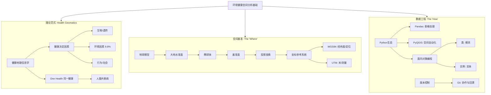

# 🌏 模块一：地理空间数据科学基础架构 (Foundations)

## 1.0 模块导读与知识图谱

本模块是整个课程的基石。在环境健康研究中，我们面临的核心挑战是：**如何将异构的、多源的、跨时空的数据（环境监测、临床记录、人口统计）统一到一个可计算的分析框架中。**

本模块不只是教软件操作，而是建立一套**“空间思维 + 计算思维”**的工程逻辑。



---

## 1.1 健康地理信息学与 One Health 范式

### 🌍 背景与意义
传统流行病学侧重于生物学机制（如病毒如何感染细胞）。而**健康地理信息学 (Health Geomatics)** 侧重于**“位置 (Location)”** 如何作为一种暴露代理（Proxy），影响健康结果。
*   **GISChat 视角**：新冠疫情让健康地理学“具象化”。行程码、疫情地图本质上是空间数据的实时可视化。
*   **课程视角**：环境对健康的影响权重（~10%）与医疗系统（~11%）相当，但改善环境的边际成本往往低于提升医疗技术，因此具有极高的公共卫生价值。

### 📐 核心概念

#### 1. 健康决定因素 (Determinants of Health)
*   **基础层**：健康不仅仅是“不生病”，它受多重因素影响。
*   **专业层**（彩虹图模型）：
    1.  **核心层**：年龄、性别、遗传（不可改变）。
    2.  **个体层**：生活方式（吸烟、饮食、运动）。
    3.  **社区层**：社会网络、教育、工作环境。
    4.  **宏观层**：社会经济、文化、环境政策。
*   **应用层**：在建模时，如果我们要研究“空气污染（环境）”对“肺癌（健康）”的影响，必须将**年龄、吸烟史、收入水平**作为**混杂因素 (Confounders)** 进行控制，否则得出的结论是不可靠的。

#### 2. One Health (同一健康)
*   **定义**：人类健康、动物健康和环境健康是不可分割的整体。
*   **深度解析**：
    *   **人畜共患病 (Zoonosis)**：80%以上新发传染病来自各种动物（如 SARS-CoV-2, MERS）。
    *   **反向人畜共患病 (Reverse Zoonosis)**：人传给动物（如人传给水貂）。这在环境健康中常被忽视，但对病毒变异库的监测至关重要。
    *   **学科交叉**：通过 GIS 追踪野生动物迁徙路线与人类聚落的重叠，可以预测溢出风险。

---

## 1.2 空间数据的基础物理法则：GIS 核心

### 🧪 技术原理：从地球到地图的数学转换

在进行任何距离计算（如：该患者距离最近的化工厂多少米？）之前，必须解决**坐标参考系统 (CRS)** 问题。

#### 1. 大地测量学基础 (Geodesy)
*   **大地水准面 (Geoid)**：地球真实的、重力等势面形状（像一个凹凸不平的土豆）。它太复杂，无法直接用于数学计算。
*   **椭球体 (Ellipsoid)**：为了计算方便，用一个规则的椭球体去拟合地球（如 GRS80）。
*   **基准面 (Datum)**：将椭球体“锚定”到地球的具体位置。
    *   *地心基准面*（如 WGS84）：锚点在地球质量中心，适合全球定位。
    *   *区域基准面*（如 ED50）：锚点在特定区域表面，该区域内精度更高。

#### 2. 投影 (Projection)
将 3D 表面撕开铺平到 2D 平面的过程。**所有投影都会变形**，必须根据需求选择保留的属性（等角、等积、等距）。

| 特性             | **WGS84 (EPSG:4326)**          | **UTM (如 Zone 32N - EPSG:32632)**     |
| :--------------- | :----------------------------- | :------------------------------------- |
| **类型**         | 地理坐标系 (Geographic)        | 投影坐标系 (Projected)                 |
| **单位**         | **度 (Degrees)**               | **米 (Meters)**                        |
| **坐标形式**     | 经度, 纬度 (Lon, Lat)          | 东伪偏移, 北伪偏移 (Easting, Northing) |
| **适用场景**     | 数据存储、GPS 定位、全球可视化 | **距离计算、面积计算、空间分析**       |
| **环境健康应用** | 记录患者居住地、监测站位置     | 计算缓冲区 (Buffer)、插值、密度分析    |

**⚠️ 严重警告**：永远不要在 WGS84 (度) 坐标系下计算欧氏距离或缓冲区！因为经度线的间距随纬度变化，1度在赤道和在北极代表的实际距离完全不同。**必须重投影到 UTM**。

### 💻 实操指南：数据模型与 QGIS

#### 1. 数据模型 (Data Models)
*   **矢量 (Vector)**：离散对象。
    *   *点*：监测站、病例住址。
    *   *线*：河流、道路网络（用于计算交通污染暴露）。
    *   *面*：行政区划（用于统计发病率）、湖泊。
    *   *格式*：**Shapefile** (旧标准，多文件组成，列名限制10字符)、**GeoPackage** (新标准，单文件，基于SQLite)。
*   **栅格 (Raster)**：连续场。
    *   *例子*：卫星反演的 PM2.5 浓度图、地表温度 (LST)、高程模型 (DEM)。
    *   *结构*：矩阵，每个像素 (Pixel) 有一个数值。

#### 2. QGIS 与 Python 的关系
QGIS 是开源 GIS 软件，其内核是用 C++ 写的，但提供了强大的 Python API (**PyQGIS**)。
*   **为什么用 PyQGIS？**
    *   **自动化**：如果你的研究涉及全意大利 100 个省份，每个省份都要做相同的缓冲区分析，手动点击会死人，Python 循环只需 1 秒。
    *   **复现性**：代码可以记录你的分析步骤，鼠标点击无法被同行评审。

---

## 1.3 编程工程学：Python, Pandas 与 OOP

### 📐 核心概念：面向对象编程 (OOP)
在环境健康建模中，数据结构非常复杂。OOP 提供了一种组织代码的方法，使代码更易读、易维护。

#### 1. 类与实例 (Class & Instance)
*   **基础层**：
    *   **Class (类)** = 饼干模具。它定义了形状和规则。
    *   **Instance (实例)** = 用模具压出来的饼干。每一个都是独立的实体。
*   **专业层**：
    *   类定义了**属性 (Attributes)**（数据）和**方法 (Methods)**（行为）。
    *   `self` 关键字在 Python 中指代“实例本身”。

#### 2. 在本课程中的应用
我们需要构建自定义对象来处理复杂的时空数据。例如，定义一个 `StudyArea` 类。

### 💻 代码实战：构建环境健康分析类
这个示例展示了如何定义一个类来管理环境数据，并包含简单的分析方法。

```python
import numpy as np
import pandas as pd

class EnvironmentalExposure:
    """
    用于管理环境暴露数据的类。
    包含数据加载、清洗和风险分类的方法。
    """
    
    def __init__(self, dataset_name, pollutant_type, threshold):
        """
        构造函数 (Constructor): 初始化实例属性
        :param dataset_name: 数据集名称 (str)
        :param pollutant_type: 污染物类型，如 'NO2', 'PM2.5' (str)
        :param threshold: 风险阈值，超过此值视为高风险 (float)
        """
        self.name = dataset_name
        self.pollutant = pollutant_type
        self.threshold = threshold
        self.data = None  # 占位符，稍后加载数据
        print(f"初始化项目: {self.name} | 关注污染物: {self.pollutant}")

    def load_data(self, data_list):
        """
        模拟数据加载方法
        :param data_list: 包含测量值的列表 (list)
        """
        self.data = np.array(data_list)
        print(f"数据加载完成，共 {len(self.data)} 条记录。")

    def analyze_risk(self):
        """
        分析方法：计算超标率
        :return: 超标天数比例 (float)
        """
        if self.data is None:
            raise ValueError("数据未加载！请先调用 load_data()")
        
        # 向量化运算 (Vectorization) - 比循环快得多
        exceedance = self.data > self.threshold
        num_exceed = np.sum(exceedance)
        rate = num_exceed / len(self.data)
        
        return rate

# --- 使用示例 ---
# 1. 实例化对象 (Instance)
milan_study = EnvironmentalExposure("Milan_2024", "PM10", 50.0)

# 2. 模拟一些环境监测数据 (假设是微克/立方米)
sensor_data = [45.2, 55.6, 62.1, 48.9, 30.5, 120.0, 49.9]

# 3. 调用方法
milan_study.load_data(sensor_data)
risk_rate = milan_study.analyze_risk()

print(f"高风险暴露比例: {risk_rate:.2%}") 
# 输出: 42.86%
```

---

## 1.4 自动化工作流：从脚本到软件

### 🧪 技术原理：封装 (Encapsulation)
*   **问题**：初学者常把几千行代码写在一个 `main.py` 里，导致难以调试。
*   **解决**：**封装**。将特定的功能（如“读取Shapefile”、“计算NDVI”、“导出报表”）剥离成独立的函数或脚本文件。
*   **最佳实践**：
    *   `data_loader.py`: 专门负责读取各种奇怪格式的数据。
    *   `preprocessing.py`: 专门负责清洗、去重、填补缺失值。
    *   `analysis.py`: 核心算法。
    *   `main.py`: 负责调度以上模块，不包含具体逻辑。

### 💻 实操指南：PyQGIS 批处理脚本
这是一个典型的 PyQGIS 脚本，用于在 QGIS 内部控制台运行。它展示了如何遍历图层中的每个要素（Feature），这在“计算每个城市的平均气温”这种任务中非常常见。

```python
# 必须在 QGIS Python Console 中运行
from qgis.core import (
    QgsProject,
    QgsVectorLayer,
    QgsFeature
)

def list_features_attributes(layer_name, attribute_name):
    """
    打印指定图层中某一列的所有值
    """
    # 1. 获取当前项目中的图层
    layers = QgsProject.instance().mapLayersByName(layer_name)
    
    if not layers:
        print(f"错误：找不到名为 '{layer_name}' 的图层")
        return
        
    layer = layers[0] # 获取第一个匹配的图层
    
    # 2. 遍历要素 (Features)
    # getFeatures() 返回一个迭代器，非常节省内存
    print(f"正在读取图层: {layer.name()}...")
    count = 0
    for feature in layer.getFeatures():
        # 获取属性值
        val = feature[attribute_name]
        print(f"Feature ID {feature.id()}: {attribute_name} = {val}")
        count += 1
        if count >= 5: break # 仅打印前5个作为示例

# 假设你已经加载了一个叫 "Lombardy_Municipalities" 的图层
# 且里面有一列叫 "NAME"
# list_features_attributes("Lombardy_Municipalities", "NAME")
```

---

## 1.5 版本控制与协作 (Git)

### ⚠️ 常见问题与解决方案
在科研项目中，Git 不仅是备份工具，更是**“时光机”**。

1.  **为什么需要 Git？**
    *   避免文件名出现 `thesis_final_v2_really_final_modified.doc`。
    *   当代码跑崩了，可以一键回退到昨天能跑的版本。
2.  **核心命令**：
    *   `git init`: 初始化仓库。
    *   `git add .`: 将文件放入暂存区（Stage）。
    *   `git commit -m "msg"`: 保存快照（这就是一个版本）。
    *   `git push`: 上传到 GitHub。
    *   `git pull`: **黄金法则**。在开始每天工作前，必须先 Pull，以防止覆盖队友的代码。
3.  **冲突 (Conflict)**：
    *   当两个人同时修改了同一行代码，Git 无法自动合并。
    *   **解决**：手动打开文件，保留需要的代码，删除 Git 插入的标记 (`<<<<<<< HEAD`)，然后重新 Commit。

---

## 📊 跨学科术语对照表 (Module 1)

| 术语 (English) | 数据科学/计算机视角               | 流行病学/环境科学视角                   | 地理信息科学 (GIS) 视角               |
| :------------- | :-------------------------------- | :-------------------------------------- | :------------------------------------ |
| **Instance**   | 类的实例化对象 (Object in memory) | 一个具体的观察样本 (Sample/Case)        | 一个地理要素 (Feature: Point/Polygon) |
| **Attribute**  | 对象的成员变量                    | 协变量/风险因子 (Covariate/Risk Factor) | 属性表中的字段/列 (Field/Column)      |
| **Join**       | 表连接 (Merge/Join)               | 记录链接 (Record Linkage)               | 空间连接 (Spatial Join)               |
| **Resolution** | 数据精度/粒度                     | 聚合水平 (Aggregation Level)            | 空间分辨率 (Spatial Resolution)       |
| **Noise**      | 数据中的随机误差                  | 混杂因素/测量误差                       | 几何拓扑错误/影像噪点                 |

---

## 🌐 案例研究深度解析：1854年伦敦霍乱

*   **问题定义**：霍乱是通过“瘴气（空气）”传播还是其他途径？
*   **数据收集**：John Snow 医生手动记录了每一个死亡病例的住址（点数据），以及该区域水泵的位置（点数据）。
*   **分析方法**：**空间叠加 (Spatial Overlay)**。他在地图上标记病例，发现病例高度聚集在 Broad Street 水泵周围。
*   **结果解释**：这是一种**基于位置的推断**。虽然当时还没发现霍乱弧菌，但空间模式强有力地指向了水源传播。
*   **干预措施**：拆掉水泵的把手（切断暴露源）。
*   **现代启示**：这是 Health Geomatics 的原型。今天我们用 GIS 软件替代了手绘地图，用复杂的统计模型替代了肉眼观察，但核心逻辑未变——**通过空间模式寻找疾病成因**。

---

# 📉 模块二：统计推断与机器学习方法论 (Methodology)

## 2.0 模块导读：两种文化的碰撞

在环境健康数据科学中，我们同时使用两套哲学体系：
1.  **推断（Inference）**：源自统计学/流行病学。关注**“为什么”**（$X$ 对 $Y$ 的影响机制是什么？相关性显著吗？）。重点在于参数估计、置信区间和假设检验。
2.  **预测（Prediction）**：源自计算机科学/机器学习。关注**“是什么”**（给定 $X$，能否准确预测 $Y$？）。重点在于泛化能力、准确率和过拟合控制。

本模块的目标是融合这两者：用统计学严谨性筛选变量，用机器学习强大的拟合能力构建模型。

---

## 2.1 统计推断基础：拨开随机性的迷雾

### 📐 核心概念：假设检验 (Hypothesis Testing)

#### 1. 证伪主义逻辑
科学无法通过数据“证明”一个理论绝对正确，只能证明它“尚未被推翻”。
*   **原假设 ($H_0$, Null Hypothesis)**：默认立场。例如：“空气污染与肺癌**没有**关系”（$\beta = 0$）。
*   **备择假设 ($H_1$, Alternative Hypothesis)**：我们试图寻找证据支持的立场。例如：“空气污染与肺癌**有**关系”（$\beta \neq 0$）。

#### 2. 判决规则与错误类型
这是环境健康决策中最敏感的部分。

| 真实情况 \ 决策结果       | **拒绝 $H_0$ (认为有危害)**                                  | **不拒绝 $H_0$ (认为无危害)**                                |
| :------------------------ | :----------------------------------------------------------- | :----------------------------------------------------------- |
| **$H_0$ 为真 (实际无害)** | **第一类错误 (Type I Error)** <br> $\alpha$ (假阳性)<br> *后果：导致恐慌，浪费治理成本* | 正确决策 <br> ($1-\alpha$)                                   |
| **$H_0$ 为假 (实际有害)** | 正确决策 (Power) <br> ($1-\beta$)                            | **第二类错误 (Type II Error)** <br> $\beta$ (假阴性) <br> *后果：漏掉风险，公众健康受损* |

*   **P值 (P-value)**：在 $H_0$ 为真的前提下，观察到当前数据（或更极端数据）的概率。
    *   **误区警示**：$P > 0.05$ **不代表** $H_0$ 是真的！只代表证据不足（Not enough evidence）。就像法庭上“证据不足释放”不等于“宣判无罪”。

#### 3. 置信区间 (Confidence Interval, CI)
相比 P 值，CI 提供更多信息。
*   **定义**：如果我们重复采样100次，有95次计算出的区间会包含真实的总体参数。
*   **应用**：若 Odds Ratio 的 95% CI 为 $[0.9, 1.5]$，因为区间包含了 **1**（无效值），所以结果不显著。若为 $[1.1, 1.5]$，则显著增加风险。

### 💻 实操指南：统计检验的选择与 Python 实现

面对手中的数据，如何选择正确的检验方法？请遵循以下**决策树**：

1.  **数据类型**？ (连续 vs 分类)
2.  **组数**？ (1组, 2组, >2组)
3.  **分布**？ (正态 vs 非正态 -> 参数检验 vs 非参数检验)
4.  **独立性**？ (配对 vs 独立 -> 同一人不同时间测 vs 不同人群测)

```python
import numpy as np
from scipy import stats

# 模拟数据：两个城市的PM2.5日均浓度
# 城市A（工业区）：正态分布
city_a = np.random.normal(loc=55, scale=10, size=100)
# 城市B（生态区）：正态分布
city_b = np.random.normal(loc=45, scale=10, size=100)

# 1. 正态性检验 (Shapiro-Wilk)
# H0: 数据服从正态分布
shapiro_a = stats.shapiro(city_a)
shapiro_b = stats.shapiro(city_b)

print(f"城市A 正态性 P值: {shapiro_a.pvalue:.4f}")

# 2. 方差齐性检验 (Levene test)
# H0: 两组方差相等
levene = stats.levene(city_a, city_b)

# 3. 选择检验方法
if shapiro_a.pvalue > 0.05 and shapiro_b.pvalue > 0.05:
    if levene.pvalue > 0.05:
        # 满足正态且方差齐 -> 独立样本 T 检验
        res = stats.ttest_ind(city_a, city_b)
        test_name = "T-test"
    else:
        # 方差不齐 -> Welch's T-test
        res = stats.ttest_ind(city_a, city_b, equal_var=False)
        test_name = "Welch's T-test"
else:
    # 不满足正态分布 -> 曼-惠特尼 U 检验 (非参数)
    res = stats.mannwhitneyu(city_a, city_b)
    test_name = "Mann-Whitney U"

print(f"使用方法: {test_name} | 统计量: {res.statistic:.2f} | P值: {res.pvalue:.4e}")
# 结论：若P<0.05，拒绝H0，认为两城市PM2.5浓度有显著差异。
```

---

## 2.2 流行病学核心指标：OR 与 RR

在环境健康中，我们很少直接预测“某人明天会不会得病”，而是评估“暴露是否增加了得病的概率”。

### 🧪 技术原理：风险度量

| 指标         | **相对风险 (Relative Risk, RR)** | **比值比 (Odds Ratio, OR)**                              |
| :----------- | :------------------------------- | :------------------------------------------------------- |
| **定义**     | 暴露组发病率 / 非暴露组发病率    | 病例组暴露比值 / 对照组暴露比值                          |
| **适用研究** | **队列研究 (Cohort)** (前瞻性)   | **病例对照研究 (Case-Control)** (回顾性)                 |
| **公式**     | $$RR = \frac{A/(A+B)}{C/(C+D)}$$ | $$OR = \frac{A/C}{B/D} = \frac{A \times D}{B \times C}$$ |
| **解释**     | "暴露组患病风险是非暴露组的X倍"  | "患病者有过暴露史的可能性是未患病者的X倍"                |
| **数学特性** | 直观，但在发病率高时数值较小     | 在罕见病（Rare Disease Assumption）下，OR $\approx$ RR   |

*注：A=暴露且患病, B=暴露未患病, C=未暴露患病, D=未暴露未患病*

### 💻 实操指南：用 Python 计算 OR 与 RR

```python
import numpy as np
import statsmodels.api as sm

# 构建列联表 (2x2 Contingency Table)
#           患病(Case)   未患病(Control)
# 暴露(Exp)      a            b
# 未暴露(Un)     c            d

table = np.array([[30, 70],   # 暴露组：30人病，70人未病
                  [10, 90]])  # 非暴露组：10人病，90人未病

# 手动计算
a, b = table[0]
c, d = table[1]

# 1. Relative Risk (RR)
risk_exposed = a / (a + b)
risk_unexposed = c / (c + d)
rr = risk_exposed / risk_unexposed
print(f"Relative Risk (RR): {rr:.2f}") 
# 解释: 暴露组患病风险是非暴露组的 3.00 倍

# 2. Odds Ratio (OR)
odds_exposed = a / b
odds_unexposed = c / d
or_val = odds_exposed / odds_unexposed
print(f"Odds Ratio (OR): {or_val:.2f}")
# 解释: OR 通常比 RR 更极端 (这里是 3.86)

# 3. 使用 statsmodels 计算置信区间
table_sm = sm.stats.Table2x2(table)
print(table_sm.summary())
# 输出包含 95% CI，若 CI 跨越 1 (例如 0.8 - 1.5)，则无统计学意义。
```

---

## 2.3 机器学习范式：从模式识别到预测

在环境健康中，机器学习（ML）主要用于处理复杂的非线性关系（如：气温对死亡率的影响呈 U 型曲线，两端高中间低）。

### 📐 核心概念：分类体系

#### 1. 无监督学习 (Unsupervised Learning)
*目标：没有标准答案，寻找数据内在结构。*
*   **聚类 (Clustering)**：
    *   **K-Means**：基于距离，假设簇是球状的。**缺点**：必须预设 K 值，对噪声敏感。
    *   **DBSCAN**：基于密度。**环境健康首选**。
        *   *优势*：能发现任意形状的簇（如沿着河流或道路分布的污染带），能自动识别并排除噪声（异常值）。
*   **降维 (Dimensionality Reduction)**：
    *   **PCA (主成分分析)**：将高度相关的变量（如温度、湿度、露点）压缩成几个互不相关的主成分，解决**多重共线性**问题。

#### 2. 有监督学习 (Supervised Learning)
*目标：给定输入 X，预测标签 Y。*
*   **回归 (Regression)**：预测连续值（如 PM2.5 浓度）。
    *   **线性回归**：基准模型。
    *   **Lasso / Ridge**：引入正则化项，防止过拟合，处理高维环境数据。
*   **分类 (Classification)**：预测类别（如 风险等级：高/中/低）。
    *   **逻辑回归**：虽然叫回归，实际是分类。输出概率（0-1）。
    *   **决策树 (Decision Tree)**：像医生诊断流程一样的 If-Else 规则，可解释性强，但易过拟合。

#### 3. 集成学习 (Ensemble Methods) —— 核心中的核心
这是目前竞赛和实战中表现最好的模型族。
*   **Bagging (如 Random Forest)**：
    *   *原理*：并联。训练很多棵树，每棵树看不同的数据子集，最后投票。
    *   *特点*：降低方差（稳健），不易过拟合。适合处理高维环境数据。
*   **Boosting (如 XGBoost, LightGBM)**：
    *   *原理*：串联。后一棵树专门修正前一棵树的错误。
    *   *特点*：降低偏差（精准），精度极高，但参数难调。

---

## 2.4 模型评估与可解释性 AI (XAI)

在医疗和环境领域，**“黑盒”模型是不可接受的**。如果模型预测某区域癌症高发，决策者必须知道原因（是污染？是老龄化？还是吸烟？）。

### 🧪 技术原理：模型评估指标

*   **混淆矩阵 (Confusion Matrix)**：
    *   **Accuracy (准确率)**：$(TP+TN)/Total$。**陷阱**：在罕见病预测中（如发病率1%），模型只要全猜“不病”，准确率就有99%，但毫无用处。
    *   **Sensitivity (Recall/灵敏度)**：$TP/(TP+FN)$。**宁可错杀，不可放过**。筛查传染病时，必须最大化灵敏度。
    *   **Specificity (特异度)**：$TN/(TN+FP)$。**精准打击**。确诊治疗时，需要高特异度，避免误诊。
*   **ROC 曲线与 AUC**：衡量模型在不同阈值下的综合能力。AUC=0.5 是瞎猜，AUC=1 是完美。

### 📐 核心概念：SHAP (Shapley Additive exPlanations)
这是目前最先进的 XAI 方法，源于博弈论。
*   **原理**：计算每个特征（如 PM2.5、温度）对最终预测结果的“边际贡献”。
*   **优势**：
    1.  **全局解释**：哪些环境因子最重要？
    2.  **局部解释**：对于**这个特定的病人**，为什么模型预测他是高风险？（例如：因为他住在高速公路旁且年龄>70）。

### 💻 实操指南：随机森林与 SHAP 分析

```python
import pandas as pd
from sklearn.ensemble import RandomForestClassifier
from sklearn.model_selection import train_test_split
import shap

# 1. 准备数据
# 假设 X 是环境特征 (PM2.5, 温度, 距离道路距离, 绿地率)
# y 是健康结局 (0:健康, 1:呼吸道疾病)
X, y = load_environmental_health_data() 
X_train, X_test, y_train, y_test = train_test_split(X, y, test_size=0.2)

# 2. 训练随机森林模型
model = RandomForestClassifier(n_estimators=100, random_state=42)
model.fit(X_train, y_train)

# 3. 评估模型
print(f"Test Accuracy: {model.score(X_test, y_test):.2f}")

# 4. SHAP 可解释性分析
explainer = shap.TreeExplainer(model)
shap_values = explainer.shap_values(X_test)

# 绘制特征重要性蜂群图 (Beeswarm plot)
# 这一步会生成图表，显示每个特征如何影响预测（正向或负向）
shap.summary_plot(shap_values[1], X_test) 
```

---

## 📊 跨学科术语对照表 (Module 2)

| 术语 (English)     | 数据科学 (Data Science) | 流行病学 (Epidemiology)            | 环境科学 (Env. Sci.) |
| :----------------- | :---------------------- | :--------------------------------- | :------------------- |
| **Feature**        | 特征 / 维度             | 协变量 / 风险因子 (Covariate)      | 环境参数             |
| **Target / Label** | 目标变量 / 标签         | 结局 / 健康终点 (Outcome/Endpoint) | 响应变量             |
| **Weights**        | 权重 (Model Parameters) | 效应大小 (Effect Size)             | 贡献度               |
| **Bias**           | 欠拟合 (Underfitting)   | 系统误差 / 混杂 (Confounding)      | 测量偏差             |
| **Noise**          | 随机误差 / 不可约误差   | 测量误差 / 个体差异                | 背景波动             |
| **Sensitivity**    | 召回率 (Recall)         | 灵敏度 (真阳性率)                  | 检出限               |

---

## ⚠️ 常见问题与解决方案 (FAQ)

*   **Q1: 环境数据（如气温）和健康数据（如死亡率）尺度不一致怎么办？**
    *   **问题**：气温是每天变化的，死亡率可能只有月度数据；或者气温是连续的，健康结局是二元的。
    *   **解决**：
        1.  **聚合 (Aggregation)**：将气温聚合为月均温（损失信息）。
        2.  **泊松回归 (Poisson Regression)**：如果因变量是“每天死亡人数”（计数数据），不要用线性回归，要用广义线性模型 (GLM) 中的泊松回归或负二项回归。

*   **Q2: 为什么我的模型准确率很高，但在新城市完全失效？**
    *   **原因**：**过拟合 (Overfitting)** 或 **空间异质性**。模型学到了原城市特有的噪声，而非普遍规律。
    *   **解决**：
        1.  使用交叉验证 (Cross-Validation)。
        2.  引入空间变量（见模块三）。
        3.  使用正则化 (Lasso/Ridge)。

*   **Q3: 相关性分析显示“绿地越多，癌症发病率越高”，这合理吗？**
    *   **原因**：典型的**混杂偏倚**。可能绿地多的地方是富人区，富人平均寿命更长，而癌症是老年病，所以发病率看起来高（其实是因为活得久）。
    *   **解决**：必须对年龄、收入进行**分层分析**或**多元回归控制**。

---

# 🌍 模块三：高级空间统计与建模 (Advanced Spatial Statistics & Modeling)

## 3.0 模块导读：打破“独立性”假设

在普通统计学（模块二）中，我们假设样本是**独立同分布 (i.i.d.)** 的。但在地理空间中，**“一切事物都与其他事物相关，但近处的事物比远处的事物更相关”**（Tobler 地理学第一定律）。

如果在分析环境健康数据时忽略空间效应，会导致：
1.  **伪重复 (Pseudoreplication)**：样本看起来很多，其实由于空间自相关，有效样本量很小。
2.  **参数估计偏差**：回归系数不可靠。
3.  **生态谬误 (Ecological Fallacy)**：混淆了不同尺度的关系。

本模块的核心任务是将**空间结构 (Spatial Structure)** 显式地纳入数学模型中。

---

## 3.1 空间数据处理：粒度与插值

在环境健康中，我们经常面临**“点面不匹配”**的问题：空气质量是监测站测的（点），但健康数据是按行政区划统计的（面）。我们需要通过插值来填补空白。

### 📐 核心概念
*   **空间粒度 (Spatial Granularity/Resolution)**：空间划分的精细程度。
    *   *高粒度*：网格单元小（如 10m $\times$ 10m），细节丰富，计算量大。
    *   *低粒度*：网格单元大（如 10km $\times$ 10km），概括性强，计算快。
*   **尺度转换 (Scaling)**：
    *   **Upscaling (聚合)**：细 $\to$ 粗。例如：从像素级 PM2.5 聚合到城市平均值。
    *   **Downscaling (降尺度)**：粗 $\to$ 细。例如：利用土地利用数据，将卫星反演的粗分辨率气温推演到街道尺度。

### 🧪 技术原理：空间插值 (Spatial Interpolation)
利用已知点的数据，推测未知位置的数据。

| 方法                   | 原理                                                         | 优点                                    | 缺点                             | 环境健康应用场景           |
| :--------------------- | :----------------------------------------------------------- | :-------------------------------------- | :------------------------------- | :------------------------- |
| **Voronoi / Thiessen** | 最近邻分配。将空间划分为多边形，每个位置的值等于最近监测点的值。 | 简单直观                                | 边界突变，不连续，不符合自然规律 | 服务区划分（如最近的医院） |
| **IDW (反距离加权)**   | 距离衰减。未知点的值是周围已知点的加权平均，距离越近权重越大。 | 计算快，保留极值                        | 无法估计误差，对聚集点敏感       | 快速生成污染热力图         |
| **Kriging (克里金)**   | **地统计学方法**。利用半变异函数 (Semivariogram) 建模空间自相关结构。 | **无偏最优估计 (BLUE)**，提供预测误差图 | 计算极慢，需要满足平稳性假设     | **环境暴露评估的金标准**   |
| **Splines (样条函数)** | 物理模拟。通过最小化表面曲率来拟合平滑曲面（像弯曲的金属板）。 | 表面非常平滑                            | 容易在数据稀疏处产生异常振荡     | 气温表面插值               |

### 💻 实操指南：Python 实现 IDW 插值
使用 `scikit-learn` 或 `scipy` 可以快速实现。

```python
import numpy as np
from scipy.interpolate import Rbf  # 径向基函数插值 (类似 IDW/Spline)
import matplotlib.pyplot as plt

# 1. 模拟监测站数据 (已知点)
x_obs = np.array([1, 2, 4, 5, 8]) # 经度
y_obs = np.array([1, 3, 2, 5, 1]) # 纬度
z_obs = np.array([10, 15, 12, 30, 5]) # PM2.5 浓度

# 2. 创建插值网格 (未知点)
ti_x = np.linspace(0, 10, 100)
ti_y = np.linspace(0, 6, 100)
XI, YI = np.meshgrid(ti_x, ti_y)

# 3. 运行插值 (Rbf - Radial Basis Function)
# 'inverse': 反距离权重
rbf_model = Rbf(x_obs, y_obs, z_obs, function='inverse')
ZI = rbf_model(XI, YI)

# 4. 可视化
plt.figure(figsize=(8, 6))
plt.pcolor(XI, YI, ZI, cmap='RdYlGn_r') # 红色代表高污染
plt.scatter(x_obs, y_obs, c='black', s=100, label='监测站')
plt.colorbar(label='PM2.5 Concentration')
plt.title("Spatial Interpolation (IDW-like)")
plt.legend()
plt.show()
```

---

## 3.2 空间关联性：探索空间模式

在建模之前，必须进行**探索性空间数据分析 (ESDA)**，回答：数据是随机分布的，还是聚集的？

### 🧪 技术原理：空间权重矩阵 ($W$)
这是所有空间统计的核心。它定义了“谁是谁的邻居”。
*   **邻接定义 (Contiguity)**:
    *   **Rook (车)**: 共享边。
    *   **Queen (后)**: 共享边或顶点（更常用）。
*   **距离定义 (Distance)**:
    *   **KNN**: 最近的 K 个点为邻居。
    *   **阈值距离**: 半径 R 内的所有点。
    *   **反距离**: 所有点都是邻居，但权重随距离衰减（$1/d^2$）。

### 📐 核心概念：莫兰指数 (Moran's I)

#### 1. 全局莫兰指数 (Global Moran's I)
*   **定义**：衡量整个研究区域的空间自相关程度。
*   **取值范围**：$[-1, 1]$
    *   $I > 0$ (接近 1)：**聚类 (Clustered)**。高值挨着高值，低值挨着低值（如传染病爆发、工业区污染）。
    *   $I < 0$ (接近 -1)：**离散 (Dispersed)**。像棋盘格一样交错（在自然界较少见）。
    *   $I \approx 0$：**随机 (Random)**。

#### 2. 局部莫兰指数 (Local Moran's I / LISA)
*   **目的**：全局指数可能掩盖局部异常。LISA (Local Indicators of Spatial Association) 用于识别具体的**热点**和**冷点**。
*   **四种聚类类型**：
    1.  **High-High (HH)**: **热点**。高发病率地区被高发病率地区包围（重点干预区域）。
    2.  **Low-Low (LL)**: **冷点**。低风险区被低风险区包围。
    3.  **High-Low (HL)**: **空间异常值**。一个高值点周围都是低值（可能是局部污染源，或数据错误）。
    4.  **Low-High (LH)**: **空间异常值**。一个低值点周围都是高值（可能是防护做得好的“避难所”）。

---

## 3.3 空间回归模型：显式建模

如果 Moran's I 显示数据存在显著的空间自相关，使用普通最小二乘法 (OLS) 回归就是**错误**的（违反了独立性假设，残差存在空间结构）。我们需要**空间回归**。

### 🧪 技术原理：空间计量经济学模型

#### 1. 空间滞后模型 (Spatial Lag Model, SAR)
*   **假设**：邻居的行为直接影响我（**扩散效应**）。
*   **公式**：$y = \rho W y + X\beta + \epsilon$
    *   $Wy$：空间滞后项（邻居的平均值）。
    *   $\rho$：空间自回归系数。
*   **应用**：传染病模型。一个城市的流感病例数，不仅取决于该市的卫生条件 ($X$)，还取决于隔壁城市是否有流感 ($Wy$)。

#### 2. 空间误差模型 (Spatial Error Model, SEM)
*   **假设**：邻居的影响来自未观测到的、空间相关的误差项（**遗漏变量**）。
*   **公式**：$y = X\beta + u, \quad u = \lambda W u + \epsilon$
*   **应用**：环境健康研究。如果我们研究癌症与吸烟的关系，但忽略了“区域气候特征”这个变量（它是空间连续的），那么误差项 $u$ 就会表现出空间自相关。此时应用 SEM。

### 💻 实操指南：PySAL (Python Spatial Analysis Library)
`esda` 用于空间自相关，`spreg` 用于空间回归。

```python
import libpysal
from esda.moran import Moran
from spreg import OLS, ML_Lag, ML_Error

# 1. 创建空间权重矩阵 (Queen Contiguity)
# w 是一个对象，定义了谁是谁的邻居
w = libpysal.weights.Queen.from_dataframe(gdf)
w.transform = 'r' # 行标准化 (Row-standardized)

# 2. 计算全局 Moran's I
y = gdf['lung_cancer_rate'].values
moran = Moran(y, w)
print(f"Moran's I: {moran.I:.3f}, P-value: {moran.p_sim:.4f}")

# 3. 如果 P < 0.05 (存在自相关)，运行空间回归
# 准备变量
X_vars = ['smoking_rate', 'income', 'pm25']
X = gdf[X_vars].values

# 模型A: 普通最小二乘 (OLS) - 作为基准
ols = OLS(y, X, w=w, name_x=X_vars, name_y='cancer')
print(ols.summary) # 检查 Moran's I of residuals

# 模型B: 空间滞后模型 (SAR)
sar = ML_Lag(y, X, w=w, name_x=X_vars, name_y='cancer')
print(sar.summary)
```

---

## 3.4 地理加权回归 (GWR) 与多尺度 GWR (MGWR)

### 📐 核心概念：空间非平稳性 (Spatial Non-stationarity)
全局模型（如 OLS, SAR）假设 $X$ 和 $Y$ 的关系在整个地图上是**固定**的（例如：PM2.5 每增加 10，死亡率增加 5%）。
但在现实中，这种关系可能随位置变化（**空间异质性**）。例如：在贫困地区，污染对健康的影响可能比富裕地区更大（因为医疗条件差）。

#### 1. 地理加权回归 (GWR)
*   **原理**：不再拟合一条全局回归线，而是**为地图上的每一个点都拟合一个局部回归方程**。
*   **权重**：在拟合某一点的模型时，离该点越近的样本权重越大（核函数）。
*   **输出**：每个样本点都有一套自己的回归系数 ($\beta_0, \beta_1, ...$)。我们可以绘制**系数地图**，直观展示“哪里污染影响最大”。

#### 2. 多尺度地理加权回归 (MGWR)
*   **GWR 的局限**：假设所有变量的影响尺度（带宽 Bandwidth）是相同的。
*   **MGWR 的改进**：允许不同变量拥有不同的带宽。
    *   *局部变量*：带宽小（如交通噪音，只影响周边几百米）。
    *   *全局变量*：带宽大（如区域气候政策，影响整个大区）。
*   **地位**：MGWR 是目前处理空间异质性的**最先进 (State-of-the-art)** 方法。

### 🌐 案例应用：MGWR 在环境健康中的应用
*   **研究**：土地利用（绿地、水体）对 PM2.5 浓度的影响。
*   **方法**：使用 MGWR。
*   **发现**：
    *   **全局效应**：工业用地在所有区域都显著增加 PM2.5。
    *   **局部效应**：绿地的降尘作用在城市中心（高密度区）非常显著，但在郊区（本底绿化好）效果不明显。
*   **价值**：这一发现指导政策制定者——在市中心种树比在郊区种树的边际健康收益更高。

---

## 📊 跨学科术语对照表 (Module 3)

| 术语 (English)    | 数据科学/机器学习        | 统计学     | 地理信息科学 (GIS) | 环境健康意义                   |
| :---------------- | :----------------------- | :--------- | :----------------- | :----------------------------- |
| **Interpolation** | 回归/填补缺失值          | 预测       | 栅格化/空间插值    | 估算无监测站地区的暴露水平     |
| **Spatial Lag**   | 邻接节点的特征聚合 (GNN) | 自相关项   | 邻域加权平均       | 邻近社区的溢出效应 (Spillover) |
| **Stationarity**  | 分布一致性               | 平稳性     | 空间同质性         | 假设健康风险因子在各地作用相同 |
| **Bandwidth**     | 超参数/窗口大小          | 平滑参数   | 搜索半径/邻域范围  | 影响范围 (如工厂污染圈)        |
| **Hotspot**       | 异常检测/高值簇          | 显著高值区 | High-High Cluster  | 疾病爆发区/高风险聚集区        |

---

## ⚠️ 常见问题与解决方案 (FAQ)

*   **Q1: 如何选择网格形状？正方形还是六边形？**
    *   **回答**：**六边形 (Hexagon)** 通常更好。
    *   **理由**：
        1.  六边形的所有邻居距离质心相等（正方形的对角线邻居更远），这减少了采样偏差。
        2.  六边形更能拟合复杂的自然边界。
        3.  视觉效果更自然，减少了人眼的“网格错觉”。

*   **Q2: 什么时候用全局模型 (OLS/SAR)，什么时候用局部模型 (GWR)？**
    *   **诊断**：先跑 OLS，检查残差的 Moran's I。
        *   如果残差随机分布 $\to$ OLS 足够。
        *   如果残差聚类 $\to$ 考虑 SAR/SEM。
    *   **异质性检验**：如果怀疑 $X$ 对 $Y$ 的作用因地而异（Koenker (BP) Test 显著），则必须用 GWR/MGWR。

*   **Q3: GWR 的结果系数在某些地方非常极端且难以解释，为什么？**
    *   **原因**：**多重共线性 (Multicollinearity)**。在局部小范围内，两个自变量可能高度相关（例如富人区绿地也多，如果是局部回归，模型分不清是收入还是绿地在起作用）。
    *   **解决**：在运行 GWR 前，先做全局 VIF (方差膨胀因子) 检验；或者使用正则化的 GWR。

---

# 🏥 模块四：环境健康风险评估模型 (Environmental Health Risk Assessment Models)

## 4.0 模块导读：从“相关性”到“风险评估”

在数据科学中，我们习惯于预测 $Y$（例如房价）。但在环境健康中，我们更关注 $X$ 对 $Y$ 的**归因 (Attribution)** 和 **风险特征描述 (Characterization)**。

本模块将回答以下核心问题：
1.  **暴露-反应关系**：PM2.5 每增加 10 $\mu g/m^3$，死亡率增加多少？
2.  **滞后效应**：热浪结束了，为什么死亡人数还在上升？
3.  **脆弱性**：同样的污染水平，为什么贫困社区受害更深？

---

## 4.1 理论框架：IPCC 风险定义与因果推断

### 📐 核心概念：IPCC 风险框架
联合国政府间气候变化专门委员会 (IPCC) 定义的“风险 (Risk)”不同于金融或工程领域，它是三个要素的动态交互：

$$ \text{Risk} = \text{Hazard} \times \text{Exposure} \times \text{Vulnerability} $$

1.  **致灾因子 (Hazard)**：可能导致伤害的自然或人为物理事件（例如：极端高温、高浓度 $\text{NO}_2$）。
    *   *数据源*：气象站、CAMS 卫星数据。
2.  **暴露 (Exposure)**：人员、资产或生态系统出现在致灾因子影响范围内的情况（例如：住在热岛中心的人口数量）。
    *   *数据源*：人口密度栅格、土地利用数据。
3.  **脆弱性 (Vulnerability)**：受到不利影响的倾向或易感性（例如：老人、慢性病患者、没有空调的低收入家庭）。
    *   *数据源*：人口普查数据（年龄、收入）、医院记录。

### 🧪 技术原理：混杂与交互

在建模时，必须区分两类不仅影响结果的变量：

1.  **混杂因素 (Confounders)**：既影响暴露，又影响结果，导致“伪相关”。
    *   *例子*：**季节 (Seasonality)**。冬天（季节）气温低（暴露），冬天流感多导致死亡率高（结果）。如果不控制季节，模型会误以为“低温直接导致了所有死亡”，而忽略了流感的作用。
    *   *处理*：在回归方程中作为协变量加入（如时间平滑函数）。

2.  **交互/修饰因子 (Effect Modifiers/Interactions)**：改变暴露与结果之间关系的强度。
    *   *例子*：**绿地**。在同样的温度下（暴露），绿地多（修饰因子）的区域死亡率（结果）上升幅度较小。
    *   *处理*：分层分析或在模型中加入交互项 ($X_1 \times X_2$)。

---

## 4.2 黄金标准：分布式滞后非线性模型 (DLNM)

**DLNM (Distributed Lag Non-linear Model)** 是目前环境流行病学界研究气温/污染对健康影响的**“圣杯”**。它完美解决了两个难题：
1.  **非线性 (Non-linear)**：气温对健康的影响通常是 U 型或 J 型的（太冷太热都不好）。
2.  **滞后性 (Delayed effects)**：暴露的影响不是即时的，而是分布在未来一段时间内的（例如寒潮的死亡高峰通常滞后 2-7 天）。

### 🧪 技术原理：交叉基函数 (Cross-Basis Function)

DLNM 的核心思想是构建一个**二维矩阵**空间，同时描述“暴露-反应”和“滞后-反应”。

#### 1. 维度一：暴露空间 (Exposure-Response)
*   使用**样条函数 (Splines)**（如自然三次样条 Natural Cubic Spline）来拟合暴露值（如温度）与风险（RR）之间的非线性曲线。

#### 2. 维度二：滞后空间 (Lag-Response)
*   同样使用样条函数，描述风险随时间（Lag 0, Lag 1, ..., Lag 21）的衰减或变化规律。

#### 3. 交叉基 (Cross-Basis)
*   将上述两个维度的基函数进行张量积（Tensor Product），形成一个能够同时捕捉**强度**和**时间**维度的复杂曲面。

### 📊 核心输出指标
1.  **相对风险 (RR) 曲线**：通常以“最小死亡温度 (MMT)”为参照（RR=1），绘制其他温度下的 RR 值。
    *   *典型发现*：**“反 J 型曲线” (Reversed J-shape)** —— 低温的风险通常比高温更持久且累积效应更大（虽然高温的急性效应更猛烈）。
2.  **归因风险 (Attributable Risk)**：计算有多少死亡是可以归因于该环境因素的（例如：去年夏天有 500 人因热浪超额死亡）。

### 💻 实操指南：R 语言实现 (dlnm 包)
*注：虽然课程主推 Python，但教授明确指出 DLNM 的生态主要在 R 语言中（Gasparrini et al.）。Python 有 `pydlnm` 但不如 R 的 `dlnm` 包成熟。为了学术严谨，这里提供 R 代码。*

```r
library(dlnm)
library(splines)

# 1. 准备数据
# data 包含: date, death_count, temp (温度), humidity (湿度), time (时间趋势)
# 设定最大滞后天数 (例如 21 天)
max_lag <- 21

# 2. 定义交叉基 (Cross-Basis)
# argvar: 暴露维度的设置 (二次样条, 3个自由度)
# arglag: 滞后维度的设置 (自然样条, 4个自由度)
cb <- crossbasis(data$temp, 
                 lag = max_lag, 
                 argvar = list(fun = "bs", degree = 2, df = 3),
                 arglag = list(fun = "ns", df = 4))

# 3. 建立回归模型 (通常是广义线性模型 GLM + 泊松分布)
# 控制了长期趋势 (ns(time)) 和 湿度
model <- glm(death_count ~ cb + ns(time, 7*10) + humidity, 
             family = quasipoisson(), 
             data = data)

# 4. 预测与绘图
# pred: 计算相对于参考温度 (例如 21度) 的 RR
pred <- crosspred(cb, model, cen = 21, by = 1)

# 绘制 3D 表面图
plot(pred, xlab = "Temperature", zlab = "RR", theta = 200, phi = 30, 
     main = "3D Exposure-Lag-Response Surface")

# 绘制 总体累积效应 (Overall Cumulative Association)
plot(pred, "overall", xlab = "Temperature", ylab = "RR", 
     main = "Overall Effect of Temperature on Mortality")
```

---

## 4.3 创新风险指数：EHRI 与 WMARM

这是本课程研究团队（Polimi）开发的定制化模型，旨在解决传统 DLNM 计算量大、难以直接用于多因素对比的问题。

### 1. 环境相关健康风险指数 (EHRI)
**Environment-Related Health Risk Index**
*   **目标**：完全数据驱动，不依赖先验假设（如具体的病理机制），直接从数据中挖掘“暴露-结果”的异常模式。
*   **算法流程**：
    1.  **定义阈值**：确定什么是“高暴露日”（例如温度 > 95% 分位数）。
    2.  **计算基线**：利用滑动窗口计算“非暴露日”的平均发病率。
    3.  **发病率差分 (Incidence Differential)**：计算暴露日发病率与基线的偏差 ($\Delta inc$)。
    4.  **Bootstrap 检验**：通过 1000 次重采样，验证这个偏差是否具有统计学显著性。
    5.  **加权输出**：最终指数结合了**效应大小 (Effect Size)** 和 **P值 (Robustness)**。
*   **输出含义**：
    *   $EHRI > 0.7$: 暴露极大地增加了风险。
    *   $EHRI < -0.7$: 暴露具有保护作用（降低了风险）。

### 2. 加权元分析相关性评分 (WMARM)
**Weighted Meta-Analytical Relevance Score**
*   **目标**：在不同区域（如米兰的88个分区）或不同年份之间汇总风险，找出哪些环境因素最重要。
*   **核心逻辑**：
    *   不是简单平均，而是**加权平均**。
    *   权重取决于：1. 统计显著性（置信区间越窄，权重越大）；2. 人口数量（影响的人越多，权重越大）。
*   **应用**：可以用来回答“在米兰，是NO2对心血管的影响大，还是PM2.5的影响大？”

---

## 4.4 数据隐私与伦理考量

在处理具体的健康数据（Outcome）时，必须遵守严格的伦理规范。

### ⚠️ 关键原则
1.  **匿名化 (Anonymization)**：移除所有直接标识符（姓名、税号）。
2.  **聚合 (Aggregation)**：这是空间分析中最常用的隐私保护手段。
    *   *操作*：不要发布“张三家住在经纬度(x,y)”，而是发布“该街道/网格单元内有 5 个病例”。
    *   *代价*：**可变面元问题 (MAUP)** —— 聚合的尺度（街道 vs 城市）会改变分析结果。
3.  **K-匿名 (K-anonymity)**：确保任何公开的数据组合至少能匹配到 K 个人（通常 K $\ge$ 3），防止通过多源数据拼凑出个人身份。

---

## 📊 跨学科术语对照表 (Module 4)

| 术语 (English)        | 流行病学 / 环境健康 (Epi/Env) | 数据科学 / 机器学习 (DS/ML)                   |
| :-------------------- | :---------------------------- | :-------------------------------------------- |
| **Dose-Response**     | 剂量-反应关系                 | 特征-目标依赖关系 (Feature-Target Dependency) |
| **Lag**               | 滞后效应（延迟发生）          | 时间序列的时间步 (Time Step / Window)         |
| **Cross-Basis**       | 交叉基函数 (DLNM核心)         | 特征交互与多项式扩展 (Polynomial Interaction) |
| **Counterfactual**    | 反事实 (如果没暴露会怎样?)    | 基准预测 / 对照组 (Baseline Prediction)       |
| **Effect Modifier**   | 效应修饰因子                  | 交互特征 (Interaction Feature)                |
| **Attributable Risk** | 归因风险                      | 特征重要性 / 边际贡献 (Marginal Contribution) |

---

## ⚠️ 常见问题与解决方案 (FAQ)

*   **Q1: DLNM 模型太复杂，算不动怎么办？**
    *   **解决**：DLNM 的计算复杂度随滞后天数和样条自由度呈指数级增长。
    *   **策略**：
        1.  减少最大滞后天数（例如从 21 天减到 7 天，如果关注急性效应）。
        2.  使用 EHRI 这种轻量级指数作为替代，进行快速筛查。

*   **Q2: 如何解释“相对风险 RR = 1.05 (95% CI: 0.98 - 1.12)”？**
    *   **解读**：点估计显示风险增加了 5%，但是置信区间跨越了 1（无效线）。
    *   **结论**：**结果在统计学上不显著**。我们不能断定该暴露有害，也不能断定无害，只能说证据不足（Underpowered）。

*   **Q3: 为什么说环境健康数据存在“生态谬误”？**
    *   **解释**：你发现“高污染城市的平均寿命更短”，但这不代表“住在该城市的张三因为污染而短命”。张三可能吸烟、酗酒。
    *   **避免**：尽量使用个体层面的数据（队列研究），或者在解释聚合数据结果时保持谨慎，不要轻易推导到个体。

---

# 🚀 模块五：项目实战与案例研究 (Capstone Project & Case Studies)

## 5.0 模块导读：从“代码”到“科学”

在环境健康数据科学中，写出能跑的代码只是第一步。一个成功的项目（Capstone Project）必须能够讲述一个**基于证据的科学故事**。

本模块的核心目标是：
1.  **复现性 (Reproducibility)**：将你的分析流程自动化，使其不仅仅是一次性的尝试，而是可复用的工具。
2.  **解释性 (Interpretability)**：不仅仅是预测结果，而是解释“为什么”以及“在哪里”环境因素影响了健康。
3.  **落地性 (Actionability)**：为政策制定者提供可操作的建议（例如：在哪里种树降温效果最好？）。

---

## 5.1 项目开发标准流程 (The Workflow)

教授在最后一课反复强调了**“分析就绪数据 (Analysis Ready Data, ARD)”**的概念。一个成熟的项目应该遵循以下流水线：

### 阶段一：问题定义与数据侦察
*   **原则**：不要先定题目再找数据（容易死胡同），要**“数据驱动 (Data-driven)”**。先看手头有什么高质量数据，再构思能回答什么问题。
*   **关键检查点**：
    *   **时空匹配**：环境数据（如卫星遥感）和健康数据（如医院记录）在时间和空间粒度上能否对齐？
    *   **基线设定**：是否存在一个“无暴露”或“低风险”的对照组/对照区域？

### 阶段二：构建“分析就绪数据” (ARD)
这是项目中最耗时（占 70%）但最重要的工程环节。
*   **目标**：生成一个清洗干净的、结构化的主数据集（Master Table），后续所有模型都只读取这个文件。
*   **操作**：
    *   **Upscaling/Downscaling**：统一空间分辨率（推荐：六边形网格或行政区划）。
    *   **数据融合**：将多源数据（CSV, Shapefile, NetCDF）通过 `Spatial Join` 或 `Time Series Merge` 整合。

### 阶段三：建模与策略选择
*   **分叉路口**：
    *   *探索性分析*：先跑空间自相关 (Moran's I)，看数据是否扎堆。
    *   *隐式 vs 显式*：如果空间效应不强，用随机森林（隐式）；如果空间异质性强，用 MGWR（显式）。

### 阶段四：自动化与封装
*   **要求**：不要把所有代码写在一个巨大的 Jupyter Notebook 里。
*   **实践**：使用 Python 脚本 (`.py`) 封装功能模块（如 `data_loader.py`, `model_trainer.py`），通过 `main.py` 统一调用。

---

## 5.2 深度案例解析：课堂讨论复盘

Lecture 09 中深入讨论了两个极具代表性的研究方向，涵盖了从数据获取到模型选择的全过程。

### 🌿 案例 A：城市绿地与地表温度 (Urban Green & LST)
*   **研究问题**：在米兰市，增加城市绿地（树木）能多大程度上降低地表温度？这种降温效应在城市的哪里最明显？
*   **数据源**：
    *   *自变量 (Exposure)*：土地利用数据 (DUSAF)、市政树木普查数据（点数据）。
    *   *因变量 (Outcome)*：Landsat 8 卫星反演的地表温度 (LST, 30m分辨率)。
    *   *协变量 (Confounders)*：建筑物密度、街道宽度、人口密度。
*   **技术难点**：
    *   **混杂效应**：富人区通常绿化好且建筑密度低，低温可能是因为建筑少，而不是树多。必须控制建筑密度。
*   **分析策略 (3S-GeoXAI)**：
    1.  **特征选择**：剔除共线性变量。
    2.  **空间增强 (Spatial Enhancement)**：使用 MGWR 识别出变量作用的空间尺度（带宽），对数据进行重投影，增强局部特征。
    3.  **可解释模型**：训练一个**故意过拟合 (Overfitted)** 的随机森林模型。
        *   *为什么过拟合？* 因为我们不想预测新城市，只想精准解释**当前这个城市**内部的规律。
    4.  **SHAP 分析**：计算每一块绿地对降温的边际贡献。
*   **政策价值**：输出一张地图，标出“在哪个街区种树性价比最高”。

### 🚗 案例 B：人类移动性与空气污染暴露 (Mobility & Exposure)
*   **研究问题**：如果只按“居住地”计算暴露，是否低估了人们在通勤（尤其是在高污染路段）中的吸入量？
*   **数据源**：
    *   *移动性*：手机信令数据（OD 矩阵，基站级粒度）。
    *   *污染*：CAMS 卫星数据（背景浓度）+ 交通监测站（路边浓度）。
*   **关键洞察**：
    *   **静态 vs 动态**：传统的静态人口数据假设人不动。引入移动性数据后，可以计算**动态人口加权暴露 (Dynamic Population-Weighted Exposure)**。
    *   **特殊场景**：山区峡谷或湖边道路。虽然区域背景污染低（卫星看着绿），但由于地形封闭且只有一条路，交通拥堵会导致局部的极高浓度（热点）。
*   **模型选择**：
    *   可能需要结合 **插值模型 (Interpolation)** 和 **移动性权重**。如果数据量够大，可以尝试构建时空回归模型。

---

## 5.3 综合实战代码模板：端到端空间分析流水线

这是为你准备的一套 Python 代码骨架，可以直接用于课程项目的起步。它整合了 GeoPandas, Sklearn 和 SHAP。

```python
import geopandas as gpd
import pandas as pd
import numpy as np
from sklearn.ensemble import RandomForestRegressor
from sklearn.model_selection import train_test_split
from sklearn.metrics import r2_score
import shap
import matplotlib.pyplot as plt

# ==========================================
# 1. 封装数据加载与预处理模块
# ==========================================
class GeoHealthAnalysis:
    def __init__(self, shapefile_path, target_col, feature_cols):
        self.gdf = gpd.read_file(shapefile_path)
        self.target = target_col
        self.features = feature_cols
        self.model = None
        
        print(f"载入数据: {len(self.gdf)} 个区域单元")
    
    def preprocess(self):
        """
        数据清洗与空间特征工程
        """
        # 1. 处理缺失值
        self.gdf = self.gdf.dropna(subset=[self.target] + self.features)
        
        # 2. 提取空间特征 (例如: 质心坐标)
        # 这让模型变成 'Partially Explicit' (部分显式空间模型)
        self.gdf['centroid_x'] = self.gdf.geometry.centroid.x
        self.gdf['centroid_y'] = self.gdf.geometry.centroid.y
        self.features.extend(['centroid_x', 'centroid_y'])
        
        print("预处理完成。")

    def train_model(self):
        """
        训练随机森林模型
        """
        X = self.gdf[self.features]
        y = self.gdf[self.target]
        
        # 划分训练/测试集
        X_train, X_test, y_train, y_test = train_test_split(X, y, test_size=0.2, random_state=42)
        
        # 初始化并训练
        self.model = RandomForestRegressor(n_estimators=100, random_state=42)
        self.model.fit(X_train, y_train)
        
        # 评估
        score = self.model.score(X_test, y_test)
        print(f"模型 R2 Score: {score:.3f}")
        
        return X_train, X_test # 返回用于后续解释

    def explain_model(self, X_sample):
        """
        使用 SHAP 进行可解释性分析
        """
        print("正在计算 SHAP 值...")
        explainer = shap.TreeExplainer(self.model)
        shap_values = explainer.shap_values(X_sample)
        
        # 绘制摘要图
        plt.figure()
        shap.summary_plot(shap_values, X_sample, show=False)
        plt.title(f"SHAP Summary for {self.target}")
        plt.show()

# ==========================================
# 2. 主程序 (Main Execution)
# ==========================================
if __name__ == "__main__":
    # 假设我们有一个包含米兰分区的 Shapefile
    # 包含列: 'LST_Summer' (地表温度), 'NDVI' (植被), 'Building_Density' (建筑密度)
    
    # 1. 初始化
    project = GeoHealthAnalysis(
        shapefile_path="data/milan_districts.shp", 
        target_col="LST_Summer",
        feature_cols=["NDVI", "Building_Density", "Population"]
    )
    
    # 2. 预处理
    project.preprocess()
    
    # 3. 训练
    X_train, X_test = project.train_model()
    
    # 4. 解释 (XAI)
    # 查看哪些因素最影响温度（通常 NDVI 会显示负贡献，建筑密度显示正贡献）
    project.explain_model(X_test)
```

---

## 📊 跨学科术语对照表 (Module 5: Project & Policy)

| 术语 (English)        | 数据科学 / 工程                 | 政策 / 公共管理          | 环境健康研究               |
| :-------------------- | :------------------------------ | :----------------------- | :------------------------- |
| **Actionable Factor** | 可控特征 (Controllable Feature) | 政策抓手 / 干预点        | 可干预的风险因子           |
| **Baseline**          | 训练集均值 / 零模型             | 现状 (Business as Usual) | 参考水平 (Reference Level) |
| **Trade-off**         | 偏差-方差权衡 / 精度-召回权衡   | 成本-效益分析            | 敏感性-特异性权衡          |
| **Drifting**          | 数据漂移 (Data Drift)           | 趋势变化                 | 长期趋势 (如气候变化)      |
| **Gold Standard**     | SOTA (State-of-the-Art) 模型    | 最佳实践                 | 公认的验证方法 (如 DLNM)   |

---

## ⚠️ 常见问题与解决方案 (FAQ) - 项目实战篇

*   **Q1: 我找不到完美的健康数据，项目还能做吗？**
    *   **A**: 能。教授明确表示，**方法论的严谨性 > 数据的完美性**。如果拿不到具体的病例数据，可以使用**代理变量 (Proxy)**，例如用“救护车出动次数”代表“急诊需求”，或者专注于环境暴露端的精细化建模（如案例A）。重点是展示你构建分析框架（ETL -> Model -> XAI）的能力。

*   **Q2: 结果是阴性（环境因素对健康没有显著影响），怎么办？**
    *   **A**: **不要篡改数据凑显著性 (P-hacking)**。阴性结果也是科学发现（说明该因素在当前条件下风险不高，或者被其他因素掩盖了）。在报告中重点讨论**“为什么没发现显著性”**（是样本量不够？是混杂因素太强？还是确实没关系？），这种批判性思考在评分中价值很高。

*   **Q3: 如何让我的项目在展示中脱颖而出？**
    *   **A**: **可视化**。不要只放表格。
        *   放一张漂亮的**研究区域地图**。
        *   放**SHAP 蜂群图**解释模型。
        *   如果做空间分析，放**LISA 聚类图**（哪里是热点）。
        *   最重要的是，用**“故事线”**串联：问题 -> 数据 -> 挑战 -> 解决方案 -> 发现 -> 建议。
