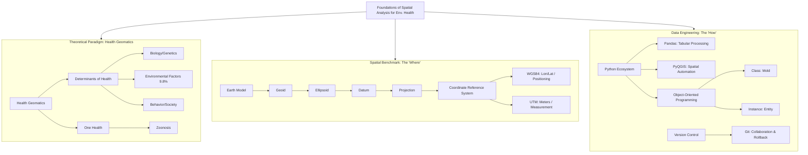

# 🌏 Module 1: Foundations of Geospatial Data Science (Foundations)

## 1.0 Module Introduction & Knowledge Graph

This module is the cornerstone of the entire course. In environmental health research, the core challenge we face is: **How to unify heterogeneous, multi-source, spatiotemporal data (environmental monitoring, clinical records, demographics) into a computable analytical framework.**

This module is not just about teaching software operations, but establishing an engineering logic of **"Spatial Thinking + Computational Thinking"**.



---

## 1.1 Health Geomatics & One Health Paradigm

### 🌍 Background & Significance
Traditional epidemiology focuses on biological mechanisms (e.g., how a virus infects cells). **Health Geomatics**, on the other hand, focuses on how **"Location"** serves as an exposure proxy effectively influencing health outcomes.
*   **GISChat Perspective**: The COVID-19 pandemic made health geography "tangible". Health codes and epidemic maps are essentially real-time visualizations of spatial data.
*   **Course Perspective**: The weight of environmental impact on health (~10%) is comparable to that of the medical system (~11%), but the marginal cost of improving the environment is often lower than advancing medical technology, thus holding extremely high public health value.

### 📐 Core Concepts

#### 1. Determinants of Health
*   **Basic Layer**: Health is not just "not being sick"; it is influenced by multiple factors.
*   **Professional Layer** (Rainbow Model):
    1.  **Core Layer**: Age, sex, genetics (unchangeable).
    2.  **Individual Layer**: Lifestyle (smoking, diet, exercise).
    3.  **Community Layer**: Social networks, education, work environment.
    4.  **Macro Layer**: Socioeconomic, cultural, environmental policies.
*   **Application Layer**: When modeling, if we want to study the impact of "air pollution (environment)" on "lung cancer (health)", we must control for **age, smoking history, income level** as **Confounders**; otherwise, the conclusions are unreliable.

#### 2. One Health
*   **Definition**: Human health, animal health, and environmental health are an inseparable whole.
*   **In-depth Analysis**:
    *   **Zoonosis**: Over 80% of emerging infectious diseases come from various animals (e.g., SARS-CoV-2, MERS).
    *   **Reverse Zoonosis**: Transmission from humans to animals (e.g., human to mink). This is often overlooked in environmental health but is crucial for monitoring virus mutation reservoirs.
    *   **Interdisciplinary**: By using GIS to track the overlap between wildlife migration routes and human settlements, spillover risks can be predicted.

---

## 1.2 Fundamental Physics of Spatial Data: GIS Core

### 🧪 Technical Principles: Math Transformation from Earth to Map

Before performing any distance calculation (e.g.: How many meters is this patient from the nearest chemical plant?), the **Coordinate Reference System (CRS)** problem must be solved.

#### 1. Foundations of Geodesy
*   **Geoid**: The true, gravity-equipotential shape of the Earth (like a bumpy potato). It is too complex to be directly used for mathematical calculations.
*   **Ellipsoid**: For computational convenience, a regular ellipsoid is used to fit the Earth (e.g., GRS80).
*   **Datum**: "Anchors" the ellipsoid to a specific location on Earth.
    *   *Geocentric Datum* (e.g., WGS84): Anchored at the Earth's center of mass, suitable for global positioning.
    *   *Local Datum* (e.g., ED50): Anchored at a specific surface area, providing higher accuracy within that region.

#### 2. Projection
The process of tearing the 3D surface and flattening it onto a 2D plane. **All projections cause distortion**, and one must choose which properties to preserve (conformal, equal-area, equidistant) based on needs.

| Feature          | **WGS84 (EPSG:4326)**          | **UTM (e.g., Zone 32N - EPSG:32632)**  |
| :--------------- | :----------------------------- | :------------------------------------- |
| **Type**         | Geographic Coordinate System   | Projected Coordinate System            |
| **Unit**         | **Degrees**                    | **Meters**                             |
| **Coordinate**   | Longitude, Latitude (Lon, Lat) | Easting, Northing                      |
| **Use Case**     | Data Storage, GPS, Visualization| **Distance Calc, Area Calc, Spatial Analysis** |
| **Env Health App**| Recording patient/station locs | Computing Buffers, Interpolation, Density |

**⚠️ Severe Warning**: Never calculate Euclidean distance or buffers in the WGS84 (Degree) coordinate system! Because the spacing of longitude lines changes with latitude, 1 degree represents a completely different actual distance at the equator vs. the North Pole. **Must reproject to UTM**.

### 💻 Practical Guide: Data Models & QGIS

#### 1. Data Models
*   **Vector**: Discrete objects.
    *   *Point*: Monitoring stations, case addresses.
    *   *Line*: Rivers, road networks (for calculating traffic pollution exposure).
    *   *Polygon*: Administrative divisions (for statistics on incidence rates), lakes.
    *   *Format*: **Shapefile** (old standard, multi-file, 10-char column limit), **GeoPackage** (new standard, single file, SQLite-based).
*   **Raster**: Continuous fields.
    *   *Examples*: Satellite-derived PM2.5 concentration maps, Land Surface Temperature (LST), Digital Elevation Models (DEM).
    *   *Structure*: Matrix, where each Pixel has a value.

#### 2. Relationship between QGIS and Python
QGIS is open-source GIS software. Its core is written in C++, but it provides a powerful Python API (**PyQGIS**).
*   **Why use PyQGIS?**
    *   **Automation**: If your research involves 100 provinces in Italy and each province needs the same buffer analysis, manual clicking is deadly; a Python loop takes just 1 second.
    *   **Reproducibility**: Code records your analysis steps; mouse clicks cannot be peer-reviewed.

---

## 1.3 Programming Engineering: Python, Pandas & OOP

### 📐 Core Concepts: Object-Oriented Programming (OOP)
In environmental health modeling, data structures are very complex. OOP provides a way to organize code, making it more readable and maintainable.

#### 1. Class & Instance
*   **Basic Layer**:
    *   **Class** = Cookie mold. It defines the shape and rules.
    *   **Instance** = The cookie pressed from the mold. Each one is an independent entity.
*   **Professional Layer**:
    *   Classes define **Attributes** (data) and **Methods** (behaviors).
    *   The `self` keyword in Python refers to "the instance itself".

#### 2. Application in this Course
We need to build custom objects to handle specific spatiotemporal data. For example, defining a `StudyArea` class.

### 💻 Code Practice: Building an Environmental Health Analysis Class
This example shows how to define a class to manage environmental data and include simple analysis methods.

```python
import numpy as np
import pandas as pd

class EnvironmentalExposure:
    """
    Class for managing environmental exposure data.
    Contains methods for data loading, cleaning, and risk classification.
    """
    
    def __init__(self, dataset_name, pollutant_type, threshold):
        """
        Constructor: Initialize instance attributes
        :param dataset_name: Name of dataset (str)
        :param pollutant_type: Type of pollutant, e.g., 'NO2', 'PM2.5' (str)
        :param threshold: Risk threshold, values above this are considered high risk (float)
        """
        self.name = dataset_name
        self.pollutant = pollutant_type
        self.threshold = threshold
        self.data = None  # Placeholder, load data later
        print(f"Initializing Project: {self.name} | Pollutant: {self.pollutant}")

    def load_data(self, data_list):
        """
        Simulate data loading method
        :param data_list: List containing measurement values (list)
        """
        self.data = np.array(data_list)
        print(f"Data loaded, total {len(self.data)} records.")

    def analyze_risk(self):
        """
        Analysis method: Calculate exceedance rate
        :return: Proportion of days exceeding threshold (float)
        """
        if self.data is None:
            raise ValueError("Data not loaded! Please call load_data() first.")
        
        # Vectorization - much faster than loops
        exceedance = self.data > self.threshold
        num_exceed = np.sum(exceedance)
        rate = num_exceed / len(self.data)
        
        return rate

# --- Usage Example ---
# 1. Instantiate Object (Instance)
milan_study = EnvironmentalExposure("Milan_2024", "PM10", 50.0)

# 2. Simulate some environmental monitoring data (assume ug/m3)
sensor_data = [45.2, 55.6, 62.1, 48.9, 30.5, 120.0, 49.9]

# 3. Call methods
milan_study.load_data(sensor_data)
risk_rate = milan_study.analyze_risk()

print(f"High Risk Exposure Rate: {risk_rate:.2%}") 
# Output: 42.86%
```

---

## 1.4 Automated Workflow: From Script to Software

### 🧪 Technical Principles: Encapsulation
*   **Problem**: Beginners often write thousands of lines of code in a single `main.py`, making it hard to debug.
*   **Solution**: **Encapsulation**. Strip specific functions (like "Read Shapefile", "Calculate NDVI", "Export Report") into independent functions or script files.
*   **Best Practice**:
    *   `data_loader.py`: Specifically for reading various weird data formats.
    *   `preprocessing.py`: Specifically for cleaning, deduplication, filling missing values.
    *   `analysis.py`: Core algorithms.
    *   `main.py`: Responsible for scheduling the above modules, contains no specific logic.

### 💻 Practical Guide: PyQGIS Batch Script
This is a typical PyQGIS script for running in the QGIS internal console. It demonstrates how to iterate through every feature in a layer, which is very common in tasks like "Calculate average temperature for each city".

```python
# Must run in QGIS Python Console
from qgis.core import (
    QgsProject,
    QgsVectorLayer,
    QgsFeature
)

def list_features_attributes(layer_name, attribute_name):
    """
    Print all values of a specific column in a specified layer
    """
    # 1. Get layers in current project
    layers = QgsProject.instance().mapLayersByName(layer_name)
    
    if not layers:
        print(f"Error: Layer '{layer_name}' not found")
        return
        
    layer = layers[0] # Get the first matching layer
    
    # 2. Iterate Features
    # getFeatures() returns an iterator, very memory efficient
    print(f"Reading layer: {layer.name()}...")
    count = 0
    for feature in layer.getFeatures():
        # Get attribute value
        val = feature[attribute_name]
        print(f"Feature ID {feature.id()}: {attribute_name} = {val}")
        count += 1
        if count >= 5: break # Print only first 5 as example

# Assume you have loaded a layer named "Lombardy_Municipalities"
# and it has a column named "NAME"
# list_features_attributes("Lombardy_Municipalities", "NAME")
```

---

## 1.5 Version Control & Collaboration (Git)

### ⚠️ Common Issues & Solutions
In scientific projects, Git is not just a backup tool, but a **"Time Machine"**.

1.  **Why need Git?**
    *   Avoid filenames like `thesis_final_v2_really_final_modified.doc`.
    *   When code breaks, one-click revert to yesterday's working version.
2.  **Core Commands**:
    *   `git init`: Initialize repository.
    *   `git add .`: Put files into Staging Area.
    *   `git commit -m "msg"`: Save snapshot (this is a version).
    *   `git push`: Upload to GitHub.
    *   `git pull`: **Golden Rule**. Before starting work every day, must Pull first to prevent overwriting teammates' code.
3.  **Conflict**:
    *   When two people modify the same line of code, Git cannot automatically merge.
    *   **Solution**: Manually open the file, keep the needed code, delete Git's markers (`<<<<<<< HEAD`), and Re-commit.

---

## 📊 Cross-disciplinary Terminology (Module 1)

| Term (English) | Data Science / CS Perspective | Epidemiology / Env. Sci Perspective | GIS Perspective |
| :------------- | :-------------------------------- | :-------------------------------------- | :------------------------------------ |
| **Instance**   | Object in memory                  | A specific sample/case                  | A geographic feature (Point/Polygon)  |
| **Attribute**  | Member variable of an object      | Covariate / Risk Factor                 | Field / Column in Attribute Table     |
| **Join**       | Merge / Join                      | Record Linkage                          | Spatial Join                          |
| **Resolution** | Data precision / granularity      | Aggregation Level                       | Spatial Resolution                    |
| **Noise**      | Random error in data              | Confounder / Measurement Error          | Geometric topology error / Image noise|

---

## 🌐 Case Study Deep Dive: 1854 London Cholera

*   **Problem Definition**: Is cholera transmitted via "miasma (air)" or other pathways?
*   **Data Collection**: Dr. John Snow manually recorded the address of every death case (point data) and the location of water pumps (point data).
*   **Analysis Method**: **Spatial Overlay**. He marked cases on the map and found cases highly clustered around the Broad Street pump.
*   **Result Interpretation**: This is a **Location-based Inference**. Although *Vibrio cholerae* hadn't been discovered yet, the spatial pattern strongly pointed to waterborne transmission.
*   **Intervention**: Removed the pump handle (cut off the exposure source).
*   **Modern Implication**: This is the prototype of Health Geomatics. Today we use GIS software instead of hand-drawn maps and complex statistical models instead of naked eyes, but the core logic remains unchanged — **Finding disease causes through spatial patterns**.

---

# 📉 Module 2: Statistical Inference & Machine Learning Methodology (Methodology)

## 2.0 Module Introduction: Matrix of Two Cultures

In Environmental Health Data Science, we use two philosophical systems simultaneously:
1.  **Inference**: From Statistics/Epidemiology. Focuses on **"Why"** (What is the mechanism of $X$ on $Y$? Is the correlation significant?). Emphasis on parameter estimation, confidence intervals, and hypothesis testing.
2.  **Prediction**: From CS/Machine Learning. Focuses on **"What"** (Given $X$, can we accurately predict $Y$?). Emphasis on generalization, accuracy, and overfitting control.

The goal of this module is to fuse them: Use statistical rigor to screen variables, and use the powerful fitting ability of machine learning to build models.

---

## 2.1 Statistical Inference Foundations: Clearing the Fog of Randomness

### 📐 Core Concepts: Hypothesis Testing

#### 1. Logic of Falsificationism
Science cannot "prove" a theory is absolutely correct via data, only that it has "not yet been falsified".
*   **Null Hypothesis ($H_0$)**: Default stance. E.g.: "Air pollution has **no** relationship with lung cancer" ($\beta = 0$).
*   **Alternative Hypothesis ($H_1$)**: The stance we try to find evidence to support. E.g.: "Air pollution **has** a relationship with lung cancer" ($\beta \neq 0$).

#### 2. Decision Rules & Error Types
This is the most sensitive part of environmental health decision-making.

| Reality \ Decision | **Reject $H_0$ (Think Harmful)** | **Do Not Reject $H_0$ (Think Harmless)** |
| :----------------- | :------------------------------- | :--------------------------------------- |
| **$H_0$ True (Safe)** | **Type I Error** <br> $\alpha$ (False Positive)<br> *Result: Panic, wasted costs* | Correct Decision <br> ($1-\alpha$) |
| **$H_0$ False (Harmful)** | Correct Decision (Power) <br> ($1-\beta$) | **Type II Error** <br> $\beta$ (False Negative) <br> *Result: Missed risk, public health damage* |

*   **P-value**: The probability of observing the current data (or more extreme data) given $H_0$ is true.
    *   **Misconception Warning**: $P > 0.05$ **does not** mean $H_0$ is true! It only means "Not enough evidence". Just like "released due to lack of evidence" $\neq$ "declared innocent".

#### 3. Confidence Interval (CI)
Provides more info than P-value.
*   **Definition**: If we resample 100 times, the calculated interval will contain the true population parameter 95 times.
*   **Application**: If 95% CI of Odds Ratio is $[0.9, 1.5]$, since it includes **1** (null value), the result is not significant. If $[1.1, 1.5]$, it significantly increases risk.

### 💻 Practical Guide: Choice of Statistical Test & Python Implementation

How to choose the right test for your data? Follow this **Decision Tree**:

1.  **Data Type**? (Continuous vs Categorical)
2.  **Groups**? (1, 2, >2)
3.  **Distribution**? (Normal vs Non-normal -> Parametric vs Non-parametric)
4.  **Independence**? (Paired vs Independent -> Same person different times vs Different people)

```python
import numpy as np
from scipy import stats

# Simulated Data: Daily average PM2.5 for two cities
# City A (Industrial): Normal distribution
city_a = np.random.normal(loc=55, scale=10, size=100)
# City B (Eco): Normal distribution
city_b = np.random.normal(loc=45, scale=10, size=100)

# 1. Normality Test (Shapiro-Wilk)
# H0: Data follows normal distribution
shapiro_a = stats.shapiro(city_a)
shapiro_b = stats.shapiro(city_b)

print(f"City A Normality P-value: {shapiro_a.pvalue:.4f}")

# 2. Homogeneity of Variance (Levene test)
# H0: Variances are equal
levene = stats.levene(city_a, city_b)

# 3. Choose Test Method
if shapiro_a.pvalue > 0.05 and shapiro_b.pvalue > 0.05:
    if levene.pvalue > 0.05:
        # Normal & Equal Variance -> Independent T-test
        res = stats.ttest_ind(city_a, city_b)
        test_name = "T-test"
    else:
        # Unequal Variance -> Welch's T-test
        res = stats.ttest_ind(city_a, city_b, equal_var=False)
        test_name = "Welch's T-test"
else:
    # Not Normal -> Mann-Whitney U Test (Non-parametric)
    res = stats.mannwhitneyu(city_a, city_b)
    test_name = "Mann-Whitney U"

print(f"Method: {test_name} | Statistic: {res.statistic:.2f} | P-value: {res.pvalue:.4e}")
# Conclusion: If P<0.05, reject H0, assume significant difference.
```

---

## 2.2 Core Epidemiological Metrics: OR & RR

In environmental health, we rarely directly predict "if someone will get sick tomorrow", but assess "does exposure increase the probability of getting sick".

### 🧪 Technical Principles: Risk Measures

| Metric       | **Relative Risk (RR)** | **Odds Ratio (OR)** |
| :----------- | :--------------------- | :------------------ |
| **Definition**| Incidence in Exposed / Incidence in Unexposed | Odds of exposure in Cases / Odds of exposure in Controls |
| **Study Type**| **Cohort Study** (Prospective) | **Case-Control Study** (Retrospective) |
| **Formula**   | $$RR = \frac{A/(A+B)}{C/(C+D)}$$ | $$OR = \frac{A/C}{B/D} = \frac{A \times D}{B \times C}$$ |
| **Interpretation**| "Risk in exposed group is X times that of unexposed" | "Odds of having been exposed for cases is X times that of controls" |
| **Math Prop** | Intuitive, but small if incidence is high | Under Rare Disease Assumption, OR $\approx$ RR |

*Note: A=Exp & Case, B=Exp & Non-case, C=Unexp & Case, D=Unexp & Non-case*

### 💻 Practical Guide: calculating OR & RR with Python

```python
import numpy as np
import statsmodels.api as sm

# Build 2x2 Contingency Table
#           Case   Control
# Exposed    a       b
# Unexposed  c       d

table = np.array([[30, 70],   # Exposed: 30 sick, 70 healthy
                  [10, 90]])  # Unexposed: 10 sick, 90 healthy

# Manual calculation
a, b = table[0]
c, d = table[1]

# 1. Relative Risk (RR)
risk_exposed = a / (a + b)
risk_unexposed = c / (c + d)
rr = risk_exposed / risk_unexposed
print(f"Relative Risk (RR): {rr:.2f}") 
# Interpretation: Risk for exposed is 3.00 times that of unexposed

# 2. Odds Ratio (OR)
odds_exposed = a / b
odds_unexposed = c / d
or_val = odds_exposed / odds_unexposed
print(f"Odds Ratio (OR): {or_val:.2f}")
# Interpretation: OR is usually more extreme than RR (here 3.86)

# 3. Confidence Interval using statsmodels
table_sm = sm.stats.Table2x2(table)
print(table_sm.summary())
# Output includes 95% CI. If CI crosses 1 (e.g., 0.8 - 1.5), not statistically significant.
```

---

## 2.3 Machine Learning Paradigm: From Pattern Recognition to Prediction

In environmental health, Machine Learning (ML) is mainly used to handle complex non-linear relationships (e.g., the effect of temperature on mortality follows a U-shaped curve).

### 📐 Core Concepts: Classification System

#### 1. Unsupervised Learning
*Goal: No standard answer, finding internal structure of data.*
*   **Clustering**:
    *   **K-Means**: Distance-based, assumes clusters are spherical. **Cons**: Must preset K, sensitive to noise.
    *   **DBSCAN**: Density-based. **Preferred for Env Health**.
        *   *Pros*: Can discover arbitrary shapes (e.g., pollution belts along rivers), automatically identifies and excludes noise (outliers).
*   **Dimensionality Reduction**:
    *   **PCA**: Compresses highly correlated variables (temp, humidity, dew point) into a few uncorrelated principal components, solving **Multicollinearity**.

#### 2. Supervised Learning
*Goal: Given input X, predict label Y.*
*   **Regression**: Predict continuous values (e.g., PM2.5).
    *   **Linear Regression**: Benchmark.
    *   **Lasso / Ridge**: Introduces regularization to prevent overfitting, handles high-dimensional environmental data.
*   **Classification**: Predict categories (e.g., Risk Level: High/Med/Low).
    *   **Logistic Regression**: Despite the name, it's classification. Outputs probability.
    *   **Decision Tree**: If-Else rules like a diagnosis flowchart. High interpretability, but prone to overfitting.

#### 3. Ensemble Methods — Core of the Core
Best performing model family in competitions and practice.
*   **Bagging (e.g., Random Forest)**:
    *   *Principle*: Parallel. Train many trees, each sees a different subset, then vote.
    *   *Features*: Reduces variance (robust), hard to overfit. Good for high-dimensional data.
*   **Boosting (e.g., XGBoost, LightGBM)**:
    *   *Principle*: Serial. Next tree specifically corrects errors of the previous one.
    *   *Features*: Reduces bias (precise), high accuracy, but hard to tune.

---

## 2.4 Model Evaluation & Explainable AI (XAI)

In medical and environmental fields, **"Black Box" models are unacceptable**. If a model predicts high cancer rates in an area, policymakers must know why (Pollution? Aging? Smoking?).

### 🧪 Technical Principles: Evaluation Metrics

*   **Confusion Matrix**:
    *   **Accuracy**: $(TP+TN)/Total$. **Trap**: In rare disease prediction (e.g., 1% prevalence), guessing "no disease" for everyone gives 99% accuracy but is useless.
    *   **Sensitivity (Recall)**: $TP/(TP+FN)$. **Better safe than sorry**. Maximize sensitivity for disease screening.
    *   **Specificity**: $TN/(TN+FP)$. **Precision strike**. High specificity needed for confirmation to avoid misdiagnosis.
*   **ROC Curve & AUC**: Comprehensive ability across thresholds. AUC=0.5 is guessing, AUC=1 is perfect.

### 📐 Core Concepts: SHAP (Shapley Additive exPlanations)
State-of-the-art XAI method, derived from Game Theory.
*   **Principle**: Calculates the "marginal contribution" of each feature (PM2.5, Temp) to the final prediction.
*   **Advantages**:
    1.  **Global Explanation**: Which environmental factors are most important?
    2.  **Local Explanation**: For **this specific patient**, why is the risk high? (e.g., living near highway AND age > 70).

### 💻 Practical Guide: Random Forest & SHAP

```python
import pandas as pd
from sklearn.ensemble import RandomForestClassifier
from sklearn.model_selection import train_test_split
import shap

# 1. Prepare Data
# Assume X are environmental features, y is health outcome
X, y = load_environmental_health_data() 
X_train, X_test, y_train, y_test = train_test_split(X, y, test_size=0.2)

# 2. Train Model
model = RandomForestClassifier(n_estimators=100, random_state=42)
model.fit(X_train, y_train)

# 3. Evaluate
print(f"Test Accuracy: {model.score(X_test, y_test):.2f}")

# 4. SHAP Analysis
explainer = shap.TreeExplainer(model)
shap_values = explainer.shap_values(X_test)

# Beeswarm plot
# Shows how each feature impacts prediction (positive or negative)
shap.summary_plot(shap_values[1], X_test) 
```

---

## 📊 Cross-disciplinary Terminology (Module 2)

| Term (English)     | Data Science            | Epidemiology                       | Env. Science         |
| :----------------- | :---------------------- | :--------------------------------- | :------------------- |
| **Feature**        | Feature / Dimension     | Covariate / Risk Factor            | Environmental Param  |
| **Target / Label** | Target Variable / Label | Outcome / Endpoint                 | Response Variable    |
| **Weights**        | Model Parameters        | Effect Size                        | Contribution         |
| **Bias**           | Underfitting            | Confounding                        | Measurement Bias     |
| **Noise**          | Random/Irreducible Error| Measurement Error / Individual diff| Background Fluctuation|
| **Sensitivity**    | Recall                  | Sensitivity (True Positive Rate)   | Detection Limit      |

---

## ⚠️ FAQ (Methodology)

*   **Q1: Env data (Temp) and Health data (Mortality) scales don't match?**
    *   **Problem**: Temp is daily, Mortality is monthly; or Temp is continuous, Outcome is binary.
    *   **Solution**:
        1.  **Aggregation**: Aggregate temp to monthly mean (info loss).
        2.  **Poisson Regression**: If dependent variable is "daily death count" (count data), use GLM (Poisson or Negative Binomial), not Linear Regression.

*   **Q2: High accuracy but fails in new city?**
    *   **Reason**: **Overfitting** or **Spatial Heterogeneity**. Model learned local noise.
    *   **Solution**:
        1.  Cross-Validation.
        2.  Introduce Spatial Variables (Module 3).
        3.  Regularization.

*   **Q3: Correlation says "More Green Space = More Cancer"?**
    *   **Reason**: **Confounding**. Green areas might be wealthy areas -> higher life expectancy -> cancer is a disease of old age -> higher incidence.
    *   **Solution**: Must **Control** for age and income (Stratification or Multivariate Regression).

---

# 🌍 Module 3: Advanced Spatial Statistics & Modeling

## 3.0 Module Introduction: Breaking "Independence"

In standard statistics (Module 2), we assume samples are **i.i.d.** But in space, **"Everything is related to everything else, but near things are more related than distant things"** (Tobler's First Law).

Ignoring spatial effects leads to:
1.  **Pseudoreplication**: Effective sample size is smaller than it looks.
2.  **Biased Estimates**: Unreliable coefficients.
3.  **Ecological Fallacy**: Confusing relationships at different scales.

---

## 3.1 Spatial Data Processing: Granularity & Interpolation

Issue: **Point-Area Mismatch**. Monitoring stations are points, health data are polygons. We need interpolation.

### 📐 Core Concepts
*   **Spatial Granularity**:
    *   *High*: Small grid (10m), rich detail, heavy calc.
    *   *Low*: Large grid (10km), general, fast.
*   **Scaling**:
    *   **Upscaling**: Fine -> Coarse. (Pixel PM2.5 to City Avg).
    *   **Downscaling**: Coarse -> Fine. (Satellite Temp to Street Level using Land Use).

### 🧪 Technical Principles: Spatial Interpolation
Guessing unknown values from known points.

| Method | Principle | Pros | Cons | Application |
| :--- | :--- | :--- | :--- | :--- |
| **Voronoi** | Nearest Neighbor. | Simple | Abrupt boundaries | Service areas |
| **IDW** | Inverse Distance Weighting. | Fast | No error est., sensitive to clusters | Quick pollution map |
| **Kriging** | **Geostatistics**. Models spatial autocorrelation. | **BLUE (Unbiased Optimal)**, gives error map | Slow, assumes stationarity | **Gold Standard for Exposure** |
| **Splines** | Minimize curvature. | Smooth | Oscillations | Temp surface |

### 💻 Practical Guide: IDW in Python

```python
import numpy as np
from scipy.interpolate import Rbf
import matplotlib.pyplot as plt

# 1. Observed Data
x_obs = np.array([1, 2, 4, 5, 8])
y_obs = np.array([1, 3, 2, 5, 1])
z_obs = np.array([10, 15, 12, 30, 5]) # PM2.5

# 2. Grid
ti_x = np.linspace(0, 10, 100)
ti_y = np.linspace(0, 6, 100)
XI, YI = np.meshgrid(ti_x, ti_y)

# 3. Interpolate (Inverse Distance)
rbf_model = Rbf(x_obs, y_obs, z_obs, function='inverse')
ZI = rbf_model(XI, YI)

# 4. Plot
plt.figure(figsize=(8, 6))
plt.pcolor(XI, YI, ZI, cmap='RdYlGn_r')
plt.scatter(x_obs, y_obs, c='black', s=100, label='Stations')
plt.colorbar(label='PM2.5')
plt.show()
```

---

## 3.2 Spatial Association: Exploring Patterns

Before modeling, conduct **ESDA**. Random or Clustered?

### 🧪 Technical Principles: Spatial Weight Matrix ($W$)
Defines "Who is neighbor".
*   **Contiguity**: Rook (Edge), Queen (Edge/Vertex).
*   **Distance**: KNN, Radius, Inverse Distance.

### 📐 Core Concepts: Moran's I

#### 1. Global Moran's I
*   Range $[-1, 1]$.
    *   $I > 0$: **Clustered**. High-High, Low-Low.
    *   $I < 0$: **Dispersed**. Checkerboard.
    *   $I \approx 0$: **Random**.

#### 2. Local Moran's I (LISA)
*   Identifies local **Hotspots** and **Coldspots**.
    1.  **HH**: Hotspot.
    2.  **LL**: Coldspot.
    3.  **HL**: Spatial Outlier.
    4.  **LH**: Spatial Outlier.

---

## 3.3 Spatial Regression: Explicit Modeling

If Moran's I is significant, OLS is **wrong** (violates independence). We need **Spatial Regression**.

### 🧪 Technical Principles

#### 1. Spatial Lag Model (SAR)
*   **Assumption**: Neighbors' behavior directly affects me (**Diffusion**).
*   **Formula**: $y = \rho W y + X\beta + \epsilon$
    *   $Wy$: Spatial lag term (avg of neighbors).
*   **App**: Infectious disease. My flu risk depends on neighbors' flu status.

#### 2. Spatial Error Model (SEM)
*   **Assumption**: Neighbors' influence comes from unobserved, spatially correlated errors (**Omitted Variables**).
*   **Formula**: $y = X\beta + u, \quad u = \lambda W u + \epsilon$
*   **App**: Cancer vs Smoking. If "Regional Climate" is ignored, errors will cluster. Use SEM.

### 💻 Practical Guide: PySAL

```python
import libpysal
from esda.moran import Moran
from spreg import OLS, ML_Lag, ML_Error

# 1. Weights (Queen)
w = libpysal.weights.Queen.from_dataframe(gdf)
w.transform = 'r'

# 2. Global Moran's I
y = gdf['lung_cancer_rate'].values
moran = Moran(y, w)
print(f"Moran's I: {moran.I:.3f}, P-value: {moran.p_sim:.4f}")

# 3. If P < 0.05, run Spatial Regression
X_vars = ['smoking_rate', 'income', 'pm25']
X = gdf[X_vars].values

# A: OLS (Benchmark)
ols = OLS(y, X, w=w, name_x=X_vars, name_y='cancer')
print(ols.summary) # Check Moran's I of residuals

# B: SAR
sar = ML_Lag(y, X, w=w, name_x=X_vars, name_y='cancer')
print(sar.summary)
```

---

## 3.4 Geographically Weighted Regression (GWR) & MGWR

### 📐 Core Concepts: Spatial Non-stationarity
Global models (OLS, SAR) assume relationship is **Fixed** everywhere. Real world has **Heterogeneity**.

#### 1. GWR
*   **Principle**: Fit a local regression equation for **every point**.
*   **Weights**: Closer points have higher weights.
*   **Output**: Coefficient maps. See "Where pollution matters most".

#### 2. Multiscale GWR (MGWR)
*   **Improvement**: Different variables can have different **Bandwidths**.
    *   *Local*: Traffic noise (small scale).
    *   *Global*: Climate policy (large scale).
*   **Status**: **State-of-the-art**.

### 🌐 Case Study: MGWR in Env Health
*   **Study**: Green space vs PM2.5.
*   **Finding**:
    *   *Global*: Industrial land increases PM2.5 everywhere.
    *   *Local*: Green space reduces dust heavily in City Center, but not in Suburbs.
*   **Value**: Planting trees in city center has higher marginal health benefit.

---

## 📊 Cross-disciplinary Terminology (Module 3)

| Term (English)    | Data Science             | Statistics | GIS                | Env Health Significance        |
| :---------------- | :----------------------- | :--------- | :----------------- | :----------------------------- |
| **Interpolation** | Imputation               | Prediction | Rasterization      | Est. exposure where no sensors |
| **Spatial Lag**   | GNN Aggregation          | Autocorr   | Neighborhood Avg   | Spillover effects              |
| **Stationarity**  | Distribution Consistency | Stationarity| Spatial Homogeneity| Risk factors act same everywhere|
| **Bandwidth**     | Hyperparam / Window      | Smoothing  | Search Radius      | Scope of influence             |
| **Hotspot**       | Anomaly / Cluster        | Sig. High  | High-High Cluster  | Outbreak area                  |

---

## ⚠️ FAQ (Spatial)

*   **Q1: Grid shape? Square or Hexagon?**
    *   **A**: **Hexagon**.
        *   Equidistant neighbors.
        *   Fits natural boundaries better.
        *   Reduces visual "grid illusion".

*   **Q2: When OLS/SAR vs GWR?**
    *   **Diagnosis**: Run OLS, check Residual Moran's I.
        *   Random residuals -> OLS okay.
        *   Clustered residuals -> SAR/SEM.
    *   **Heterogeneity**: If Koenker (BP) Test is significant -> GWR/MGWR.

*   **Q3: GWR coefficients are extreme/unexplainable?**
    *   **Reason**: **Local Multicollinearity**.
    *   **Solution**: Check global VIF; use Regularized GWR.

---

# 🏥 Module 4: Environmental Health Risk Assessment Models

## 4.0 Module Introduction: From "Correlation" to "Risk"

In DS, we predict $Y$. In Env Health, we focus on **Attribution** and **Characterization** of X's effect on Y.
Questions:
1.  **Dose-Response**: How much mortality increase per 10 $\mu g/m^3$ PM2.5?
2.  **Lag Effect**: Why deaths rise after heatwave ends?
3.  **Vulnerability**: Why poor communities suffer more?

---

## 4.1 Theoretical Framework: IPCC Risk
$$ \text{Risk} = \text{Hazard} \times \text{Exposure} \times \text{Vulnerability} $$

1.  **Hazard**: Event causing harm (Heat, NO2).
2.  **Exposure**: Presence of people/assets in hazard zone.
3.  **Vulnerability**: Susceptibility (Elderly, No A/C).

### 🧪 Technical Principles: Confounding & Interaction
1.  **Confounders**: Affect both Exposure and Outcome. (e.g., Season). Must Control.
2.  **Interaction/Effect Modifiers**: Changes strength of relationship. (e.g., Green space modifies Heat-Death link). Stratify or Interaction Term.

---

## 4.2 Gold Standard: DLNM

**Distributed Lag Non-linear Model (DLNM)** is the **"Holy Grail"** for temp/pollution studies.
Solves:
1.  **Non-linear**: U-shaped temp effect.
2.  **Delayed (Lag)**: Effects distributed over time.

### 🧪 Technical Principles: Cross-Basis Function
Constructs a **2D Matrix** space.
1.  **Exposure-Response**: Splines for Temp-Risk curve.
2.  **Lag-Response**: Splines for Time decay.
3.  **Cross-Basis**: Tensor product of the two.

### 📊 Core Outputs
1.  **RR Curve**: Ref to MMT (RR=1). "Reversed J-shape" (Cold effect lasts longer).
2.  **Attributable Risk**: Number of deaths due to factor.

### 💻 Practical Guide: R Implementation (dlnm package)
*Note: DLNM ecosystem is mature in R.*

```r
library(dlnm)
library(splines)

# 1. Prep Data
# data: date, death_count, temp, humidity, time
max_lag <- 21

# 2. Define Cross-Basis
cb <- crossbasis(data$temp, 
                 lag = max_lag, 
                 argvar = list(fun = "bs", degree = 2, df = 3),
                 arglag = list(fun = "ns", df = 4))

# 3. GLM Model (Poisson)
# Control for trend (time) and humidity
model <- glm(death_count ~ cb + ns(time, 7*10) + humidity, 
             family = quasipoisson(), 
             data = data)

# 4. Predict & Plot
pred <- crosspred(cb, model, cen = 21, by = 1)

# 3D Surface
plot(pred, xlab = "Temperature", zlab = "RR", theta = 200, phi = 30, 
     main = "3D Exposure-Lag-Response Surface")

# Overall Cumulative Effect
plot(pred, "overall", xlab = "Temperature", ylab = "RR", 
     main = "Overall Effect")
```

---

## 4.3 Innovative Risk Indices: EHRI & WMARM

Custom models by Polimi team to solve DLNM complexity.

### 1. EHRI (Environment-Related Health Risk Index)
*   **Goal**: Data-driven, no prior assumptions.
*   **Workflow**:
    1.  **Threshold**: Define "High Exposure Day" (>95 percentile).
    2.  **Baseline**: Avg incidence on non-exposed days.
    3.  **Differential**: $\Delta inc$.
    4.  **Bootstrap**: Verify significance.
    5.  **Output**: Combination of Effect Size and P-value.
*   **Meaning**: $>0.7$ High Risk; $<-0.7$ Protective.

### 2. WMARM (Weighted Meta-Analytical Relevance Score)
*   **Goal**: Aggregate risks across regions/years.
*   **Logic**: Weighted average. Weights depend on Significance (CI width) and Population size.
*   **App**: "Is NO2 or PM2.5 more critical in Milan?"

---

## 4.4 Data Privacy & Ethics

### ⚠️ Key Principles
1.  **Anonymization**: Remove identifiers.
2.  **Aggregation**: Don't publish "John's coord", publish "5 cases in this grid".
    *   *Cost*: **MAUP** (Modifiable Areal Unit Problem).
3.  **K-anonymity**: Any combination matches at least K people (K $\ge$ 3).

---

## 📊 Cross-disciplinary Terminology (Module 4)

| Term (English)        | Epi / Env Health              | Data Science / ML                             |
| :-------------------- | :---------------------------- | :-------------------------------------------- |
| **Dose-Response**     | Dose-Response Relationship    | Feature-Target Dependency                     |
| **Lag**               | Delayed Effect                | Time Step / Window                            |
| **Cross-Basis**       | Cross-Basis Function (DLNM)   | Polynomial Interaction                        |
| **Counterfactual**    | What if not exposed?          | Baseline Prediction                           |
| **Effect Modifier**   | Effect Modifier               | Interaction Feature                           |
| **Attributable Risk** | Attributable Risk             | Feature Importance / Marginal Contribution    |

---

## ⚠️ FAQ (Risk)

*   **Q1: DLNM too slow?**
    *   **A**: Exponential complexity. Reduce max lag (21->7) or use EHRI for screening.

*   **Q2: Interpet RR=1.05 (95% CI: 0.98 - 1.12)?**
    *   **A**: **Not Statistically Significant** (Interval crosses 1). Evidence insufficient.

*   **Q3: Ecological Fallacy?**
    *   **A**: Aggregated data results ("Polluted city lives shorter") $\neq$ Individual results ("You live short because of pollution"). Don't deduce to individual.

---

# 🚀 Module 5: Project & Case Studies (Capstone Project & Case Studies)

## 5.0 Module Introduction: From "Code" to "Science"

A successful Capstone must tell a **Science Story based on Evidence**.
Goals:
1.  **Reproducibility**: Automation.
2.  **Interpretability**: Explain "Why" and "Where".
3.  **Actionability**: Advice for policy (Where to plant trees?).

---

## 5.1 Project Workflow (The Workflow)

**"Analysis Ready Data (ARD)"** is key.

### Phase 1: Problem Definition
*   **Data-driven**: Check what high-quality data you have first.
*   **Check**: Spatiotemporal alignment? Baseline availability?

### Phase 2: Build ARD
*   **Most time-consuming (70%)**.
*   **Ops**: Upscaling/Downscaling (Hexagon grid), Data Fusion (Spatial Join).

### Phase 3: Modeling
*   **Fork**:
    *   *Exploratory*: Moran's I.
    *   *Implicit vs Explicit*: Random Forest (if weak spatial effect) vs MGWR (if strong heterogeneity).

### Phase 4: Automation
*   Use `.py` scripts (`data_loader.py`, `model.py`) called by `main.py`.

---

## 5.2 Deep Case Studies

### 🌿 Case A: Urban Green & LST
*   **Q**: How much does green space cool Milan? Where is it most effective?
*   **Data**: DUSAF (Land Use), Trees (Point), LST (Satellite).
*   **Challenge**: **Confounding** (Rich areas have more trees AND lower density). Must control Building Density.
*   **Strategy (3S-GeoXAI)**:
    1.  Feature Selection.
    2.  **Spatial Enhancement**: MGWR.
    3.  **Overfitted Model**: Train RF to explain *this city* perfectly (not to generalize).
    4.  **SHAP**: Calculate marginal contribution of green space.
*   **Value**: Map of "Where planting trees has highest ROI".

### 🚗 Case B: Mobility & Exposure
*   **Q**: Does residence-based exposure underestimate risk?
*   **Data**: Mobile Phone Signals (OD Matrix) + CAMS/Traffic Sensors.
*   **Insight**:
    *   **Dynamic**: **Dynamic Population-Weighted Exposure**.
    *   **Hotspot**: Closed valleys/canyons with traffic -> Local high peak.
*   **Model**: Interpolation + Mobility Weights.

---

## 5.3 Comprehensive Code Template: End-to-End Pipeline

```python
import geopandas as gpd
import pandas as pd
import numpy as np
from sklearn.ensemble import RandomForestRegressor
from sklearn.model_selection import train_test_split
from sklearn.metrics import r2_score
import shap
import matplotlib.pyplot as plt

# ==========================================
# 1. Encapsulated Module
# ==========================================
class GeoHealthAnalysis:
    def __init__(self, shapefile_path, target_col, feature_cols):
        self.gdf = gpd.read_file(shapefile_path)
        self.target = target_col
        self.features = feature_cols
        self.model = None
        
        print(f"Loaded: {len(self.gdf)} units")
    
    def preprocess(self):
        """ Data Cleaning & Spatial Feature Eng """
        # 1. Missing
        self.gdf = self.gdf.dropna(subset=[self.target] + self.features)
        
        # 2. Spatial Features (Centroid) -> Partially Explicit
        self.gdf['centroid_x'] = self.gdf.geometry.centroid.x
        self.gdf['centroid_y'] = self.gdf.geometry.centroid.y
        self.features.extend(['centroid_x', 'centroid_y'])
        
        print("Preprocessed.")

    def train_model(self):
        """ Train Random Forest """
        X = self.gdf[self.features]
        y = self.gdf[self.target]
        
        # Split
        X_train, X_test, y_train, y_test = train_test_split(X, y, test_size=0.2, random_state=42)
        
        # Train
        self.model = RandomForestRegressor(n_estimators=100, random_state=42)
        self.model.fit(X_train, y_train)
        
        # Eval
        score = self.model.score(X_test, y_test)
        print(f"Model R2 Score: {score:.3f}")
        
        return X_train, X_test

    def explain_model(self, X_sample):
        """ SHAP XAI """
        print("Calculating SHAP...")
        explainer = shap.TreeExplainer(self.model)
        shap_values = explainer.shap_values(X_sample)
        
        # Plot
        plt.figure()
        shap.summary_plot(shap_values, X_sample, show=False)
        plt.title(f"SHAP Summary for {self.target}")
        plt.show()

# ==========================================
# 2. Main Execution
# ==========================================
if __name__ == "__main__":
    # Assume Shapefile for Milan Districts
    # Cols: 'LST_Summer', 'NDVI', 'Building_Density'
    
    # 1. Init
    project = GeoHealthAnalysis(
        shapefile_path="data/milan_districts.shp", 
        target_col="LST_Summer",
        feature_cols=["NDVI", "Building_Density", "Population"]
    )
    
    # 2. Preprocess
    project.preprocess()
    
    # 3. Train
    X_train, X_test = project.train_model()
    
    # 4. Explain
    project.explain_model(X_test)
```

---

## 📊 Cross-disciplinary Terminology (Module 5)

| Term (English)        | Data Science / Eng              | Policy / Public Mgmt     | Env Health Research        |
| :-------------------- | :------------------------------ | :----------------------- | :------------------------- |
| **Actionable Factor** | Controllable Feature            | Policy Lever             | Modifiable Risk Factor     |
| **Baseline**          | Training Mean / Zero Model      | Business as Usual        | Reference Level            |
| **Trade-off**         | Bias-Variance / Precision-Recall| Cost-Benefit Analysis    | Sensitivity-Specificity    |
| **Drifting**          | Data Drift                      | Trend Change             | Long-term Trend (Climate Change) |
| **Gold Standard**     | SOTA                            | Best Practice            | Accepted Method (DLNM)     |

---

## ⚠️ FAQ (Project)

*   **Q1: No perfect health data?**
    *   **A**: **Methodology > Data Perfection**. Use **Proxies** (Ambulance calls for ER). Focus on Framework (ETL->Model->XAI).

*   **Q2: Negative result (No significance)?**
    *   **A**: **No P-hacking**. Negative result is a result. Discuss "Why".

*   **Q3: How to stand out?**
    *   **A**: **Visualization**.
        *   Maps.
        *   SHAP Beeswarm.
        *   LISA Cluster Map.
        *   **Storyline**: Problem -> Data -> Challenge -> Solution -> Finding -> Advice.
