# **🌍《基于社交媒体数据的城市感知计算》**

### **前言**

本笔记旨在系统性地整理《基于社交媒体文本数据挖掘与分析的城市公共空间优化工作坊》的课程内容。该工作坊结合了自然语言处理（NLP）和地理信息科学（GIS），旨在通过社交媒体文本数据挖掘，为城市公共空间的设计与优化提供数据驱动的洞察。

本笔记将涵盖从数据获取、清洗、文本特征工程、情感分析、主题建模、聚类分析、语义相似度计算，到命名实体识别、知识图谱构建以及最终结果可视化的全流程。通过本笔记，学习者可以：

*   掌握社交媒体数据爬取与处理的关键技术。
*   理解并应用主流的自然语言处理模型和算法。
*   学会将文本分析结果与地理空间信息相结合，进行空间洞察。
*   为未来的自主项目实践、博士申请科研经历说明、学术论文写作以及城市感知相关课题拓展奠定基础。

本笔记将以 Markdown 格式呈现，力求结构清晰、技术详实，兼顾理论与实操，并提供丰富的代码示例、图表建议、思考题和延伸阅读材料。

```mermaid
graph LR
    %% Styles
    classDef stage fill:#E6E6FA,stroke:#4B0082,stroke-width:2px,color:#333,font-weight:bold,rx:5,ry:5;
    classDef module fill:#F0F8FF,stroke:#4682B4,stroke-width:1.5px,color:#333,rx:5,ry:5;
    classDef tech fill:#FFF0F5,stroke:#DB7093,stroke-width:1px,color:#333,rx:5,ry:5;

    %% Stages
    S1[第一阶段: 项目启动与数据获取]:::stage;
    S2[第二阶段: 文本特征工程与情感洞察]:::stage;
    S3[第三阶段: 高级文本分析与主题发现]:::stage;
    S4[第四阶段: 结果可视化与空间关联分析]:::stage;
    S5[第五阶段: 项目总结与成果回顾]:::stage;
    S6[第六阶段: 未来展望与拓展]:::stage;

    %% Stage 1 Modules
    S1_M1[模块1.1: 网络爬虫基础与环境配置]:::module;
    S1_M2[模块1.2: 社交媒体数据采集实践]:::module;
    S1_M3[模块1.3: 数据存储与初步清洗]:::module;

    S1 --> S1_M1;
    S1 --> S1_M2;
    S1 --> S1_M3;

    %% Stage 1 Technologies
    S1_M1 --> T1_1_1(课程与项目概览):::tech;
    S1_M1 --> T1_1_2(Python, Anaconda, Jupyter):::tech;
    S1_M1 --> T1_1_3(HTTP协议: 请求/响应, Headers, Cookies):::tech;
    S1_M1 --> T1_1_4(浏览器开发者工具):::tech;

    S1_M2 --> T1_2_1(Requests库):::tech;
    S1_M2 --> T1_2_2(BeautifulSoup库):::tech;
    S1_M2 --> T1_2_3(Selenium库: WebDriver, 元素定位):::tech;
    S1_M2 --> T1_2_4(微博/小红书爬取策略):::tech;
    S1_M2 --> T1_2_5(反爬虫策略):::tech;

    S1_M3 --> T1_3_1(数据存储格式: Excel, CSV, JSON):::tech;
    S1_M3 --> T1_3_2(Pandas基础: DataFrame, Series):::tech;
    S1_M3 --> T1_3_3(Excel读写: xlrd, xlwt, xlutils, openpyxl):::tech;
    S1_M3 --> T1_3_4(Pandas数据读写与去重):::tech;

    %% Stage 2 Modules
    S2_M1[模块2.1: 中文文本分词与停用词处理]:::module;
    S2_M2[模块2.2: 文本向量化]:::module;
    S2_M3[模块2.3: 情感分析]:::module;

    S2 --> S2_M1;
    S2 --> S2_M2;
    S2 --> S2_M3;

    %% Stage 2 Technologies
    S2_M1 --> T2_1_1(文本清洗深化: 正则表达式):::tech;
    S2_M1 --> T2_1_2(Jieba分词: 模式, 自定义词典):::tech;
    S2_M1 --> T2_1_3(停用词处理: 通用与自定义):::tech;

    S2_M2 --> T2_2_1(TF-IDF原理与Sklearn实现):::tech;
    S2_M2 --> T2_2_2(Word Embeddings: Word2Vec, GloVe原理):::tech;
    S2_M2 --> T2_2_3(Gensim Word2Vec训练):::tech;
    S2_M2 --> T2_2_4(BERT Embeddings原理与Transformers获取):::tech;

    S2_M3 --> T2_3_1(情感分析层次与粒度):::tech;
    S2_M3 --> T2_3_2(SnowNLP情感分析):::tech;
    S2_M3 --> T2_3_3(Transformers情感分析: Pipeline, BERT/RoBERTa):::tech;
    S2_M3 --> T2_3_4(情感得分与标签):::tech;

    %% Stage 3 Modules
    S3_M1[模块3.1: 主题建模]:::module;
    S3_M2[模块3.2: 聚类分析]:::module;
    S3_M3[模块3.3: 语义相似度与命名实体识别]:::module;

    S3 --> S3_M1;
    S3 --> S3_M2;
    S3 --> S3_M3;

    %% Stage 3 Technologies
    S3_M1 --> T3_1_1(LSA原理与Sklearn实现):::tech;
    S3_M1 --> T3_1_2(LDA原理与Gensim实现):::tech;
    S3_M1 --> T3_1_3(主题数K值选择: 困惑度, 连贯性):::tech;

    S3_M2 --> T3_2_1(K-Means聚类原理与Sklearn实现):::tech;
    S3_M2 --> T3_2_2(K值选择: 肘部法则, 轮廓系数):::tech;
    S3_M2 --> T3_2_3(聚类结果解读):::tech;

    S3_M3 --> T3_3_1(语义相似度计算方法: 余弦相似度):::tech;
    S3_M3 --> T3_3_2(基于不同向量的相似度比较):::tech;
    S3_M3 --> T3_3_3(命名实体识别NER原理):::tech;
    S3_M3 --> T3_3_4(SpaCy进行中文NER):::tech;
    S3_M3 --> T3_3_5(Transformers进行NER概念):::tech;

    %% Stage 4 Modules
    S4_M1[模块4.1: 地理空间数据处理与可视化]:::module;
    S4_M2[模块4.2: 知识图谱构建与展示]:::module;
    S4_M3[模块4.3: 统计图表绘制]:::module;
    S4_M4[模块4.4: 综合成果展示与解读]:::module;

    S4 --> S4_M1;
    S4 --> S4_M2;
    S4 --> S4_M3;
    S4 --> S4_M4;

    %% Stage 4 Technologies
    S4_M1 --> T4_1_1(地理空间数据: 矢量/栅格, CRS):::tech;
    S4_M1 --> T4_1_2(GeoPandas: GeoDataFrame, CRS操作, 空间连接):::tech;
    S4_M1 --> T4_1_3(Folium: Map, Marker, GeoJson, Choropleth):::tech;

    S4_M2 --> T4_2_1(知识图谱核心概念: 实体, 关系, 三元组):::tech;
    S4_M2 --> T4_2_2(NetworkX构建与绘制):::tech;
    S4_M2 --> T4_2_3(Pyvis交互式可视化):::tech;

    S4_M3 --> T4_3_1(Matplotlib基础绘图):::tech;
    S4_M3 --> T4_3_2(Seaborn高级绘图):::tech;
    S4_M3 --> T4_3_3(词云图, 饼图, 柱状图, 折线图等):::tech;

    S4_M4 --> T4_4_1(数据故事化):::tech;
    S4_M4 --> T4_4_2(多维度分析视角):::tech;
    S4_M4 --> T4_4_3(成果可解释性与可操作性):::tech;

    %% Stage 5 & 6 (Summary & Future)
    S5 --> S5_M1[模块5.1: 项目成果回顾与模型评估]:::module;
    S5_M1 --> T5_1_1(模型评估指标: 分类, 聚类, 主题):::tech;
    S5_M1 --> T5_1_2(超参数优化: GridSearchCV):::tech;
    S5_M1 --> T5_1_3(技术回顾与深化):::tech;

    S6 --> S6_M1[模块6.1: 经验总结与项目挑战]:::module;
    S6 --> S6_M2[模块6.2: 未来研究方向与技术拓展]:::module;
    S6_M1 --> T6_1_1(核心经验总结):::tech;
    S6_M1 --> T6_1_2(项目挑战与应对):::tech;
    S6_M2 --> T6_2_1(深层语义, 动态分析, 多模态, LLMs, 因果推断等):::tech;
```



**知识体系框架图说明**:
此Mermaid图通过不同颜色的节点（阶段、模块、技术点）和箭头，清晰地展示了整个课程的结构层次和知识点之间的逻辑递进关系。从基础的数据获取开始，逐步深入到文本的特征工程、高级分析，最终到结果的可视化、总结与未来展望。

---

### **🏷️ 标签化知识点索引系统 (概念)**

为了方便未来检索、回顾和拓展相关内容，并支持加入其他课程（如街景、社交媒体综合整体分析、空间回归建模等），我们可以为每个核心技术点和概念打上标签。在完整的Markdown笔记中，这些标签可以放在每个小节的末尾或作为文档元数据。

**标签示例体系**:

*   **阶段标签**: `#P1_DataAcquisition`, `#P2_TextFeatureEngineering`, `#P3_AdvancedAnalytics`, `#P4_Visualization`, `#P5_Summary`, `#P6_FutureWork`
*   **核心技术领域标签**: `#NLP`, `#GIS`, `#MachineLearning`, `#DataScience`, `#UrbanComputing`
*   **具体技术/库标签**:
    *   `#Python`, `#Anaconda`, `#Jupyter`
    *   `#WebScraping`, `#Requests`, `#Selenium`, `#BeautifulSoup`, `#AntiAntiSpam`
    *   `#DataStorage`, `#Excel`, `#CSV`, `#JSON`
    *   `#DataCleaning`, `#Pandas`, `#Regex`
    *   `#TextPreprocessing`, `#Tokenization`, `#Jieba`, `#Stopwords`
    *   `#TextVectorization`, `#TFIDF`, `#WordEmbedding`, `#Word2Vec`, `#GloVe`, `#BERTEmbedding`
    *   `#SentimentAnalysis`, `#SnowNLP`, `#Transformers`, `#BERT`, `#RoBERTa`
    *   `#TopicModeling`, `#LDA`, `#LSA`, `#Gensim`
    *   `#Clustering`, `#KMeans`, `#Sklearn`
    *   `#SemanticSimilarity`, `#CosineSimilarity`
    *   `#NER`, `#SpaCy`
    *   `#KnowledgeGraph`, `#NetworkX`, `#Pyvis`
    *   `#GeoSpatialAnalysis`, `#GeoPandas`, `#Folium`, `#CRS`
    *   `#DataVisualization`, `#Matplotlib`, `#Seaborn`, `#WordCloud`
    *   `#ModelEvaluation`, `#HyperparameterTuning`, `#GridSearchCV`
    *   `#SupervisedLearning`, `#UnsupervisedLearning`
*   **应用场景/概念标签**: `#PublicSpace`, `#SocialMedia`, `#UrbanPerception`, `#DataStorytelling`, `#LLM`

**使用方式**: 在每个模块或重要知识点介绍完毕后，附上相关标签。例如，在介绍Jieba分词后，可以添加 `#TextPreprocessing #Tokenization #Jieba #NLP #Python`。这样，未来可以通过搜索特定标签快速定位到相关内容。


---

## **第一阶段：项目启动与数据获取**

### **模块 1.1：网络爬虫基础与环境配置**

**核心目标**: 理解网络爬虫的基本工作原理，掌握HTTP协议的基础知识，并成功搭建Python开发环境，为后续的数据采集做好准备。

#### **1.1.1 核心概念解析**

##### **1. 网络爬虫 (Web Crawler / Spider)**

*   **定义**: 一种按照特定规则，自动地抓取万维网信息的程序或者脚本。它们通过模拟人类用户浏览网页的行为，从网页中提取数据。
*   **工作流程**:
    1.  **发送请求 (Request)**: 爬虫程序向目标服务器发送一个HTTP请求，请求特定的网页资源。
    2.  **获取响应 (Response)**: 服务器接收到请求后，返回一个HTTP响应，其中包含了网页的HTML内容、图片、CSS、JavaScript等。
    3.  **解析内容 (Parsing)**: 爬虫程序对获取到的HTML内容进行解析，提取所需的数据（如文本、链接、图片URL等）。
    4.  **存储数据 (Storing)**: 将提取到的数据存储到本地文件（如CSV, Excel, JSON）或数据库中。
    5.  **发现新链接 (Discovery)**: 从当前页面中发现新的URL链接，并将这些链接加入到待抓取的队列中，重复以上过程。
*   **重要性**: 网络爬虫是进行大规模数据收集，特别是从社交媒体、新闻网站等获取文本数据的基础工具。

##### **2. HTTP (HyperText Transfer Protocol) 协议**

*   **定义**: 超文本传输协议，是互联网上应用最为广泛的一种网络协议，用于客户端和服务器之间的通信。
*   **通信模型**: 客户端-服务器模型 (Client-Server Model)。客户端发起请求，服务器响应请求。
*   **HTTP 请求 (Request) 组成**:
    *   **请求行 (Request Line)**: 包含请求方法、请求URI和HTTP协议版本。
        *   **请求方法 (Method)**:
            *   `GET`: 从服务器获取资源。是最常用的方法，如在浏览器地址栏输入网址访问页面。
            *   `POST`: 向服务器提交数据，通常用于提交表单、上传文件等。
            *   其他方法如 `PUT`, `DELETE`, `HEAD` 等在爬虫中较少直接使用。
    *   **请求头 (Headers)**: 包含关于客户端环境、请求配置等附加信息。每一条头信息由一个名称和一个值组成，中间用冒号分隔。
        *   **`User-Agent`**: 客户端的标识，如浏览器类型和版本、操作系统等。很多网站会根据此信息判断请求来源。
            *   *示例*: `Mozilla/5.0 (Windows NT 10.0; Win64; x64) AppleWebKit/537.36 (KHTML, like Gecko) Chrome/119.0.0.0 Safari/537.36`
        *   **`Referer`**: 表明请求是从哪个URL链接过来的。
        *   **`Accept`**: 客户端可以接收的内容类型，如 `text/html`, `application/json`。
        *   **`Accept-Language`**: 客户端偏好的语言。
        *   **`Cookie`**: 客户端发送给服务器的之前存储的Cookie信息，用于会话管理和身份认证。
        *   **`Connection`**: 如 `keep-alive` 表示保持连接。
    *   **请求体 (Body/Payload)**: 当使用`POST`等方法提交数据时，实际的数据内容会放在请求体中。`GET`请求通常没有请求体。

*   **HTTP 响应 (Response) 组成**:
    *   **状态行 (Status Line)**: 包含HTTP协议版本、状态码和状态描述。
        *   **状态码 (Status Code)**: 用三位数字表示请求的处理结果。
            *   `2xx` (成功): 如 `200 OK` (请求成功)。
            *   `3xx` (重定向): 如 `301 Moved Permanently`, `302 Found`。
            *   `4xx` (客户端错误): 如 `404 Not Found` (请求的资源不存在), `403 Forbidden` (禁止访问)。
            *   `5xx` (服务器错误): 如 `500 Internal Server Error` (服务器内部错误)。
    *   **响应头 (Headers)**: 包含关于服务器和响应内容的附加信息，如内容类型、内容长度、服务器类型、Set-Cookie（服务器要求客户端保存的Cookie）等。
    *   **响应体 (Body/Payload)**: 服务器返回的实际数据内容，如HTML文本、JSON数据、图片二进制数据等。

*   **HTTPS (HyperText Transfer Protocol Secure)**: HTTP的安全版本，通过SSL/TLS协议对通信内容进行加密。爬取HTTPS网站与HTTP网站在请求方式上基本一致，Python的`requests`库会自动处理加密。

*   **Cookies**:
    *   **定义**: 服务器发送到用户浏览器并保存在本地的一小块数据，它会在浏览器下次向同一服务器再发起请求时被携带并发送到服务器上。
    *   **用途**:
        *   **会话保持 (Session Management)**: 识别用户身份，保持登录状态。
        *   **个性化 (Personalization)**: 存储用户偏好设置。
        *   **追踪 (Tracking)**: 记录用户行为。
    *   **在爬虫中的重要性**: 许多网站需要登录才能访问特定内容，爬虫需要携带有效的Cookie来模拟登录状态。

##### **3. 开发者工具 (Developer Tools)**

*   **定义**: 现代浏览器（如Chrome, Firefox, Edge）内置的一套用于网页调试和分析的工具。
*   **常用功能**:
    *   **Elements (元素/检查器)**: 查看和编辑页面的HTML和CSS结构。可以右键点击页面元素选择“检查”快速定位。
    *   **Network (网络)**: 监控所有HTTP请求和响应的详细信息，包括请求头、响应头、响应内容、状态码、时间等。这是分析网站API和爬虫请求构造的关键。
    *   **Console (控制台)**: 显示JavaScript错误、日志信息，并可以执行JavaScript代码。
    *   **Sources (源代码)**: 查看和调试网页的JavaScript、CSS等源代码。
    *   **Application (应用/存储)**: 查看和管理Cookies、LocalStorage、SessionStorage等浏览器存储。
*   **如何打开 (Chrome示例)**:
    *   右键点击页面 -> 选择“检查 (Inspect)”。
    *   快捷键: `F12` (Windows) 或 `Option + Command + I` (macOS)。
    *   菜单: Chrome右上角三个点 -> 更多工具 -> 开发者工具。

#### **1.1.2 关键技术说明**

本节将介绍进行Python数据爬取所必需的基础环境搭建，包括Python解释器、Anaconda发行版以及Jupyter Notebook。

##### **1. Python 安装**

*   **下载**: 从Python官方网站 [https://www.python.org/downloads/](https://www.python.org/downloads/) 下载适合你操作系统的最新稳定版安装包。
    *   **Windows**: 选择 "Windows installer (64-bit)" (推荐)。
    *   **macOS**: 选择 "macOS 64-bit universal2 installer"。
*   **安装 (Windows)**:
    1.  运行下载的 `.exe` 文件。
    2.  **重要**: 勾选 "Add Python X.X to PATH" (X.X代表版本号)，这将把Python添加到系统环境变量中，方便在命令行中直接运行Python。
    3.  选择 "Install Now" 进行默认安装，或 "Customize installation" 自定义安装路径和组件。
*   **安装 (macOS)**:
    1.  运行下载的 `.pkg` 文件，按照提示完成安装。通常会自动配置好PATH。
*   **验证安装**:
    *   打开命令行终端 (Windows: `cmd` 或 `PowerShell`，macOS: `Terminal`)。
    *   输入 `python --version` 或 `python -V`，如果显示Python版本号，则表示安装成功。
    *   输入 `pip --version`，如果显示pip版本号，则表示包管理工具也已安装成功。

##### **2. Anaconda 安装**

*   **定义**: 一个开源的Python和R语言的发行版本，专注于数据科学和机器学习。它集成了conda包管理器、Python解释器以及大量常用的科学计算库（如NumPy, Pandas, Matplotlib, Scikit-learn等）。
*   **优势**:
    *   **便捷的包管理**: `conda` 可以轻松安装、更新、卸载软件包及其依赖，并能有效解决包之间的版本冲突。
    *   **环境管理**: 可以创建和管理多个独立的Python环境，避免不同项目之间的库版本冲突。
    *   **预装常用库**: 省去了手动安装许多数据科学库的麻烦。
*   **下载**: 从Anaconda官方网站 [https://www.anaconda.com/download](https://www.anaconda.com/download) 下载适用于你操作系统的Anaconda Individual Edition安装包。
*   **安装**:
    *   运行下载的安装程序。
    *   **Windows**:
        *   建议为 "Just Me" 安装。
        *   **重要**: 在 "Advanced Options" 步骤中，**建议勾选 "Add Anaconda3 to my PATH environment variable"** (虽然安装程序不推荐，但对于初学者在命令行中使用`conda`和`python`会更方便)。如果选择不勾选，则需要通过Anaconda Prompt来使用conda命令。
        *   可以勾选 "Register Anaconda3 as my default Python X.X"。
    *   **macOS**: 按照图形界面提示完成安装。安装程序会自动将Anaconda添加到PATH。
*   **验证安装**:
    *   打开 Anaconda Prompt (Windows) 或系统终端 (macOS)。
    *   输入 `conda --version`，如果显示conda版本号，则安装成功。
    *   输入 `python --version`，应该显示Anaconda自带的Python版本。

##### **3. Jupyter Notebook / JupyterLab**

*   **定义**:
    *   **Jupyter Notebook**: 一个基于Web的交互式计算环境，允许创建和共享包含实时代码、方程式、可视化和叙述文本的文档。
    *   **JupyterLab**: Jupyter Notebook的下一代用户界面，提供更灵活和强大的集成开发环境。
*   **核心组件 - Notebook文档 (`.ipynb` 文件)**:
    *   由一系列**单元格 (Cells)** 组成。
    *   **代码单元格 (Code Cells)**: 包含可执行代码（如Python）。
    *   **Markdown单元格 (Markdown Cells)**: 包含格式化文本、标题、列表、图片、链接等，用于编写叙述性内容。
*   **启动**:
    *   **通过Anaconda Navigator**:
        1.  打开Anaconda Navigator。
        2.  在主界面找到 Jupyter Notebook 或 JupyterLab，点击 "Launch"。
        3.  浏览器会自动打开Jupyter界面，显示你的用户目录。
    *   **通过命令行**:
        1.  打开 Anaconda Prompt (Windows) 或系统终端 (macOS)。
        2.  输入 `jupyter notebook` 或 `jupyter lab` 并回车。
*   **基本操作 (Jupyter Notebook)**:
    *   **创建新Notebook**: 在Jupyter文件浏览器界面，点击右上角的 "New" -> "Python 3 (ipykernel)"。
    *   **单元格类型切换**: 在选中单元格后，通过工具栏的下拉菜单或快捷键 (`Y` 转为代码，`M` 转为Markdown)。
    *   **运行单元格**:
        *   `Shift + Enter`: 运行当前单元格并选中下一个单元格。
        *   `Ctrl + Enter`: 运行当前单元格并在当前单元格保持选中。
        *   `Alt + Enter` (或 `Option + Enter` on Mac): 运行当前单元格并在下方插入新单元格。
    *   **保存Notebook**: 点击工具栏的保存图标，或 `Ctrl + S` / `Cmd + S`。
    *   **Kernel (内核)**: 是执行Notebook中代码的计算引擎。
        *   `Kernel`菜单 -> `Restart`: 重启内核（清除所有变量）。
        *   `Kernel`菜单 -> `Restart & Clear Output`: 重启内核并清除所有输出。
        *   `Kernel`菜单 -> `Restart & Run All`: 重启内核并运行所有单元格。
*   **练习**: (`第1讲：Python的环境搭建+Anaconda Jupyter Notebook.pdf` - 幻灯片10)
    ```python
    # 在Jupyter Notebook的代码单元格中输入
    print("hello world!")
    # 按 Shift + Enter 运行
    ```
    输出应为: `hello world!`

##### **4. 包的安装与管理 (conda 和 pip)**

*   **conda**: Anaconda的包管理器和环境管理器。
    *   `conda list`: 查看当前环境中已安装的包。
    *   `conda install package_name`: 安装指定的包。
        *   *示例*: `conda install requests selenium beautifulsoup4 pandas xlrd xlwt xlutils matplotlib seaborn wordcloud geopandas folium networkx pyvis spacy transformers gensim scikit-learn nltk` (一次性安装大部分课程所需包)
    *   `conda update package_name`: 更新指定的包。
    *   `conda remove package_name`: 卸载指定的包。
    *   `conda search package_name`: 搜索可用的包版本。
    *   **创建新环境**: `conda create --name myenv python=3.9` (创建一个名为myenv，Python版本为3.9的新环境)
    *   **激活环境**: `conda activate myenv`
    *   **退出环境**: `conda deactivate`
*   **pip**: Python的官方包安装程序。
    *   `pip list`: 查看当前环境中已安装的包。
    *   `pip install package_name`: 安装指定的包。
    *   `pip install package_name==version`: 安装指定版本的包。
    *   `pip uninstall package_name`: 卸载指定的包。
*   **使用场景**:
    *   **推荐**: 在Anaconda环境中，优先使用`conda install`，因为`conda`会更好地处理依赖关系并确保包与环境的兼容性。
    *   如果`conda`找不到某个包，或者需要安装特定版本的包而`conda`中没有，可以尝试使用`pip install`。
    *   **注意**: 在特定conda环境中使用pip时，请先激活该环境，确保pip将包安装到正确的环境中。

#### **1.1.3 案例分析：使用开发者工具分析网页结构**

本案例将引导学习者使用浏览器开发者工具（以Chrome为例）来分析目标网页的结构，为后续爬虫编写中的元素定位做准备。

*   **目标**: 打开百度首页，并使用开发者工具查找搜索输入框和“百度一下”按钮的HTML元素及其属性。
*   **步骤**:
    1.  打开Chrome浏览器，访问 `https://www.baidu.com`。
    2.  在页面空白处右键，选择“检查 (Inspect)”，打开开发者工具面板。
    3.  切换到 "Elements" 标签页，这里会显示页面的HTML源代码。
    4.  在开发者工具左上角，点击箭头图标（“Select an element in the page to inspect it”）。
    5.  将鼠标移动到百度首页的**搜索输入框**上并点击。此时，"Elements" 面板会自动高亮显示对应的HTML代码。
        *   观察其标签名（如 `input`）。
        *   观察其属性，特别是 `id` 和 `class`。例如，百度输入框的 `id` 可能是 `kw`，`class` 可能包含 `s_ipt`。
    6.  同样的方法，定位**“百度一下”按钮**。
        *   观察其标签名（如 `input` 或 `button`）。
        *   观察其属性。例如，按钮的 `id` 可能是 `su`，`class` 可能包含 `s_btn` 和 `bg`。
*   **结果解读**:
    *   通过开发者工具，我们可以准确地获取到目标元素的HTML标签名、ID、类名以及其他属性。这些信息将直接用于Selenium或BeautifulSoup进行元素定位。
    *   例如，知道了输入框的 `id="kw"`，在Selenium中就可以使用 `driver.find_element(By.ID, "kw")` 来定位它。
    *   知道了按钮的 `class="bg s_btn"`，在Selenium中可以使用 `driver.find_element(By.CSS_SELECTOR, ".bg.s_btn")` 来定位。

#### **1.1.4 思考题与延伸阅读建议**

*   **思考题**:
    1.  HTTP的`GET`和`POST`请求方法在数据传输和安全性上有何主要区别？爬虫中何时会用到`POST`请求？
    2.  `Cookie` 和 `Session` 的关系是什么？为什么爬虫有时需要处理`Cookie`？
    3.  尝试使用开发者工具的 "Network" 标签页，分析当你访问百度并搜索一个关键词时，浏览器发出了哪些主要的HTTP请求？这些请求的URL、方法、Headers和响应内容分别是什么？
    4.  Anaconda创建虚拟环境有什么好处？在实际项目中，为什么推荐使用虚拟环境？
    5.  Jupyter Notebook中的代码单元格和Markdown单元格如何配合使用，来更好地组织和展示你的分析过程和结果？

*   **延伸阅读**:
    *   **Python官方文档**: [https://docs.python.org/3/](https://docs.python.org/3/) (权威的Python语言参考)
    *   **Anaconda用户指南**: [https://docs.anaconda.com/anaconda/user-guide/](https://docs.anaconda.com/anaconda/user-guide/)
    *   **Jupyter Notebook官方文档**: [https://jupyter-notebook.readthedocs.io/en/stable/](https://jupyter-notebook.readthedocs.io/en/stable/)
    *   **HTTP Made Really Easy**: [https://www.jmarshall.com/easy/http/](https://www.jmarshall.com/easy/http/) (一个简明易懂的HTTP协议介绍)
    *   **Chrome DevTools官方文档**: [https://developer.chrome.com/docs/devtools/

### **模块 1.2：社交媒体数据采集实践**

**核心目标**: 掌握针对主流社交媒体平台（微博、小红书）进行数据采集的实战技巧，理解并应用反爬虫策略，获取用于后续分析的原始文本数据。

#### **1.2.1 核心概念解析**

##### **1. 网页元素定位策略回顾与深化**

*   **选择器优先级与稳定性**:
    *   **ID**: 通常是页面唯一的，定位最快最稳定。
    *   **Name**: 早期HTML中常用，也可能唯一。
    *   **CSS Selector**: 语法简洁，定位效率高，浏览器原生支持，推荐使用。
    *   **XPath**: 功能最强大，能定位几乎任何元素，但语法相对复杂，定位速度可能稍慢，且当页面结构变动时，XPath表达式更容易失效（特别是绝对路径）。
*   **动态ID与Class**: 许多现代网站（尤其是使用前端框架如React, Vue, Angular构建的）会生成动态变化的ID和Class名称。此时，不应依赖这些易变的属性，而应寻找更稳定的定位方式，如：
    *   基于不变的父/祖先元素。
    *   基于元素包含的文本内容。
    *   基于其他稳定属性（如`data-*`属性）。
    *   组合使用XPath或CSS Selector的逻辑运算（如`and`, `or`, `not`）。
*   **开发者工具辅助选择**: 浏览器开发者工具通常可以直接复制元素的XPath或CSS Selector，但自动生成的路径可能不是最优或最稳定的，需要人工审查和优化。

##### **2. 反爬虫机制与应对策略深化**

*   **IP限制与代理IP**:
    *   **机制**: 网站检测到来自同一IP地址的请求过于频繁或行为异常（如短时间内大量访问、不加载图片/CSS/JS），可能会暂时或永久封禁该IP。
    *   **应对**:
        *   **降低请求频率**: 使用`time.sleep()`加入随机延迟。
        *   **代理IP池 (Advanced)**: 使用大量代理IP轮换发送请求，分散来源。代理IP分为透明代理、匿名代理和高匿代理。
*   **User-Agent轮换**:
    *   **机制**: 网站记录常见的浏览器`User-Agent`，对于非常规或固定的`User-Agent`可能判定为爬虫。
    *   **应对**: 维护一个包含多种常见浏览器`User-Agent`的列表，每次请求时随机选择一个。
*   **Cookie处理与会话保持**:
    *   **机制**: 许多网站通过Cookie跟踪用户会话状态，无Cookie或Cookie异常可能导致访问受限或被要求登录。
    *   **应对**:
        *   **初次登录获取**: 使用Selenium模拟登录过程，然后`driver.get_cookies()`获取登录后的Cookie。
        *   **Cookie持久化**: 将获取的Cookie保存到本地文件，后续爬取时加载使用。
        *   **Requests中携带Cookie**: 将Cookie字符串添加到`headers`字典的`Cookie`键中。
        *   **Selenium中添加Cookie**: 使用`driver.add_cookie(cookie_dict)`。
*   **JavaScript动态加载与异步请求 (XHR/Fetch)**:
    *   **机制**: 页面部分内容通过JavaScript在用户交互（如滚动、点击）后异步加载，直接请求原始HTML可能无法获取完整数据。
    *   **应对**:
        *   **Selenium**: 最直接有效的方法，因为它执行浏览器内核，能够完整渲染页面并执行JS。通过模拟滚动（`driver.execute_script("window.scrollTo(...)"`)、点击等操作触发数据加载。
        *   **分析XHR/Fetch请求 (Advanced)**: 在浏览器开发者工具的"Network"标签页中，筛选XHR或Fetch请求，找到真正加载数据的API接口。然后直接模拟这些API请求（通常返回JSON数据），比渲染整个页面更高效。
*   **验证码处理**:
    *   **机制**: 图形验证码、滑块验证、短信验证码等，用于区分机器和人类用户。
    *   **应对**:
        *   **人工介入**: 对于少量或一次性登录，可以暂停程序，人工输入验证码。
        *   **OCR识别 (Advanced)**: 对简单的图形验证码，可以使用Tesseract等OCR库进行识别。
        *   **打码平台 (Advanced)**: 将验证码图片发送给第三方打码平台，由人工或AI识别后返回结果。
        *   **Selenium模拟行为**: 某些滑块验证可以通过Selenium模拟鼠标拖拽轨迹来破解。
*   **数据加密/混淆**:
    *   **机制**: 网页中的关键数据（如电话号码、价格）可能通过JS进行加密、编码或CSS样式混淆，使得直接抓取的文本不可读。
    *   **应对**:
        *   **逆向工程JS (Advanced)**: 分析网页的JavaScript代码，找到加密/解密逻辑，用Python实现相应的解密函数。
        *   **Selenium获取渲染后文本**: Selenium获取的是浏览器渲染后的最终文本，通常可以绕过简单的CSS混淆。

#### **1.2.2 关键技术说明**

本节将基于课程讲义中的代码片段，对微博和小红书的数据采集实践进行详细梳理。

##### **1. 微博数据爬取实践 (基于 `requests` + `BeautifulSoup` + `selenium` 获取Cookie)**

*   **核心流程**:
    1.  **获取登录Cookie**:
        *   使用Selenium打开微博登录页面。
        *   用户手动输入用户名、密码（可能需要处理验证码）。讲义中通过`time.sleep(50)`给予充足的人工登录时间。
        *   登录成功后，`driver.refresh()`确保Cookie已更新。
        *   `driver.get_cookies()`获取所有Cookie字典列表。
        *   将Cookie列表转换为符合HTTP请求头格式的字符串: `'; '.join([f"{cookie['name']}={cookie['value']}" for cookie in cookies])`。
    2.  **构造请求URL和Headers**:
        *   分析微博搜索结果页的URL规律，关键词和页码通常作为URL参数。
            *   *示例URL*: `https://s.weibo.com/weibo?q={keyword}&page={page_num}` (注意，实际URL可能更复杂或有变动，需实时分析)。
        *   创建Headers字典，至少包含`User-Agent`和上一步获取的`Cookie`字符串。可以使用`User-Agent`列表随机选择。
    3.  **发送请求与获取响应**:
        *   使用`requests.Session()`创建会话对象，可以保持Cookie。
        *   循环遍历关键词和页码。
        *   在循环中，使用`session.get(url, headers=headers, timeout=10)`发送请求。
        *   加入`time.sleep(random.uniform(min_delay, max_delay))`随机延时。
    4.  **解析HTML内容**:
        *   使用`BeautifulSoup(response.text, 'lxml')`解析响应的HTML。
        *   定位包含每条微博信息的父级标签（如`div`的`class="card-wrap"`）。
        *   在每个父级标签内，分别定位用户名、发布时间、正文等具体元素。
            *   用户名: 如`a`标签，`class="name"`。
            *   发布时间: 如`div`标签，`class="from"`下的`a`标签文本。需要进一步处理相对时间（如“昨天”、“X分钟前”、“X小时前”、“X天前”）和日期格式。
            *   正文内容: 如`p`标签，`node-type="feed_list_content"`。注意去除HTML标签（如图片、链接、表情占位符）和多余空白，只保留纯文本。
    5.  **数据存储**: 将提取的信息（关键词、用户名、发布时间、博文内容）存入列表或直接写入Excel/CSV。

*   **时间格式处理函数 (`convert_relative_time_to_date`)**:
    *   需要使用`datetime`和`timedelta`模块。
    *   利用正则表达式或字符串匹配判断“昨天”、“X天前”、“X分钟前”、“X小时前”。
    *   对于“月日”格式，需要判断并补齐年份（通常为当前年份，但要注意跨年情况）。
    *   最终统一输出为`YYYY-MM-DD`格式。

*   **错误处理与翻页判断**:
    *   使用`try-except requests.exceptions.RequestException`捕获网络请求错误。
    *   解析内容时，如果找不到关键元素（如微博卡片列表为空），则认为可能已到达最后一页或触发反爬，应停止当前关键词的爬取。

##### **2. 小红书数据爬取实践 (基于 `selenium` 模拟滚动获取链接 + `requests`/`selenium` 获取详情)**

*   **核心流程**:
    1.  **Selenium初始化与登录**:
        *   启动ChromeDriver。
        *   访问小红书搜索结果页（关键词需要URL编码，可能需要二次编码）。
        *   `time.sleep()`给予用户手动登录（扫码或短信验证）的时间。
    2.  **动态加载与链接提取 (Selenium)**:
        *   **模拟滚动**: 循环执行`driver.execute_script("window.scrollTo(0, document.body.scrollHeight);")`。
        *   **等待加载**: 每次滚动后，`time.sleep()`等待新内容加载。
        *   **判断停止**: 比较滚动前后`document.body.scrollHeight`，若不再变化，则认为已加载完毕。或设置最大滚动次数。
        *   **提取笔记链接**: 定位包含笔记跳转链接的`a`标签（如`class="cover ld mask"`），获取其`href`属性。使用`set`存储链接以自动去重。
    3.  **笔记详情页内容获取 (Requests优先，Selenium备用)**:
        *   遍历上一步获取的笔记链接列表。
        *   **尝试Requests**:
            *   使用`requests.get(note_url, timeout=10)`获取详情页HTML。
            *   使用`BeautifulSoup`解析，定位用户名（如`span`的`class="username"`）、笔记正文（如`span`的`class="note-text"`或`div`的`class="content"`）。
        *   **若Requests失败或内容不全，则使用Selenium**:
            *   `driver.get(note_url)`。
            *   使用`WebDriverWait`等待关键元素加载完成。
            *   通过Selenium的`find_element`和`.text`属性获取用户名和笔记正文。
    4.  **数据存储**: 将提取的关键词、用户名、笔记内容、笔记链接存入Excel/CSV。
    5.  **错误记录**: 对于无法成功获取内容的链接，可以记录到单独的文件中，方便后续排查。

*   **URL编码 (`urllib.parse.quote`)**:
    *   中文字符在URL中需要编码。
    *   小红书的URL编码可能较为特殊，讲义中提到`quote(quote(keyword, safe=''), safe='')`进行二次编码，这需要根据实际抓包分析确定。

*   **Selenium定位与交互深化**:
    *   **显式等待 (`WebDriverWait`)**: 比`time.sleep()`更智能，它会等待特定条件满足（如元素出现、可点击）再继续执行，提高脚本的稳定性和效率。
        ```python
        from selenium.webdriver.support.ui import WebDriverWait
        from selenium.webdriver.support import expected_conditions as EC
        from selenium.webdriver.common.by import By
        
        # element = WebDriverWait(driver, 10).until(
        #     EC.presence_of_element_located((By.CSS_SELECTOR, "your_selector"))
        # )
        ```

#### **1.2.3 案例分析：对比微博与小红书的爬取策略**

| 特性           | 微博 (搜索结果页)                          | 小红书 (搜索结果页 + 详情页)                                 |
| :------------- | :----------------------------------------- | :----------------------------------------------------------- |
| **主要挑战**   | Cookie登录、相对时间格式、内容多样性       | 动态加载（无限滚动）、登录验证复杂（扫码/短信）、部分内容可能JS编码、Cookie时效性 |
| **核心爬取库** | `requests` (主要) + `BeautifulSoup`        | `selenium` (滚动和链接提取，备用内容获取) + `requests` (优先内容获取) + `BeautifulSoup` |
| **登录处理**   | Selenium获取一次性Cookie，后续Requests携带 | Selenium页面人工登录，Session可能需要保持，或频繁重新登录获取Cookie（如果Cookie有效期短） |
            |
| **内容加载**   | 多数内容静态，少量动态（如评论展开），翻页参数明确         | 无限滚动动态加载笔记列表，笔记详情页内容多数静态                                                 |
| **数据提取**   | 直接解析HTML                                           | 搜索页通过Selenium操作DOM提取链接，详情页优先Requests解析HTML，失败则Selenium获取渲染后文本       |
| **反爬强度**   | 中等，主要依赖Cookie和请求频率                          | 较高，滚动加载、登录验证、可能的JS混淆                                                       |

#### **1.2.4 思考题与延伸阅读建议**

*   **思考题**:
    1.  在爬取微博时，如果遇到“查看更多”或评论需要点击加载的情况，你会如何使用Selenium或分析XHR请求来获取这些动态加载的内容？
    2.  小红书的Cookie有效期如果很短，导致爬虫进行一段时间后就无法访问，你会如何设计一个更健壮的Cookie管理和自动续期（或重新登录）机制？
    3.  对于小红书笔记详情页，如果笔记内容包含大量图片，而你需要提取图片描述或图片中的文字信息（OCR），你的爬取和处理流程会如何调整？
    4.  比较直接使用Selenium获取整个页面内容，和先分析API接口再用Requests请求JSON数据这两种方式的优缺点和适用场景。
    5.  如何设计一个通用的爬虫框架，使其能够通过配置文件方便地适配不同社交媒体平台的爬取任务？

*   **延伸阅读**:
    *   **Selenium高级用法**: 学习Selenium Grid进行分布式爬取，ActionChains模拟复杂用户交互。
    *   **XHR/Fetch请求分析**: 深入学习浏览器开发者工具，掌握如何抓取和分析异步API请求，并用Python模拟。
    *   **Scrapy框架**: [https://scrapy.org/](https://scrapy.org/) 学习Python中功能最强大的专业爬虫框架，适合构建大型、可扩展的爬虫项目。
    *   **Splash (JavaScript rendering service)**: 了解Splash如何与Scrapy等框架结合，用于渲染执行JavaScript的网页。
    *   **爬虫伦理与法律法规**: 了解爬虫使用中应遵循的`robots.txt`协议，以及相关的法律法规，避免不当使用。

### **模块 1.3：数据存储与初步清洗**

**核心目标**: 学习如何将爬取到的原始数据有效地存储到文件中，并使用Pandas进行数据的初步管理和清洗，为后续的文本分析做好准备。

#### **1.3.1 核心概念解析**

##### **1. 数据存储格式选择**

在数据爬取后，选择合适的存储格式对于后续的数据处理、分析和共享至关重要。

*   **Excel (.xls, .xlsx)**:
    *   **优点**: 用户友好，易于人工查看、编辑和共享。
    *   **缺点**:
        *   `.xls`格式（Excel 2003及更早版本）有行数限制（约65536行）。
        *   `.xlsx`格式虽然行数限制大大增加（约100万行），但对于非常大的数据集（数百万行以上）读写效率仍不高。
        *   不适合版本控制。
        *   处理复杂数据类型或嵌套结构不方便。
    *   **Python库**:
        *   `xlrd` (读取 `.xls`), `xlwt` (写入 `.xls`), `xlutils` (复制和修改 `.xls`) - 主要针对旧版Excel。
        *   `openpyxl` (读写 `.xlsx`) - 更现代，功能更全。
        *   `pandas` (通过`read_excel()`, `to_excel()` 封装了对多种Excel读写引擎的支持，包括`openpyxl`和`xlrd`) - **推荐使用**。

*   **CSV (Comma Separated Values)**:
    *   **优点**:
        *   纯文本格式，结构简单，文件体积小。
        *   通用性强，几乎所有数据分析软件和编程语言都支持。
        *   读写效率高，适合大规模数据集。
        *   易于版本控制。
    *   **缺点**:
        *   不包含格式信息（如字体、颜色）。
        *   不支持多工作表。
        *   对于包含特殊字符（如逗号、引号、换行符）的数据，需要妥善处理（如使用引号包围、转义）。
    *   **Python库**: `csv` (内置模块), `pandas` (`read_csv()`, `to_csv()`) - **推荐使用pandas**。

*   **JSON (JavaScript Object Notation)**:
    *   **优点**:
        *   轻量级的数据交换格式，易于人阅读和编写，也易于机器解析和生成。
        *   支持复杂数据结构，如嵌套列表和字典。
        *   广泛用于Web API的数据传输。
    *   **缺点**:
        *   不适合直接进行表格型数据的查询和分析。
        *   对于非常大的数据集，文件可能较大。
    *   **Python库**: `json` (内置模块)。

*   **数据库 (如 SQLite, PostgreSQL, MySQL)**:
    *   **优点**:
        *   结构化存储，数据一致性和完整性高。
        *   高效的查询、索引、更新和删除操作。
        *   支持事务处理和并发控制。
        *   适合大规模、长期存储和管理的复杂数据集。
    *   **缺点**:
        *   需要额外的学习成本（SQL语言、数据库管理）。
        *   配置和维护相对复杂。
    *   **Python库**: `sqlite3` (内置，适用于小型项目), `psycopg2` (PostgreSQL), `mysql.connector` (MySQL), `SQLAlchemy` (ORM框架，屏蔽数据库差异)。

**本项目选择**: 考虑到数据量和后续分析的便利性，**Excel (.xlsx)** 或 **CSV** 是初期存储爬取数据的良好选择。Pandas库提供了非常便捷的读写接口。

##### **2. Pandas 库核心数据结构与操作回顾**

*   **DataFrame**:
    *   二维、大小可变、异构（可以包含不同数据类型）的表格型数据结构，带有标记的行和列。
    *   可以看作是一个共享相同索引的Series的字典。
*   **Series**:
    *   一维带标签数组，能够存储任何数据类型。DataFrame的每一列都是一个Series。
*   **关键操作**:
    *   **创建**: `pd.DataFrame(data_dict_or_list)`
    *   **读取**: `pd.read_excel(filepath)`, `pd.read_csv(filepath)`
    *   **写入**: `df.to_excel(filepath, index=False)`, `df.to_csv(filepath, index=False)`
        *   `index=False`: 通常在保存时不需要将DataFrame的索引写入文件。
    *   **查看数据**: `df.head(n)`, `df.tail(n)`, `df.info()`, `df.describe()`, `df.shape`, `df.columns`, `df.index`
    *   **选择数据 (Indexing & Slicing)**:
        *   按列名: `df['column_name']` (返回Series), `df[['col1', 'col2']]` (返回DataFrame)。
        *   按行标签: `df.loc[row_label]`。
        *   按行/列整数位置: `df.iloc[row_index, col_index]`。
        *   条件选择 (Boolean Indexing): `df[df['column_name'] > value]`。
    *   **处理缺失值**: `df.isnull().sum()`, `df.dropna()`, `df.fillna(value)`。
    *   **数据去重**: `df.duplicated().sum()`, `df.drop_duplicates(subset=['col1', 'col2'], keep='first')`。
    *   **数据类型转换**: `df['column'].astype(new_type)`。
    *   **应用函数**: `df['column'].apply(function)`。

##### **3. 初步数据清洗策略**

*   **去重 (Deduplication)**:
    *   **目标**: 移除数据集中完全相同或基于关键字段判断为重复的记录。
    *   **策略**:
        *   **写入时去重 (如模块1.3中基于`xlrd`/`xlwt`的示例)**: 每次写入新数据前，与已存数据比较。这种方式对于逐条写入的场景（如实时爬虫）有一定意义，但对于大批量数据效率较低。
        *   **Pandas去重 (推荐)**: 将所有爬取数据加载到DataFrame后，使用`df.drop_duplicates()`方法。
            *   `subset`: 指定用于判断重复的列名列表（如`['用户名', '发布时间', '博文内容']`）。
            *   `keep`: `'first'` (保留第一个出现的重复项), `'last'` (保留最后一个), `False` (删除所有重复项)。
*   **其他初步清洗**:
    *   **格式统一**: 如日期时间格式的统一。
    *   **去除明显无效数据**: 如博文内容过短（如少于5个字符）、完全由符号组成等。

#### **1.3.2 关键技术说明**

本节将重点介绍使用 **Pandas** 进行数据存储（读写Excel/CSV）和初步清洗（特别是去重）的方法。

##### **1. 使用 Pandas 读写 Excel/CSV 文件**

*   **读取Excel文件**:
    ```python
    import pandas as pd
    
    try:
        # 假设Excel文件名为 'social_media_data.xlsx'，并且数据在第一个工作表
        df = pd.read_excel('social_media_data.xlsx', sheet_name=0) # sheet_name可以指定工作表名或索引
        print("Excel file loaded successfully.")
        print(df.head())
    except FileNotFoundError:
        print("Error: Excel file not found. Creating an empty DataFrame.")
        df = pd.DataFrame() # 如果文件不存在，创建一个空的DataFrame
    except Exception as e:
        print(f"Error loading Excel file: {e}")
        df = pd.DataFrame()
    ```

*   **读取CSV文件**:
    ```python
    import pandas as pd
    
    try:
        # 假设CSV文件名为 'social_media_data.csv'
        df_csv = pd.read_csv('social_media_data.csv', encoding='utf-8') # 指定编码，如utf-8或gbk
        print("CSV file loaded successfully.")
        print(df_csv.head())
    except FileNotFoundError:
        print("Error: CSV file not found. Creating an empty DataFrame.")
        df_csv = pd.DataFrame()
    except Exception as e:
        print(f"Error loading CSV file: {e}")
        df_csv = pd.DataFrame()
    ```

*   **写入Excel文件**:
    ```python
    import pandas as pd
    
    # 假设 df 是一个已经处理好的Pandas DataFrame
    # data_to_save = {'Column1': [1, 2], 'Column2': ['A', 'B']}
    # df_to_save = pd.DataFrame(data_to_save)
    
    try:
        # df_to_save.to_excel('output_data.xlsx', index=False, engine='openpyxl') # engine='openpyxl' 明确指定使用openpyxl
        # print("DataFrame saved to output_data.xlsx")
        pass # 避免实际写入文件
    except Exception as e:
        print(f"Error saving to Excel: {e}")
    ```

*   **写入CSV文件**:
    ```python
    import pandas as pd
    
    # 假设 df 是一个已经处理好的Pandas DataFrame
    # df_to_save.to_csv('output_data.csv', index=False, encoding='utf-8-sig') # encoding='utf-8-sig' 可以在Excel中正确显示中文
    # print("DataFrame saved to output_data.csv")
    ```

##### **2. 使用 Pandas 进行数据去重**

*   **场景**: 当爬取了大量数据并汇总到一个DataFrame后，进行去重操作。
*   **示例**:

    ```python
    import pandas as pd
    
    # 假设从多个来源爬取数据，并合并到一个DataFrame
    # 这里创建一个包含重复项的示例DataFrame
    data_with_duplicates = {
        '用户ID': ['user1', 'user2', 'user1', 'user3', 'user2'],
        '发布时间': ['2023-01-01 10:00', '2023-01-01 11:00', '2023-01-01 10:00', '2023-01-02 09:00', '2023-01-01 11:00'],
        '博文内容': ['内容A', '内容B', '内容A', '内容C', '内容B'],
        '平台': ['微博', '微博', '微博', '小红书', '微博']
    }
    df_duplicates = pd.DataFrame(data_with_duplicates)
    print("Original DataFrame with duplicates:")
    print(df_duplicates)
    print(f"Number of rows before deduplication: {len(df_duplicates)}")
    
    # 定义用于判断重复的列
    # 如果认为用户ID、发布时间、博文内容三者完全一致才算重复
    subset_cols = ['用户ID', '发布时间', '博文内容']
    
    # 去除重复行，保留第一个出现的记录
    df_deduplicated = df_duplicates.drop_duplicates(subset=subset_cols, keep='first')
    print("\nDataFrame after deduplication (keeping first):")
    print(df_deduplicated)
    print(f"Number of rows after deduplication: {len(df_deduplicated)}")
    
    # 也可以根据所有列判断重复（不指定subset）
    # df_all_cols_dedup = df_duplicates.drop_duplicates(keep='first')
    ```

##### **3. `WriteNewDataToSheet` 函数的 Pandas 版本 (更推荐)**

讲义中提供的 `WriteNewDataToSheet` 函数基于 `xlrd/xlwt`，适用于`.xls`格式且在每次写入时检查重复。如果数据量较大或使用`.xlsx`格式，用Pandas进行批量处理通常更高效。以下是一个基于Pandas的增量写入并去重的思路：

```python
import pandas as pd
import os

def append_data_to_excel_pandas(file_path, new_data_list_of_dicts, unique_check_cols):
    """
    使用Pandas向Excel文件追加数据，并进行去重。
    :param file_path: Excel文件路径 (推荐.xlsx)。
    :param new_data_list_of_dicts: 字典列表，每项代表一行新数据。
    :param unique_check_cols: 列表，用于判断重复的列名。
    """
    if not new_data_list_of_dicts:
        print("No new data to append.")
        return

    new_df = pd.DataFrame(new_data_list_of_dicts)

    if os.path.exists(file_path):
        try:
            existing_df = pd.read_excel(file_path)
            # 合并新旧数据
            combined_df = pd.concat([existing_df, new_df], ignore_index=True)
            # 去重
            deduplicated_df = combined_df.drop_duplicates(subset=unique_check_cols, keep='first')
            # 保存
            deduplicated_df.to_excel(file_path, index=False, engine='openpyxl')
            print(f"Appended {len(new_df)} new rows, {len(deduplicated_df) - len(existing_df)} unique rows added to '{file_path}'.")
        except Exception as e:
            print(f"Error appending to existing Excel file: {e}. Saving new data to a new file.")
            new_df.to_excel(file_path, index=False, engine='openpyxl') # 如果读取旧文件失败，则覆盖写入新数据
            print(f"New data saved to '{file_path}'.")
    else:
        # 如果文件不存在，直接保存新数据
        new_df.to_excel(file_path, index=False, engine='openpyxl')
        print(f"New Excel file '{file_path}' created with {len(new_df)} rows.")

# --- 示例调用 Pandas 版本 ---
# collected_weibo_data = [
#     {"关键词": "北京公园", "用户名": "用户C", "发布时间": "2023-01-03", "博文内容": "香山红叶真美"},
#     {"关键词": "北京公园", "用户名": "用户D", "发布时间": "2023-01-03", "博文内容": "奥森跑步好去处"},
#     {"关键词": "北京公园", "用户名": "用户C", "发布时间": "2023-01-03", "博文内容": "香山红叶真美"} # 重复数据
# ]
# unique_cols = ['关键词', '用户名', '发布时间', '博文内容'] # 定义判断重复的列
# append_data_to_excel_pandas('social_media_data_pandas.xlsx', collected_weibo_data, unique_cols)
```
**说明**: 这个Pandas版本更适合一次性将爬取到的一个批次的数据追加到文件中，并在合并后进行去重。如果爬虫是实时持续运行且数据量巨大，可能需要更专业的数据库方案。

#### **1.3.3 案例分析：社交媒体评论的初步整合与去重**

*   **目标**: 将从微博和小红书爬取到的评论数据整合到一个统一的存储结构中（如一个Excel文件的不同工作表，或一个包含来源标识的CSV文件），并去除重复的评论。
*   **数据准备**:
    *   `weibo_data.xls` (或 `.xlsx`)：包含微博评论。
    *   `redbook_data.xls` (或 `.xlsx`)：包含小红书笔记。
*   **流程**:
    1.  **分别加载数据**: 使用Pandas的`read_excel`分别加载微博和小红书的数据到不同的DataFrame。
    2.  **统一列名 (可选但推荐)**: 确保两个DataFrame中表示相同信息的列具有相同的名称（如都用“用户名”、“发布内容”、“发布时间”、“来源平台”）。
    3.  **添加来源标识**: 为每个DataFrame添加一列，指明数据来源（如“微博”、“小红书”）。
    4.  **合并DataFrame**: 使用`pd.concat([df_weibo, df_redbook], ignore_index=True)`将两个DataFrame纵向合并。
    5.  **定义去重标准**: 确定哪些列的组合可以唯一标识一条评论（如 `['来源平台', '用户名', '发布时间', '发布内容']`）。
    6.  **执行去重**: 使用`combined_df.drop_duplicates(subset=unique_cols, keep='first')`。
    7.  **保存整合后的数据**: 将去重后的DataFrame保存到新的Excel或CSV文件。
*   **关键点**:
    *   **时间格式统一**: 在合并和去重前，确保“发布时间”列的格式一致，否则可能导致本应重复的数据因格式不同而被保留。
    *   **内容相似度去重 (高级)**: 简单的完全匹配去重可能无法去除语义相近但表述略有不同的重复内容。高级去重可能需要计算文本相似度（如Jaccard相似度、余弦相似度）。

#### **1.3.4 思考题与延伸阅读建议**

*   **思考题**:
    1.  对于非常大规模的社交媒体数据（例如千万级别），直接使用Pandas加载所有数据到内存中进行处理可能会导致内存不足。你会考虑哪些策略来处理这种情况？（提示：分块处理、使用Dask或Spark、数据库）。
    2.  在进行数据去重时，`keep='first'`、`keep='last'`和`keep=False`分别在什么场景下适用？
    3.  如果需要将爬取的数据实时或准实时地存入数据库，你会选择哪种类型的数据库？为什么？
    4.  除了完全重复，社交媒体上还可能存在大量语义相似但表述不同的“软重复”内容。你会如何识别这类软重复？
    5.  在数据存储和初步清洗阶段，记录元数据（如爬取时间、爬虫版本、数据来源URL）有何重要性？

*   **延伸阅读**:
    *   **《Python for Data Analysis》** (Wes McKinney): Pandas库作者撰写，深入理解Pandas数据处理的权威指南。
    *   **Dask**: [https://dask.org/](https://dask.org/) 了解Dask库，用于处理大于内存的大型数据集的并行计算。
    *   **数据库教程**: 学习SQLite或PostgreSQL等数据库的基本操作和Python接口。
    *   **数据清洗与预处理的最佳实践**: 搜索相关博客和文章，了解更多关于数据质量和清洗技巧。

## **第二阶段：文本特征工程与情感洞察**

### **模块 2.1：中文文本分词与停用词处理**

**核心目标**: 掌握中文文本预处理的核心步骤——分词和停用词去除，为后续的文本向量化和高级分析（情感分析、主题建模等）准备干净、结构化的文本数据。

#### **2.1.1 核心概念解析**

##### **1. 文本清洗深化 (Text Cleaning)**

在模块1.3中我们进行了初步的数据存储和去重。本模块将更侧重于文本内容本身的清洗，使其更适合分词和后续NLP任务。

*   **清洗目标**: 移除对语义分析贡献小或产生干扰的字符/模式。
*   **正则表达式 (`re`模块) 的高级应用**:
    *   **匹配特定模式**: 如去除URL、邮箱地址、HTML标签、特定格式的ID号等。
        *   URL: `r'http[s]?://(?:[a-zA-Z]|[0-9]|[$-_@.&+]|[!*\\(\\),]|(?:%[0-9a-fA-F][0-9a-fA-F]))+'`
        *   HTML标签: `r'<[^>]+>'`
    *   **保留特定字符**: 如通过 `r'[^\u4e00-\u9fa5a-zA-Z0-9\s]'` 匹配并去除除中英文、数字、空白之外的所有字符（保留标点以便后续处理，或直接去除）。课程中采用的 `r'[\u4e00-\u9fa5]+'` 是更激进的策略，只保留中文字符。
    *   **处理连续重复字符**: 如将 "哈哈哈哈" 转换为 "哈哈" (使用 `re.sub(r'(.)\1{2,}', r'\1\1', text)`)。

##### **2. 中文分词 (Chinese Word Segmentation) - Jieba库**

*   **Jieba分词**:
    *   **特点**: Python中最流行的中文分词库之一，支持多种分词模式，具有较好的准确性和效率。
    *   **分词模式**:
        *   **精确模式 (Default)**: `jieba.lcut(sentence)` 或 `jieba.cut(sentence)`。试图将句子最精确地切开，适合文本分析。
        *   **全模式**: `jieba.lcut(sentence, cut_all=True)` 或 `jieba.cut(sentence, cut_all=True)`。把句子中所有可以成词的词语都扫描出来，速度非常快，但不能解决歧义。
        *   **搜索引擎模式**: `jieba.lcut_for_search(sentence)` 或 `jieba.cut_for_search(sentence)`。在精确模式的基础上，对长词再次切分，提高召回率，适合用于搜索引擎分词。
    *   **自定义词典**: `jieba.load_userdict(file_path)`。
        *   **目的**: 提高对特定领域词汇、新词、专有名词（如公园名称“玉渊潭公园”、活动名称“樱花节”）的识别准确率，避免被错误切分。
        *   **格式**: 文本文件，每行一个词，后可跟词频（可选）和词性（可选），用空格隔开。
            *   *示例*:
                ```
                玉渊潭公园 5 nz
                樱花节 3 n
                朝阳公园
                ```
    *   **词性标注**: `jieba.posseg.lcut(sentence)`。返回包含词语和其对应词性标签的组合。虽然本项目后续分析主要基于词语本身，但了解词性有助于进行更细致的文本分析（如只保留名词、动词）。

##### **3. 停用词 (Stop Words) 处理深化**

*   **停用词表的选择与构建**:
    *   **通用停用词表**: 如哈工大停用词表、百度停用词表、`nltk.corpus.stopwords.words('chinese')`（需下载NLTK数据包）。这些词表包含大量通用但无区分意义的词。
    *   **自定义停用词表**:
        *   **必要性**: 通用停用词表可能无法覆盖特定领域或语料中的噪音词。例如，在分析“北京公园”的评论时，“北京”、“公园”、“玉渊潭”这类词如果作为搜索关键词或在所有文档中都高频出现，可能会对主题建模或关键词提取造成干扰，此时可以考虑将其加入自定义停用词表。
        *   **构建方法**:
            1.  **基于词频**: 分析去除通用停用词后，仍然高频出现的词语，人工判断其是否对分析有意义。
            2.  **基于TF-IDF/LDA结果**: 分析TF-IDF权重高但实际意义不大的词，或LDA主题中普遍出现但无区分度的词。
            3.  **领域知识**: 结合城市公共空间领域的专业知识，预先添加一些无意义的行业术语或常用表达。
        *   **格式**: 纯文本文件，每行一个停用词。
    *   **合并使用**: 通常会将通用停用词表和自定义停用词表合并使用。

*   **停用词去除的考量**:
    *   **过度去除**: 去除过多词语可能导致丢失部分语义信息，影响分析结果。
    *   **特定任务**: 对于某些任务（如情感分析中，否定词“不”、“没”非常重要，通常不应作为停用词去除），停用词列表需要特别调整。

#### **2.1.2 关键技术说明**

本节将详细展示文本清洗、Jieba分词和停用词处理的Python实现。

##### **1. 文本清洗函数 (`comprehensive_text_clean`)**

```python
import re

def comprehensive_text_clean(text):
    """
    综合文本清洗函数：
    1. 确保输入为字符串。
    2. 只保留中文字符（去除英文、数字、标点、Emoji等）。
    3. 去除多余的空白字符（将连续空白替换为单个空格，并去除首尾空白）。
    """
    if not isinstance(text, str):
        return ""  # 如果输入不是字符串，返回空字符串

    # 1. 只保留中文字符
    chinese_pattern = r'[\u4e00-\u9fa5]+' # Unicode中文字符范围
    chinese_text_list = re.findall(chinese_pattern, text)
    cleaned_text = ''.join(chinese_text_list) # 将匹配到的中文片段连接起来

    # 2. 去除多余空白字符 (虽然上一步已处理大部分，但保险起见)
    cleaned_text = re.sub(r'\s+', ' ', cleaned_text).strip()

    return cleaned_text

# 示例
# raw_text = "【特惠】玉渊潭公园 门票仅售 ¥19.9元！快来赏樱花🌸吧~ #北京公园# 地址：北京市海淀区西三环中路10号。 超赞👍！ "
# cleaned = comprehensive_text_clean(raw_text)
# print(f"原始文本: {raw_text}")
# print(f"清洗后文本: {cleaned}")
# 输出: 清洗后文本: 玉渊潭公园门票仅售元快来赏樱花吧北京公园地址北京市海淀区西三环中路号超赞
```
**注意**: `comprehensive_text_clean` 函数采用的是一种比较“激进”的清洗策略，只保留了中文字符。这意味着所有的英文、数字、标点符号和Emoji都会被去除。在某些场景下，数字（如数量、年份）、英文专有名词或特定标点（如情感分析中的感叹号）可能是有用的。需要根据具体分析目标调整清洗策略。例如，可以分步骤清洗，先去除特定不想要的符号，再处理数字等。

##### **2. Jieba 分词与自定义词典**

```python
import jieba

# --- 加载自定义词典 (应在首次调用jieba分词前执行) ---
# user_dict_path = 'user_custom_dict.txt' # 假设自定义词典文件路径
# try:
#     jieba.load_userdict(user_dict_path)
#     print(f"自定义词典 '{user_dict_path}' 加载成功。")
# except FileNotFoundError:
#     print(f"自定义词典 '{user_dict_path}' 未找到。将使用Jieba默认词典。")

def seg_depart_jieba(sentence):
    """
    使用Jieba对中文句子进行精确模式分词。
    """
    if not isinstance(sentence, str):
        return []
    # 使用精确模式分词
    segmented_list = jieba.lcut(sentence.strip())
    return segmented_list

# 示例
# text_for_segmentation = "玉渊潭公园的樱花节非常热闹"
# segmented_words_jieba = seg_depart_jieba(text_for_segmentation)
# print(f"原始文本: {text_for_segmentation}")
# print(f"Jieba分词结果: {segmented_words_jieba}")
# 如果加载了包含“玉渊潭公园”和“樱花节”的自定义词典，结果可能是：
# ['玉渊潭公园', '的', '樱花节', '非常', '热闹']
# 否则可能是：
# ['玉渊潭', '公园', '的', '樱花节', '非常', '热闹'] 或 ['玉渊潭公园', '的', '樱花', '节', '非常', '热闹']
```

##### **3. 停用词加载与去除**

```python
def get_stopwords_set(filepath='cn_stopwords.txt'): # 修改函数名以示返回set
    """
    从指定文件加载停用词列表，返回一个set集合以便高效查找。
    """
    stopwords = set()
    try:
        with open(filepath, 'r', encoding='utf-8') as f:
            for line in f:
                stopwords.add(line.strip())
    except FileNotFoundError:
        print(f"停用词文件 '{filepath}' 未找到。")
    return stopwords

def remove_stopwords_from_list(word_list, stopwords_set):
    """
    从词语列表中去除停用词。
    """
    if not isinstance(word_list, list):
        return []
    return [word for word in word_list if word not in stopwords_set and word.strip()] # 额外检查词本身是否为空白

# --- 示例 ---
# # 1. 加载通用停用词表
# general_stopwords = get_stopwords_set('cn_stopwords.txt') # 确保此文件存在

# # 2. 加载自定义停用词表 (例如，在分析公园评论后，发现“公园”本身是高频噪音)
# # custom_stopwords_content = "公园\n北京\n觉得\n今天"
# # with open('my_custom_stopwords.txt', 'w', encoding='utf-8') as f:
# #     f.write(custom_stopwords_content)
# my_custom_stopwords = get_stopwords_set('my_custom_stopwords.txt')

# # 3. 合并停用词表
# all_stopwords_set = general_stopwords.union(my_custom_stopwords)

# # 4. 对已分词的列表去除停用词
# segmented_example = ['玉渊潭公园', '的', '樱花', '非常', '美丽', '值得', '一', '去']
# filtered_example = remove_stopwords_from_list(segmented_example, all_stopwords_set)
# print(f"原始分词: {segmented_example}")
# print(f"合并停用词表后过滤: {filtered_example}")
# 可能输出 (取决于停用词表内容): ['玉渊潭公园', '樱花', '美丽', '值得', '去']
```

##### **4. 整合的文本预处理流水线**

将清洗、分词、去停用词整合到一个流程中，方便对整个数据集进行处理。

```python
import pandas as pd
# 假设 comprehensive_text_clean, seg_depart_jieba, get_stopwords_set, remove_stopwords_from_list 已定义

def preprocess_text_pipeline(text_series, general_stopwords_path='cn_stopwords.txt', custom_stopwords_path=None):
    """
    对Pandas Series中的文本进行完整的预处理：清洗、分词、去停用词。
    :param text_series: Pandas Series，包含原始文本数据。
    :param general_stopwords_path: 通用停用词文件路径。
    :param custom_stopwords_path: 自定义停用词文件路径 (可选)。
    :return: Pandas Series，每项是处理后的词语列表。
    """
    # 1. 加载停用词
    stopwords_set = get_stopwords_set(general_stopwords_path)
    if custom_stopwords_path:
        custom_stopwords = get_stopwords_set(custom_stopwords_path)
        stopwords_set = stopwords_set.union(custom_stopwords)

    processed_texts = []
    for text in text_series:
        # 2. 清洗文本 (只保留中文，去多余空白)
        cleaned_text = comprehensive_text_clean(text)
        
        # 3. 中文分词
        segmented_words = seg_depart_jieba(cleaned_text)
        
        # 4. 去除停用词
        filtered_words = remove_stopwords_from_list(segmented_words, stopwords_set)
        
        processed_texts.append(filtered_words)
        
    return pd.Series(processed_texts)

# --- 示例：对DataFrame应用预处理流水线 ---
# 假设 df_weibo 是已加载的包含 '博文内容' 列的DataFrame
# if not df_weibo.empty and '博文内容' in df_weibo.columns:
#     print("Applying text preprocessing pipeline...")
#     df_weibo['processed_tokens'] = preprocess_text_pipeline(df_weibo['博文内容'], custom_stopwords_path='my_custom_stopwords.txt')
    
#     print("\nDataFrame with processed tokens head:")
#     print(df_weibo[['博文内容', 'processed_tokens']].head())

#     # 后续分析将使用 'processed_tokens' 列
# else:
#     print("DataFrame is empty or '博文内容' column not found for preprocessing.")
```

#### **2.1.3 案例分析：社交媒体评论的预处理实践**

*   **目标**: 对之前爬取的微博和小红书评论数据，应用上述文本清洗、分词和停用词去除流程。
*   **数据**: `weibo_data.xlsx` 和 `redbook_data.xlsx` 中的评论列。
*   **步骤**:
    1.  **加载数据**: 使用Pandas加载Excel数据到DataFrame。
    2.  **合并数据 (可选)**: 如果希望对所有平台的评论进行统一分析，可以将不同平台的评论合并到一个DataFrame，并添加“来源”列。
    3.  **文本清洗**: 对评论列应用`comprehensive_text_clean`函数。
    4.  **分词**: 对清洗后的文本应用`seg_depart_jieba`函数（确保已加载自定义词典，如包含公园名称）。
    5.  **停用词去除**: 加载通用和自定义停用词表，对分词结果应用`remove_stopwords_from_list`函数。
    6.  **保存结果**: 将处理后的词语列表（或重新join成空格分隔的字符串）保存为DataFrame的新列，或输出到新文件，供后续模块使用。

*   **预期结果**: 原始的、包含各种噪音的社交媒体评论文本，被转换为由有意义的、非停用词组成的词语列表。例如：
    *   原始: "今天和朋友去了玉渊潭公园，里面的樱花🌸开得好好看呀！推荐大家去看看！#玉渊潭公园# "
    *   清洗后 (只保留中文): "今天和朋友去了玉渊潭公园里面的樱花开得好好看呀推荐大家去看看玉渊潭公园"
    *   分词后 (假设“玉渊潭公园”在自定义词典): `['今天', '和', '朋友', '去', '了', '玉渊潭公园', '里面', '的', '樱花', '开', '得', '好好看', '呀', '推荐', '大家', '去', '看看', '玉渊潭公园']`
    *   去停用词后 (假设“今天”、“和”、“朋友”、“去”、“了”、“里面”、“的”、“呀”、“推荐”、“大家”、“看看”是停用词): `['玉渊潭公园', '樱花', '开', '好好看', '玉渊潭公园']`
        *   注意: 这里的停用词去除结果是一个示例，实际的停用词表会显著影响结果。如“玉渊潭公园”如果作为研究对象本身，不应加入停用词。

#### **2.1.4 思考题与延伸阅读建议**

*   **思考题**:
    1.  在`comprehensive_text_clean`函数中，只保留中文字符的策略在哪些情况下可能不适用？例如，如果评论中包含重要的英文品牌名或数字（如价格、评分），应如何修改清洗策略？
    2.  Jieba的自定义词典除了提高专有名词的识别率，还有什么其他作用？（提示：调整词频、强制分词）。
    3.  构建自定义停用词表时，如何平衡“去除噪音”和“保留有用信息”？是否存在一种“通用完美”的停用词表？
    4.  对于社交媒体上常见的网络用语、谐音梗、表情符号文本化（如“[笑cry]”）等，本模块的预处理方法能否有效处理？如果不能，你会考虑哪些额外的处理步骤？
    5.  思考一下，如果不过滤停用词，直接进行后续的TF-IDF计算或情感分析，可能会对结果产生什么影响？

*   **延伸阅读**:
    *   **NLTK (Natural Language Toolkit)**: Python中另一个强大的NLP库，提供了丰富的文本处理功能和语料库资源，包括英文停用词列表和更复杂的词性标注、句法分析工具。
    *   **Stanford CoreNLP / HanLP / LTP**: 更专业的NLP工具包，提供更底层的语言分析功能，但配置和使用也相对复杂。
    *   **正则表达式高级教程**: 深入学习正则表达式的零宽断言、捕获组、回溯等高级技巧，以应对更复杂的文本匹配和清洗需求。
    *   **《宗成庆自然语言处理》**: 国内NLP领域的经典教材，系统学习NLP的基础理论和方法。

### **模块 2.2：文本向量化**

**核心目标**: 将经过清洗和分词的文本数据转换为机器能够理解和处理的数值型向量表示，为后续的情感分析、主题建模、聚类等机器学习任务奠定基础。本模块将详细介绍TF-IDF、Word2Vec/GloVe以及BERT词向量的原理、实现和应用场景。

#### **2.2.1 核心概念解析**

##### **1. 文本向量化的必要性**

*   **机器无法直接理解文本**: 计算机擅长处理数值数据，而非自然语言文本。
*   **量化文本特征**: 文本向量化旨在将文本中的词汇、语义、结构等信息转化为数字向量，以便机器学习模型能够学习这些特征。
*   **相似性度量**: 向量化的文本可以在向量空间中进行距离或角度的计算，从而量化文本间的相似性。

##### **2. TF-IDF (Term Frequency-Inverse Document Frequency) 回顾与深化**

*   **核心思想**: 一个词在文档中的重要性与其在文档中出现的频率成正比，与其在整个语料库中出现的频率成反比。
*   **TF (Term Frequency - 词频)**:
    *   `TF(t, d) = (词t在文档d中出现的次数) / (文档d中所有词的总词数)`
    *   反映词`t`在文档`d`中的局部重要性。
*   **IDF (Inverse Document Frequency - 逆文档频率)**:
    *   `IDF(t, D) = log(语料库D中的总文档数 / (包含词t的文档数 + 1))` (加1是为了避免分母为零)
    *   反映词`t`在整个语料库中的全局稀有度或区分度。一个词如果只在少数文档中出现，其IDF值会较高，说明该词具有较好的区分能力。
*   **TF-IDF 值**:
    *   `TF-IDF(t, d, D) = TF(t, d) * IDF(t, D)`
    *   高TF-IDF值的词通常是文档的关键词。
*   **向量表示**:
    *   对于一个文档，其TF-IDF向量的维度等于语料库中所有不重复词语的数量（词汇表大小）。
    *   向量中的每个元素对应词汇表中的一个词，其值为该词在该文档中的TF-IDF值。
    *   TF-IDF矩阵通常是**高维稀疏**的（大部分元素为0）。
*   **优点**:
    *   简单有效，计算速度快。
    *   能够有效识别文档中的关键词。
*   **缺点**:
    *   **不包含语义信息**: 无法理解词语之间的语义关系（如“汽车”和“轿车”会被视为完全不同的词）。
    *   **词序信息丢失**: 仅考虑词频，忽略了词语在句子中的顺序。
    *   **维度灾难**: 当词汇表非常大时，向量维度会非常高。

##### **3. 词向量/词嵌入 (Word Embeddings)**

*   **核心思想**: 将词语映射到一个**低维、稠密**的连续向量空间中，使得语义相似的词在向量空间中的位置也相近。
*   **与TF-IDF的区别**: 词嵌入**捕捉了词语的语义信息**。
*   **主要模型**:

    *   **a. Word2Vec (Google, 2013)**:
        *   **原理**: 基于神经网络的预测模型。通过学习词语的上下文来生成词向量。
        *   **两种模型架构**:
            1.  **CBOW (Continuous Bag-of-Words)**: 根据上下文词语预测中心词。
            2.  **Skip-gram**: 根据中心词预测上下文词语。Skip-gram在处理低频词时效果通常更好，但训练速度稍慢。
        *   **训练过程**: 迭代调整词向量，使得模型能更好地完成预测任务。
        *   **优点**: 能够学习到词语的语义和句法关系（如 `king - man + woman = queen` 这样的类比关系）。
        *   **缺点**:
            *   对于未在训练语料中出现的词（OOV - Out-Of-Vocabulary words）无法生成向量。
            *   上下文无关：同一个词在不同语境下具有相同的向量表示，无法处理一词多义。

    *   **b. GloVe (Global Vectors for Word Representation, Stanford, 2014)**:
        *   **原理**: 基于**全局词共现统计**的矩阵分解方法。
        *   **核心**: 构建一个词-词共现矩阵，矩阵元素表示两个词在特定窗口内共同出现的频率。然后通过优化目标函数来学习词向量，使得词向量的点积能够拟合共现概率的对数。
        *   **优点**: 能够利用全局统计信息，训练速度相对较快，对于大规模语料效果较好。
        *   **缺点**: 与Word2Vec类似，也是上下文无关的，无法处理OOV。

    *   **c. FastText (Facebook, 2016)**:
        *   **原理**: Word2Vec的扩展，将每个词表示为其**字符n-gram (character n-grams)** 的向量之和。
        *   **优点**:
            *   能够为未登录词（OOV）生成词向量（通过组合其字符n-gram的向量）。
            *   能够捕捉词语的形态学信息（如词根、词缀）。
        *   **缺点**: 词向量的维度可能更高，训练时间可能更长。

    *   **d. BERT (Bidirectional Encoder Representations from Transformers, Google, 2018) Embeddings**:
        *   **原理**: 基于Transformer架构的深度双向预训练语言模型。
        *   **核心特点**: **上下文相关 (Contextualized)**。同一个词在不同的句子或语境中，其生成的词向量（或称为Token Embedding）是不同的。
        *   **获取方式**: 通常提取BERT模型内部特定隐藏层的输出作为词或Token的向量表示。
            *   **[CLS] Token Embedding**: 对于分类任务，通常使用输入序列第一个特殊Token `[CLS]` 对应的输出向量作为整个序列（句子/文档）的表示。
            *   **词/Token级别Embedding**: 获取每个输入Token对应的输出向量。可以通过平均池化（Average Pooling）或最大池化（Max Pooling）等方式从Token Embeddings得到句子或文档的固定长度表示。
            *   **`last_hidden_state`**: `transformers`库中BERT模型输出的最后一层隐藏状态，包含了所有Token的上下文相关向量。
        *   **优点**: 能够深刻理解词语在具体语境中的含义，有效处理一词多义问题，在各种NLP下游任务中表现优异。
        *   **缺点**: 模型较大，计算资源消耗高。

##### **4. 文档/句子向量表示**

对于需要将整个文档或句子表示为一个固定长度向量的场景（如文本分类、聚类、语义相似度计算）：

*   **基于TF-IDF**: 直接使用文档的TF-IDF向量。
*   **基于词嵌入 (Word2Vec, GloVe, FastText)**:
    *   **简单平均/加权平均**: 将文档中所有词（或过滤停用词后的词）的词向量进行平均或加权平均（如使用TF-IDF作为权重）。
    *   **Doc2Vec (Paragraph Vectors)**: Word2Vec的扩展，直接学习文档级别的向量。
*   **基于BERT**:
    *   使用`[CLS]` Token的输出向量。
    *   对所有Token的`last_hidden_state`进行平均池化或最大池化。

#### **2.2.2 关键技术说明**

本节将展示使用`sklearn`进行TF-IDF向量化，`gensim`进行Word2Vec模型训练和词向量获取，以及`transformers`库获取BERT词向量的Python实现。

##### **1. TF-IDF 向量化 (`sklearn.feature_extraction.text.TfidfVectorizer`)**

```python
from sklearn.feature_extraction.text import TfidfVectorizer
import pandas as pd

def get_tfidf_matrix(processed_texts_series, min_df=2, max_df=0.8, ngram_range=(1, 1)):
    """
    将处理后的文本列表转换为TF-IDF矩阵。
    :param processed_texts_series: Pandas Series，每项是处理后的词语列表。
    :param min_df: 忽略词频低于此阈值的词。
    :param max_df: 忽略在超过此比例文档中出现的词。
    :param ngram_range: 考虑的n-gram范围，如(1,1)只考虑单个词，(1,2)考虑单个词和二元词组。
    :return: (tfidf_matrix, vectorizer) TF-IDF稀疏矩阵和训练好的TfidfVectorizer对象。
    """
    # TfidfVectorizer期望输入是字符串列表，每个字符串是一个文档
    corpus = processed_texts_series.apply(lambda tokens: ' '.join(tokens) if isinstance(tokens, list) else '')
    
    if corpus.empty or corpus.str.strip().eq('').all():
        print("Warning: No valid text data provided for TF-IDF vectorization.")
        # 返回一个空的TF-IDF矩阵和一个未训练的vectorizer
        return TfidfVectorizer().fit_transform([]), TfidfVectorizer()

    vectorizer = TfidfVectorizer(min_df=min_df, max_df=max_df, ngram_range=ngram_range)
    tfidf_matrix = vectorizer.fit_transform(corpus)
    
    print(f"TF-IDF matrix shape: {tfidf_matrix.shape}") # (文档数量, 词汇表大小)
    # print(f"TF-IDF Vocabulary (first 10): {list(vectorizer.vocabulary_.items())[:10]}")
    # print(f"TF-IDF Feature names (first 10): {vectorizer.get_feature_names_out()[:10]}")
    
    return tfidf_matrix, vectorizer

# --- 示例调用 ---
# # 假设 df_weibo['processed_tokens'] 是经过模块2.1处理的词语列表Series
# if not df_weibo.empty and 'processed_tokens' in df_weibo.columns:
#     tfidf_matrix_weibo, tfidf_vectorizer_weibo = get_tfidf_matrix(df_weibo['processed_tokens'])
#     # tfidf_matrix_weibo 可以用于后续的聚类、分类等任务
# else:
#     print("DataFrame is empty or 'processed_tokens' column not found.")
```

##### **2. Word2Vec 词向量 (`gensim.models.Word2Vec`)**

```python
from gensim.models import Word2Vec
import pandas as pd

def train_and_get_word2vec_model(processed_texts_series, vector_size=100, window=5, min_count=5, workers=4, sg=0):
    """
    训练Word2Vec模型并返回模型。
    :param processed_texts_series: Pandas Series，每项是处理后的词语列表。
    :param vector_size: 词向量维度。
    :param window: 上下文窗口大小。
    :param min_count: 词语最小出现次数。
    :param workers: 并行训练的线程数。
    :param sg: 训练算法，0 for CBOW, 1 for Skip-gram。
    :return: 训练好的gensim Word2Vec模型。
    """
    sentences = processed_texts_series.tolist()
    # 过滤掉非列表或空列表的项
    sentences = [s for s in sentences if isinstance(s, list) and len(s) > 0]

    if not sentences:
        print("Warning: No valid sentences for Word2Vec training.")
        return None

    model = Word2Vec(sentences=sentences, vector_size=vector_size, window=window,
                     min_count=min_count, workers=workers, sg=sg)
    
    print(f"Word2Vec model trained. Vocabulary size: {len(model.wv.key_to_index)}")
    # print(f"Example vector for a word (if exists): {model.wv['公园'][:10] if '公园' in model.wv else '公园 not in vocab'}")
    return model

# --- 示例调用 ---
# # 假设 df_weibo['processed_tokens'] 存在
# # word2vec_model_weibo = train_and_get_word2vec_model(df_weibo['processed_tokens'])

# # 获取特定词的向量
# # if word2vec_model_weibo and '樱花' in word2vec_model_weibo.wv:
# #     vector_yinghua = word2vec_model_weibo.wv['樱花']
# #     print(f"Vector for '樱花' (first 10 dims): {vector_yinghua[:10]}")

# # 查找相似词
# # if word2vec_model_weibo and '樱花' in word2vec_model_weibo.wv:
# #     similar_to_yinghua = word2vec_model_weibo.wv.most_similar('樱花', topn=5)
# #     print(f"Words similar to '樱花': {similar_to_yinghua}")
```

##### **3. BERT 词向量/句向量 (`transformers`)**

```python
from transformers import AutoTokenizer, AutoModel
import torch
import numpy as np
import pandas as pd

# 全局加载一次模型和分词器，避免重复加载
# model_name_bert = "hfl/chinese-bert-wwm" # 或 "bert-base-chinese"
# try:
#     tokenizer_bert = AutoTokenizer.from_pretrained(model_name_bert)
#     model_bert = AutoModel.from_pretrained(model_name_bert)
#     model_bert.eval() # 设置为评估模式
#     print(f"BERT model '{model_name_bert}' loaded successfully.")
# except Exception as e:
#     print(f"Error loading BERT model '{model_name_bert}': {e}")
#     tokenizer_bert, model_bert = None, None


def get_bert_sentence_embeddings(text_series, tokenizer, model, max_length=128, batch_size=32):
    """
    获取Pandas Series中每个文本的BERT句向量 (通过[CLS] token或平均池化)。
    :param text_series: Pandas Series，包含待处理的文本字符串。
    :param tokenizer: 预训练的BERT分词器。
    :param model: 预训练的BERT模型。
    :param max_length: Tokenizer的最大序列长度。
    :param batch_size: 批处理大小，提高效率。
    :return: numpy array，包含所有文本的句向量。
    """
    if tokenizer is None or model is None:
        print("BERT tokenizer or model not loaded.")
        return np.array([])
        
    all_embeddings = []
    num_texts = len(text_series)

    for i in range(0, num_texts, batch_size):
        batch_texts = text_series[i:i+batch_size].tolist()
        # 确保批次中的文本是字符串且非空
        valid_batch_texts = [str(text) if pd.notnull(text) and str(text).strip() else tokenizer.pad_token for text in batch_texts]

        inputs = tokenizer(valid_batch_texts, padding=True, truncation=True, 
                           max_length=max_length, return_tensors="pt")
        
        with torch.no_grad():
            outputs = model(**inputs)
        
        # 使用 [CLS] token的输出来代表整个句子的向量
        # last_hidden_states = outputs.last_hidden_state
        # cls_embeddings = last_hidden_states[:, 0, :].cpu().numpy() # (batch_size, hidden_size)
        
        # 或者使用平均池化 (更推荐用于获取句子语义)
        # 需要 attention_mask 来排除 padding tokens
        last_hidden_states = outputs.last_hidden_state
        attention_mask = inputs['attention_mask']
        mask_expanded = attention_mask.unsqueeze(-1).expand(last_hidden_states.size()).float()
        sum_embeddings = torch.sum(last_hidden_states * mask_expanded, 1)
        sum_mask = mask_expanded.sum(1)
        sum_mask = torch.clamp(sum_mask, min=1e-9) # 防止除以零
        mean_pooled_embeddings = (sum_embeddings / sum_mask).cpu().numpy()

        all_embeddings.append(mean_pooled_embeddings)
        print(f"Processed batch {i//batch_size + 1}/{(num_texts + batch_size -1)//batch_size}")

    if not all_embeddings:
        return np.array([])
        
    return np.concatenate(all_embeddings, axis=0)

# --- 示例调用 ---
# # 假设 df_weibo['博文内容'] 是原始文本Series
# # if not df_weibo.empty and '博文内容' in df_weibo.columns and tokenizer_bert and model_bert:
# #     bert_sentence_vectors_weibo = get_bert_sentence_embeddings(df_weibo['博文内容'], tokenizer_bert, model_bert)
# #     print(f"Shape of BERT sentence embeddings matrix: {bert_sentence_vectors_weibo.shape}")
# #     # (文档数量, BERT隐藏层维度，如768)
# #     # df_weibo['bert_embedding'] = list(bert_sentence_vectors_weibo) # 将向量存回DataFrame
# # else:
# #     print("DataFrame or BERT model/tokenizer not ready for embedding.")

```

#### **2.2.3 案例分析：多维度向量表示北京公园评论**

*   **目标**: 对预处理后的北京公园评论数据，生成TF-IDF向量、Word2Vec词向量（并聚合成文档向量）、以及BERT句向量，对比它们的特性。
*   **数据**: `df_weibo['processed_tokens']` (词语列表Series) 和 `df_weibo['博文内容']` (原始文本Series)。
*   **流程**:
    1.  **TF-IDF**: 应用`get_tfidf_matrix`，得到每个评论的TF-IDF向量。
    2.  **Word2Vec**:
        *   应用`train_and_get_word2vec_model`训练模型。
        *   对每个评论（词语列表），计算其中所有有效词的Word2Vec向量的平均值，得到文档向量。
    3.  **BERT Embedding**: 应用`get_bert_sentence_embeddings`，得到每个评论的BERT句向量。
*   **对比与选择**:
    *   **维度**: TF-IDF维度等于词汇表大小（高维稀疏）；Word2Vec维度自定义（如100-300维，稠密）；BERT维度由预训练模型决定（如`bert-base-chinese`是768维，稠密）。
    *   **语义能力**: TF-IDF < Word2Vec < BERT。
    *   **计算成本**: TF-IDF < Word2Vec < BERT。
    *   **下游任务适用性**:
        *   简单分类/关键词提取: TF-IDF可能足够。
        *   需要基础语义理解的聚类/相似度: Word2Vec平均向量是不错的选择。
        *   复杂语义理解、情感分析、问答等: BERT句向量通常效果最好。

#### **2.2.4 思考题与延伸阅读建议**

*   **思考题**:
    1.  在TF-IDF中，`ngram_range`参数的作用是什么？设置为`(1, 2)`和`(1, 1)`相比，对文本表示有何影响？
    2.  Word2Vec的CBOW和Skip-gram模型在训练目标和适用场景上有何不同？
    3.  如何评估训练好的Word2Vec词向量的质量？（提示：词语相似度任务、类比任务、下游任务性能）。
    4.  BERT模型如何通过Transformer的自注意力机制 (Self-Attention) 来理解词语在句子中的上下文含义？
    5.  对于非常长的文档，直接使用`[CLS]` token的BERT Embedding或者对所有Token Embedding求平均，哪种方式可能更能代表整个文档的语义？为什么？有没有其他聚合Token Embedding的方法？

*   **延伸阅读**:
    *   **《Speech and Language Processing》** (Dan Jurafsky & James H. Martin): NLP领域的经典教材，详细介绍了各种文本表示方法。
    *   **Jay Alammar的图解博客**:
        *   **The Illustrated Word2vec**: [http://jalammar.github.io/illustrated-word2vec/](http://jalammar.github.io/illustrated-word2vec/)
        *   **The Illustrated Transformer**: [http://jalammar.github.io/illustrated-transformer/](http://jalammar.github.io/illustrated-transformer/)
        *   **The Illustrated BERT, ELMo, and co.**: [http://jalammar.github.io/illustrated-bert/](http://jalammar.github.io/illustrated-bert/)
    *   **Gensim官方教程**: 学习Word2Vec和Doc2Vec的更多高级用法和参数。
    *   **Hugging Face Transformers文档 - Tokenizers**: 深入理解BERT等模型的分词和输入表示。
    *   **Sentence-BERT**: 专门用于生成高质量句向量的BERT变体，通常优于简单的`[CLS]`或平均池化。

### **模块 2.3：情感分析**

**核心目标**: 理解情感分析的基本原理和方法，掌握使用Python库（SnowNLP、Transformers）对社交媒体文本进行情感倾向判断的实战技能，并为后续的公众意见分析提供量化依据。

#### **2.3.1 核心概念解析**

##### **1. 情感分析 (Sentiment Analysis / Opinion Mining) 定义与重要性**

*   **定义**: 旨在自动识别、提取、量化和研究文本中所表达的**主观情感、态度、评价或意见**的过程。
*   **核心任务**: 判断文本的情感极性（积极、消极、中性）或更细致的情感类别。
*   **重要性**:
    *   **商业智能**: 分析用户评论、市场反馈，改进产品和服务。
    *   **舆情监控**: 了解公众对事件、政策、人物的看法。
    *   **品牌管理**: 追踪品牌声誉和公众认知。
    *   **城市公共空间研究**:
        *   评估公众对公园、广场等公共空间的满意度和体验。
        *   识别空间设计或管理中的优点与不足。
        *   辅助城市规划和决策，提升公共空间品质。

##### **2. 情感分析的层次与粒度**

*   **文档级 (Document-level)**: 判断整个文档（如一篇评论、一篇文章）的整体情感倾向。这是最常见的情感分析层次。
*   **句子级 (Sentence-level)**: 判断文档中每个句子的情感倾向。一个文档可能包含不同情感的句子。
*   **方面级/属性级 (Aspect-based Sentiment Analysis, ABSA)**:
    *   识别文本中讨论的特定方面（实体或属性），并判断对该方面的情感。
    *   **例如**: "这个公园的景色很美，但是设施有点旧。"
        *   对“景色”的情感是积极的。
        *   对“设施”的情感是消极的。
    *   ABSA能提供更细致、更有针对性的洞察，但实现也更复杂。

##### **3. 情感分析的主要方法回顾**

*   **基于情感词典 (Lexicon-based)**:
    *   **原理**: 依赖一个预先构建的情感词典，其中包含词语及其对应的情感极性（如积极/消极）和强度分数。通过匹配文本中的情感词，并聚合其分数来判断整体情感。
    *   **优点**: 简单直观，无需训练数据，可解释性强。
    *   **缺点**: 词典构建耗时，覆盖度有限（难以处理新词、领域词），无法很好处理上下文、否定、反讽等复杂语言现象。
    *   **`SnowNLP`**: 其情感分析功能在一定程度上借鉴了词典和统计方法，并基于豆瓣影评语料进行了“训练”（更像是统计参数的拟合）。

*   **基于传统机器学习 (Machine Learning-based)**:
    *   **原理**: 将情感分析视为一个文本分类问题。
        1.  **特征工程**: 将文本转换为数值向量（如TF-IDF、N-grams、词向量）。
        2.  **模型训练**: 使用带情感标签的训练数据，训练分类器（如朴素贝叶斯、逻辑回归、SVM、随机森林）。
        3.  **预测**: 使用训练好的模型对新文本进行情感分类。
    *   **优点**: 效果通常优于单纯的词典方法，能学习更复杂的模式。
    *   **缺点**: 需要大量标注数据进行训练；特征工程的好坏直接影响模型性能。

*   **基于深度学习 (Deep Learning-based)**:
    *   **原理**: 利用深度神经网络（如CNN、RNN、LSTM、Transformer）自动从原始文本中学习特征表示和情感分类。
    *   **预训练语言模型 (Pre-trained Language Models, PLMs)**: 如BERT、RoBERTa、GPT等，在大规模无标签文本上进行预训练，学习通用的语言表示，然后在特定情感分析任务上进行**微调 (Fine-tuning)**。
    *   **优点**: 端到端学习，无需手动特征工程；能够捕捉复杂的上下文信息和深层语义；在许多情感分析基准上达到SOTA（State-of-the-Art）性能。
    *   **缺点**: 需要大量计算资源进行预训练和微调（但可以直接使用开源的预训练模型）；模型复杂度高，可解释性相对较差。
    *   **`Transformers` 库**: 提供了大量基于Transformer架构的预训练模型，包括专门用于情感分析的模型。

##### **4. 情感得分与标签**

*   **情感得分 (Sentiment Score)**:
    *   通常是一个连续的数值，表示情感的强度和方向。
    *   **范围**:
        *   ``: 如SnowNLP，接近1为积极，接近0为消极，0.5为中性。
        *   `[-1, 1]`: 常见于某些库或自定义实现，1为最积极，-1为最消极，0为中性。
        *   **Logits**: 深度学习模型原始输出，未经Softmax或Sigmoid激活的数值，通常需要进一步处理。
*   **情感标签 (Sentiment Label)**:
    *   离散的类别，如 "positive", "negative", "neutral"。
    *   通常通过对情感得分设置阈值来获得。
        *   *示例*: SnowNLP得分 > 0.7 为 "positive", < 0.3 为 "negative", 其余为 "neutral"。
        *   `Transformers`的Pipeline API通常直接返回标签和置信度。

#### **2.3.2 关键技术说明**

本节将回顾并深化使用 `SnowNLP` 和 `Transformers` 库进行情感分析的技术细节。

##### **1. SnowNLP 情感分析**

```python
from snownlp import SnowNLP
import pandas as pd

def get_snownlp_sentiment(text):
    """
    使用SnowNLP计算文本的情感得分。
    返回一个介于0（消极）和1（积极）之间的浮点数。
    """
    if not isinstance(text, str) or not text.strip():
        return 0.5 # 对于空或无效输入，返回中性
    try:
        s = SnowNLP(text)
        return s.sentiments
    except Exception as e:
        # SnowNLP 在处理某些特殊字符或非常短的文本时可能出错
        print(f"SnowNLP Error for text '{text[:30]}...': {e}")
        return 0.5 # 出错时返回中性

def classify_sentiment_score(score, positive_threshold=0.7, negative_threshold=0.3):
    """
    根据情感得分将其分类为积极、消极或中性。
    """
    if score >= positive_threshold:
        return "positive"
    elif score <= negative_threshold:
        return "negative"
    else:
        return "neutral"

# --- 示例：对DataFrame应用SnowNLP情感分析 ---
# 假设 df_weibo 包含 '博文内容' 列
# if not df_weibo.empty and '博文内容' in df_weibo.columns:
#     print("Performing SnowNLP sentiment analysis...")
#     # 应用情感得分计算
#     df_weibo['snownlp_score'] = df_weibo['博文内容'].apply(get_snownlp_sentiment)
#     # 根据得分分类
#     df_weibo['snownlp_label'] = df_weibo['snownlp_score'].apply(classify_sentiment_score)
    
#     print("\nSnowNLP Sentiment Analysis Results Head:")
#     print(df_weibo[['博文内容', 'snownlp_score', 'snownlp_label']].head())

#     # 统计情感分布
#     # sentiment_distribution_snownlp = df_weibo['snownlp_label'].value_counts(normalize=True) * 100
#     # print("\nSentiment Distribution (SnowNLP):")
#     # print(sentiment_distribution_snownlp)
# else:
#     print("DataFrame is empty or '博文内容' column not found for SnowNLP.")
```
*   **局限性**: SnowNLP基于豆瓣影评训练，对于其他领域的文本（如社交媒体上的口语化表达、特定事件的讨论）的准确性可能有限。阈值的选择也具有主观性。

##### **2. Transformers 库进行情感分析 (Pipeline API 与手动加载)**

*   **Pipeline API (推荐用于快速应用)**:
    ```python
    from transformers import pipeline
    import pandas as pd
    
    # 全局加载一次Pipeline，避免重复初始化模型
    # model_name_bert_sentiment = "uer/roberta-base-finetuned-jd-binary-chinese"
    # try:
    #     sentiment_classifier_pipeline = pipeline(
    #         "sentiment-analysis",
    #         model=model_name_bert_sentiment,
    #         # device=0 # 如果有GPU，可以指定 device=0 (CUDA) 或 device=-1 (CPU, 默认)
    #         # tokenizer=model_name_bert_sentiment # Pipeline会自动加载对应的tokenizer
    #     )
    #     print(f"Transformers sentiment pipeline with '{model_name_bert_sentiment}' loaded.")
    # except Exception as e:
    #     print(f"Error loading Transformers sentiment pipeline: {e}")
    #     sentiment_classifier_pipeline = None
    
    def batch_analyze_sentiment_transformers(text_list, classifier):
        """
        使用预加载的Transformers Pipeline对文本列表进行批量情感分析。
        :param text_list: 待分析的文本字符串列表。
        :param classifier: 预加载的Transformers sentiment-analysis pipeline。
        :return: 包含原始文本、情感标签和标准化得分（积极为正，消极为负）的字典列表。
        """
        if classifier is None or not text_list:
            return []
        
        # Pipeline期望输入是列表
        valid_texts = [str(text) if pd.notnull(text) and str(text).strip() else "" for text in text_list]
        
        results = []
        try:
            # Pipeline可以处理列表输入，进行批处理
            pipeline_outputs = classifier(valid_texts, truncation=True, max_length=128) # 增加truncation和max_length
            
            for text, output in zip(text_list, pipeline_outputs):
                label = output['label']
                score = output['score']
                # 'uer/roberta-base-finetuned-jd-binary-chinese' 输出 'positive' 或 'negative'
                # 其他模型可能输出数字标签，如 'LABEL_0', 'LABEL_1'，需要根据模型config转换
                # 例如，此模型 'positive' 通常是 LABEL_1, 'negative' 是 LABEL_0
                # 我们将得分统一：积极得分 > 0, 消极得分 < 0
                sentiment_score_normalized = score if label.lower() == 'positive' or label == 'LABEL_1' else -score
                sentiment_label_normalized = 'positive' if sentiment_score_normalized >= 0 else 'negative'
    
                results.append({
                    'text': text,
                    'sentiment_label': sentiment_label_normalized, # 或直接用模型的原始label
                    'sentiment_score': sentiment_score_normalized # 范围 [-1, 1]
                })
        except Exception as e:
            print(f"Error during Transformers batch sentiment analysis: {e}")
            # 可以为出错的批次返回默认值或空列表
            for text in text_list:
                 results.append({
                    'text': text,
                    'sentiment_label': 'neutral',
                    'sentiment_score': 0.0
                })
        return results
    
    # --- 示例：对DataFrame应用Transformers Pipeline情感分析 ---
    # # 假设 df_weibo 包含 '博文内容' 列
    # if not df_weibo.empty and '博文内容' in df_weibo.columns and sentiment_classifier_pipeline:
    #     print("Performing Transformers Pipeline sentiment analysis...")
    #     comments_to_analyze = df_weibo['博文内容'].tolist()
    #     sentiment_results_transformers = batch_analyze_sentiment_transformers(comments_to_analyze, sentiment_classifier_pipeline)
        
    #     # 将结果合并回DataFrame
    #     df_sentiment_results = pd.DataFrame(sentiment_results_transformers)
    #     df_weibo['bert_sentiment_label'] = df_sentiment_results['sentiment_label']
    #     df_weibo['bert_sentiment_score'] = df_sentiment_results['sentiment_score']
    
    #     print("\nTransformers Sentiment Analysis Results Head:")
    #     print(df_weibo[['博文内容', 'bert_sentiment_label', 'bert_sentiment_score']].head())
    
    #     # 统计情感分布
    #     # sentiment_distribution_bert = df_weibo['bert_sentiment_label'].value_counts(normalize=True) * 100
    #     # print("\nSentiment Distribution (BERT):")
    #     # print(sentiment_distribution_bert)
    # else:
    #     print("DataFrame or Transformers pipeline not ready.")
    ```

*   **手动加载模型与微调 (Fine-tuning) 概念回顾**:
    *   **预训练模型**: `AutoModelForSequenceClassification.from_pretrained(model_name)`。
    *   **分词器**: `AutoTokenizer.from_pretrained(model_name)`。
    *   **微调**: 如果有特定领域的标注情感数据（如“城市公园评论情感数据集”），可以在预训练模型的基础上进行微调，以提高模型在该领域的性能。微调过程涉及：
        1.  准备数据集（文本和对应的情感标签）。
        2.  对文本进行Tokenization。
        3.  定义训练参数（学习率、批大小、epoch数）。
        4.  使用`Trainer` API (来自`transformers`库) 或 PyTorch/TensorFlow 自定义训练循环进行训练。
        5.  评估微调后的模型。
    *   **课程重点**: 本课程主要使用**预训练好的情感分析模型**进行推理，不涉及从零开始的模型微调代码实现细节，但理解微调概念有助于选择和评估模型。

#### **2.3.3 案例分析：北京公园评论的情感画像**

*   **目标**: 综合运用情感分析技术，对北京各大公园的社交媒体评论进行情感画像，识别公众的情感热点和痛点。
*   **数据**: 清洗后的微博、小红书公园评论数据。
*   **流程**:
    1.  **模型选择**: 根据数据特点和分析需求，选择合适的情感分析模型。
        *   **初步探索**: 可使用SnowNLP进行快速的整体情感倾向判断。
        *   **深入分析**: 推荐使用基于BERT的预训练模型（如`uer/roberta-base-finetuned-jd-binary-chinese`）以获得更准确的结果，特别是对于评论类文本。
    2.  **批量情感分析**: 对所有评论计算情感得分和标签。
    3.  **结果聚合与统计**:
        *   **按公园聚合**: 计算每个公园的平均情感得分、积极评论比例、消极评论比例。
        *   **按时间聚合 (若有时间戳)**: 分析特定公园或整体情感随时间的变化趋势。
        *   **按平台聚合**: 对比微博和小红书上同一公园的情感表达差异。
    4.  **可视化呈现**:
        *   **柱状图/条形图**: 展示各公园的平均情感得分或积极/消极评论数。
        *   **饼图**: 展示整体或特定公园的情感类别分布。
        *   **地理热力图 (Folium)**: 在地图上根据公园的平均情感得分进行着色，形成情感热力图。
        *   **词云图**: 分别为积极评论和消极评论生成词云，观察不同情感倾向下的高频词。
    5.  **洞察提取**:
        *   识别情感评价最高的公园和最低的公园。
        *   分析导致负面情感的主要原因（结合高频词和典型评论）。
        *   发现不同平台用户对公园情感表达的差异。

*   **示例输出图表建议**:
    *   **图1: 北京市主要公园平均情感得分排行柱状图** (Y轴: 平均情感得分[-1,1], X轴: 公园名称)
    *   **图2: 玉渊潭公园评论情感分布饼图** (积极/消极/中性比例)
    *   **图3: 北京市公园情感地理热力图 (Folium Choropleth)** (颜色深浅表示平均情感得分)
    *   **图4: 积极评论词云 vs. 消极评论词云**

#### **2.3.4 思考题与延伸阅读建议**

*   **思考题**:
    1.  在对社交媒体评论进行情感分析时，如何处理表情符号（Emoji）？它们通常蕴含强烈的情感，简单去除是否会损失信息？（提示：Emoji转文字、专门的Emoji情感分析库）。
    2.  否定词（如“不”、“没”、“一点也不”）和程度副词（如“非常”、“有点”、“太”）对情感极性有何影响？情感分析模型是如何处理这些语言现象的？
    3.  如果一个公园的平均情感得分接近中性（如0.5 for SnowNLP, 0 for BERT normalized），这可能意味着什么？（提示：评论内容复杂、褒贬不一、中性描述多）。
    4.  除了直接使用预训练模型，如果拥有大量特定领域（如城市绿地）的标注数据，进行模型微调相比使用通用预训练模型有哪些优势？
    5.  如何将情感分析结果与主题建模（下一模块）的结果相结合，以获得更深层次的洞察？（例如，分析“设施维护”主题下的情感倾向）。

*   **延伸阅读**:
    *   **Hugging Face - Sentiment Analysis Task**: [https://huggingface.co/tasks/text-classification](https://huggingface.co/tasks/text-classification) (选择Sentiment Analysis filter) 浏览和尝试更多预训练的情感分析模型。
    *   **《Natural Language Processing with Transformers》** (Lewis Tunstall, Leandro von Werra, Thomas Wolf): 深入学习Transformers库和模型微调。
    *   **VADER (Valence Aware Dictionary and sEntiment Reasoner)**: 一个针对社交媒体文本优化的基于规则和词典的情感分析工具，对俚语、表情符号等处理较好。
    *   **方面级情感分析 (ABSA) 研究进展**: 搜索最新的ABSA学术论文，了解其前沿技术。

## **第四阶段：结果可视化与空间关联分析**

### **模块 4.1：地理空间数据处理与可视化**

#### **4.1.1 核心概念解析**

本模块旨在将前阶段文本分析所获得的洞察（如情感得分、主题关键词、识别到的实体等）与地理空间信息进行结合，并通过交互式地图等方式进行直观的可视化，以辅助城市公共空间的优化决策。

*   **地理空间数据 (Geospatial Data)**:
    *   **定义**: 描述地球表面对象位置、形状和属性的数据。
    *   **数据类型**:
        *   **矢量数据**: 以点、线、面（多边形）等几何图形表示地理要素。
            *   **点 (Point)**: 单个坐标，如公园入口、POI点。
            *   **线 (LineString)**: 一系列连接的坐标，如道路、河流、步行路径。
            *   **面 (Polygon)**: 闭合的线，表示区域，如公园边界、行政区划。
            *   **文件格式**:
                *   **Shapefile (.shp)**: ESRI公司开发，包含多个文件（.shp, .shx, .dbf等）。
                *   **GeoJSON (.geojson)**: 基于JSON的地理空间数据格式，轻量级，易于Web应用集成。
        *   **栅格数据**: 以网格（像元）形式表示连续的地理现象（如卫星影像、DEM）。本项目主要关注矢量数据。

*   **坐标参考系统 (CRS - Coordinate Reference System)**:
    *   **定义**: 用于在地球上定位和表示地理数据位置和方向的系统。
    *   **重要性**: 确保不同来源的地理数据能够正确地叠加和分析。
    *   **类型**:
        *   **地理坐标系统 (GCS - Geographic Coordinate System)**: 使用经纬度（纬度和经度）定义地球上的位置。
            *   **WGS84 (EPSG:4326)**: 最常见的GCS，GPS系统使用的坐标系统，广泛用于Web地图。
        *   **投影坐标系统 (PCS - Projected Coordinate System)**: 将地球的曲面投影到平面上，使用X, Y坐标定义位置，通常以米或英尺为单位。适合局部区域的精确测量和分析。
            *   **UTM (Universal Transverse Mercator)**: 通用横轴墨卡托投影。
            *   **Web Mercator (EPSG:3857)**: 广泛用于Web地图服务（如Google Maps, OpenStreetMap）。
    *   **EPSG 代码**: 每个CRS都有一个唯一的标识符，如WGS84是`EPSG:4326`，Web Mercator是`EPSG:3857`。
    *   **转换**: 经常需要在不同CRS之间进行转换，以统一数据。

*   **GeoPandas 库**:
    *   **核心功能**: Python中用于空间数据操作和分析的强大库，扩展了Pandas的功能，使其能够处理地理空间数据。
    *   **核心数据结构**:
        *   **GeoSeries**: 存储几何对象（点、线、面）的一维序列，类似Pandas Series。
        *   **GeoDataFrame**: 存储地理对象的表格结构，类似Pandas DataFrame，但包含一个特殊的`geometry`列用于存储空间数据，并具有一个`crs`属性用于定义坐标参考系统。
    *   **常用操作**:
        *   **文件读写**: `gpd.read_file()` (读取Shapefile, GeoJSON等), `gdf.to_file()` (写入空间数据)。
        *   **CRS操作**:
            *   `gdf.crs`: 查看GeoDataFrame的CRS。
            *   `gdf.set_crs(epsg_code)`: 设置CRS（如果未定义）。
            *   `gdf.to_crs(epsg_code)`: 将数据从当前CRS转换到新的CRS。
        *   **空间连接 (`gpd.sjoin`)**:
            *   根据空间关系（如相交、包含）将两个GeoDataFrame进行连接，类似于Pandas的`merge`操作。
            *   `how`: 连接方式 (`'inner'`, `'left'`, `'right'`, `'outer'`)。
            *   `predicate`: 空间关系谓词（`'intersects'`, `'contains'`, `'within'`, `'touches'`, `'overlaps'`）。

*   **Folium 库**:
    *   **核心功能**: Python中用于创建交互式地图的库，基于JavaScript库Leaflet.js。
    *   **优势**: 能够轻松创建可在Web浏览器中查看的动态、交互式地图，支持缩放、平移和添加各种图层。
    *   **常用地图元素**:
        *   `folium.Map()`: 创建地图对象，可设置中心位置、缩放级别、底图样式。
        *   `folium.Marker()`: 添加标记点到地图上，可附带弹出信息（popup）和悬停提示（tooltip）。
        *   `folium.Circle()` / `folium.Rectangle()`: 添加圆形或矩形到地图。
        *   `folium.GeoJson()`: 用于在地图上添加GeoJSON数据图层，可自定义样式、高亮和弹出信息。
        *   `folium.Choropleth()`: 添加渐变色图层，用于显示地理区域的数据分布强度。

#### **4.1.2 关键技术说明**

本节将展示如何利用 `geopandas` 处理地理空间数据，以及 `folium` 进行交互式地图可视化。

##### **1. GeoPandas 基础操作**

*   **安装**: `pip install geopandas`
*   **导入**: `import geopandas as gpd`
*   **文件读写示例**:

    ```python
    import geopandas as gpd

    # 读取GeoJSON文件 (假设'beijing_parks.geojson'是北京公园的地理边界数据)
    # 注意: 确保geojson文件路径正确
    try:
        park_gdf = gpd.read_file('beijing_parks.geojson')
        print("GeoDataFrame head:")
        print(park_gdf.head())
        print(f"CRS: {park_gdf.crs}") # 查看CRS
    except Exception as e:
        print(f"Error reading GeoJSON file: {e}. Please ensure 'beijing_parks.geojson' exists and is valid.")
        park_gdf = gpd.GeoDataFrame() # 创建空DataFrame以防后续代码报错

    # # 写入GeoJSON文件
    # # park_gdf.to_file('output_parks.geojson', driver='GeoJSON')
    # # print("GeoDataFrame saved to output_parks.geojson")
    ```

*   **CRS 查看与转换示例**:

    ```python
    # 假设 park_gdf 已加载
    # if not park_gdf.empty:
    #     print(f"Current CRS: {park_gdf.crs}")

    #     # 设置CRS (如果CRS未定义，或需要明确指定)
    #     # park_gdf.set_crs(epsg=4326, inplace=True) # WGS84

    #     # 转换为新的CRS (例如，将WGS84转换为Web Mercator for web maps)
    #     # park_gdf_web_mercator = park_gdf.to_crs(epsg=3857)
    #     # print(f"CRS after conversion to EPSG:3857: {park_gdf_web_mercator.crs}")
    ```

*   **空间连接 (`gpd.sjoin`) 示例**:
    *   **目标**: 将文本分析结果（如情感得分）与公园的地理边界关联。
    *   **场景**: 如果我们有每个评论的经纬度（点数据，存储在另一个GeoDataFrame），可以将其与公园的面数据进行空间连接，判断评论属于哪个公园。
    *   **逻辑**: `gpd.sjoin(left_gdf, right_gdf, how='inner', predicate='intersects')`
        *   `left_gdf`: 评论点数据 (GeoDataFrame)。
        *   `right_gdf`: 公园面数据 (GeoDataFrame)。
        *   `how='inner'`: 只保留相交（即评论点落在公园面内）的记录。
        *   `predicate='intersects'`: 判断几何对象是否相交。

##### **2. Folium 交互式地图绘制**

*   **安装**: `pip install folium`
*   **导入**: `import folium`
*   **基本地图绘制**:

    ```python
    # 创建地图对象 (中心位置为北京故宫附近，缩放级别10)
    m = folium.Map(location=[39.9042, 116.4074], zoom_start=10, tiles='OpenStreetMap')

    # # 保存地图到HTML文件
    # m.save('beijing_map_base.html')
    # print("Base map saved to beijing_map_base.html")
    ```

*   **添加标记点 (`folium.Marker`)**:

    ```python
    # 添加一个标记点到玉渊潭公园 (假设坐标)
    folium.Marker(
        location=[39.9149, 116.3262], # 玉渊潭公园经纬度
        popup='<b>玉渊潭公园</b><br>春季赏樱热门地', # 弹出信息
        tooltip='点击查看详情', # 悬停提示
        icon=folium.Icon(color='blue', icon='info-sign') # 自定义图标颜色和样式
    ).add_to(m)

    # # 保存更新后的地图
    # m.save('beijing_map_with_marker.html')
    # print("Map with marker saved to beijing_map_with_marker.html")
    ```

*   **添加 GeoJSON 图层 (`folium.GeoJson`)**:

    ```python
    # 假设 park_gdf 已加载并包含公园几何信息
    # folium.GeoJson(
    #     park_gdf,
    #     name='Beijing Parks',
    #     tooltip=folium.features.GeoJsonTooltip(fields=['name'], aliases=['公园名称:']), # 悬停显示公园名称
    #     popup=folium.features.GeoJsonPopup(fields=['name', 'area'], aliases=['公园名称:', '面积:']), # 弹出显示更多信息
    #     style_function=lambda x: {'fillColor': 'green', 'color': 'black', 'weight': 1, 'fillOpacity': 0.5}, # 默认样式
    #     highlight_function=lambda x: {'fillColor': 'blue', 'color': 'black', 'weight': 2, 'fillOpacity': 0.7} # 鼠标悬停高亮
    # ).add_to(m)

    # # 保存更新后的地图
    # m.save('beijing_map_with_parks_geojson.html')
    # print("Map with parks GeoJSON saved to beijing_map_with_parks_geojson.html")
    ```

*   **分级设色图 (`folium.Choropleth`)**:
    *   **用途**: 根据某个数值属性（如平均情感得分、主题强度）对地理区域进行着色。
    *   **输入**: GeoJSON数据（包含区域边界和唯一标识符），以及一个Pandas DataFrame（包含相同标识符和对应数值）。
*   **分级设色图示例**:

    ```python
    # # 假设 avg_sentiment_by_park_df 是一个DataFrame，包含 '关键词' (公园名) 和 'sentiment_score_bert' (平均情感得分)
    # # 且 'beijing_parks.geojson' 包含公园的 'name' 属性与DataFrame的 '关键词' 匹配
    
    # # 确保公园GeoJSON文件中的属性名称与DataFrame中的列名匹配
    # # 在 beijing_parks.geojson 中，假设公园名称在 'name' 属性
    # # 将情感得分DataFrame的列名改为与GeoJSON属性匹配
    # if not df_park_comments.empty and '关键词' in df_park_comments.columns and 'sentiment_score_bert' in df_park_comments.columns:
    #     # 聚合每个公园的平均情感得分
    #     park_sentiment_df = df_park_comments.groupby('关键词')['sentiment_score_bert'].mean().reset_index()
    #     park_sentiment_df.columns = ['name', 'avg_sentiment'] # 重命名列以匹配GeoJSON属性
    
    #     # 创建一个新的Folium地图
    #     m_choropleth = folium.Map(location=[39.9042, 116.4074], zoom_start=10, tiles='CartoDB positron')
    
    #     # 添加分级设色图
    #     folium.Choropleth(
    #         geo_data=park_gdf.to_json(), # GeoJSON数据，转为JSON字符串
    #         data=park_sentiment_df,      # Pandas DataFrame，包含数据和唯一标识符
    #         columns=['name', 'avg_sentiment'], # DataFrame中的列名，第一个是GeoJSON的唯一标识符，第二个是数值
    #         key_on='feature.properties.name', # GeoJSON中用于匹配数据的属性路径 (这里是'name'属性)
    #         fill_color='RdYlGn', # 颜色方案 (Red-Yellow-Green), RdYlGn for sentiment (-1 to 1)
    #         fill_opacity=0.7,    # 填充透明度
    #         line_opacity=0.2,    # 边框透明度
    #         legend_name='Average Sentiment Score', # 图例名称
    #         highlight=True, # 鼠标悬停高亮
    #         # bins=[0, 0.2, 0.4, 0.6, 0.8, 1.0] # 可以自定义分级区间
    #     ).add_to(m_choropleth)
    
    #     # 添加图层控制 (可选，用于在地图上开关图层)
    #     folium.LayerControl().add_to(m_choropleth)
    
    #     # m_choropleth.save('beijing_parks_sentiment_choropleth.html')
    #     # print("Choropleth map saved to beijing_parks_sentiment_choropleth.html")
    # else:
    #     print("Cannot create Choropleth map: required DataFrame or columns not found.")
    ```

#### **4.1.3 案例分析：北京公园公众关注点空间分布**

*   **目标**: 结合文本分析结果，在地图上直观展示公众对北京不同公园的情感倾向、提及频率或主题分布。
*   **数据准备**:
    1.  **公园地理数据**: GeoJSON文件 (`beijing_parks.geojson`)，包含北京主要公园的名称和地理边界。
    2.  **文本分析结果**: DataFrame，包含公园名称（`关键词`）、评论情感得分（`sentiment_score`）、以及可能的聚类标签（`cluster_label`）或主题强度。
*   **流程**:
    1.  **加载数据**: 加载公园GeoJSON数据和处理后的评论DataFrame。
    2.  **数据关联**:
        *   使用Pandas将评论DataFrame按`关键词`（公园名）分组，计算每个公园的平均情感得分、提及次数。
        *   确保评论DataFrame中的公园名称与GeoJSON文件中的公园名称能够匹配。
    3.  **空间连接 (可选)**: 如果评论本身带有精确的经纬度信息，可以使用`gpd.sjoin`将评论点与公园面数据进行空间连接，以更精确地将评论归属到具体公园。
    4.  **地图可视化**:
        *   **创建底图**: 使用`folium.Map`创建交互式地图。
        *   **标注公园位置**: 使用`folium.Marker`或`folium.Circle`在地图上标记每个公园，并根据其情感得分或提及次数调整颜色、大小。
        *   **添加公园边界**: 使用`folium.GeoJson`添加公园的地理边界作为图层。
        *   **分级设色图**: 使用`folium.Choropleth`根据公园的平均情感得分对公园区域进行着色，直观展现不同区域的情感温度。
        *   **交互式信息**: 为每个地图元素添加`popup`和`tooltip`，显示公园名称、平均情感、代表性关键词等详细信息。
*   **可视化效果**:
    *   通过分级设色图，可以一目了然地看到北京市哪些区域的公园获得更多积极评价，哪些区域的公园可能存在问题。
    *   通过点击或悬停标注点，可以查看特定公园的详细情感得分、评论摘要或高频关键词。
    *   结合GeoJSON边界，能更清晰地了解每个公园的地理范围和其对应的情感分布。

#### **4.1.4 思考题与延伸阅读建议**

*   **思考题**:
    1.  在将文本分析结果与地理信息结合时，最关键的数据匹配问题是什么？如何处理评论中提及的公园名称与地理数据中公园名称不完全一致的情况？
    2.  `EPSG:4326`和`EPSG:3857`这两种CRS在Web地图应用中各有何优缺点？在何种场景下选择使用？
    3.  除了分级设色图，还有哪些`folium`的可视化方式可以用于展示城市公共空间的情感分布或主题强度？（提示：热力图、聚类点图）。
    4.  如果评论没有精确的经纬度信息，你如何将评论与最近的公园进行空间关联？（提示：考虑空间距离计算）。
    5.  你认为结合地理信息的可视化，能为城市公共空间设计和管理提供哪些传统文本分析无法提供的独特洞察？

*   **延伸阅读**:
    *   **Geopandas 官方文档**: [https://geopandas.org/en/stable/](https://geopandas.org/en/stable/) 深入学习GeoPandas的空间数据操作、分析和几何关系。
    *   **Folium 官方文档**: [https://python-visualization.github.io/folium/](https://python-visualization.github.io/folium/) 探索Folium的更多地图类型、图层控制和插件。
    *   **Leaflet.js 官方文档**: [https://leafletjs.com/](https://leafletjs.com/) Folium的底层JS库，了解其基本原理有助于更深入理解Folium。
    *   **GIS 基础知识**: 了解地理信息系统中的更多概念，如缓冲区分析、叠置分析等。
    *   **空间数据获取**: 了解如何获取更多城市POI数据、行政区划边界等公开地理数据集。

### **模块 4.2：知识图谱构建与展示**

#### **4.2.1 核心概念解析**

知识图谱（Knowledge Graph, KG）是一种结构化的知识表示方式，它通过**实体（nodes/节点）**和**关系（edges/边）**来表示和存储知识。在文本数据挖掘中，知识图谱可以帮助我们将从非结构化文本中提取的信息组织成结构化的网络，从而更直观地理解实体之间的复杂关联，发现隐藏的模式和洞察。

*   **知识图谱 (Knowledge Graph, KG)**:
    *   **核心构成**:
        *   **实体 (Nodes/节点)**: 现实世界中具有独立意义的事物，如人名、地名、组织、事件、概念等。在公共空间研究中，实体可以是“玉渊潭公园”、“奥巴马”（访客）、“樱花节”（事件）、“长椅”（设施）等。
        *   **关系 (Edges/边)**: 连接两个实体，表示它们之间的某种联系。关系通常是有向的，并带有类型或属性（如“位于”、“举办”、“关注”）。例如，“玉渊潭公园” -- (位于) --> “北京”，“颐和园” -- (举办) --> “皇家庙会”，“游客” -- (关注) --> “设施”。
    *   **知识表示**: 以“三元组”形式（**实体1 - 关系 - 实体2**）存储知识。
    *   **应用场景**: 自然语言处理（NLP）、推荐系统、问答系统、智能搜索、风险控制等。在城市公共空间研究中，可用于：
        *   **梳理公众关注点**: 直观展现不同公园、设施、事件、人物之间的关系。
        *   **辅助决策**: 发现隐藏的关联，例如哪些公园常与特定活动关联，哪些设施常与特定人群关联。
        *   **知识问答**: 支持对城市公共空间的智能问答。

*   **知识图谱构建的关键步骤**:
    1.  **实体识别 (NER - Named Entity Recognition)**:
        *   从文本中识别出关键实体，并将其归类到预定义的类别（如PERSON, LOC, FACILITY, EVENT）。
        *   这是构建知识图谱的**第一步**，为图谱提供节点。
    2.  **关系抽取 (RE - Relation Extraction)**:
        *   识别文本中实体之间的语义关系。
        *   例如，从“奥巴马出生在夏威夷”中抽取`(奥巴马, 出生在, 夏威夷)`这个三元组。
        *   这是构建知识图谱的**第二步**，为图谱提供边。
    3.  **图谱构建与存储**:
        *   将提取的实体和关系组织成网络结构。
        *   通常使用图数据库（如Neo4j）或图处理库（如NetworkX）进行构建和操作。
    4.  **知识图谱可视化**:
        *   将图谱以节点和边的图形形式展示，帮助用户直观理解复杂的知识网络。

#### **4.2.2 关键技术说明**

本节将展示如何利用 `networkx` 构建知识图谱，并使用 `matplotlib` 和 `pyvis` 进行可视化。

##### **1. NetworkX 库构建知识图谱**

*   **安装**: `pip install networkx`
*   **核心概念**:
    *   **图 (Graph)**: 由节点和边组成的数据结构。
    *   **有向图 (DiGraph)**: 边具有方向性的图，表示单向关系（如“A影响B”）。
    *   **无向图 (Graph)**: 边没有方向性的图，表示双向或对称关系。
*   **常用函数**:
    *   `networkx.Graph()`: 创建无向图对象。
    *   `networkx.DiGraph()`: 创建有向图对象。
    *   `G.add_node(node_id, **attr)`: 添加节点，可附带属性（如`label`, `type`, `color`）。
    *   `G.add_edge(u, v, **attr)`: 添加边，`u`是起点，`v`是终点，可附带属性（如`relation`, `weight`）。
    *   `networkx.spring_layout(G)`: 计算图的布局，将节点位置映射到二维空间，使节点分布更美观（弹簧布局）。
    *   `networkx.draw(G, pos, **kwargs)`: 绘制图。
    *   `matplotlib.pyplot`: 用于绘制图表的Python库。

*   **知识图谱构建与基本绘制示例**:

    ```python
    import networkx as nx
    import matplotlib.pyplot as plt
    import matplotlib.font_manager as fm # 用于处理中文显示
    
    # 假设 NER 结果 (detected_entities) 已经获取，例如:
    # detected_entities = [
    #     {'text': '奥巴马', 'label': 'PERSON'},
    #     {'text': '夏威夷', 'label': 'LOCATION'},
    #     {'text': '2008年', 'label': 'DATE'},
    #     {'text': '总统', 'label': 'MISC'} # 简化，实际可能不是MISC
    # ]
    
    # 1. 设置中文显示字体 (非常重要，否则中文可能显示为方框)
    # 确保 'SIMHEI.TTF' 字体文件存在于当前目录或指定路径
    font_path = 'SIMHEI.TTF' # 假设字体文件在此
    try:
        my_font = fm.FontProperties(fname=font_path)
    except FileNotFoundError:
        print(f"Warning: Font file '{font_path}' not found. Chinese characters might not display correctly.")
        my_font = None # Fallback
    
    def build_and_draw_knowledge_graph(entity_list, relations_list=None, title="Knowledge Graph"):
        """
        构建并绘制知识图谱。
        :param entity_list: 实体列表，每项为 {'text': '实体文本', 'label': '实体类型'}
        :param relations_list: 关系列表，每项为 {'source': '实体1文本', 'target': '实体2文本', 'relation': '关系类型'} (可选)
        :param title: 图谱标题。
        """
        G = nx.DiGraph() # 创建有向图
    
        # 1. 添加节点
        # 使用 set 避免重复添加节点
        added_nodes = set()
        for ent in entity_list:
            if ent['text'] not in added_nodes:
                # 节点ID使用实体文本，可以添加属性如label, type, color
                # 根据实体类型分配颜色 (示例)
                color = 'lightblue'
                if ent['label'] == 'PERSON': color = 'skyblue'
                elif ent['label'] == 'LOCATION': color = 'lightgreen'
                elif ent['label'] == 'GPE': color = 'lightcoral'
                elif ent['label'] == 'FAC': color = 'lightgray'
                elif ent['label'] == 'EVENT': color = 'orange'
                
                G.add_node(ent['text'], label=ent['text'], type=ent['label'], color=color)
                added_nodes.add(ent['text'])
        
        # 2. 添加边 (关系)
        if relations_list:
            for rel in relations_list:
                if rel['source'] in added_nodes and rel['target'] in added_nodes:
                    G.add_edge(rel['source'], rel['target'], relation=rel['relation'])
        else: # 简单示例: 如果没有明确关系，可以构建相邻实体之间的关系
            # 假设实体列表是按文本顺序提取的，构建相邻实体之间的关系
            for i in range(len(entity_list) - 1):
                source_ent = entity_list[i]['text']
                target_ent = entity_list[i+1]['text']
                if source_ent in added_nodes and target_ent in added_nodes:
                    G.add_edge(source_ent, target_ent, relation="相邻提及")


        # 3. 计算图布局 (nodes_pos是一个字典，键是节点ID，值是(x,y)坐标)
        # spring_layout 模拟弹簧力学，让节点分布更均匀
        pos = nx.spring_layout(G, seed=42, k=0.5) # k值调整节点间距离
    
        # 4. 绘制图
        plt.figure(figsize=(12, 8)) # 设置画布大小
    
        # 绘制节点
        # node_color 可以根据节点属性（如'type'）获取，这里简化为所有节点颜色
        node_colors = [G.nodes[node].get('color', 'lightblue') for node in G.nodes()]
        nx.draw_networkx_nodes(G, pos, node_color=node_colors, node_size=3000, alpha=0.9)
    
        # 绘制边
        # arrowsize 调整箭头大小
        # edge_color 可以根据边属性获取
        nx.draw_networkx_edges(G, pos, width=1.0, alpha=0.5, edge_color='gray', arrowsize=20)
    
        # 绘制节点标签 (确保中文显示)
        # 用 draw_networkx_labels 而不是 draw 中的 with_labels=True，可以自定义字体
        nx.draw_networkx_labels(G, pos, font_size=10, font_family=my_font.get_name() if my_font else 'sans-serif', font_color='black')
    
        # 绘制边标签 (关系)
        edge_labels = nx.get_edge_attributes(G, 'relation')
        nx.draw_networkx_edge_labels(G, pos, edge_labels=edge_labels, font_size=8, font_color='darkgreen', font_family=my_font.get_name() if my_font else 'sans-serif')
    
        plt.title(title, fontproperties=my_font if my_font else 'sans-serif', fontsize=16)
        plt.axis('off') # 不显示坐标轴
        plt.show()
    
    # --- 示例调用知识图谱绘制 (NER 结果) ---
    # # 假设 detected_entities 是通过 perform_ner_spacy 或其他 NER 模型获取的实体列表
    # # text_for_ner = ["今天去了北京的玉渊潭公园，看到了美丽的樱花，真开心。", "2023年春节期间，颐和园举办了皇家庙会，吸引了大量游客。"]
    # # detected_entities = perform_ner_spacy(text_for_ner) # 运行NER获取实体
    
    # # 构建简单的关系列表 (示例: 相邻提及的关系)
    # simple_relations = []
    # for i in range(len(detected_entities) - 1):
    #     source_ent_text = detected_entities[i]['text']
    #     target_ent_text = detected_entities[i+1]['text']
    #     simple_relations.append({'source': source_ent_text, 'target': target_ent_text, 'relation': '提及'})
    
    # # 实际的NER结果可能包含重复实体，需要去重
    # unique_entities_for_graph = []
    # seen_texts = set()
    # for ent in detected_entities:
    #     if ent['text'] not in seen_texts:
    #         unique_entities_for_graph.append(ent)
    #         seen_texts.add(ent['text'])
    
    # build_and_draw_knowledge_graph(unique_entities_for_graph, simple_relations, title="北京公园评论实体关系图 (NetworkX)")
    ```
    *   **说明**: `k`参数在`spring_layout`中控制节点间的理想距离。增大`k`会使节点更分散，减小`k`会使节点更紧密。`seed`参数用于固定布局，确保每次运行结果一致。
    *   **中文显示**: `matplotlib`默认不支持中文，需要通过`font_manager`加载本地中文字体（如`SIMHEI.TTF`黑体）。

##### **2. Pyvis 库交互式知识图谱展示**

*   **安装**: `pip install pyvis`
*   **特点**: 能够生成交互式的HTML图谱，用户可以在浏览器中进行缩放、拖拽、点击节点查看属性等操作，非常适合分享和演示。
*   **常用函数**:
    *   `Network(notebook=True, font_color="black")`: 创建网络图对象。`notebook=True`表示在Jupyter Notebook中显示。
    *   `net.add_node(id, label, **attr)`: 添加节点。`id`是节点唯一标识符，`label`是显示文本，其他属性（如`color`, `title`用于悬停信息）。
    *   `net.add_edge(source, target, title, **attr)`: 添加边。`source`和`target`是节点ID，`title`是悬停在边上显示的信息。
    *   `net.show(filename)`: 将交互式图谱保存为HTML文件。

*   **Pyvis 交互式知识图谱示例**:

    ```python
    from pyvis.network import Network
    import json # 用于读取实体数据 (如果从JSON文件加载的话)
    
    def build_and_show_interactive_kg(entity_list, relations_list=None, output_filename="interactive_kg.html", title="Interactive Knowledge Graph"):
        """
        构建并生成交互式知识图谱HTML文件。
        :param entity_list: 实体列表，每项为 {'text': '实体文本', 'label': '实体类型'}
        :param relations_list: 关系列表，每项为 {'source': '实体1文本', 'target': '实体2文本', 'relation': '关系类型'} (可选)
        :param output_filename: 输出HTML文件名。
        :param title: 图谱标题。
        """
        # 创建一个Pyvis网络图对象
        # notebook=True 允许在Jupyter环境中直接显示
        # bgcolor 和 font_color 可以设置背景和字体颜色
        net = Network(notebook=True, height="750px", width="100%", bgcolor="#222222", font_color="white", cdn_resources='remote')
        
        # 允许物理模拟（节点会根据力学原理移动）
        net.toggle_physics(True)
    
        # 1. 添加节点
        added_node_ids = set() # 记录已添加的节点ID，防止重复
        for i, ent in enumerate(entity_list):
            node_id = ent['text'] # 使用实体文本作为唯一ID
            if node_id not in added_node_ids:
                node_label = ent['text']
                node_type = ent['label']
                node_title = f"类型: {node_type}" # 悬停在节点上显示的信息
                
                # 根据实体类型设置节点颜色
                color_map = {
                    'PERSON': '#FFC0CB',  # 粉色
                    'LOCATION': '#ADD8E6', # 浅蓝色
                    'GPE': '#90EE90',     # 浅绿色
                    'FAC': '#FFD700',     # 金色
                    'EVENT': '#FFA07A',    # 浅橙色
                    'DATE': '#D3D3D3',     # 浅灰色
                    'MISC': '#E0BBE4'     # 薰衣草色
                }
                node_color = color_map.get(node_type, '#D3D3D3') # 默认颜色
    
                net.add_node(node_id, label=node_label, title=node_title, group=node_type, color=node_color, physics=True)
                added_node_ids.add(node_id)
        
        # 2. 添加边 (关系)
        if relations_list:
            for rel in relations_list:
                source_id = rel['source']
                target_id = rel['target']
                relation_type = rel['relation']
                
                if source_id in added_node_ids and target_id in added_node_ids:
                    # title 显示在边上悬停信息
                    net.add_edge(source_id, target_id, title=relation_type, label=relation_type, physics=True)
        else: # 简单示例: 如果没有明确关系，构建相邻实体之间的关系
            for i in range(len(entity_list) - 1):
                source_ent_text = entity_list[i]['text']
                target_ent_text = entity_list[i+1]['text']
                
                if source_ent_text in added_node_ids and target_ent_text in added_node_ids:
                    # 避免重复添加 (虽然set处理了节点，边可能仍重复，Pyvis内部会去重)
                    net.add_edge(source_ent_text, target_ent_text, title="提及", label="提及", physics=True)
    
        # net.set_options({
        #     "nodes": {
        #         "font": { "size": 16, "face": "SimHei" } # 设置中文字体
        #     }
        # }) # 此处设置字体可能不直接生效，因为Pyvis主要依赖浏览器渲染
    
        # 3. 生成HTML文件
        net.write_html(output_filename)
        print(f"Interactive knowledge graph saved to {output_filename}")
        # 在Jupyter Notebook中显示图谱 (注意: write_html后，如果notebook=True会自动显示)
        # return net # 如果需要直接在notebook显示
    
    # --- 示例调用 Pyvis 交互式知识图谱 ---
    # # 假设 unique_entities_for_graph 和 simple_relations 已通过 NER 及其处理获取
    # # text_for_kg = ["今天去了北京的玉渊潭公园，看到了美丽的樱花，真开心。", "2023年春节期间，颐和园举办了皇家庙会，吸引了大量游客。"]
    # # detected_entities_raw = perform_ner_spacy(text_for_kg) # 获取原始实体
    # # unique_entities_for_pyvis = []
    # # seen_pyvis_texts = set()
    # # for ent in detected_entities_raw:
    # #     if ent['text'] not in seen_pyvis_texts:
    # #         unique_entities_for_pyvis.append(ent)
    # #         seen_pyvis_texts.add(ent['text'])
    # #
    # # pyvis_relations = []
    # # for i in range(len(detected_entities_raw) - 1): # 简单地将相邻实体视为有关系
    # #     pyvis_relations.append({
    # #         'source': detected_entities_raw[i]['text'],
    # #         'target': detected_entities_raw[i+1]['text'],
    # #         'relation': '提及'
    # #     })
    
    # # build_and_show_interactive_kg(unique_entities_for_pyvis, pyvis_relations, output_filename="beijing_park_kg_interactive.html")
    # # print("请在浏览器中打开 'beijing_park_kg_interactive.html' 查看交互式知识图谱。")
    ```

#### **4.2.3 案例分析：北京公园评论的知识图谱构建**

*   **目标**: 构建一个基于北京公园社交媒体评论的知识图谱，直观展现评论中提及的公园、设施、事件、人物等实体及其相互关系。
*   **数据准备**: 使用命名实体识别 (NER) 模块识别出的实体列表，并根据文本内容或相邻关系构建简单的关系。
*   **流程**:
    1.  **NER 实体识别**: 对评论文本进行NER，获取实体及其类型。
    2.  **实体去重与过滤**: 从NER结果中提取唯一的实体作为图谱节点。可以根据需求过滤掉不相关的实体类型（如`CARDINAL`数字、`DATE`日期）。
    3.  **关系抽取 (简化)**:
        *   **相邻提及**: 最简单的方式是，如果两个实体在文本中相邻提及，则假定它们之间存在某种关系（如“提及”）。
        *   **人工定义/规则**: 针对特定实体类型，可以定义简单的规则来抽取关系（如“公园”+“活动” -> “举办”关系）。
        *   **共同出现**: 两个实体在同一条评论中出现，则认为它们有关系。
    4.  **图谱构建**: 使用NetworkX添加节点和边。
    5.  **图谱可视化**:
        *   **静态图**: 使用`matplotlib`结合NetworkX绘制，用于报告或论文配图。
        *   **交互式图**: 使用`pyvis`生成HTML文件，便于在Web浏览器中探索和演示。

*   **示例分析与解读**:
    *   通过知识图谱，可以直观看到：
        *   某个公园（如“玉渊潭公园”）连接了哪些“活动”（如“樱花节”），哪些“人物”（如“游客”），以及哪些“设施”（如“长椅”）。
        *   不同公园之间是否存在共同提及的“事件”或“人物”。
        *   哪些实体是图谱中的“核心”节点（连接的边最多），可能代表公众关注度最高的公园或话题。
    *   这有助于城市规划者和设计师快速发现城市公共空间中的核心要素、用户行为模式以及各要素之间的隐藏关联，从而为空间优化提供更全面的视角。

#### **4.2.4 思考题与延伸阅读建议**

*   **思考题**:
    1.  在构建知识图谱时，手动定义的“相邻提及”关系过于简单。如何设计更复杂、更准确的关系抽取方法？（提示：句法分析、深度学习的关系抽取模型）。
    2.  如果你的NER结果中，某个实体有多个标签（例如，“故宫”既是`LOCATION`又是`FACILITY`），在知识图谱中如何表示？
    3.  在大型知识图谱中，NetworkX的`draw`函数可能会导致节点重叠。除了调整`k`参数，还有哪些可视化优化策略？（提示：子图、过滤不重要节点）。
    4.  Pyvis生成的HTML文件有什么优势？在实际项目中，除了本地文件，如何将它集成到Web应用中？
    5.  知识图谱在城市规划领域还有哪些潜在应用？例如，如何利用知识图谱分析城市设施的“可达性”或“关联性”？

*   **延伸阅读**:
    *   **《知识图谱概念与技术》** (张翼): 深入了解知识图谱的理论基础和构建方法。
    *   **NetworkX 官方文档**: [https://networkx.org/documentation/stable/](https://networkx.org/documentation/stable/) 学习NetworkX的更多高级图算法和可视化选项。
    *   **Pyvis 官方文档**: [https://pyvis.readthedocs.io/en/latest/](https://pyvis.readthedocs.io/en/latest/) 探索Pyvis的更多交互式功能和样式定制。
    *   **关系抽取 (Relation Extraction) 综述**: 搜索相关学术论文，了解基于规则、机器学习、深度学习的关系抽取技术。
    *   **图数据库 (Graph Databases)**: 了解Neo4j等图数据库，它们专门用于存储和查询知识图谱，支持更复杂的图分析。

### **模块 4.3：统计图表绘制与项目成果总结**

#### **4.3.1 核心概念解析**

本模块将介绍如何使用Python中的主流可视化库（如`Matplotlib`和`Seaborn`）来绘制统计图表，以清晰、直观地展示文本分析的结果。同时，本模块也为最终的项目成果总结和展示奠定基础。

*   **数据可视化 (Data Visualization)**:
    *   **目的**: 将复杂的数据信息（如情感分布、主题强度、词语频率、聚类结果等）通过图形的方式呈现出来，使信息更易于理解、比较和分析。
    *   **重要性**: 在城市公共空间研究中，可视化能够帮助研究人员和决策者快速发现趋势、模式、异常值和不同群体之间的关系。
    *   **原则**: 清晰性、准确性、简洁性、美观性。选择合适的图表类型来表达特定的数据关系。

*   **常用统计图表类型及其适用场景**:
    *   **词云图 (Word Cloud)**:
        *   **用途**: 直观展示文本中高频或高权重词语，词语大小与频率/权重成正比。
        *   **适用场景**: 快速了解文本核心内容、关键词分布。
    *   **饼图 (Pie Chart)**:
        *   **用途**: 显示各类别占总体的百分比。
        *   **适用场景**: 情感分布（积极/消极/中性比例）、主题分布（各主题所占比例）。
        *   **局限性**: 当类别过多时，可读性差。
    *   **柱状图/条形图 (Bar Chart)**:
        *   **用途**: 比较不同类别之间的数值大小。
        *   **适用场景**: 不同公园的情感得分对比、不同主题的平均强度、不同实体类型的出现频率。
    *   **折线图 (Line Chart)**:
        *   **用途**: 显示数据随时间或其他连续变量变化的趋势。
        *   **适用场景**: 情感得分随时间的变化、特定主题关注度随时间的变化。
    *   **散点图 (Scatter Plot)**:
        *   **用途**: 显示两个数值变量之间的关系，可以观察是否存在相关性或聚类趋势。
        *   **适用场景**: 词向量降维后的可视化（如t-SNE）、聚类结果可视化。
    *   **热力图 (Heatmap)**:
        *   **用途**: 通过颜色深浅表示数值大小，通常用于矩阵数据的可视化。
        *   **适用场景**: 词语共现矩阵、文本相似度矩阵、地理空间上的情感或主题强度分布（结合地理信息）。
    *   **箱形图 (Box Plot)**:
        *   **用途**: 显示一组数据的分布情况，包括中位数、四分位数、异常值。
        *   **适用场景**: 比较不同公园情感得分的分布差异。

*   **Python 可视化库**:
    *   **Matplotlib**:
        *   Python中最基础、最广泛使用的绘图库，提供强大的底层绘图能力。
        *   **核心对象**: `Figure` (画布), `Axes` (坐标轴/子图)。
        *   **特点**: 灵活性高，可定制性强，但有时代码相对繁琐。
    *   **Seaborn**:
        *   基于Matplotlib的高级绘图库，提供更美观、更简洁的API来绘制常见的统计图表。
        *   **特点**: API更简洁，默认样式更美观，与Pandas DataFrame集成良好。

#### **4.3.2 关键技术说明**

本节将展示如何使用 `matplotlib` 和 `seaborn` 绘制常见的统计图表。

##### **1. Matplotlib 基础绘图**

*   **安装**: 通常Anaconda已自带，或 `pip install matplotlib`。
*   **导入**: `import matplotlib.pyplot as plt`
*   **常用函数**:
    *   `plt.figure(figsize=(width, height))`: 创建画布并设置大小。
    *   `plt.plot(x, y)`: 绘制折线图。
    *   `plt.bar(x, height)`: 绘制柱状图。
    *   `plt.pie(sizes, labels, autopct)`: 绘制饼图。
    *   `plt.scatter(x, y)`: 绘制散点图。
    *   `plt.xlabel()`, `plt.ylabel()`, `plt.title()`: 设置坐标轴标签和图表标题。
    *   `plt.xticks()`, `plt.yticks()`: 设置刻度。
    *   `plt.legend()`: 显示图例。
    *   `plt.grid(True)`: 显示网格。
    *   `plt.show()`: 显示图表。
    *   `plt.savefig(filename)`: 保存图表到文件。
    *   **处理中文显示**:
        ```python
        import matplotlib.pyplot as plt
        from matplotlib.font_manager import FontProperties
        
        # 加载中文字体 (确保SIMHEI.TTF路径正确)
        try:
            font = FontProperties(fname='SIMHEI.TTF', size=12)
        except FileNotFoundError:
            print("Warning: SIMHEI.TTF not found. Using default font.")
            font = None
        
        # 在需要中文显示的地方使用 fontproperties=font
        # 例如: plt.title("中文标题", fontproperties=font)
        # 或全局设置 (更推荐)
        plt.rcParams['font.sans-serif'] = ['SimHei'] # 指定默认字体为黑体
        plt.rcParams['axes.unicode_minus'] = False   # 解决保存图像是负号'-'显示为方块的问题
        ```

*   **Matplotlib 绘图示例**:

    ```python
    import matplotlib.pyplot as plt
    import numpy as np
    
    # 确保中文显示 (全局设置)
    plt.rcParams['font.sans-serif'] = ['SimHei']
    plt.rcParams['axes.unicode_minus'] = False
    
    # --- 示例1: 柱状图 - 不同公园平均情感得分 ---
    # 假设 park_sentiment_df 已包含 'name' 和 'avg_sentiment' 列
    # park_names = park_sentiment_df['name'].tolist()
    # avg_sentiments = park_sentiment_df['avg_sentiment'].tolist()
    
    # plt.figure(figsize=(10, 6))
    # plt.bar(park_names, avg_sentiments, color=['skyblue', 'lightcoral', 'lightgreen', 'gold'])
    # plt.xlabel("公园名称")
    # plt.ylabel("平均情感得分")
    # plt.title("不同公园平均情感得分对比")
    # plt.xticks(rotation=45, ha="right") # 旋转X轴标签防止重叠
    # plt.tight_layout() # 调整布局防止标签被截断
    # # plt.savefig("park_sentiment_bar_chart.png")
    # plt.show()
    
    # --- 示例2: 饼图 - 情感分布 ---
    # 假设 sentiment_counts_df 是一个Series，索引是情感标签，值是数量
    # sentiment_labels = ['积极', '中性', '消极']
    # sentiment_sizes = [150, 80, 70] # 假设的数量
    # colors = ['lightgreen', 'gold', 'lightcoral']
    # explode = (0.1, 0, 0)  # 突出显示第一块 (积极)
    
    # plt.figure(figsize=(8, 8))
    # plt.pie(sentiment_sizes, explode=explode, labels=sentiment_labels, colors=colors,
    #         autopct='%1.1f%%', shadow=True, startangle=90) # autopct显示百分比
    # plt.title("公园评论情感分布")
    # plt.axis('equal')  # 保证饼图是圆形
    # # plt.savefig("sentiment_distribution_pie_chart.png")
    # plt.show()
    ```

##### **2. Seaborn 高级绘图**

*   **安装**: 通常Anaconda已自带，或 `pip install seaborn`。
*   **导入**: `import seaborn as sns`
*   **常用函数**:
    *   `sns.barplot(x, y, data)`: 绘制柱状图。
    *   `sns.lineplot(x, y, data)`: 绘制折线图。
    *   `sns.scatterplot(x, y, hue, size, data)`: 绘制散点图，可根据`hue`和`size`添加更多维度。
    *   `sns.heatmap(data)`: 绘制热力图。
    *   `sns.boxplot(x, y, data)`: 绘制箱形图。
    *   `sns.set_theme(style="whitegrid")`: 设置全局主题样式。
*   **Seaborn 绘图示例**:

    ```python
    import seaborn as sns
    import pandas as pd
    import matplotlib.pyplot as plt # Seaborn通常与Matplotlib结合使用
    
    # 确保中文显示 (全局设置，对Seaborn同样有效)
    plt.rcParams['font.sans-serif'] = ['SimHei']
    plt.rcParams['axes.unicode_minus'] = False
    sns.set_theme(style="whitegrid", font='SimHei') # 设置Seaborn主题并指定中文字体
    
    # --- 示例: 热力图 - 词语相似度矩阵 ---
    # 假设 word_similarity_matrix 是一个DataFrame，表示词语间的余弦相似度
    # words = ['樱花', '桃花', '公园', '设施', '活动']
    # data_sim = np.array([
    #     [1.0, 0.8, 0.3, 0.2, 0.4],
    #     [0.8, 1.0, 0.25, 0.15, 0.35],
    #     [0.3, 0.25, 1.0, 0.7, 0.6],
    #     [0.2, 0.15, 0.7, 1.0, 0.5],
    #     [0.4, 0.35, 0.6, 0.5, 1.0]
    # ])
    # word_similarity_df = pd.DataFrame(data_sim, index=words, columns=words)
    
    # plt.figure(figsize=(8, 6))
    # sns.heatmap(word_similarity_df, annot=True, cmap="YlGnBu", fmt=".2f") # annot显示数值, cmap颜色映射
    # plt.title("词语语义相似度热力图")
    # # plt.savefig("word_similarity_heatmap.png")
    # plt.show()
    ```

#### **4.3.3 案例分析：北京公园公众意见分析结果可视化**

*   **目标**: 将前期所有文本分析结果（情感、主题、聚类、NER）通过合适的统计图表进行多维度展示，并结合地理信息图（模块4.1），形成一个完整的分析报告。
*   **数据准备**: 各阶段分析结果的DataFrame。
*   **可视化内容建议**:
    1.  **高权重词词云图**: 每个公园或整体评论的词云图。
    2.  **情感分析图表**:
        *   **饼图/柱状图**: 整体或各公园的积极/消极/中性评论比例。
        *   **箱形图/小提琴图**: 比较不同公园情感得分的分布。
        *   **折线图**: 特定公园情感得分随时间的变化趋势（如果数据包含时间戳）。
    3.  **主题建模图表**:
        *   **主题-词语分布图**: 使用柱状图展示每个主题下权重最高的词语。
        *   **LDAvis**: (如果使用) 交互式可视化主题。
        *   **主题强度地理分布**: 结合Folium，在地图上用颜色深浅表示不同公园对某个主题的讨论强度。
    4.  **聚类分析图表**:
        *   **饼图/柱状图**: 各聚类簇的大小（文档数量）。
        *   **关键词列表**: 每个簇的代表性关键词。
        *   **散点图 (t-SNE/PCA降维后)**: 可视化聚类结果，不同颜色代表不同簇。
    5.  **命名实体识别图表**:
        *   **柱状图**: 不同实体类型（`LOC`, `FAC`, `PERSON`等）的出现频率。
        *   **知识图谱**: (模块4.2) 直观展示实体关系。
    6.  **综合地理可视化**:
        *   Folium地图上，将公园标记点的大小与提及频率关联，颜色与平均情感关联。
        *   Choropleth图根据主题强度或情感得分对公园区域进行着色。

*   **成果总结**:
    *   **结构化报告**: 按照项目流程，逐步展示数据获取、清洗、分析和可视化的过程与结果。
    *   **核心发现**: 提炼出关于北京公园公众意见的主要结论，如哪些公园最受欢迎、公众主要关注哪些方面、不同公园的特色和问题等。
    *   **设计建议**: 基于数据分析结果，提出针对性的城市公共空间优化建议。
    *   **局限性与展望**: 讨论分析过程中的局限性（如数据偏差、模型局限）和未来可拓展的研究方向。

#### **4.3.4 思考题与延伸阅读建议**

*   **思考题**:
    1.  在为学术论文或报告选择图表时，你会优先考虑哪些因素？（提示：信息传达效率、受众理解度、图表美观度）。
    2.  如何避免“图表误导”？在使用颜色、比例、坐标轴等方面需要注意什么？
    3.  对于多维度的分析结果（例如，公园-情感-主题），你会选择哪种或哪些图表组合进行展示？
    4.  在项目总结报告中，你会如何组织和呈现你的发现，使其更具说服力和可操作性？
    5.  思考如何将本项目的分析框架应用到其他城市问题研究中？（如交通拥堵、社区服务、环境污染等）。

*   **延伸阅读**:
    *   **《数据可视化之美》** (Nathan Yau): 学习更多数据可视化的原理和优秀案例。
    *   **Matplotlib 官方文档**: [https://matplotlib.org/stable/gallery/index.html](https://matplotlib.org/stable/gallery/index.html) (Gallery部分有大量示例)
    *   **Seaborn 官方文档**: [https://seaborn.pydata.org/examples/index.html](https://seaborn.pydata.org/examples/index.html) (Examples部分有大量示例)
    *   **Plotly Dash / Streamlit**: 了解如何使用Python构建交互式Web数据可视化应用。
    *   **学术论文写作与图表规范**: 参考相关领域的优秀学术论文，学习其图表呈现方式和报告撰写规范。

### **模块 4.4：综合成果展示与解读 (整合与深化)**

**核心目标**: 将项目各阶段的分析结果（数据清洗、情感分析、主题建模、聚类分析、命名实体识别、地理空间关联）进行系统性整合，通过多维度可视化清晰呈现核心发现，并对北京公园的公众意见进行深入解读，为城市公共空间优化提供数据驱动的洞察和建议。

#### **4.4.1 核心概念解析**

##### **1. 数据故事化 (Data Storytelling)**

*   **定义**: 将复杂的数据分析结果通过叙事的方式呈现出来，使其更具吸引力、易于理解并能驱动行动。
*   **要素**:
    *   **清晰的主线**: 围绕一个核心问题或目标展开（如“公众对北京公园的整体感知如何？”或“哪些因素影响了公园的受欢迎程度？”）。
    *   **关键洞察**: 提炼出数据分析中最重要、最有价值的发现。
    *   **可视化支撑**: 使用合适的图表和地图来直观展示数据和洞察。
    *   **上下文解释**: 对数据和图表进行清晰的解读，说明其含义和潜在影响。
    *   **结论与建议**: 基于分析结果，提出明确的结论和可操作的建议。

##### **2. 多维度分析视角**

*   **综合性**: 不局限于单一分析方法，而是将多种分析结果（情感、主题、实体、空间）进行交叉验证和综合解读。
*   **比较性**:
    *   **公园间比较**: 对比不同公园在情感得分、主要关注主题、提及频率等方面的差异。
    *   **时间维度比较 (若有)**: 分析同一公园或整体趋势随时间的变化。
    *   **平台间比较**: 对比微博和小红书等不同社交媒体平台用户关注点和表达方式的异同。
    *   **人群维度比较 (若可获取用户画像)**: 分析不同用户群体（如年龄、性别）对公园的感知差异。

##### **3. 成果的可解释性与可操作性**

*   **可解释性**: 确保分析结果和模型发现对于非技术背景的城市规划者、设计师和管理者是清晰易懂的。
*   **可操作性**: 分析结论应能指向具体的改进方向或设计策略，具有实际应用价值。

#### **4.4.2 关键技术回顾与成果整合策略**

本节将回顾之前各模块的关键输出，并讨论如何将它们整合起来形成一个有逻辑、有深度的分析报告。

##### **1. 核心分析成果汇总**

*   **情感分析结果**:
    *   每个公园的平均情感得分、情感标签分布（积极/消极/中性比例）。
    *   高频积极/消极词汇（通过词云或列表展示）。
*   **主题建模 (LDA) 结果**:
    *   识别出的主要公众关注主题及其代表性关键词。
    *   每个公园在不同主题上的强度分布。
*   **聚类分析 (K-Means) 结果**:
    *   评论文本被划分成的不同簇。
    *   每个簇的代表性关键词和主要内容倾向。
    *   每个公园评论在不同簇上的分布。
*   **命名实体识别 (NER) 结果**:
    *   识别出的核心实体列表（公园名称、设施、活动、地点等）。
    *   实体间的关系（通过知识图谱展示）。
*   **高权重词 (TF-IDF) 结果**:
    *   每个公园或整体评论中的关键词列表及其权重。

##### **2. 整合分析与交叉验证**

*   **情感与主题的结合**:
    *   分析特定主题下的情感倾向。例如，“设施维护”主题下的评论是偏积极还是偏消极？
    *   对比不同主题的情感得分均值。
*   **情感与聚类的结合**:
    *   分析不同聚类簇的平均情感得分和情感分布。
    *   识别出哪些用户群体（由聚类代表）对公园有更积极或消极的看法。
*   **主题与聚类的结合**:
    *   查看每个聚类簇主要关注哪些LDA主题。
    *   验证LDA主题和K-Means聚类是否能从不同角度揭示相似的关注点。
*   **NER与情感/主题的结合**:
    *   分析特定实体（如某个具体公园设施、某个特定活动）相关评论的情感倾向。
    *   查看不同主题中常被提及的核心实体。
*   **地理空间与各项分析的结合**:
    *   将公园的平均情感得分、主要主题强度、特定实体提及频率等属性，通过Folium在地图上进行可视化（如Choropleth图、不同大小/颜色的Marker）。
    *   分析不同地理位置（如市中心vs.郊区）公园在公众感知上的差异。

##### **3. 可视化策略整合**

*   **仪表盘 (Dashboard) 思维**: 考虑将多个相关的图表组织在一个视图中，形成一个综合性的分析仪表盘（虽然本课程不直接实现Web仪表盘，但可以构思其布局）。
*   **图表联动 (概念)**: 理想情况下，交互式图表可以联动，例如点击地图上的一个公园，可以动态更新其情感分布饼图和主题词云图。
*   **叙事性可视化**: 按照一定的逻辑顺序组织图表，引导读者逐步深入理解分析结果。例如，从整体情感概览 -> 具体公园情感对比 -> 主要关注主题 -> 主题与情感的交叉分析 -> 空间分布。

#### **4.4.3 案例分析：构建“北京公园公众感知画像”报告**

*   **报告结构建议**:
    1.  **引言**:
        *   研究背景与意义（城市公共空间的重要性、社交媒体数据的价值）。
        *   研究目标与问题（希望通过数据分析回答哪些关于北京公园的问题）。
        *   数据来源与范围（微博、小红书，爬取时间，公园列表）。
        *   技术路线概览（数据获取、清洗、主要分析方法）。
    2.  **数据概览与预处理**:
        *   爬取数据量统计（总评论数、涉及公园数）。
        *   文本清洗和分词效果简述。
    3.  **公众情感洞察**:
        *   整体情感倾向分析（积极/消极/中性比例）。
        *   主要公园情感得分排行与对比（柱状图、箱形图）。
        *   情感地理空间分布（Folium情感热力图或Choropleth图）。
        *   积极/消极评论高频词云对比。
    4.  **核心关注主题分析**:
        *   LDA主题建模结果展示（主题数量、各主题代表性关键词）。
        *   主要公园的主题强度分布（堆叠柱状图或雷达图）。
        *   特定主题的空间分布（Folium地图标注）。
    5.  **评论群体聚类分析**:
        *   K-Means聚类结果（各簇大小、代表性关键词）。
        *   各簇的情感特征和主要关注主题。
    6.  **关键实体与关系网络**:
        *   NER识别出的主要实体类型统计。
        *   核心公园相关的知识图谱展示（NetworkX静态图或Pyvis交互图）。
    7.  **综合讨论与发现**:
        *   将情感、主题、实体、空间等多维度信息进行交叉解读。
        *   提炼核心发现，如哪些公园因何受欢迎，哪些方面存在普遍问题。
        *   对比不同社交媒体平台的差异。
    8.  **结论与优化建议**:
        *   总结研究的主要结论。
        *   基于分析结果，为北京公园的规划、设计、管理和运营提出具体、可操作的优化建议。
    9.  **研究局限性与未来展望**:
        *   坦诚分析本研究在数据、方法、模型等方面的局限性。
        *   提出未来可进一步拓展的研究方向。
    10. **附录 (可选)**:
        *   详细的方法论说明。
        *   部分代码片段。
        *   完整的停用词表。

#### **4.4.4 思考题与延伸阅读建议**

*   **思考题**:
    1.  在向非技术背景的城市管理者汇报时，你会如何调整你的“数据故事”的叙述方式和可视化重点？
    2.  如何确保从社交媒体数据中提取的“公众意见”能够真正代表广泛市民的需求，而不仅仅是活跃网络用户的声音？
    3.  如果发现不同分析方法（如LDA和K-Means）得出的关于“关注点”的结论不完全一致，你会如何解释和整合这些结果？
    4.  在提出公共空间优化建议时，如何平衡数据驱动的洞察与实际规划设计中的其他考虑因素（如预算、政策、场地限制）？
    5.  除了本课程涉及的技术，还有哪些新兴的NLP或GIS技术可以应用于城市公共空间研究？

*   **延伸阅读**:
    *   **《用数据讲故事》** (Cole Nussbaumer Knaflic): 学习如何有效地通过数据和可视化传达信息。
    *   **城市计算 (Urban Computing) 相关综述论文**: 了解数据科学在城市研究中的更广泛应用。
    *   **可解释性AI (Explainable AI, XAI) 在NLP中的应用**: 探索如何让复杂的NLP模型（如BERT）的决策过程更透明。
    *   **参与式GIS (Public Participation GIS, PPGIS)**: 了解如何将GIS技术与公众参与结合，共同促进城市规划。

## **第五阶段：项目总结与成果回顾**

### **模块 5.1：项目成果回顾与模型评估**

**核心目标**: 系统回顾整个项目流程，对所使用的关键技术和模型进行总结与评估，提炼核心方法论，并反思项目过程中的得失。

#### **5.1.1 核心方法论与技术栈总结**

*   **数据驱动的城市公共空间分析流程**:
    1.  **问题定义**: 明确研究目标（如评估公众对北京公园的感知）。
    2.  **数据获取**: 选择合适的社交媒体平台，制定爬虫策略，采集原始文本和元数据。
        *   *技术栈*: `Requests`, `BeautifulSoup`, `Selenium`, `WebDriver Manager`。
    3.  **数据预处理**: 对原始数据进行清洗、去重、格式转换、中文分词、停用词去除。
        *   *技术栈*: `Pandas`, `re` (正则表达式), `jieba`。
    4.  **文本特征工程**: 将文本数据转换为数值向量。
        *   *技术栈*: `sklearn.feature_extraction.text.TfidfVectorizer` (TF-IDF), `gensim.models.Word2Vec` (Word2Vec), `transformers.AutoTokenizer/AutoModel` (BERT Embeddings)。
    5.  **核心分析模型**:
        *   **情感分析**: 判断文本情感极性。
            *   *技术栈*: `SnowNLP`, `transformers.pipeline` (sentiment-analysis)。
        *   **主题建模**: 发现文本中的潜在主题。
            *   *技术栈*: `gensim.models.LdaModel` (LDA), `sklearn.decomposition.TruncatedSVD` (LSA)。
        *   **聚类分析**: 对文本或用户群体进行分组。
            *   *技术栈*: `sklearn.cluster.KMeans`。
        *   **命名实体识别**: 提取关键实体。
            *   *技术栈*: `spaCy`, `transformers.pipeline` (ner)。
        *   **语义相似度**: 计算文本间的意义相似度。
            *   *技术栈*: `sklearn.metrics.pairwise.cosine_similarity`。
    6.  **地理空间关联与可视化**:
        *   将分析结果与地理信息结合，通过地图和图表展示。
        *   *技术栈*: `GeoPandas`, `Folium`, `NetworkX`, `Pyvis`, `Matplotlib`, `Seaborn`, `WordCloud`。
    7.  **结果解读与应用**: 提炼洞察，形成报告，辅助决策。

#### **5.1.2 模型评估与选择反思**

*   **情感分析模型**:
    *   **SnowNLP**: 优点是简单、快速，专门针对中文。缺点是基于单一语料（豆瓣影评），泛化能力可能受限，准确度不如基于大规模预训练的模型。
    *   **BERT/RoBERTa (Transformers)**: 优点是准确度高，能理解复杂上下文。缺点是模型较大，计算稍慢。`uer/roberta-base-finetuned-jd-binary-chinese`在评论类文本上表现较好。
    *   **评估**: 若有标注数据，可使用准确率、F1分数。无标注数据时，可通过抽样人工判断和比较不同模型结果的一致性。

*   **主题建模 (LDA) 与聚类 (K-Means)**:
    *   **K值选择**:
        *   LDA: 困惑度、主题连贯性。
        *   K-Means: 肘部法则 (SSE)、轮廓系数。
    *   **结果可解释性**: 主题和簇的命名需要人工结合关键词和领域知识进行。
    *   **输入向量**: LDA通常基于词袋或TF-IDF。K-Means可基于TF-IDF (LSA降维后)、Word2Vec文档向量、BERT句向量。不同的输入向量会影响聚类结果的语义侧重点。

*   **文本向量化方法**:
    *   选择取决于任务需求、计算资源和对语义深度的要求。
    *   **TF-IDF**: 适合关键词提取和简单的相似度度量。
    *   **Word2Vec**: 适合需要基础语义关系的任务。
    *   **BERT Embedding**: 适合需要深层上下文理解的复杂任务。

*   **监督学习分类器 (SVM, Random Forest - 若有标签数据)**:
    *   **特征选择**: 输入向量的质量直接影响分类效果。
    *   **超参数调优**: 使用`GridSearchCV`寻找最优参数组合。
    *   **评估**: 准确率、精确率、召回率、F1分数、ROC-AUC。

#### **5.1.3 项目关键成果与洞察回顾**

*   **成果清单 (示例)**:
    *   清洗后的北京公园社交媒体评论数据集。
    *   各公园的情感得分与情感分布图。
    *   公众对北京公园关注的主要主题及其关键词。
    *   基于评论内容的聚类群体画像。
    *   核心公园的知识图谱，展示实体关联。
    *   北京公园情感/主题的地理空间可视化地图。
    *   一份综合分析报告，包含核心发现和优化建议。
*   **核心洞察提炼**:
    *   公众对北京公园的整体情感倾向是积极还是消极？哪些公园最受欢迎/最具争议？
    *   公众在讨论公园时，最常提及的方面是什么（如自然景观、设施、活动、交通、管理）？
    *   是否存在具有相似关注点或情感倾向的用户群体？他们的特征是什么？
    *   不同类型的公园（如历史名园、社区公园、郊野公园）在公众感知上有何显著差异？
    *   公园的地理位置与其公众评价或关注主题之间是否存在空间关联？
    *   社交媒体数据揭示了哪些当前公园管理或设计中可能存在的痛点或亮点？

## **第六阶段：未来展望与拓展**

### **模块 6.1：经验总结与项目挑战**

#### **6.1.1 核心经验总结**

在完成《基于社交媒体文本数据挖掘与分析的城市公共空间优化工作坊》的学习和实践后，我们可以总结出以下核心经验：

1.  **数据是基础，质量是关键**:
    *   **数据获取**: 熟练掌握多种爬虫技术（Requests, Selenium）并能根据目标网站特性灵活组合是获取有效数据的前提。反爬虫是持续的博弈，需要不断学习和适应。
    *   **数据清洗**: “Garbage in, garbage out.” 彻底、细致的文本清洗（去重、去噪、标准化）对后续所有分析结果的准确性至关重要。中文文本的特殊性（无天然分隔符、多样的标点和符号）需要针对性的处理策略。

2.  **理解工具与模型，而非盲目应用**:
    *   **文本向量化**: 理解TF-IDF（统计权重）、Word2Vec/GloVe（上下文无关语义）、BERT Embedding（上下文相关深层语义）的原理、优缺点和适用场景，是选择合适特征工程方法的基础。
    *   **NLP模型**: 无论是情感分析、主题建模还是聚类，选择合适的模型并理解其内在机制，比简单调用API更能产出有价值的洞察。例如，SnowNLP的便捷性与领域局限性，BERT的强大与资源消耗。

3.  **迭代与验证是常态**:
    *   **停用词表优化**: 通用停用词表往往不够，需要结合具体语料的分析结果（如高频词、LDA主题词）进行迭代优化。
    *   **模型参数调整**: 如LDA和K-Means的`K`值选择，情感分析的阈值设定，都需要通过评估指标或领域知识进行调整和验证。
    *   **结果解读**: 机器分析的结果需要结合人工经验和领域知识进行解读，避免过度解读或错误结论。

4.  **可视化是洞察的催化剂**:
    *   合适的图表（词云、柱状图、饼图、地理热力图、知识图谱）能够将复杂的数据关系直观呈现，帮助发现趋势、模式和异常。
    *   交互式可视化（Folium, Pyvis）能增强用户对数据的探索能力。

5.  **跨学科融合的价值**:
    *   本项目结合了NLP和GIS，通过文本挖掘分析公众对城市公共空间的感知，并将其与地理空间关联，能够产出比单一学科更丰富、更具实践意义的洞察。

#### **6.1.2 项目挑战与应对思考**

在项目实践过程中，可能会遇到以下挑战：

1.  **数据偏差与代表性问题**:
    *   **挑战**: 社交媒体用户群体并非城市全体居民的代表，其言论可能带有特定偏好或情绪化表达，导致分析结果存在偏差。不同平台的用户画像和内容风格也不同。
    *   **应对思考**:
        *   **多源数据融合**: 考虑结合其他数据源（如问卷调查、官方统计、传感器数据）进行交叉验证。
        *   **偏差识别与校正**: 分析用户画像，对特定群体言论进行加权或区分处理。
        *   **明确局限性**: 在研究结论中清晰说明数据来源的局限性。

2.  **中文NLP的复杂性**:
    *   **挑战**: 中文的博大精深（一词多义、网络用语、反讽、隐喻）给分词、情感分析、主题建模等带来了巨大挑战。
    *   **应对思考**:
        *   **更先进的模型**: 持续关注和学习更先进的中文NLP模型和技术。
        *   **领域词典与知识库**: 构建针对城市公共空间领域的专业词典和知识图谱，提升分析精度。
        *   **人工辅助**: 对于关键的语义理解，可能需要人工辅助标注或校验。

3.  **模型选择与参数调优的复杂性**:
    *   **挑战**: 面对众多的模型和参数，如何选择最适合当前数据和任务的组合，并进行有效调优，是一个耗时且需要经验的过程。
    *   **应对思考**:
        *   **理解原理**: 深入理解不同模型的假设和适用条件。
        *   **系统性评估**: 采用交叉验证、GridSearchCV等方法进行系统性的超参数搜索和模型评估。
        *   **借鉴经验**: 参考相关领域的研究和开源项目的经验。

4.  **结果解读与实际应用的鸿沟**:
    *   **挑战**: 如何将文本挖掘和数据分析的结果，有效地转化为城市规划者和设计师能够理解和采纳的具体建议，是一个关键的“最后一公里”问题。
    *   **应对思考**:
        *   **领域知识结合**: 邀请城市规划、设计领域的专家参与结果解读和讨论。
        *   **可视化传达**: 利用直观的可视化工具，清晰传达核心发现。
        *   **场景化建议**: 将分析结论与具体的公共空间场景和设计要素相结合，提出可操作的优化建议。

### **模块 6.2：未来研究方向与技术拓展**

在掌握了本课程的基础技术和方法后，未来可以在以下方向进行更深入的研究和技术拓展，以进一步提升城市公共空间数据驱动分析的能力和影响力。

1.  **更细粒度的语义与情感分析**:
    *   **方面级情感分析 (ABSA)**:
        *   **技术**: 结合句法分析、深度学习序列标注模型（如基于BERT的ABSA模型）。
        *   **应用**: 精准定位公众对公园特定方面（如“绿化覆盖”、“儿童游乐设施”、“厕所清洁度”、“活动组织”）的情感，为精细化管理提供依据。
    *   **情绪识别 (Emotion Recognition)**:
        *   **技术**: 从“积极/消极”扩展到更丰富的情绪类别（如喜悦、愤怒、悲伤、焦虑、惊讶、恐惧、信任等）。可使用基于深度学习的多标签分类模型。
        *   **应用**: 更深入地理解公众在公共空间中的情感体验，识别可能引发特定情绪的空间元素或事件。
    *   **意图识别 (Intent Detection)**:
        *   **技术**: 分析用户评论背后的意图（如建议、投诉、咨询、分享体验）。
        *   **应用**: 帮助管理者快速响应公众诉求，识别改进机会。

2.  **时空动态演化分析**:
    *   **动态主题建模 (Dynamic Topic Models)**: 分析主题内容和强度随时间的变化。
    *   **事件检测与演化**: 从社交媒体流中自动识别与公共空间相关的突发事件（如大型活动、安全事故、设施损坏），并追踪事件的传播和公众情绪的演变。
    *   **时空立方体分析 (GIS)**: 结合时间和空间维度，分析特定现象（如负面情感、特定主题讨论）的时空聚集模式和扩散过程。

3.  **多源异构数据融合**:
    *   **文本 + 图像/视频**: 利用计算机视觉技术（如物体识别、场景分类、人群密度估计、图像情感分析）分析社交媒体中的视觉内容，与文本信息融合，提供更全面的空间感知。
    *   **社交媒体 + 物联网 (IoT) 数据**: 结合公园传感器数据（如人流量、空气质量、噪音水平），验证或补充社交媒体分析的结论。
    *   **社交媒体 + 官方/规划数据**: 将公众感知与公园的官方规划、设施清单、历史变迁等数据叠加分析，评估规划实施效果或发现认知偏差。

4.  **大语言模型 (LLMs) 的深度应用**:
    *   **高级文本摘要与报告生成**: 利用LLMs对大量评论进行高质量、多角度的摘要，甚至自动生成初步的分析报告。
    *   **零样本/少样本情感与主题分类**: 利用LLMs的强大泛化能力，在缺乏大量标注数据的情况下进行情感分类或主题识别。
    *   **知识增强的城市问答系统**: 基于从社交媒体和官方文档中提取的知识构建知识图谱，并利用LLMs驱动智能问答，为市民提供便捷的公园信息服务。
    *   **模拟与预测**: 利用LLMs理解和生成符合特定情境的文本，可以用于模拟不同设计方案下的公众反应。

5.  **因果推断与可解释性AI**:
    *   **影响因素挖掘**: 超越相关性分析，尝试探索哪些空间特征或管理措施是导致公众积极或消极感知的**原因**。
    *   **模型可解释性**: 对于复杂的深度学习模型，使用LIME、SHAP等技术解释模型的决策依据，增强分析结果的可信度和对决策者的说服力。

6.  **城市公共空间的公平性、包容性与韧性研究**:
    *   **群体差异分析**: 结合用户画像（若可获取或推断），分析不同社会群体（如年龄、性别、常住地、活动能力）对公共空间的可达性、使用偏好、情感体验是否存在显著差异，为促进空间公平提供依据。
    *   **包容性设计评估**: 分析社交媒体中关于无障碍设施、特殊人群需求的讨论，评估公共空间的包容性。
    *   **韧性感知**: 分析在特殊时期（如疫情封控、极端天气）公众对公共空间的依赖、使用行为变化以及对空间韧性的评价。

7.  **参与式数据分析与众包验证**:
    *   **公众反馈平台**: 构建平台，将初步分析结果（如识别出的问题点、主题热度）反馈给公众，收集更直接的意见和验证。
    *   **众包标注**: 对于需要大量标注数据的任务（如细粒度情感、ABSA），可以设计众包任务，邀请公众参与数据标注。

---

### **附录：知识体系框架图 (Mermaid 示例)**

```mermaid
graph TD
    A[项目启动与数据获取] --> B(课程概览);
    A --> C(环境配置: Python, Anaconda, Jupyter);
    A --> D(爬虫基础: Requests, Selenium);
    A --> E(社交媒体数据采集: 微博, 小红书);
    A --> F(反爬虫策略);
    A --> G(地理信息数据获取);

    H[数据清洗与预处理] --> I(Pandas数据管理);
    H --> J(文本基础清洗: 空白, 重复, 无效字符);
    H --> K(中文分词: Jieba);
    H --> L(停用词处理);
    H --> M(正则表达式应用);

    N[文本特征工程与情感洞察] --> O(文本向量化);
    O --> P(TF-IDF);
    O --> Q(Word Embeddings: Word2Vec, GloVe);
    O --> R(BERT Embedding);
    N --> S(情感分析);
    S --> T(SnowNLP);
    S --> U(Transformers: BERT, RoBERTa);
    S --> V(预训练与微调);

    W[高级语义分析与主题发现] --> X(主题建模);
    X --> Y(LDA);
    X --> Z(LSA与降维);
    W --> AA(聚类分析: K-Means);
    AA --> AB(K值选择);
    W --> AC(语义相似度计算);
    AC --> AD(基于TF-IDF/Word2Vec/BERT);
    W --> AE(命名实体识别: NER);
    AE --> AF(spaCy);

    AG[结果可视化与空间关联分析] --> AH(统计图表绘制);
    AH --> AI(Matplotlib);
    AH --> AJ(Seaborn);
    AH --> AK(词云图);
    AG --> AL(地理空间数据处理: GeoPandas);
    AG --> AM(交互式地理可视化: Folium);
    AL --> AN(CRS操作, 空间连接);
    AM --> AO(Marker, GeoJson, Choropleth);
    AG --> AP(知识图谱构建);
    AP --> AQ(NetworkX);
    AP --> AR(Pyvis);

    AS[项目总结与成果回顾] --> AT(成果回顾与模型评估);
    AS --> AU(经验总结与挑战);

    AV[未来展望与拓展] --> AW(深层语义与情感);
    AV --> AX(动态演化分析);
    AV --> AY(多模态融合);
    AV --> AZ(LLMs应用);
    AV --> BA(因果推断与预测);
    AV --> BB(韧性与公平性);
    AV --> BC(参与式规划);

    classDef stage fill:#f9f,stroke:#333,stroke-width:2px;
    class A,H,N,W,AG,AS,AV stage;
```



**知识图谱结构图说明**：
此Mermaid图展示了课程的主要阶段及其包含的关键技术模块和概念。箭头表示了学习流程的依赖关系和先后顺序。每个主要阶段（如“项目启动与数据获取”）被定义为一个高级节点。

---

### **附录：标签化知识点索引系统 (示例)**

为了支持未来加入其他课程内容，我们可以为每个知识点打上标签。例如：

*   `#Python基础` `#环境配置` `#Anaconda` `#Jupyter`
*   `#WebScraping` `#Requests` `#Selenium` `#BeautifulSoup` `#反爬虫` `#微博爬虫` `#小红书爬虫`
*   `#DataCleaning` `#Pandas` `#Jieba` `#停用词` `#正则表达式`
*   `#TextVectorization` `#TFIDF` `#Word2Vec` `#GloVe` `#BERTEmbedding` `#Gensim` `#Sklearn`
*   `#SentimentAnalysis` `#SnowNLP` `#Transformers` `#BERT` `#RoBERTa` `#FineTuning`
*   `#TopicModeling` `#LDA` `#LSA`
*   `#Clustering` `#KMeans`
*   `#SemanticSimilarity` `#CosineSimilarity`
*   `#NER` `#SpaCy`
*   `#DataVisualization` `#Matplotlib` `#Seaborn` `#WordCloud`
*   `#GIS` `#GeoPandas` `#Folium` `#CRS` `#空间连接`
*   `#KnowledgeGraph` `#NetworkX` `#Pyvis`
*   `#MachineLearning` `#SupervisedLearning` `#UnsupervisedLearning` `#ModelEvaluation` `#GridSearchCV` `#SVM` `#RandomForest`
*   `#UrbanComputing` `#PublicSpace` `#SocialMediaAnalysis`

在每个模块的笔记中，可以列出相关的标签，方便后续的检索和关联。

---